# Day 02 프로젝트 실습

## 건강한하루 시장조사와 문제 정의

> 오늘 실습에서는 AI 기반 건강기능식품 쇼핑몰 **"건강한하루"**의 시장조사, 경쟁사 분석, Pain Point 정의를 작성합니다.

---
## 실습 목표
- 건강기능식품 시장의 주요 흐름을 정리한다.
- 경쟁 쇼핑몰의 강점과 약점을 비교한다.
- 사용자가 겪는 Pain Point를 구체적인 문장으로 정의한다.
- AI로 해결할 수 있는 기획 기회를 도출한다.

---
## 프로젝트 배경
건강한하루는 사용자가 자신의 건강 상태와 관심사에 맞는 건강기능식품을 쉽게 찾고, AI의 도움을 받아 제품을 이해하고 선택할 수 있도록 돕는 쇼핑몰입니다.

핵심 방향
- 건강기능식품 검색
- AI 맞춤 상품 추천
- AI 영양 상담

---
## 근거 자료가 필요한 이유
기획 문서의 주장은 반드시 근거가 있어야 합니다.

```
주장
  ↓
근거 자료
  ↓
기획 해석
  ↓
서비스 기회
```

예를 들어 "온라인 구매가 늘고 있다"라고만 쓰면 의견에 가깝습니다.

하지만 통계자료, 뉴스 기사, 실제 서비스 화면을 함께 제시하면 기획 판단이 됩니다.

---
# 시장조사

---
## 1. 국내 건강기능식품 시장 규모 
10가구 중 8가구 이상이 건강기능식품을 구매한 경험이 있다.
| 항목     |            내용 |
| ------ | ------------: |
| 시장 규모  |     약 6조 원 규모 |
| 구매 경험률 |     **82.1%** |
| 구매 가구수 | **1,779만 가구** |
| 조사 대상  |    전국 6,700가구 |

> 출처: [전문 언론사](https://www.foodtoday.or.kr/mobile/article.html?no=188717&utm_source=chatgpt.com)

---
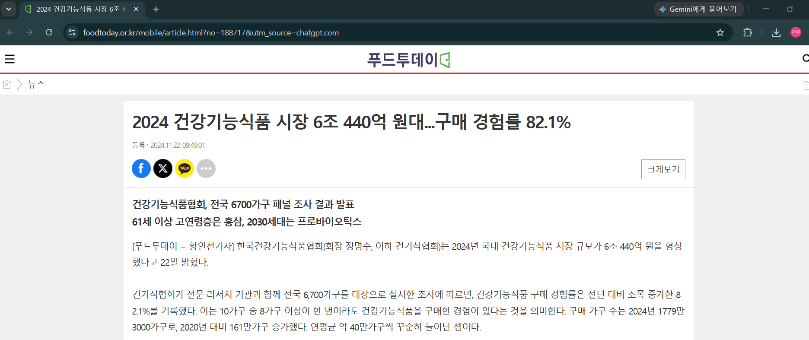

---
## 2. 시장이 계속 성장하고 있다는 근거
한국건강기능식품협회 자료에 따르면
- 국내 시장은 장기적으로 성장 추세
- 최근 몇 년간 6조 원 내외의 큰 시장을 유지
- 구매 경험률과 구매 가구 수는 지속적으로 증가
- 소비자의 건강 관심 증가와 맞춤형 제품 수요 확대가 주요 요인으로 분석됩니다.

---
### 출처: 
- [한국건강기능식품협회 공식 웹사이트 (원천 출처)](https://www.khff.or.kr/user/info/InfoBoardUserView.do?_menuNo=369&boardSeqno=10035&postsSeqno=119022)
- [전문 언론사 보도](https://www.kpanews.co.kr/news/articleView.html?idxno=255209)
> 협회의 발표를 바탕으로 제시하신 세부 지표(6조 원 유지, 구매 경험률 및 가구 수 증가, 맞춤형 제품 수요 확대 등)를 상세히 다룬 기사입니다.

---
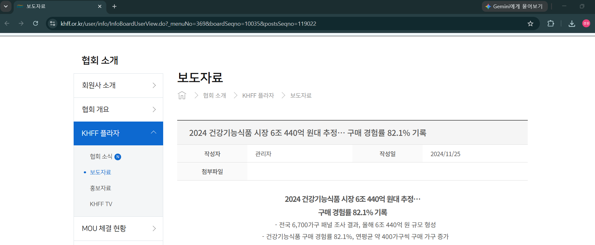

---
## 3. AI 프로젝트에서 활용하기 좋은 소비 트렌드

건강기능식품협회 조사에서는 다음과 같은 변화도 확인됩니다.
- 개인 맞춤형 건강관리 수요 증가
- 연령별로 선호하는 기능성 원료가 달라짐
- 2030세대는 프로바이오틱스 등 일상 건강관리 제품 선호
- 고연령층은 홍삼 등 전통적인 건강기능식품 선호
- 맞춤형 제품에 대한 관심이 확대되는 추세

---
### 출처: 
- [한국건강기능식품협회 공식 웹사이트 (원천 출처)](https://www.khff.or.kr/user/info/InfoBoardUserView.do?_menuNo=369&boardSeqno=10035&postsSeqno=119022)
> 협회가 전국 가구 패널을 추적 조사하여 발표한 공식 보도자료 게시글입니다. 본문에 "61세 이상 고연령층은 홍삼 선호(12.9%), 2030 세대 및 아동은 프로바이오틱스 선호(22.5%)" 등 연령별 기능성 원료 금액 비중과 소비층 변화가 수치로 명시되어 있습니다.
- [전문 언론사](http://m.dailymedipharm.com/news/articleView.html?idxno=72085)
> 협회 발표를 바탕으로 '2030 세대의 유산균(프로바이오틱스) 선호', '시니어 층의 홍삼 선호' 및 '개인 맞춤형 건기식 시장의 진화' 등 세대별 양극화와 맞춤형 트렌드를 집중적으로 다룬 기사입니다.

---
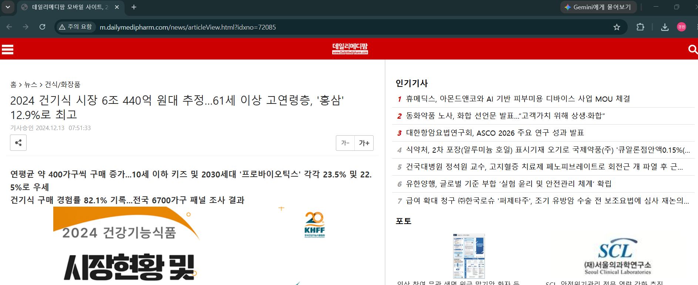

---
# 문제 정의(Pain Point)

| 문제(Pain Point)                  | 근거                        |
| ------------------------------- | ------------------------- |
| 건강기능식품 종류가 너무 많아 선택이 어렵다        | 시장 규모 약 6조 원, 제품 다양화      |
| 대부분의 소비자는 자신의 증상에 맞는 영양소를 잘 모른다 | 기능성 원료와 정보가 다양해 선택이 어려움   |
| 영양제 정보가 여러 사이트에 분산되어 있다         | 제품 정보, 기능성, 섭취기준이 기관별로 분산 |
| 나에게 맞는 영양제를 추천받기 어렵다            | 맞춤형 건강관리 수요 증가            |

---
## 출처
### 제품 과다 및 정보 분산 관련 근거 사이트
> 현재 식약처에 등록된 국내 건강기능식품 품목 수는 44,000개가 넘습니다(44,941개 기준). 기능성 정보는 식약처(식품안전나라), 섭취 기준은 보건복지부, 이상사례는 식품안전정보원 등으로 흩어져 있어 소비자가 통합적인 정보를 한눈에 비교하기 어렵습니다.
- [식품의약품안전처 식품안전나라 - 건강기능식품 검색 및 기능별 정보](https://www.foodsafetykorea.go.kr/portal/healthyfoodlife/searchHomeHF.do)
- [질병관리청 국가건강정보포털 - 건강기능식품 가이드](https://health.kdca.go.kr/healthinfo/biz/health/gnrlzHealthInfo/gnrlzHealthInfo/gnrlzHealthInfoView.do?cntnts_sn=6548)

---
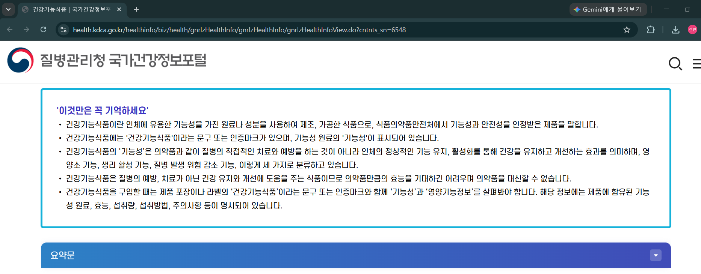

---
### 시장 규모 및 개인화 트렌드 관련 근거 사이트
> 한국건강기능식품협회의 조사 결과, 이제 건기식은 가족 단위의 공동 취식에서 개인이 필요에 따라 챙겨 먹는 '일상 루틴(개인화)'으로 중심축이 이동했습니다. 이에 따라 정부도 규제를 완화해 개인 맞춤형 소분·추천 제도를 공식화했습니다.
- [한국건강기능식품협회 공식 보도자료 - 2025 국내 건강기능식품 시장현황](https://www.khff.or.kr/user/info/InfoBoardUserView.do?_menuNo=369&boardSeqno=10035&postsSeqno=120107)
- [대한민국 정책브리핑 / 식품의약품안전처 - 맞춤형 건강기능식품 제도 실태조사 발표](https://www.korea.kr/common/download.do?fileId=198178685&tblKey=GMN)
- [한국소비자원 - 맞춤형 건강기능식품 동향 및 시사점 보고서](https://www.kca.go.kr/home/board/download.do?fno=10046906&bid=00000018&did=1003864446&menukey=4083)

---
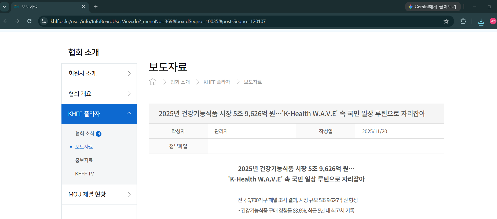

---
# 경쟁사 분석 
건강기능식품 쇼핑몰 "건강한하루"를 기준으로 경쟁사를 분석하면 단순히 온라인 쇼핑몰이 아니라 AI 기반 맞춤 추천 서비스와 비교하는 것이 좋습니다.

---
## 경쟁사 분류

| 구분        | 대표 서비스     | 특징         |
| --------- | ---------- | ---------- |
| 브랜드 쇼핑몰   | 정관장        | 브랜드 중심 판매  |
| 브랜드 쇼핑몰   | 종근당건강      | 자사 제품 중심   |
| 해외 직구     | iHerb      | 해외 브랜드 다양성 |
| 종합 쇼핑몰    | 쿠팡         | 가격 경쟁력     |
| 종합 쇼핑몰    | 네이버 스마트스토어 | 판매자 다양성    |
| AI 추천 서비스 | 필라이즈       | 개인 맞춤 추천   |

---
## 경쟁사 분석

| 경쟁사    | 장점             | 단점                          |
| ------ | -------------- | --------------------------- |
| 정관장    | 높은 브랜드 신뢰도     | 자사 제품 위주                    |
| 종근당건강  | 유명 브랜드, 다양한 제품 | 타사 제품 비교 어려움                |
| iHerb  | 해외 브랜드 수만 종    | 해외배송, 통관 고려 필요 |
| 쿠팡     | 빠른 배송, 가격 경쟁   | 영양제 선택이 어려움                 |
| 네이버 쇼핑 | 제품 수가 매우 많음    | 정보 품질 편차                    |
| 필라이즈   | AI 추천, 영양제 비교  | 쇼핑 기능은 상대적으로 제한적            |

---
> [정관장](https://www.kgcshop.co.kr/shop/goodsList?ctgryId=50#page1)

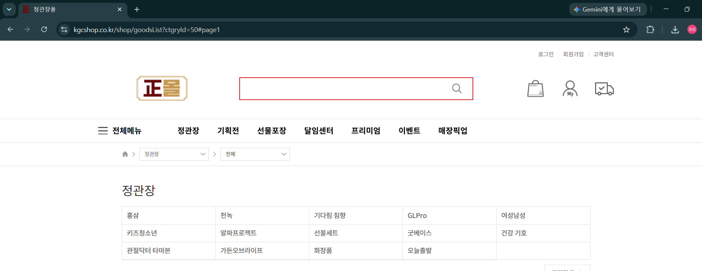

---
> [종근당건강](https://ckdhcmall.co.kr/categoryProductList.do?lvl=1&categoryCode=A001)

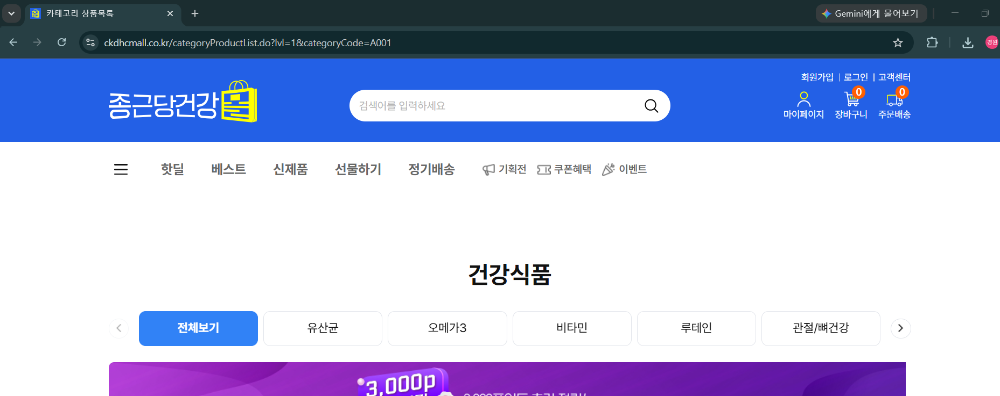

---
> [iHerb ](https://hk.iherb.com/?irclickid=Uo300gyK9xyZUj-0t43siXYZUkuVBlVcrRj6Qw0&irgwc=1&afsrc=1&utm_source=yeahpromos&utm_medium=affiliate&subaff=&gad_source=1&gad_campaignid=23140149098&gbraid=0AAAABBtCrE0MW25_cZ3Uk0CAv7w9attBn&gclid=Cj0KCQjwjb3SBhDgARIsAMKiWzjl2fJ8Rbm9wSZcytW4G_1HBsHKHCAijf2bOmpTYEV4AsGJNZKEBkUaAp4BEALw_wcB)

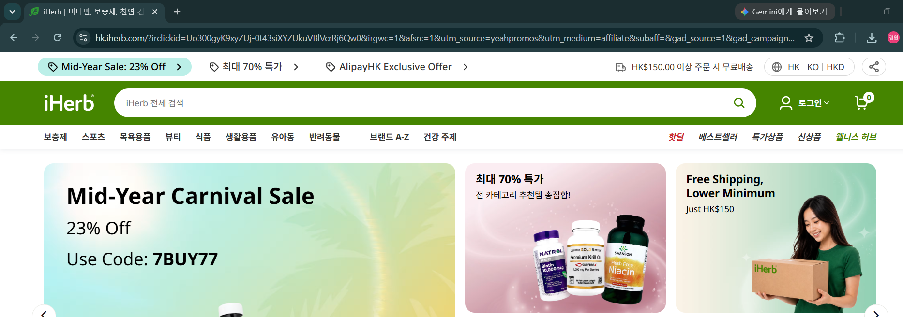

---
> [쿠팡](https://www.coupang.com/np/search?component=&q=%EA%B1%B4%EA%B0%95%EB%B3%B4%EC%A1%B0%EC%8B%9D%ED%92%88&traceId=mre9j0nn&channel=user)

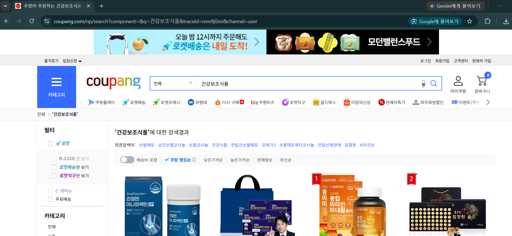

---
> [네이버 쇼핑](https://search.shopping.naver.com/ns/search?query=%EA%B1%B4%EA%B0%95%EB%B3%B4%EC%A1%B0%EC%8B%9D%ED%92%88&queryType=ac)

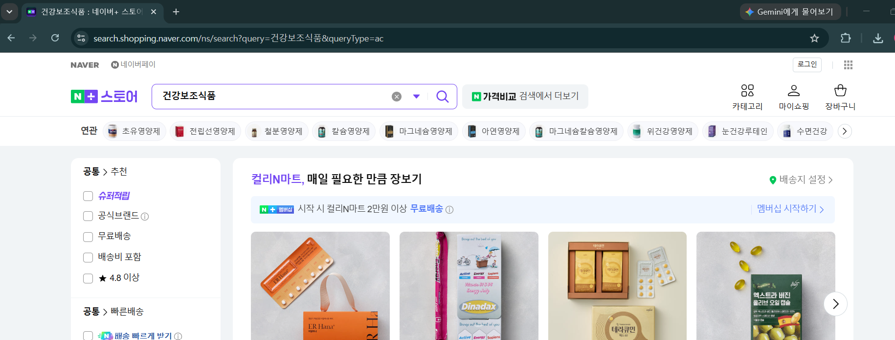

---
> [필라이즈](https://www.pillyze.com/shopping/products)

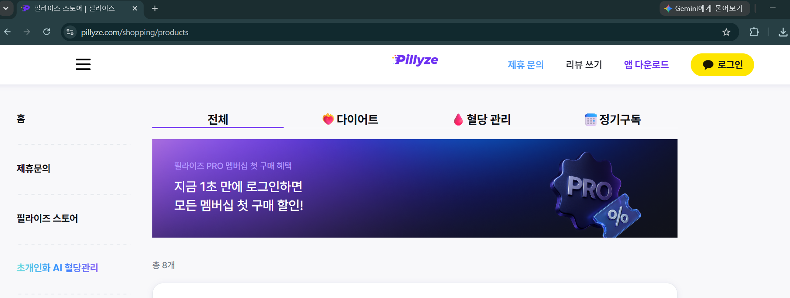

---
## AI 관점에서의 경쟁사 비교

| 기능        | 기존 쇼핑몰 | 건강한하루 |
| --------- | ------ | ----- |
| 제품 검색     | O      | O     |
| 가격 비교     | O      | O     |
| 영양소 설명    | △      | O     |
| 증상 기반 추천  | △      | O     |

---
| 기능        | 기존 쇼핑몰 | 건강한하루 |
| --------- | ------ | ----- |
| AI 챗봇     | X      | O     |
| RAG 기반 답변 | X      | O     |
| 영양소 교육    | △      | O     |
| 하루 권장량 안내 | X      | O     |
| 식약처 근거 제시 | △      | O     |
| 영양제 비교    | △      | O     |

---
## 차별화 포인트(Pain Point)

현재 대부분의 쇼핑몰은
```
제품
   ↓
검색
   ↓
구매
```
구조입니다.

---
반면 **건강한하루(프로젝트)** 는
```
증상 입력
     ↓
AI 분석
     ↓
식약처 기능성 검색(RAG)
     ↓
영양소 추천
     ↓
제품 추천
     ↓
섭취방법 및 하루 권장량 안내
```
형태로 설계할 수 있습니다.

> 이렇게 하면 단순 쇼핑몰이 아니라 AI 헬스케어 추천 플랫폼이라는 차별성을 명확하게 보여줄 수 있습니다.
