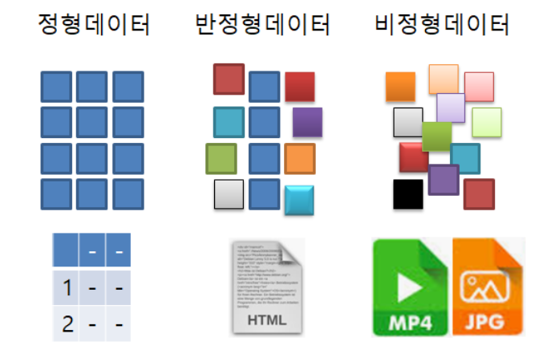
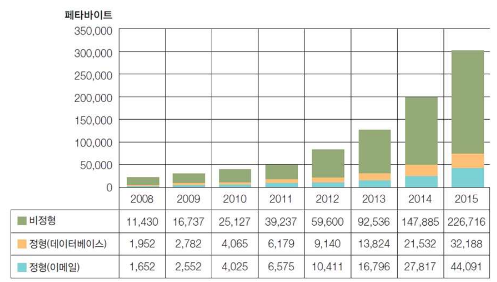
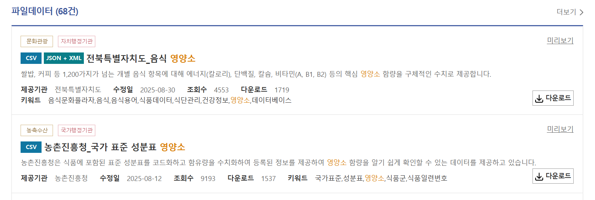
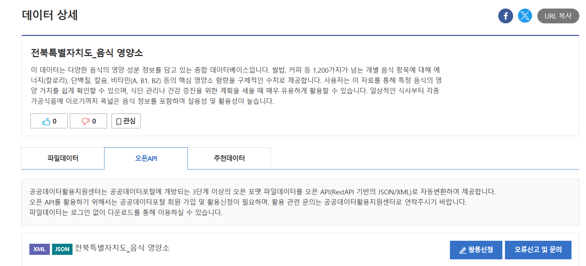

# 데이터 요구사항 분석

> AI 서비스 기획자는 기능을 정의한 뒤, 그 기능이 실제로 동작하기 위해 **어떤 데이터가 필요한지** 설명할 수 있어야 합니다.

---
## 오늘의 학습 목표
- 데이터 요구사항 분석의 목적을 설명할 수 있다.
- 기능별로 필요한 데이터를 구분할 수 있다.
- 공공데이터와 API의 기본 개념을 이해할 수 있다.
- 데이터 활용 가능성을 검토하는 기준을 설명할 수 있다.

---
## 데이터 요구사항 분석이란?
데이터 요구사항 분석은 서비스가 동작하기 위해 필요한 데이터를 정의하는 과정입니다.

```
사용자 문제
  ↓
서비스 기능
  ↓
필요 데이터
  ↓
데이터 출처
  ↓
활용 가능성 검토
```

---
## 왜 필요한가?
AI 서비스는 아이디어만으로 동작하지 않습니다.

AI가 추천, 요약, 검색, 상담, 분류, 예측을 하려면 근거가 되는 데이터가 필요합니다.

- 추천하려면 추천 기준 데이터가 필요하다.
- 요약하려면 요약할 원문 데이터가 필요하다.
- 검색하려면 검색 대상 데이터가 필요하다.
- 상담하려면 답변 근거 데이터가 필요하다.
- 개인화하려면 사용자 조건 데이터가 필요하다.

---
## 기획자의 역할
AI 기획자가 모든 데이터를 직접 수집하거나 처리할 필요는 없습니다.

하지만 다음은 정의할 수 있어야 합니다.

- 어떤 데이터가 필요한가?
- 그 데이터는 왜 필요한가?
- 어디에서 확보할 수 있는가?
- 어떤 형태로 제공되는가?
- 서비스 기능과 어떻게 연결되는가?
- 사용해도 되는 데이터인가?

---
## 데이터 요구사항의 기본 질문
데이터를 정리하기 전, 다음 질문을 던집니다.

| 질문 | 의미 |
| --- | --- |
| 어떤 문제를 해결하려는가? | 데이터 요구의 출발점 |
| 어떤 기능이 필요한가? | 데이터가 쓰일 위치 |
| 기능이 판단해야 할 것은 무엇인가? | 필요한 데이터 항목 |
| 데이터는 어디에 있는가? | 데이터 출처 |
| 데이터 품질은 충분한가? | 활용 가능성 |
| 개인정보나 저작권 이슈는 없는가? | 사용 가능성 |

---
## 데이터는 기능에서 나온다
데이터 요구사항은 막연히 많이 적는 것이 아닙니다.

기능과 연결되어야 합니다.

```
기능: 맞춤 추천
  ↓
필요 데이터: 사용자 조건, 추천 대상, 추천 기준

기능: 리뷰 요약
  ↓
필요 데이터: 리뷰 원문, 평점, 작성일
```

---
## 기능별 데이터 예시
| 기능 | 필요한 데이터 |
| --- | --- |
| 검색 | 이름, 카테고리, 태그, 설명 |
| 추천 | 사용자 조건, 추천 대상, 추천 기준 |
| 비교 | 항목별 수치, 가격, 특징, 장단점 |
| 요약 | 원문 텍스트, 작성자, 작성일 |
| 상담 | FAQ, 정책, 지식 문서, 주의사항 |
| 알림 | 사용자 설정, 일정, 상태 변화 |

---
## 데이터의 종류
서비스 기획에서 자주 다루는 데이터는 크게 나눌 수 있습니다.

| 구분 | 설명 | 예시 |
| --- | --- | --- |
| 사용자 데이터 | 개인화에 필요한 데이터 | 연령대, 선호도, 사용 이력 |
| 상품/대상 데이터 | 서비스가 제공하거나 추천하는 대상 | 상품명, 장소명, 콘텐츠명 |
| 행동 데이터 | 사용자의 이용 과정에서 생기는 데이터 | 클릭, 검색어, 구매, 조회 |
| 지식 데이터 | 설명과 판단의 근거가 되는 데이터 | FAQ, 규정, 문서, 기준표 |
| 운영 데이터 | 서비스 운영과 품질 관리에 필요한 데이터 | 오류 로그, 문의, 만족도 |

---
## 정형 데이터와 비정형 데이터
| 구분 | 설명 | 예시 |
| --- | --- | --- |
| 정형 데이터 | 표처럼 행과 열로 정리된 데이터 | CSV, 엑셀, DB 테이블 |
| 비정형 데이터 | 정해진 표 구조가 없는 데이터 | 리뷰, 문서, 이미지, 음성 |
| 반정형 데이터 | 구조는 있지만 자유도가 있는 데이터 | JSON, XML, API 응답 |

> AI 서비스에서는 세 가지 데이터가 함께 사용되는 경우가 많습니다.

---
> [데이터 분류](https://chankim.tistory.com/entry/%EA%B4%80%EA%B3%84%ED%98%95-%EB%8D%B0%EC%9D%B4%ED%84%B0%EB%B2%A0%EC%9D%B4%EC%8A%A4#google_vignette)



---
>  [시간이 지날수록비정형 데이터에 대한 양이 늘어나고 있음](https://scienceon.kisti.re.kr/commons/util/originalView.do?cn=TRKO201900000151&dbt=TRKO&rn=)



---
## 데이터 항목 정의
데이터 요구사항은 "데이터가 필요하다"에서 끝나면 안 됩니다.

구체적인 항목까지 적어야 합니다.

| 나쁜 예 | 좋은 예 |
| --- | --- |
| 상품 데이터가 필요하다. | 상품명, 브랜드, 카테고리, 가격, 설명, 이미지가 필요하다. |
| 사용자 데이터가 필요하다. | 연령대, 선호 조건, 관심사, 제외 조건이 필요하다. |
| 리뷰 데이터가 필요하다. | 리뷰 본문, 평점, 작성일, 상품 ID가 필요하다. |

---
## 데이터 출처
데이터 출처는 데이터를 얻을 수 있는 위치입니다.

예시
- 내부 서비스 DB
- 공공데이터
- API
- CSV/엑셀 파일
- 사용자 입력
- 제휴사 제공 데이터
- 운영 중 쌓이는 로그 데이터

> 출처가 불명확한 데이터는 기획 단계에서 위험 요소가 됩니다.

---
## 공공데이터란?
공공데이터는 공공기관이 만들거나 관리하는 데이터입니다.

특징
- 출처가 비교적 명확하다.
- 정책, 통계, 행정, 안전, 교통, 식품 등 다양한 분야에 존재한다.
- CSV, 엑셀, API 형태로 제공될 수 있다.
- 사용 조건과 갱신 주기를 확인해야 한다.

---
## 공공데이터를 볼 때 확인할 것
| 확인 항목 | 질문 |
| --- | --- |
| 제공 기관 | 누가 만든 데이터인가? |
| 제공 항목 | 어떤 컬럼 또는 응답값이 있는가? |
| 갱신 주기 | 얼마나 자주 업데이트되는가? |
| 파일/API 형태 | CSV인가, API인가, 문서인가? |
| 이용 조건 | 상업적 활용이 가능한가? 출처 표기가 필요한가? |
| 품질 | 빈값, 중복, 오래된 값이 많은가? |

---
> [공공데이터 포털](https://www.data.go.kr/tcs/dss/selectDataSetList.do?keyword=%EC%98%81%EC%96%91%EC%86%8C&brm=&svcType=&recmSe=N&conditionType=init&extsn=&kwrdArray=)



---
## API란?
API는 다른 시스템의 데이터를 정해진 방식으로 요청하고 받는 통로입니다.

```
우리 서비스
  ↓ 요청
외부 데이터 제공 시스템
  ↓ 응답
우리 서비스 기능
```

API는 실시간 또는 최신 데이터 연동이 필요할 때 자주 사용됩니다.

---
## API 문서에서 볼 것
AI 기획자는 API 코드를 직접 작성하지 않더라도 문서의 핵심은 읽을 수 있어야 합니다.

| 항목 | 의미 |
| --- | --- |
| API 이름 | 어떤 데이터를 제공하는가 |
| 요청 주소 | 데이터를 어디로 요청하는가 |
| 요청 파라미터 | 검색어, 날짜, 페이지 번호 등 |
| 응답 항목 | 실제로 받을 수 있는 데이터 |
| 인증 방식 | API Key가 필요한가 |
| 호출 제한 | 하루 또는 초당 몇 번 호출 가능한가 |
| 오류 코드 | 실패 상황을 어떻게 알려주는가 |

---
> [공공데이터 포털](https://www.data.go.kr/data/15050018/fileData.do#/API%20%EB%AA%A9%EB%A1%9D/getuddi%3Af6c5533d-880e-4ccf-981c-85e220df8601)



---
## CSV와 API 비교
| 구분 | CSV/엑셀 | API |
| --- | --- | --- |
| 사용 방식 | 파일을 내려받아 사용 | 요청할 때마다 데이터를 받음 |
| 장점 | 이해하기 쉽고 실습에 좋음 | 서비스 연동과 최신화에 유리 |
| 단점 | 최신 상태 유지가 어려움 | 인증, 호출 제한, 개발 연동 필요 |
| 기획 포인트 | 데이터 구조 파악에 좋음 | 실제 서비스 운영 가능성 검토에 좋음 |

---
## 데이터 활용 가능성 검토
데이터를 찾았다고 바로 사용할 수 있는 것은 아닙니다.

다음 기준으로 검토합니다.

| 기준 | 확인 질문 |
| --- | --- |
| 적합성 | 기능에 필요한 항목이 있는가? |
| 신뢰성 | 출처가 명확하고 믿을 수 있는가? |
| 최신성 | 최신 데이터인가? 갱신되는가? |
| 완전성 | 누락, 빈값, 중복이 많지 않은가? |
| 사용성 | CSV, API 등 실제 활용 가능한 형태인가? |
| 법적 이슈 | 저작권, 개인정보, 이용 조건 문제가 없는가? |

---
## AI 기능에서 더 중요한 기준
AI 기능은 일반 기능보다 데이터 근거가 더 중요합니다.

| 기준 | 확인 질문 |
| --- | --- |
| 설명 가능성 | AI가 결과의 이유를 설명할 수 있는가? |
| 개인화 가능성 | 사용자 조건과 연결할 수 있는 항목이 있는가? |
| 검색 가능성 | RAG에서 검색할 문서나 텍스트가 있는가? |
| 안전성 | 잘못된 답변이 사용자에게 피해를 줄 수 있는가? |
| 제한 조건 | 답변하면 안 되는 범위가 있는가? |

---
## 데이터 요구사항 문장 공식
데이터 요구사항은 다음 형태로 작성하면 명확합니다.

```
[기능명]을 제공하기 위해
[데이터 항목]이 필요하다.
해당 데이터는 [출처]에서 확보할 수 있으며,
[활용 방식]에 사용된다.
```

---
## 작성 예시
> 맞춤 추천 기능을 제공하기 위해 사용자 조건, 추천 대상 정보, 추천 기준 데이터가 필요하다.

> 해당 데이터는 사용자 입력, 상품 DB, 추천 기준표에서 확보할 수 있다.

> 이 데이터는 사용자의 조건에 맞는 후보를 좁히고 추천 이유를 설명하는 데 사용된다.

---
## 데이터 요구사항 표 예시
| 항목 | 내용 |
| --- | --- |
| 기능명 | 맞춤 추천 |
| 필요한 데이터 | 사용자 조건, 추천 대상, 추천 기준 |
| 데이터 출처 | 사용자 입력, 내부 DB, 공공데이터 |
| 데이터 형태 | CSV, API, DB |
| 활용 방식 | 조건에 맞는 후보 선별 및 추천 이유 생성 |
| 검토 사항 | 개인정보, 출처 신뢰도, 최신성 |

---
## 흔한 실수
- 기능만 정의하고 필요한 데이터를 적지 않는다.
- 데이터 출처를 "인터넷"처럼 모호하게 적는다.
- API가 있다는 이유만으로 바로 활용 가능하다고 판단한다.
- 개인정보가 필요한데 수집 목적과 범위를 정하지 않는다.
- AI가 답변할 근거 데이터 없이 챗봇 기능을 기획한다.


