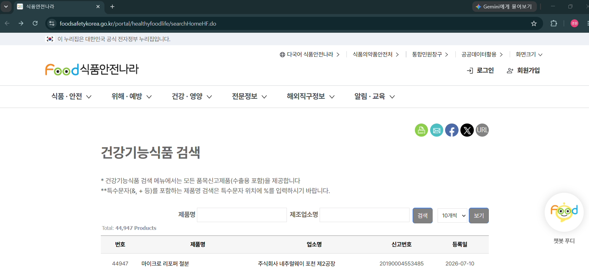
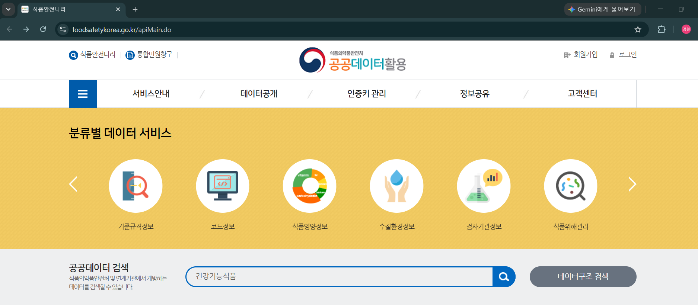
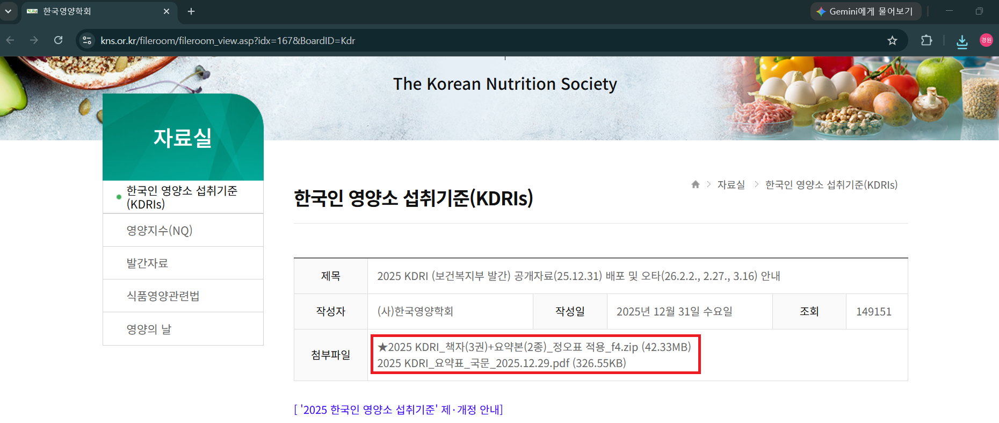
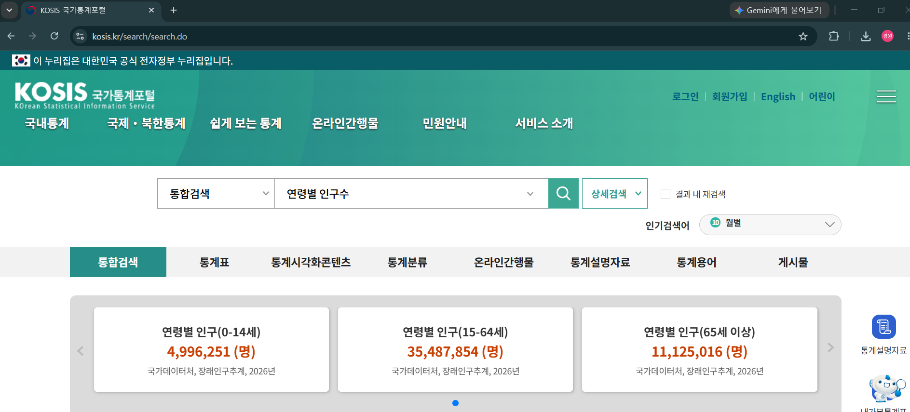

# Day 03 프로젝트 실습

## 건강한하루 데이터 요구사항 분석

> 오늘 실습에서는 AI 기반 건강기능식품 쇼핑몰 **"건강한하루"** 에 필요한 데이터를 정의하고, 실제 공공데이터 사이트와 오픈API를 직접 조사해 서비스 기능에 연결합니다.

---
## 실습 목표
- 건강한하루 주요 기능별 필요한 데이터를 정리한다.
- 실제 공공데이터 사이트/오픈API에 접속해 제공 항목(필드)을 조사한다.
- 조사한 항목의 서비스 활용 가능성을 판단한다.
- 데이터 요구사항 표를 작성한다.

---
## 오늘 사용할 자료
가상의 CSV 파일이 아니라, 아래 실제 사이트에 직접 접속해 조사합니다. 

| 자료 | 링크 | 확인할 내용 |
| --- | --- | --- |
| 식품안전나라 건강기능식품 정보 | [바로가기](https://www.foodsafetykorea.go.kr/portal/healthyfoodlife/searchHomeHF.do) | 제품, 원료, 기능성, 섭취방법, 주의사항 |
| 공공데이터포털 식품 관련 오픈API | [바로가기](https://www.foodsafetykorea.go.kr/apiMain.do) | 오픈API 목록, 요청/응답 필드, 인증 방식 |
| 한국인 영양소 섭취기준(KDRIs) | [바로가기](https://www.kns.or.kr/fileroom/fileroom_view.asp?idx=167&BoardID=Kdr) | 연령/성별/임신·수유부별 권장섭취량, 상한섭취량 |
| KOSIS 국가통계포털 인구 통계 | [바로가기](https://kosis.kr) | 연령별 인구, 고령화 추이 등 시장 규모 참고 지표 |

---
## 실습 흐름
```
Day 02 Pain Point 확인
  ↓
건강한하루 기능 정리
  ↓
필요 데이터 도출
  ↓
공공데이터 사이트/오픈API 직접 조사
  ↓
제공 항목(필드) 정리 및 활용 가능성 검토
  ↓
데이터 요구사항 표 작성
```

---
## 건강한하루 주요 기능
| 기능 | 설명 |
| --- | --- |
| 건강기능식품 검색 | 사용자가 제품이나 성분을 검색한다. |
| AI 맞춤 상품 추천 | 건강 고민과 사용자 조건에 맞는 후보를 추천한다. |
| AI 성분 설명 | 어려운 성분과 기능성을 쉬운 말로 설명한다. |
| 복용 정보 안내 | 권장섭취량, 상한섭취량, 대상자별 주의 정보를 보여준다. |
| AI 상담/RAG FAQ | 공공데이터와 제품 정보를 근거로 질문에 답한다. |

---
## 1단계. Pain Point와 데이터 연결
Day 02에서 정의한 Pain Point를 데이터 관점으로 바꿉니다.

| Pain Point | 필요한 기능 | 필요한 데이터 |
| --- | --- | --- |
| 어떤 제품을 선택해야 할지 모르겠다. | AI 맞춤 상품 추천 | 건강 고민, 영양소 기능성, 제품 정보 |
| 성분 용어가 어렵다. | AI 성분 설명 | 영양소, 기능성, 관련 증상, 쉬운 설명 |
| 함께 먹어도 되는지 모르겠다. | 복용 정보 안내 | 권장섭취량, 상한섭취량, 주의사항 |
| 근거 있는 답변을 받고 싶다. | AI 상담/RAG FAQ | 공공데이터, 기능성 근거, FAQ 문서 |

---
## 2단계. 식품안전나라 건강기능식품 정보 조사
[식품안전나라 건강기능식품 정보](https://www.foodsafetykorea.go.kr/portal/healthyfoodlife/searchHomeHF.do) 에서 제품 하나를 직접 검색하고, 상세 페이지에서 아래 항목을 확인해 표를 채웁니다.

| 확인 항목 | 조사 결과(예시 제품 기준) | 활용 예시 |
| --- | --- | --- |
| 제품명 / 제조업소명 | *(직접 조사)* | 검색, 상품 상세 |
| 주된기능성 | *(직접 조사)* | AI 맞춤 추천, AI 성분 설명 |
| 섭취방법 / 1일 섭취량 | *(직접 조사)* | 복용 정보 안내 |
| 섭취 시 주의사항 | *(직접 조사)* | 가드레일, AI 상담/RAG FAQ |
| 신고번호 / 등록일 | *(직접 조사)* | 데이터 검증, 최신성 확인 |

---


---
### 식품안전나라 데이터 활용 가능성

| 기능 | 활용 방식 |
| --- | --- |
| 건강기능식품 검색 | 제품명, 제조업소명으로 검색 결과를 제공한다. |
| AI 맞춤 추천 | 주된기능성을 사용자의 건강 고민과 연결해 추천 후보를 찾는다. |
| AI 성분 설명 | 주된기능성 표현을 쉬운 말로 풀어 설명한다. |
| AI 상담/RAG FAQ | 섭취 시 주의사항을 근거로 답변의 신뢰성을 높인다. |

---
## 3단계. 공공데이터포털 오픈API 조사
[공공데이터포털 식품 관련 오픈API](https://www.foodsafetykorea.go.kr/apiMain.do) 에서 건강기능식품 관련 API를 찾아 아래를 조사합니다.

| 확인 항목 | 조사 결과 | 활용 예시 |
| --- | --- | --- |
| API 명 | *(직접 조사)* | - |
| 인증/신청 필요 여부 | *(직접 조사)* | 개발 일정 산정 |
| 요청 파라미터 | *(직접 조사)* | 검색/필터 조건 설계 |
| 응답 필드(주요 항목) | *(직접 조사)* | 상품 상세, 데이터 검증 |
| 호출 제한(트래픽, 이용약관 등) | *(직접 조사)* | 서비스 운영 리스크 확인 |

---


---
## 4단계. 한국인 영양소 섭취기준(KDRIs) 조사
[한국인 영양소 섭취기준(KDRIs)](https://www.kns.or.kr/fileroom/fileroom_view.asp?idx=167&BoardID=Kdr) 에서 연령대·성별·임신/수유부 기준 섭취량 표를 확인합니다.

| 확인 항목 | 조사 결과 | 활용 예시 |
| --- | --- | --- |
| 연령대 구분 | *(직접 조사)* | 개인화 추천 |
| 권장섭취량 / 충분섭취량 | *(직접 조사)* | 복용 정보 안내 |
| 상한섭취량 | *(직접 조사)* | 가드레일(과다 섭취 경고) |
| 임신/수유부 별도 기준 | *(직접 조사)* | 개인화 추천, 주의 문구 |

---


---
### KDRIs 데이터 활용 가능성
| 기능 | 활용 방식 |
| --- | --- |
| 복용 정보 안내 | 사용자 조건에 맞는 권장섭취량과 단위를 보여준다. |
| AI 상담 | "얼마나 먹어야 하나요?" 질문에 기준 정보를 제공한다. |
| 가드레일 | 상한섭취량을 넘는 표현이나 과장 추천을 막는다. |
| 개인화 추천 | 연령대, 성별, 임신/수유 여부에 따라 안내 문구를 다르게 만든다. |

---
## 5단계. 시장 규모 참고 지표 조사
[KOSIS 국가통계포털](https://kosis.kr) 에서 연령별 인구, 고령화 추이 등 건강기능식품 잠재 사용자 규모를 가늠할 지표를 확인합니다.

| 확인 항목 | 조사 결과 | 활용 예시 |
| --- | --- | --- |
| 연령대별 인구 비중 | *(직접 조사)* | 시장조사, Persona 설계 |
| 고령화 추이 | *(직접 조사)* | 타깃 사용자층 우선순위 판단 |

---


---
## 6단계. 데이터 요구사항 표 작성
2~5단계 조사 결과를 종합해 기능별 데이터 요구사항 표를 완성합니다.

| 기능 | 필요한 데이터 | 출처 | 비고 |
| --- | --- | --- | --- |
| 건강기능식품 검색 | | 식품안전나라 | |
| AI 맞춤 상품 추천 | | 식품안전나라, 공공데이터포털 API | |
| AI 성분 설명 | | 식품안전나라 | |
| 복용 정보 안내 | | KDRIs | |
| AI 상담/RAG FAQ | | 식품안전나라, KDRIs | |
