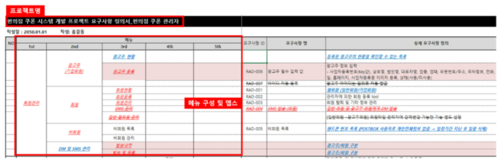
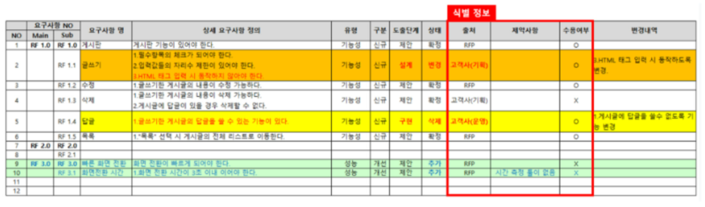
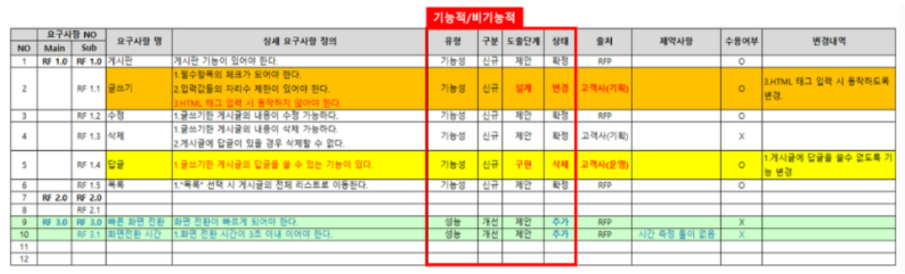
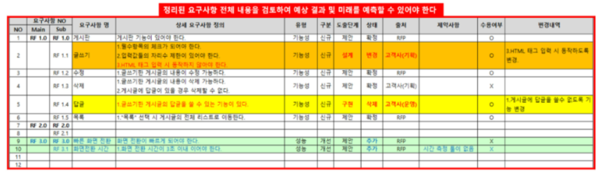

# 요구사항정의서 (Requirements Specification)
> 참고: [요구사항 정의서 작성법과 양식 (이랜서 블로그)](https://www.elancer.co.kr/blog/detail/283)

---
## 요구사항정의서란?

> 요구사항정의서는 IT 프로젝트의 성공을 좌우하는 중요한 문서로, 프로젝트의 목표, 기능, 제약 사항 등을 명확하게 정의하여 전체적인 방향을 제시합니다.

- **요구사항(Requirement)** : 사용자·고객·프로젝트가 원하는 기능, 성능, 제약 조건
- **정의서(Specification)** : 그 요구사항을 명확하고 검증 가능하게 적어 둔 문서

사업 관리, 기획, 디자인, 개발, 테스터 등 **다양한 부서가 협업** 하여 의사소통을 원활히 할 수 있게 하며, **각 담당자별 역할을 명시** 하고 프로젝트 진행 차질을 방지하여 **성공적으로 완성** 되도록 돕는 문서입니다.

---
## 왜 작성해야 하는가?

> 요구사항 정의서를 제대로 작성하지 않으면 프로젝트 중도 포기, 계약 분쟁, 예산 초과, 일정 지연 등의 문제가 발생할 수 있습니다. 잘 작성된 요구사항 정의서는 프로젝트 성공 수행을 보장하는 필수 문서입니다.

---
## 두 가지 핵심 목적

| 목적 | 설명 |
| --- | --- |
| 1. 프로젝트 목표 정의 | 이해관계자에게 요구사항을 배포·공유하여 **동일한 목표 범위와 목표의식** 을 심어 줍니다. |
| 2. 기준 문서 정의 | 완수해야 할 **업무 범위** 를 정의하는 기준 문서로, 협력 부서와 **동일한 눈높이** 를 설정하고 **의사결정·판단의 근거** 가 됩니다. |

---
## 작성하지 않으면 생기는 문제

- **방향성 상실** : 요구사항이 불명확하거나 미정의되어 프로젝트 방향을 잃음
- **의견 불일치·갈등** : 이해관계자·담당자 간 인식 차이로 갈등 고조
- **일정 지연·비용 초과** : 수익성 저하로 이어짐
- **품질 저하·프로젝트 실패** : 잘못된 기능 구현 가능성 증가 → 결국 실패로 이어질 수 있음

---
## 어떻게 작성하는가?

---
## 4단계 작성 절차

| 단계 | 내용 |
| --- | --- |
| **1. 요구사항 수집** | 이해관계자와 인터뷰, 설문조사, 워크숍 등으로 수집. 각자의 요구와 기대를 명확히 이해하되, 프로젝트 성공에 필요한 요건만 도출하고, 프로젝트와의 관여도·중요성을 판단하며 수집합니다. |
| **2. 요구사항 분석** | 수집된 요구사항에서 중복 제거, 우선순위 설정. 개인 취향이 아닌 프로젝트 핵심 요구사항인지 면밀히 판단합니다. |
| **3. 요구사항 구분** | 기능적 요구사항(시스템이 수행해야 할 기능)과 비기능적 요구사항(성능, 보안, 유지보수성, 운영 시 예상 이슈 등)으로 구분합니다. |
| **4. 요구사항 정의서 작성** | 구분된 요구사항을 문서화합니다. 아래 다섯 가지를 유념해 작성합니다. |

---
## 작성 시 반드시 포함할 다섯 가지

### 1. 프로젝트 인식

프로젝트명, 목적·배경·범위, 메뉴 구성, 뎁스(Depth) 등으로 프로젝트를 명확히 표현합니다.

---
## 2 이해관계자 식별

요구사항 출처(누가), 수용 여부, 해당 요구로 협력·처리해야 할 이해관계자가 누구인지 식별합니다.

---
## 3 기능적 요구사항

시스템이 수행해야 할 기능을 정의합니다. (예: 로그인, 데이터 저장, 보고서 생성) 기획·디자인·개발 업무의 실질적 범위입니다.

---
## 4. 비기능적 요구사항

> **기능적 요구사항(Functional Requirements)**: 서비스가 무엇을 하는지(What)

> **비기능적 요구사항(Non-Functional Requirements)**: 서비스를 얼마나 잘 수행해야 하는지(How Well)

| 구분  | 기능적 요구사항      | 비기능적 요구사항     |
| --- | ------------- | ------------- |
| 질문  | 무엇을 하는가?      | 어떻게 동작해야 하는가? |
| 목적  | 기능 정의         | 품질 기준 정의      |
| 예시  | 회원가입, 로그인, 추천 | 응답속도, 보안, 안정성 |
| 테스트 | 기능 동작 여부      | 성능·품질 측정      |

---
## 5. 제약 사항 및 예상 결과

예산, 일정, 기술적 제한 등 프로젝트에 영향을 미치는 외부 요인을 정의합니다. 예상 결과가 좋지 않을 경우 대처방안을 사전에 준비합니다.

---
## 작성 시 유의사항

1. **명확한 표현** : “사용자는 로그인을 할 수 있어야 한다”보다 **“이메일과 비밀번호를 사용하여 로그인할 수 있어야 한다”**처럼 구체적으로. 정량적 기준 명시 (예: “빠르게” → “응답시간 2초 이내”). 동일 개념은 일관된 용어 사용.
2. **일관된 형식** : 모든 요구사항을 동일한 템플릿에 기재. Depth, 설명, 우선순위, 상태 등을 템플릿화하고, 일련번호 형식의 인식 코드 부여. 글꼴, 폰트, 문단 스타일도 통일.
3. **변경 기록·버전 관리** : 요구사항 변경 내용을 기록하고 버전 관리(예: v1.0, v1.1). 진행 상황·이슈를 추적 관리. 정기적 최신화 후 담당자 공유, 검토·승인 절차와 수정 권한 규정을 두는 것이 좋습니다.

---
## 요구사항 표현 방법

- **사용자 스토리** : “~로서, ~를 원해서, ~할 수 있어야 한다.” (애자일에서 자주 사용)
- **shall / must** : “시스템은 ~해야 한다.” 형태로 필수 요구사항 명시
- **번호 + 제목 + 설명: REQ-001** : 로그인 – 사용자는 이메일과 비밀번호로 로그인할 수 있다.

---
# [예제영상> 바이브코딩 직전까지의 기획 계획 과정](https://www.youtube.com/watch?v=OtltNFaqvh8&t=183s)
1.  문제 정의
2. AI로 시장조사 하는  법
3. 패턴 찾기
4.  핵심 가치 찾기
5. PRD 작성
6. 실패 가능성 묻기
7. 암묵적  가정 묻기
8. 마케팅 타겟 정하기
9. 예외 케이스

