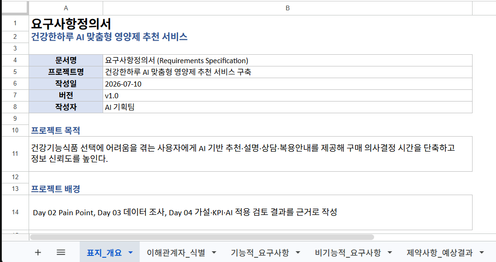
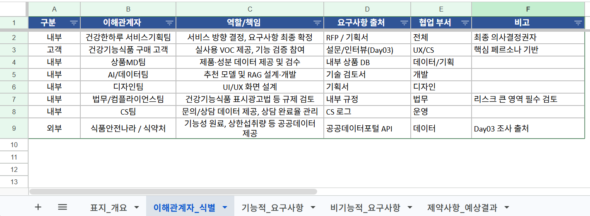
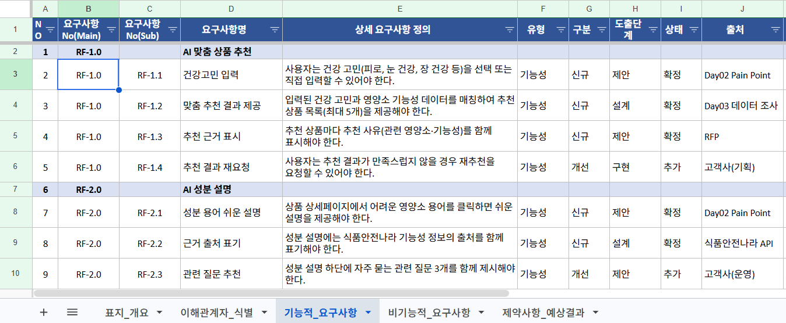
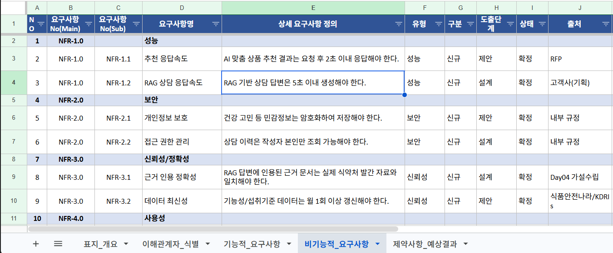
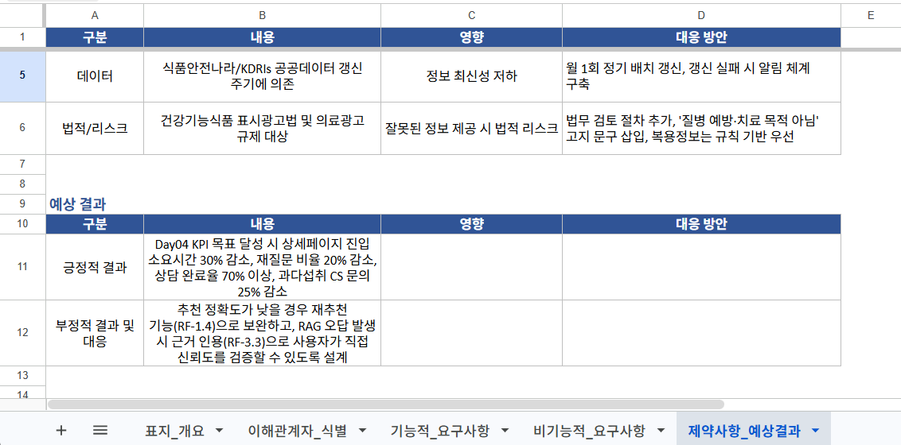

# Day 05 프로젝트 실습

## 건강한하루 요구사항정의서 작성

> Day 02~04에서 정리한 Pain Point, 데이터, 가설·KPI·AI 적용 검토 결과를 바탕으로, **"건강한하루"** 서비스의 요구사항정의서(엑셀)를 작성합니다.

---
## 실습 목표
- 프로젝트 개요(목적·배경·범위)를 명확히 정의한다.
- 이해관계자를 식별하고 역할·출처를 정리한다.
- 기능적/비기능적 요구사항을 표준 양식(ID·상태·출처 등)으로 문서화한다.
- 제약사항과 예상 결과를 정리해 리스크를 사전에 관리한다.

---
## 실습 흐름
```
Day 02 Pain Point 확인
  ↓
Day 03 데이터 요구사항 확인
  ↓
Day 04 가설·KPI·AI 적용 검토 확인
  ↓
프로젝트 개요 정의
  ↓
이해관계자 식별
  ↓
기능적/비기능적 요구사항 정의
  ↓
제약사항 및 예상 결과 정리
```

---
# 결과물 안내

`day05_5일차/프로젝트/요구사항정의서.xlsx`

---
## 파일 구성 (5개 시트)

| 시트명 | 내용 |
| --- | --- |
| 표지_개요 | 프로젝트명, 목적/배경/범위, 변경 이력 |
| 이해관계자_식별 | 내부·외부 이해관계자, 역할, 출처, 협업 부서 |
| 기능적_요구사항 | 4대 핵심 기능(RF-1~4)의 상세 요구사항 |
| 비기능적_요구사항 | 성능·보안·신뢰성·사용성·유지보수성(NFR-1~5) |
| 제약사항_예상결과 | 예산·일정·기술·데이터·법적 리스크, 예상 결과 |

> 요구사항정의서.pdf에서 안내한 작성 양식(요구사항 ID, 유형, 구분, 도출단계, 상태, 출처, 제약사항, 수용여부, 변경내역)을 그대로 적용했습니다.

---
# 1. 표지_개요

---
## 프로젝트 개요
- **프로젝트명** : 건강한하루 AI 맞춤형 영양제 추천 서비스 구축
- **목적** : 건강기능식품 선택에 어려움을 겪는 사용자에게 AI 기반 추천·설명·상담·복용안내를 제공해 구매 의사결정 시간을 단축하고 정보 신뢰도를 높인다.
- **배경** : Day 02 Pain Point, Day 03 데이터 조사, Day 04 가설·KPI·AI 적용 검토 결과를 근거로 작성
- **범위** : ① AI 맞춤 상품 추천 ② AI 성분 설명 ③ AI 상담/RAG FAQ ④ 복용 정보 안내

---


---
# 2. 이해관계자_식별

---
## 이해관계자 정리
내부 부서(서비스기획팀, 상품MD팀, AI/데이터팀, 디자인팀, 법무팀, CS팀)와 외부 기관(식품안전나라·식약처)을 함께 식별합니다.

| 구분 | 이해관계자 | 역할/책임 |
| --- | --- | --- |
| 내부 | 서비스기획팀 | 서비스 방향 결정, 요구사항 최종 확정 |
| 내부 | 법무/컴플라이언스팀 | 표시광고법 등 규제 검토 |
| 외부 | 식품안전나라/식약처 | 기능성 원료, 상한섭취량 등 공공데이터 제공 |

> 각 요구사항이 "누구의 요청으로, 누구와 협업해" 처리되는지 추적할 수 있도록 출처와 협업 부서를 함께 기록합니다.

---


---
# 3. 기능적_요구사항

---
## 작성 양식
| 요구사항 No | 요구사항명 | 상세 요구사항 정의 | 유형 | 구분 | 도출단계 | 상태 | 출처 | 제약사항 | 수용여부 | 변경내역 |
| --- | --- | --- | --- | --- | --- | --- | --- | --- | --- | --- |

- Main(RF-1.0)/Sub(RF-1.1…) 2단계 코드로 기능을 구조화
- 상태(제안→설계→구현/확정·변경·추가·삭제)로 진행 이력 추적

---
## 4대 핵심 기능 (RF-1~4)
| 기능 | 대표 요구사항 |
| --- | --- |
| RF-1.0 AI 맞춤 상품 추천 | 건강고민 입력 → 맞춤 추천(최대 5개) → 추천 근거 표시 → 재추천 요청 |
| RF-2.0 AI 성분 설명 | 어려운 영양소 용어를 쉬운 설명 + 출처 표기 |
| RF-3.0 AI 상담/RAG FAQ | 자연어 상담 → RAG 답변 생성 → 근거 문서 인용 → CS 이관 분기 |
| RF-4.0 복용 정보 안내 | 권장/상한 섭취량 표시 → 과다섭취 경고 → AI는 설명 보조 |

---
## 리스크가 큰 요구사항 예시
**RF-4.2 과다섭취 경고 안내**
> 여러 제품을 함께 담을 경우 특정 영양소의 합산 섭취량이 상한섭취량을 초과하면 경고 문구를 표시해야 한다.

- 제약사항 : 오류 시 건강 영향 리스크 높음
- 변경내역 : 경고 판단 로직을 AI가 아닌 **규칙 기반**으로 변경 (Day 04 AI 적용 가능성 검토 결과 반영)

---


---
# 4. 비기능적_요구사항

---
## NFR 그룹 구성
| 그룹 | 대표 요구사항 |
| --- | --- |
| NFR-1.0 성능 | 추천 2초 이내, RAG 답변 5초 이내 응답 |
| NFR-2.0 보안 | 민감정보 암호화, 상담 이력 본인만 조회 |
| NFR-3.0 신뢰성/정확성 | 근거 문서 일치, 데이터 월 1회 이상 갱신 |
| NFR-4.0 사용성 | 쉬운 설명, 웹 접근성 준수 |
| NFR-5.0 운영/유지보수성 | 추천·상담·경고 이력 로그화 |

> 기능적 요구사항이 "무엇을 하는가"라면, 비기능적 요구사항은 "얼마나 잘 하는가"를 정의합니다.

---


---
# 5. 제약사항_예상결과

---
## 제약사항
| 구분 | 내용 | 대응 방안 |
| --- | --- | --- |
| 예산/일정 | 4주 내 MVP 출시, 예산 한정 | RF-1~4 우선순위 기준 단계적 오픈 |
| 기술 | LLM/RAG 응답 지연·비용 | 캐싱, SLA(5초), 폴백 답변 준비 |
| 데이터 | 공공데이터 갱신 주기 의존 | 월 1회 정기 배치 갱신, 실패 알림 |
| 법적/리스크 | 표시광고법·의료광고 규제 | 법무 검토, 고지 문구 삽입, 복용정보는 규칙 기반 우선 |

---
## 예상 결과
- **긍정적 결과** : Day 04 KPI 목표 달성 시 상세페이지 진입시간 30% 감소, 재질문 20% 감소, 상담 완료율 70% 이상, CS 문의 25% 감소
- **부정적 결과 및 대응** : 추천 정확도가 낮으면 재추천(RF-1.4)으로 보완, RAG 오답 발생 시 근거 인용(RF-3.3)으로 사용자가 직접 신뢰도를 검증

---


---
# 정리
- 요구사항정의서는 Day 02~04의 결과물을 하나의 문서로 통합·구체화한 산출물입니다.
- 기능적/비기능적 요구사항을 표준 양식(ID·상태·출처)으로 관리하면 변경 이력을 추적하기 쉽습니다.
- 리스크가 큰 요구사항(복용 정보 안내)은 제약사항·변경내역에 근거를 남겨 규칙 기반 설계로 전환한 이유를 명확히 합니다.
- 이 문서는 다음 주 서비스 설계(IA, User Flow, 화면설계)의 기준선이 됩니다.

