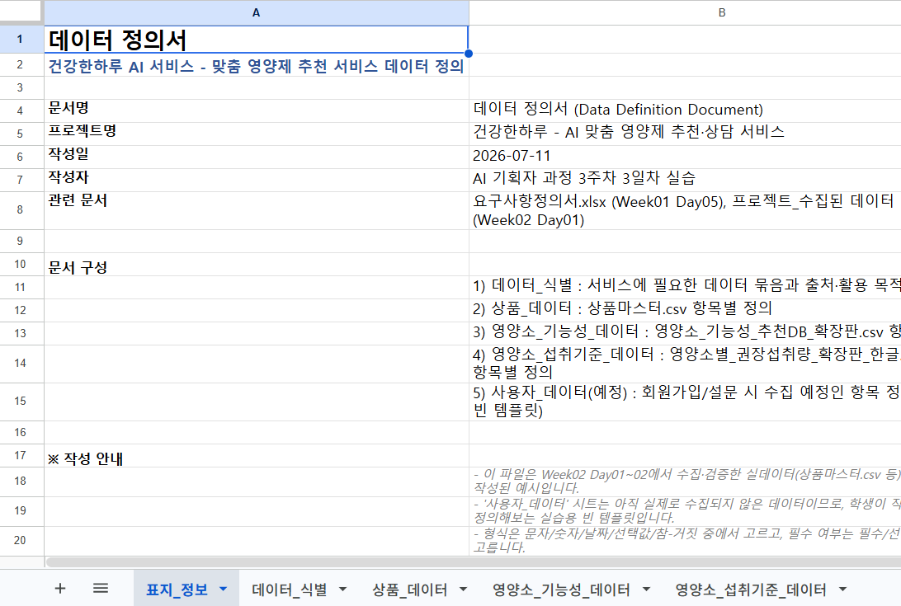
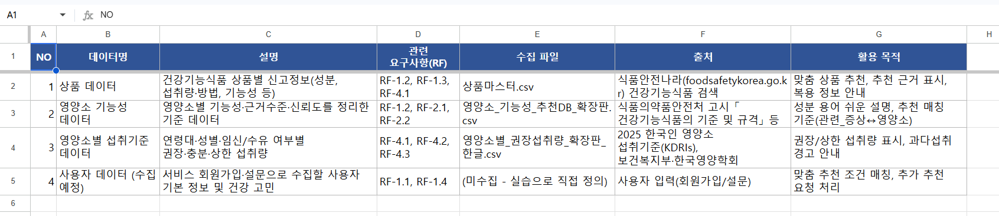
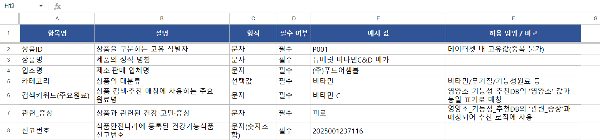
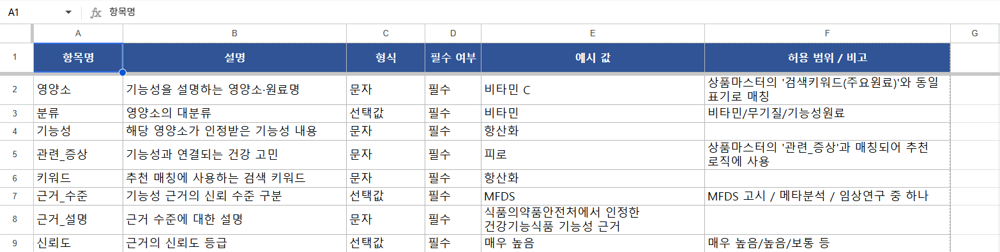
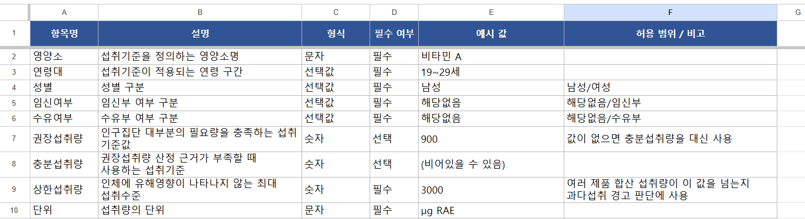

# 프로젝트 실습 - 데이터 정의서

이 폴더의 `데이터 정의서.xlsx`는 **건강한하루(AI 맞춤 영양제 추천·상담 서비스)** 가 Week02 Day01~02에서 실제로 수집·검증한 데이터를 기준으로 작성한 데이터 정의서입니다.

`../데이터 정의서.md` 자료에서 배운 내용(데이터 식별 → 데이터 속성 → 형식 → 출처 → 활용 목적)을 실제 프로젝트 데이터에 그대로 적용한 결과물이라고 보면 됩니다.

---
## 시트를 읽는 방법

- **데이터_식별** 시트가 가장 먼저 봐야 할 시트입니다. "우리 서비스에는 어떤 데이터 묶음이 필요한가?"에 대한 답이 여기 정리되어 있습니다.
- 나머지 시트(상품_데이터, 영양소_기능성_데이터, 영양소_섭취기준_데이터)는 각 데이터 묶음 안의 **항목(컬럼) 단위** 정의입니다. 실제 CSV 파일의 컬럼과 1:1로 대응합니다.
- 각 항목 정의 시트의 열 구성은 강의자료의 "데이터 정의서 예시 구조"와 동일합니다.

  `항목명 | 설명 | 형식 | 필수 여부 | 예시 값 | 허용 범위 / 비고`

- 여러 데이터 파일이 서로 연결(조인)되는 항목도 비고란에 표시해 두었습니다. 예를 들어 상품_데이터의 `검색키워드(주요원료)`와 영양소_기능성_데이터의 `영양소`는 같은 값으로 매칭되어 추천 로직에 사용됩니다.

---
## 파일 구성 (시트 순서대로)

| 시트명 | 내용 |
| --- | --- |
| 표지_정보 | 문서명, 프로젝트명, 작성일, 전체 시트 구성 안내 |

---
| 시트명 | 내용 |
| --- | --- |
| 데이터_식별 | 서비스에 필요한 데이터 묶음(상품/영양소 기능성/영양소 섭취기준/사용자)과 관련 요구사항(RF), 출처, 활용 목적 |

---
| 시트명 | 내용 |
| --- | --- |
| 상품_데이터 | `상품마스터.csv`의 15개 항목 정의 (항목명·설명·형식·필수여부·예시값·비고) |

---
| 시트명 | 내용 |
| --- | --- |
| 영양소_기능성_데이터 | `영양소_기능성_추천DB_확장판.csv`의 10개 항목 정의 |

---
| 시트명 | 내용 |
| --- | --- |
| 영양소_섭취기준_데이터 | `영양소별_권장섭취량_확장판_한글.csv`의 13개 항목 정의 |

