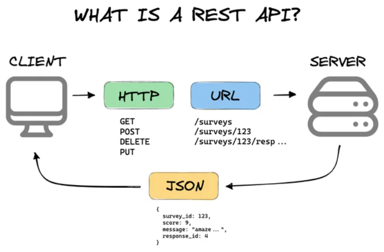
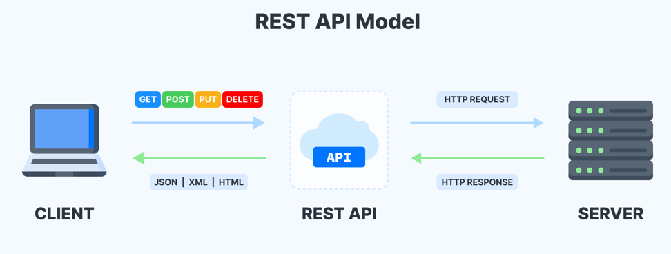
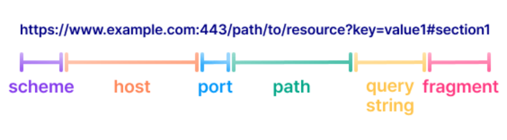
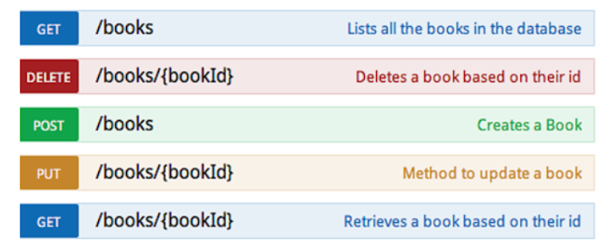

# API 설계와 AI 서비스 연동

> AI 기획자는 API를 직접 개발하는 사람이 아니라, API를 통해 **어떤 데이터와 기능이 연결되어야 하는지 설명하는 사람**입니다.

---
## 학습 목표
- REST API가 무엇인지 쉬운 말로 설명할 수 있다.
- API 정의서에 어떤 내용을 적어야 하는지 이해할 수 있다.
- AI 서비스에서 API가 어떤 역할을 하는지 설명할 수 있다.
- API를 기획할 때 조심해야 할 점을 알 수 있다.

---
## 오늘의 핵심 질문
오늘은 API 코드를 작성하는 시간이 아닙니다.

AI 기획자가 다음 질문에 답할 수 있도록 만드는 시간입니다.

- AI 서비스는 어떤 데이터를 어디에서 가져오는가?
- 화면과 서버는 어떻게 정보를 주고받는가?
- AI 기능을 사용하려면 어떤 요청이 필요한가?
- API가 실패하면 사용자는 무엇을 보게 되는가?
- API 정의서에는 무엇을 적어야 하는가?

---
## API란?
API는 서로 다른 시스템이 정해진 방식으로 데이터를 주고받기 위한 약속입니다.

쉽게 말하면,

```
사용자 화면
  ↓ 요청
API
  ↓ 응답
서비스 화면에 결과 표시
```

API가 있으면 화면, 서버, 데이터, AI 모델이 서로 연결될 수 있습니다.

---


---
## API를 일상적으로 이해하기
API는 식당 주문서와 비슷합니다.

| 식당 주문 | API 요청 |
| --- | --- |
| 메뉴판을 본다 | API 문서를 본다 |
| 메뉴 이름을 말한다 | 요청 주소를 사용한다 |
| 옵션을 말한다 | 요청값을 보낸다 |
| 음식을 받는다 | 응답 데이터를 받는다 |
| 주문이 안 되면 이유를 듣는다 | 오류 메시지를 받는다 |

---
## AI 서비스에서 API가 필요한 이유
AI 서비스는 혼자 동작하지 않습니다.

여러 시스템이 API로 연결됩니다.

- 화면에서 사용자의 질문을 보낸다.
- 서버가 사용자 정보를 확인한다.
- 데이터베이스에서 필요한 데이터를 가져온다.
- AI 모델에 질문을 보낸다.
- AI 답변을 화면으로 돌려준다.
- 사용 기록을 저장한다.

---
## REST API란?
REST API는 웹에서 많이 사용하는 API 방식입니다.

REST API는 보통 다음처럼 동작합니다.

```
정해진 주소로 요청한다
  ↓
필요한 값을 함께 보낸다
  ↓
서버가 처리한다
  ↓
결과를 JSON 같은 형태로 응답한다
```

---


---
## REST API의 핵심 요소
REST API를 이해할 때는 네 가지를 보면 됩니다.

| 요소 | 의미 |
| --- | --- |
| URL | 어디로 요청할 것인가 |
| Method | 무엇을 할 것인가 |
| Request | 어떤 값을 보낼 것인가 |
| Response | 어떤 결과를 받을 것인가 |

---
## URL은 요청 주소다
URL은 API를 호출하는 주소입니다.



---
예를 들어,

| 목적 | URL 예시 |
| --- | --- |
| 상품 목록 보기 | `/products` |
| 특정 상품 보기 | `/products/{product_id}` |
| 사용자 정보 보기 | `/users/{user_id}` |
| 추천 결과 받기 | `/recommendations` |
| 챗봇 답변 받기 | `/chat` |

URL은 기능의 위치를 알려 줍니다.

---
## Method는 요청 행동이다
Method는 API로 무엇을 할지 나타냅니다.

| Method | 의미 | 예시 |
| --- | --- | --- |
| GET | 조회하기 | 상품 목록 보기 |
| POST | 새로 만들기 또는 요청하기 | AI 추천 요청 |
| PUT/PATCH | 수정하기 | 사용자 정보 수정 |
| DELETE | 삭제하기 | 저장된 항목 삭제 |

기획자는 Method 이름을 외우기보다, 조회인지 요청인지 수정인지 구분하면 됩니다.

---


---
## Request는 보내는 값이다
Request는 API를 호출할 때 함께 보내는 값입니다.

예를 들어 추천 API라면 다음 값이 필요할 수 있습니다.

| 요청값 | 의미 |
| --- | --- |
| user_id | 어떤 사용자에게 추천할지 |
| keyword | 어떤 관심사를 기준으로 볼지 |
| limit | 몇 개를 추천받을지 |
| exclude | 제외할 조건이 있는지 |

---
## Response는 받는 값이다
Response는 API가 처리 후 돌려주는 결과입니다.

예를 들어 추천 API의 응답은 다음 정보를 포함할 수 있습니다.

| 응답값 | 의미 |
| --- | --- |
| item_id | 추천 대상 ID |
| item_name | 추천 대상 이름 |
| reason | 추천 이유 |
| score | 추천 점수 |
| source | 추천 근거 데이터 |

AI 서비스에서는 응답값이 화면에 어떻게 보일지도 함께 생각해야 합니다.

---
## JSON이란?
JSON은 API에서 데이터를 주고받을 때 자주 쓰는 형식입니다.

사람이 읽기 쉬운 이름과 값의 묶음이라고 이해하면 됩니다.

```json
{
  "question": "배송은 언제 오나요?",
  "answer": "주문 내역에서 배송 상태를 확인할 수 있습니다."
}
```

기획자는 JSON을 깊게 작성할 필요는 없지만, 어떤 값이 오가는지는 읽을 수 있어야 합니다.

---
## API 정의서란?
API 정의서는 API를 어떻게 사용할지 정리한 문서입니다.

개발자만 보는 문서가 아니라, 기획자와 디자이너도 함께 이해해야 하는 약속입니다.

---
API 정의서에는 보통 다음 내용이 들어갑니다.

- API 이름
- API 목적
- 요청 주소
- 요청 방식
- 요청값
- 응답값
- 오류 상황
- 인증 여부

---
## API 정의서가 필요한 이유
API 정의서가 없으면 사람마다 다르게 이해할 수 있습니다.

예를 들어,

- 화면에서는 10개 결과를 기대하는데 API는 5개만 준다.
- 기획자는 추천 이유가 필요하지만 API 응답에는 없다.
- 사용자가 입력하지 않은 값이 API에서는 필수값이다.
- 실패했을 때 어떤 메시지를 보여줄지 정해져 있지 않다.

API 정의서는 이런 차이를 줄입니다.

---
## API 정의서 기본 구조
| 항목 | 설명 |
| --- | --- |
| API 이름 | 어떤 API인지 |
| 목적 | 왜 필요한 API인지 |
| URL | 어디로 요청하는지 |
| Method | 조회, 요청, 수정, 삭제 중 무엇인지 |
| 요청값 | API를 부를 때 보내는 값 |
| 응답값 | API가 돌려주는 값 |
| 오류 | 실패할 수 있는 상황 |
| 비고 | 주의할 점 |

---
## 요청값 정의하기
요청값은 사용자가 보내거나 화면에서 전달하는 값입니다.

| 요청값 | 설명 | 필수 여부 | 예시 |
| --- | --- | --- | --- |
| user_id | 사용자 식별값 | 필수 | U001 |
| question | 사용자의 질문 | 필수 | 환불은 어떻게 하나요? |
| category | 검색 범위 | 선택 | 배송 |
| page | 페이지 번호 | 선택 | 1 |

필수값이 많을수록 사용자는 더 많은 정보를 입력해야 합니다.

---
## 응답값 정의하기
응답값은 화면이나 AI 기능이 사용할 결과입니다.

| 응답값 | 설명 | 예시 |
| --- | --- | --- |
| answer | AI 답변 | 환불은 주문 내역에서 신청할 수 있습니다. |
| source | 답변 근거 | 환불 정책 문서 |
| confidence | 답변 신뢰도 | 높음 |
| created_at | 응답 생성 시각 | 2026-07-11 |

AI 서비스에서는 답변 내용뿐 아니라 근거와 상태도 중요합니다.

---
## 오류 상황도 정의해야 한다
API는 항상 성공하지 않습니다.

실패 상황도 미리 정의해야 합니다.

| 오류 상황 | 사용자에게 필요한 안내 |
| --- | --- |
| 필수값이 없음 | 필요한 정보를 다시 입력해 주세요 |
| 데이터가 없음 | 조건에 맞는 결과가 없습니다 |
| 권한이 없음 | 로그인 또는 권한 확인이 필요합니다 |
| 외부 API 실패 | 잠시 후 다시 시도해 주세요 |
| AI 답변 실패 | 답변을 생성하지 못했습니다 |

---
## 인증이란?
인증은 API를 아무나 쓰지 못하게 확인하는 과정입니다.

예를 들어,

- 로그인한 사용자만 호출할 수 있다.
- 관리자만 수정할 수 있다.
- API Key가 있어야 외부 데이터를 가져올 수 있다.
- 사용자의 개인정보는 본인만 볼 수 있다.

기획자는 어떤 API에 인증이 필요한지 구분해야 합니다.

---
## AI 서비스에서 API가 쓰이는 곳
AI 서비스에서는 다양한 API가 필요할 수 있습니다.

| API | 역할 |
| --- | --- |
| 사용자 API | 사용자 정보 조회 |
| 데이터 API | 상품, 문서, 기록 조회 |
| 추천 API | 맞춤 추천 결과 생성 |
| 챗봇 API | 사용자 질문에 대한 답변 생성 |
| 검색 API | 관련 문서나 콘텐츠 검색 |
| 로그 API | 사용 기록 저장 |

---
## AI 모델 API
AI 모델을 사용할 때도 API를 호출하는 경우가 많습니다.

흐름은 단순하게 보면 다음과 같습니다.

```
사용자 질문
  ↓
우리 서비스
  ↓
AI 모델 API
  ↓
AI 답변
  ↓
사용자 화면
```

기획자는 어떤 질문을 보내고, 어떤 답변을 받아야 하는지 정의해야 합니다.

---
## AI 답변 API에서 중요한 값
AI 답변 API를 설계할 때는 답변 텍스트만 생각하면 부족합니다.

| 값 | 이유 |
| --- | --- |
| 사용자 질문 | AI가 답할 내용 |
| 대화 기록 | 앞뒤 맥락 유지 |
| 참고 문서 | 근거 있는 답변 생성 |
| 답변 내용 | 사용자에게 보여줄 결과 |
| 출처 | 답변 근거 표시 |
| 실패 메시지 | 답변 불가 상황 안내 |

---
## RAG와 API
RAG는 AI가 답변하기 전에 관련 문서를 찾아 참고하는 방식입니다.

이때도 API가 사용될 수 있습니다.

```
사용자 질문
  ↓
검색 API로 관련 문서 찾기
  ↓
AI 모델 API에 질문과 문서 전달
  ↓
근거 있는 답변 생성
```

AI 기획자는 어떤 문서를 검색하고, 답변에 출처를 보여줄지 정해야 합니다.

---
## API가 느리면 AI 서비스도 느려진다
API 속도는 사용자 경험에 영향을 줍니다.

특히 AI 서비스는 응답 시간이 길어질 수 있습니다.

기획자는 다음을 고려해야 합니다.

- 사용자가 얼마나 기다릴 수 있는가?
- 로딩 화면이 필요한가?
- 답변 생성 중이라는 안내가 필요한가?
- 너무 오래 걸리면 중단할 것인가?
- 실패 시 다시 시도할 수 있는가?

---
## API 호출 제한
외부 API는 호출 횟수 제한이 있을 수 있습니다.

예를 들어,

- 하루 1,000번까지만 호출 가능
- 1분에 60번까지만 호출 가능
- 사용량이 많아지면 비용 증가
- 무료 한도를 넘으면 응답 중단

AI 서비스는 사용자가 늘수록 API 사용량도 늘어날 수 있습니다.

---
## API 정의서 작성 시 기획자 체크리스트
API를 정의할 때 다음을 확인합니다.

- 이 API는 어떤 기능 때문에 필요한가?
- 요청값은 무엇인가?
- 필수값과 선택값은 무엇인가?
- 응답값은 화면에 충분한가?
- 실패하면 어떤 메시지를 보여줄 것인가?
- 인증이 필요한가?
- 호출 제한이나 비용이 있는가?
- AI 답변 근거를 표시할 수 있는가?

---
## 좋지 않은 API 정의서
다음과 같은 API 정의서는 협업을 어렵게 만듭니다.

- API 목적이 없다.
- 요청값과 응답값이 모호하다.
- 예시가 없다.
- 필수값이 표시되어 있지 않다.
- 오류 상황이 없다.
- 화면에서 필요한 값이 응답에 없다.
- AI 답변 실패 상황이 고려되어 있지 않다.

---
## 좋은 API 정의서
좋은 API 정의서는 읽는 사람이 같은 기능을 떠올릴 수 있습니다.

- API 이름이 명확하다.
- 어떤 화면이나 기능에서 쓰는지 알 수 있다.
- 요청값과 응답값이 구체적이다.
- 예시가 있다.
- 오류 상황과 사용자 안내가 있다.
- 인증과 권한이 표시되어 있다.
- AI 답변의 근거와 실패 상황을 고려한다.

---
## 너무 어렵게 생각하지 않기
AI 기획자가 API 개발자가 될 필요는 없습니다.

다만 다음 정도는 설명할 수 있어야 합니다.

- 어떤 기능에 API가 필요한지
- 화면에서 어떤 값을 보내야 하는지
- API가 어떤 값을 돌려줘야 하는지
- 실패하면 사용자에게 어떻게 안내할지
- AI 기능이 어떤 데이터와 연결되는지

---
## 핵심 정리
- API는 시스템끼리 데이터를 주고받기 위한 약속이다.
- REST API는 URL, Method, Request, Response를 중심으로 이해하면 된다.
- API 정의서는 API의 목적, 요청값, 응답값, 오류 상황을 정리한 문서다.
- AI 서비스에서는 사용자 정보, 데이터 조회, 검색, 추천, 챗봇, AI 모델 호출에 API가 쓰인다.
- AI 기획자는 API를 개발하지 않아도, API가 어떤 기능과 데이터를 연결하는지 설명할 수 있어야 한다.

---
## 오늘 기억할 문장
> API 정의서는 개발자만을 위한 문서가 아닙니다.

> AI 기획자가 서비스 기능과 데이터, AI 답변 흐름을 연결하기 위해 필요한 약속입니다.