# Day 05 프로젝트: 건강한하루 FastAPI 구현

`요구사항정의서.xlsx`의 기능적 요구사항(RF-1~4) 중 **LLM/RAG/Agent를 쓰지 않는 규칙 기반 기능만** FastAPI로 구현한 실습 프로젝트입니다. 
Day04에서 만든 `건강한하루.db`(SQLite)를 그대로 재사용합니다.

---
## 구현 범위

| 요구사항 | 내용 | 구현 여부 |
| --- | --- | --- |
| RF-1.0 AI 맞춤 상품 추천 | 건강고민 입력 → 매칭 → 최대 5개 추천 → 근거 표시 → 재추천 | 규칙 기반 매칭으로 구현 |
| RF-2.1~2.2 성분 설명/출처 | 영양소 용어 설명 + 출처 표기 | DB 조회로 구현 |
| RF-2.3 관련 질문 추천 | FAQ 추천 | 수용여부 X(2차 오픈 재검토) → 미구현 |
| RF-3.0 AI 상담/RAG FAQ | 자연어 상담 + RAG 답변 생성 | LLM/RAG 기능이라 이번 과제 범위에서 제외 |

---
| 요구사항 | 내용 | 구현 여부 |
| --- | --- | --- |
| RF-4.1 권장/상한 섭취량 표시 | KDRIs 기준표 조회 | 규칙 기반으로 구현 |
| RF-4.2 과다섭취 경고 안내 | 합산 섭취량 초과 경고 | 규칙 기반(중복 성분 탐지)으로 구현 — *DB에 실제 함량(mg)이 없어 정확한 합산 대신 "중복 포함 여부"로 판단하는 간이 규칙을 사용합니다* |
| RF-4.3 AI 설명 보조 | 경고 문구를 AI가 보조 생성 | LLM 기능이라 제외, 고정 문구 사용 |

---
## 프로젝트 구조

계층 흐름: `router` → `service` → `model(DB)` 순으로 의존하며, `schema`는 요청/응답 데이터의 형태만 정의합니다.

```
프로젝트/
├── app/
│   ├── main.py              # FastAPI 앱 생성 + 라우터 등록만 담당
│   ├── core/
│   │   ├── config.py         # 설정값(DB 경로, 페이지 크기 등)
│   │   └── database.py       # SQLAlchemy 엔진/세션, get_db 의존성
│   ├── models/                # ORM 모델 (기존 DB 테이블과 매핑)
│   │   ├── product.py         # 상품 테이블
│   │   └── nutrient.py        # 영양소_기능성 / 영양소_섭취기준 테이블
...
```

---
```
프로젝트/
├── app/
...
│   │   ├── product.py
│   │   ├── nutrient.py
│   │   ├── recommendation.py
│   │   └── dosage.py
│   ├── services/                # 실제 비즈니스 로직 (DB 조회 + 매칭 규칙)
│   │   ├── product_service.py
│   │   ├── recommendation_service.py   # RF-1 추천 알고리즘
│   │   ├── nutrient_service.py         # RF-2 성분 설명
│   │   └── dosage_service.py           # RF-4 섭취기준/과다섭취 경고
│   └── routers/                 # API 엔드포인트 정의 (services 호출만 담당)
│       ├── products.py
│       ├── recommendations.py
│       ├── nutrients.py
│       └── dosage.py
├── data/
│   └── 건강한하루.db          # Day04에서 구축한 SQLite DB (재사용)
└── pyproject.toml
```

---
## 실행 방법

```bash
# 1) 의존성 설치 (uv 사용)
uv sync

# 2) 가상환경에 접속
.\.venv\Scripts\activat

# 3) 서버 실행 (--reload로 코드 수정 시 자동 재시작)
uv run uvicorn app.main:app --reload --port 8001
```
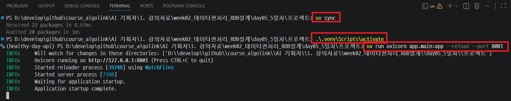

---
## 주요 API

| Method | URL | 설명 |
| --- | --- | --- |
| GET | `/products` | 상품 목록 조회 (카테고리/키워드 필터) |
| GET | `/products/{product_id}` | 상품 상세 조회 |
| POST | `/recommendations` | RF-1: 건강고민 기반 맞춤 추천 (재추천은 `offset` 사용) |
| GET | `/nutrients/{nutrient_name}` | RF-2: 영양소 성분 설명 + 출처 |
| GET | `/dosage/products/{product_id}` | RF-4.1: 상품 기준 권장/상한 섭취량 조회 |
| POST | `/dosage/overconsumption-check` | RF-4.2: 여러 상품 동시 섭취 시 과다섭취 경고 |

---
### Swagger UI 실습 (http://localhost:8001/docs)

> 각 API에서 **Try it out**을 누른 뒤 아래 순서대로 입력합니다.

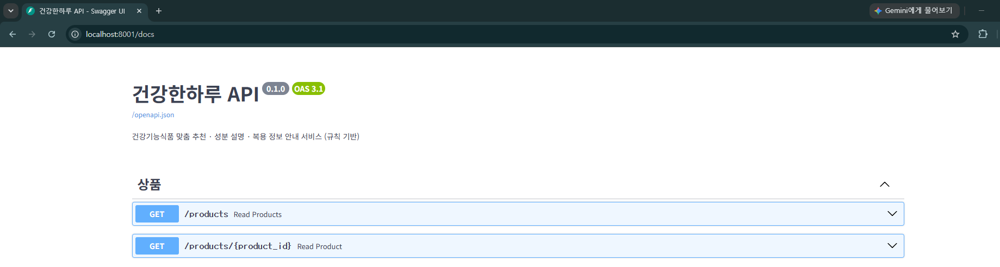

---
#### 1. `GET /products` — 상품 목록 조회
카테고리/키워드 쿼리 파라미터에 값을 넣고 **Execute**를 누릅니다.

| 파라미터 | 값 |
| --- | --- |
| 카테고리 | `비타민` |
| 키워드 | (비워두고 실행) |

---
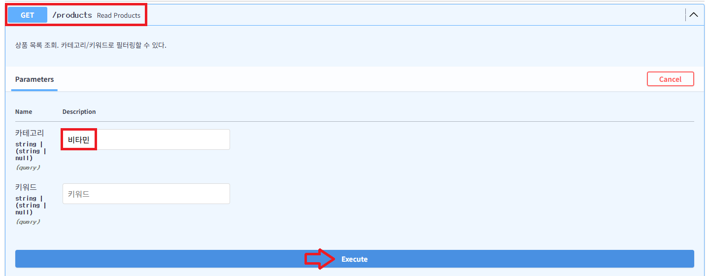

---
- 응답에서 `상품ID`(예: `P001`)를 하나 메모해둡니다. 다음 실습에서 사용합니다.

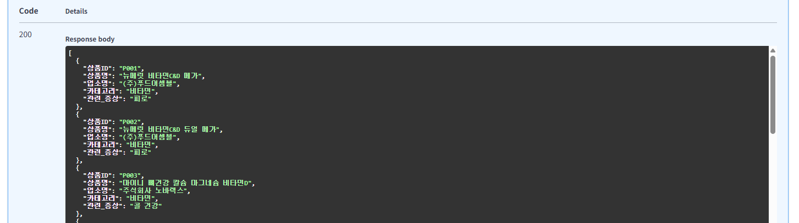

---
#### 2. `GET /products/{product_id}` — 상품 상세 조회

| 파라미터 | 값 |
| --- | --- |
| product_id | `P001` |

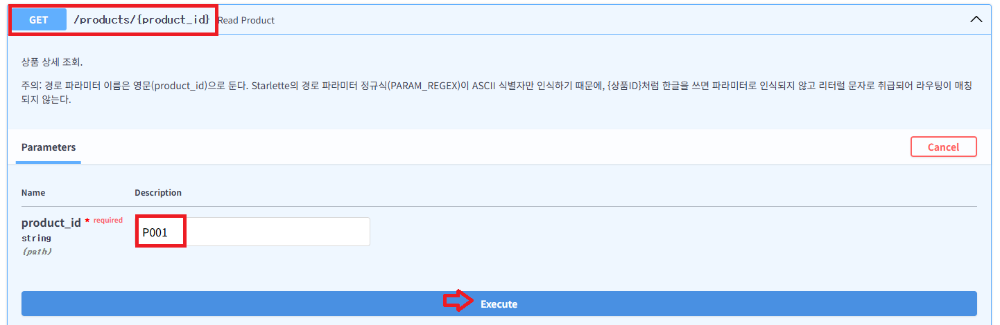

---
- 응답의 `기능성_내용`, `섭취시주의사항` 필드를 확인합니다.

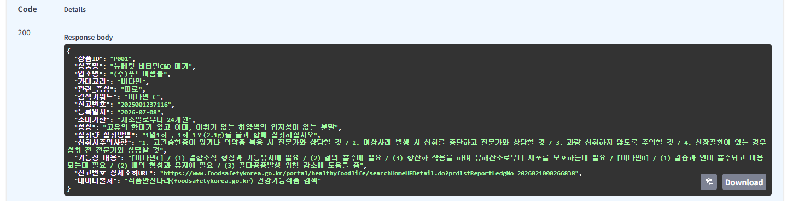

---
#### 3. `POST /recommendations` — RF-1 건강고민 기반 맞춤 추천

Request body:
```json
{
  "건강고민": "피로",
  "offset": 0
}
```
---
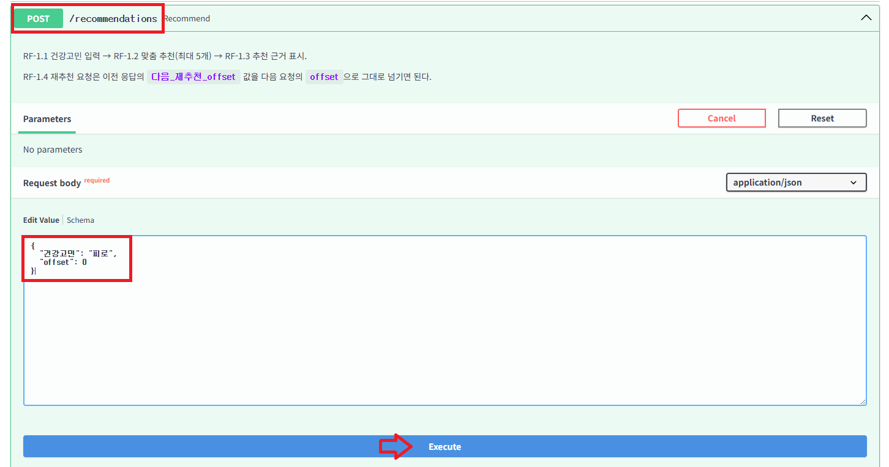

---
- 응답의 `추천상품` 배열과 각 상품의 `추천근거`(영양소·기능성)를 확인합니다.

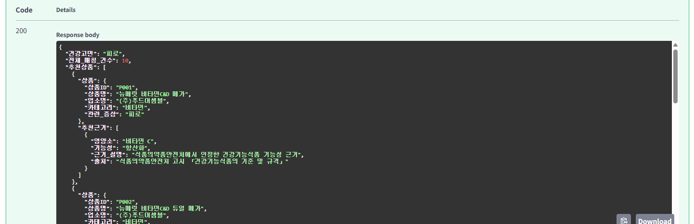

---
#### 4. `GET /nutrients/{nutrient_name}` — RF-2 영양소 성분 설명

| 파라미터 | 값 |
| --- | --- |
| nutrient_name | `비타민 C` |

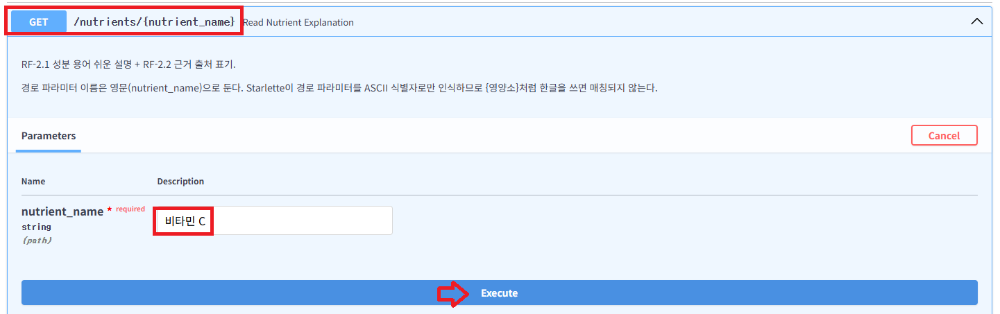

---
- 응답의 `기능성_목록` 배열에서 `근거_설명`, `출처`, `출처_URL`을 확인합니다.

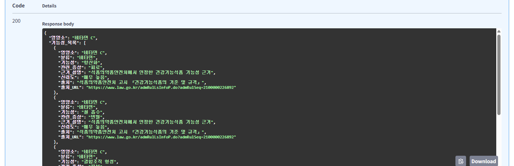

---
#### 5. `GET /dosage/products/{product_id}` — RF-4.1 상품 기준 권장/상한 섭취량

| 파라미터 | 값 |
| --- | --- |
| product_id | `P003` |
| 연령대 | `19~29세` |
| 성별 | `여성` |
| 임신여부 | (비워두기) |
| 수유여부 | (비워두기) |

---
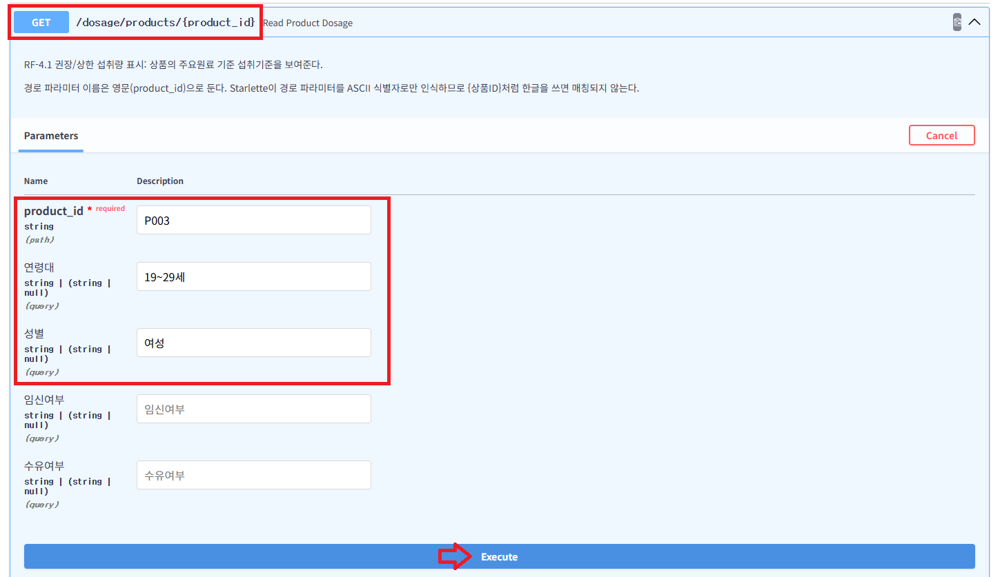

---
- 응답의 `섭취기준` 배열에서 `권장섭취량`/`상한섭취량`/`단위`가 연령대·성별에 따라 달라지는지 확인합니다.

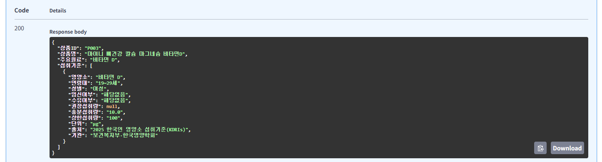

---
#### 6. `POST /dosage/overconsumption-check` — RF-4.2 과다섭취 경고 안내

`P001`, `P002`는 둘 다 주요원료가 `비타민 C`라서 같이 담으면 경고가 발생합니다.

Request body:
```json
{
  "상품ID_목록": ["P001", "P002"],
  "조건": {
    "연령대": "19~29세",
    "성별": "여성"
  }
}
```
---
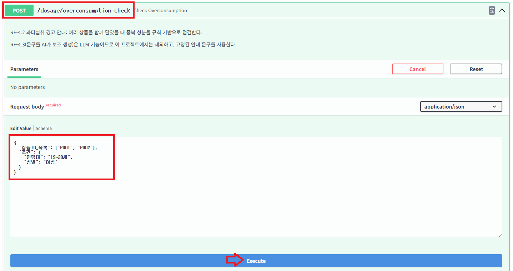

---
- 응답의 `경고_목록`에서 `영양소`, `중복_상품수`, `중복_상품명`, `경고_문구`를 확인합니다.

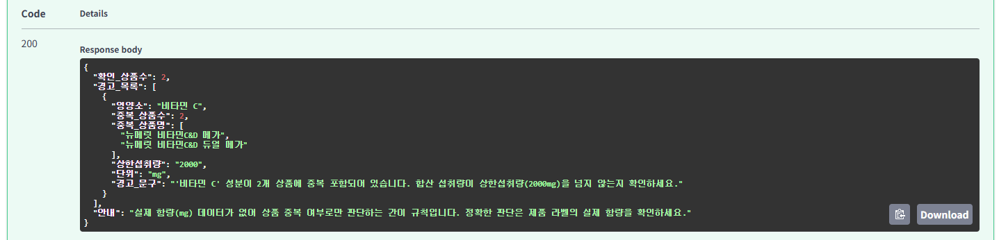

---
# [예제영상> Python FastAPI 튜토리얼](https://www.youtube.com/watch?v=iWS9ogMPOI0)
- GET 및 POST 경로
- HTTP 오류 처리
- JSON 요청 및 경로 매개변수
- 응답 모델
- 대화형 문서

