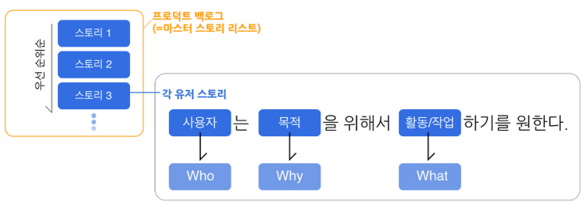
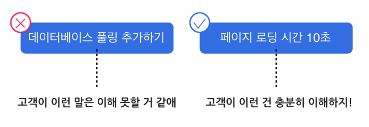
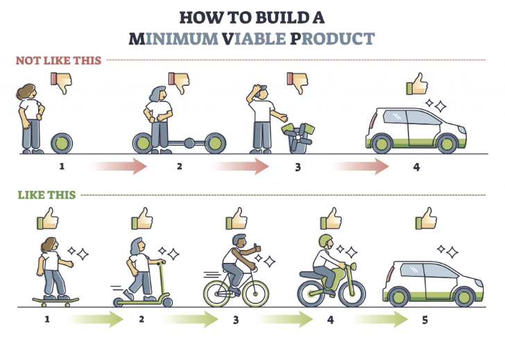
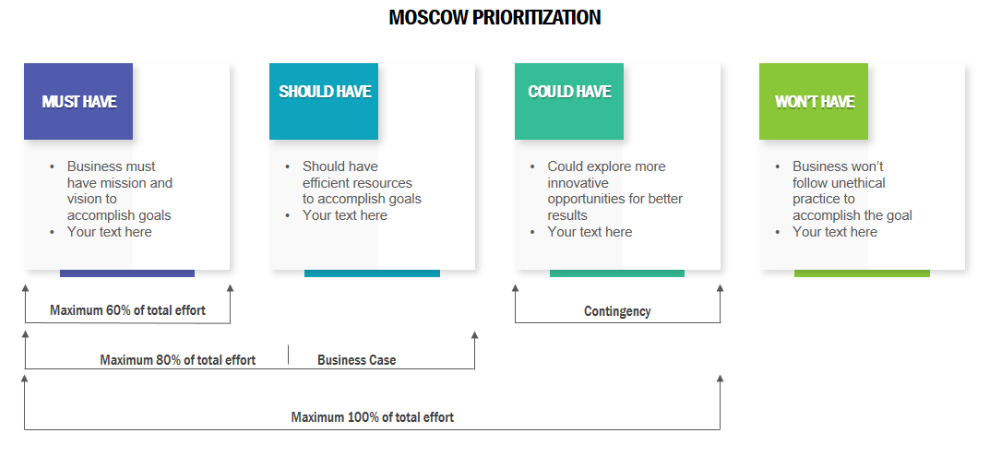

# MVP와 서비스 기능 정의

---

## 오늘의 핵심 질문

- 우리가 만들 서비스의 첫 버전은 어디까지여야 할까?
- 사용자가 정말 필요로 하는 기능은 무엇일까?
- 모든 기능을 한 번에 만들 수 없다면 무엇부터 선택해야 할까?
- AI 기능은 언제 넣어야 하고, 언제 미뤄야 할까?

---

## AI 기획자에게 기능 정의가 중요한 이유

AI 서비스는 아이디어가 커지기 쉽습니다.

- 챗봇도 넣고 싶다
- 추천도 넣고 싶다
- 자동 분석도 넣고 싶다
- 관리자 화면도 필요해 보인다
- 데이터 대시보드도 있으면 좋겠다

하지만 첫 버전의 목표는 "많이 만드는 것"이 아니라  
**사용자의 핵심 문제가 실제로 풀리는지 확인하는 것**입니다.

---

## 기능 정의란 무엇인가

기능 정의는 서비스를 구성하는 일을 사용자 관점에서 정리하는 과정입니다.

기능 정의는 단순한 기능 목록이 아닙니다.

| 구분 | 질문 |
|---|---|
| 사용자 | 누가 사용하는가? |
| 상황 | 언제, 어떤 문제 때문에 사용하는가? |
| 행동 | 사용자가 무엇을 할 수 있어야 하는가? |
| 가치 | 그 행동 후 무엇이 좋아지는가? |
| 범위 | 첫 버전에 어디까지 포함할 것인가? |

---

## 기능을 먼저 많이 적으면 생기는 문제

"있으면 좋은 기능"이 많아질수록 서비스는 흐려집니다.

- 핵심 사용자가 누구인지 모호해진다
- 첫 출시 범위가 커진다
- 개발 기간과 비용이 늘어난다
- AI 기능의 품질 검증이 어려워진다
- 사용자가 실제로 원하는 가치보다 화면과 기능 수에 집중하게 된다

AI 기획자는 기능을 늘리는 사람이 아니라  
**사용자 가치에 맞게 기능을 줄이고 정렬하는 사람**입니다.

---

## 좋은 기능 정의의 기준

좋은 기능 정의는 다음 네 가지를 설명할 수 있어야 합니다.

1. 이 기능은 누구를 위한 것인가?
2. 사용자는 이 기능으로 어떤 문제를 해결하는가?
3. 이 기능이 없으면 첫 버전의 가치가 무너지는가?
4. 이 기능은 지금 만들 만큼 중요한가?

기능의 이름보다 중요한 것은  
**그 기능이 사용자에게 만들어 주는 변화**입니다.

---

## [User Story란 무엇인가](https://teamhankki.tistory.com/16)

User Story는 기능을 사용자 관점의 짧은 문장으로 표현하는 방법입니다.

기본 형식은 다음과 같습니다.

> 나는 [사용자]로서  
> [원하는 행동]을 하고 싶다.  
> 그래서 [얻고 싶은 가치]를 얻을 수 있다.

User Story는 기능명을 정리하는 도구가 아니라  
**기능이 필요한 이유를 분명하게 만드는 도구**입니다.

---

---

## User Story의 세 부분

| 구성 | 의미 | 예시 |
|---|---|---|
| 사용자 | 누구의 문제인가 | 바쁜 직장인 |
| 원하는 행동 | 무엇을 하고 싶은가 | 오늘 먹을 건강한 식단을 빠르게 추천받고 싶다 |
| 얻는 가치 | 왜 필요한가 | 메뉴 고민 시간을 줄이고 식습관을 관리할 수 있다 |

세 부분 중 하나라도 비어 있으면 기능의 목적이 약해집니다.

---

## User Story 예시

나쁜 예시:

> 사용자는 AI 추천 기능을 사용할 수 있다.

좋은 예시:

> 나는 식단 관리가 필요한 직장인으로서  
> 내 알레르기와 선호 음식을 반영한 점심 메뉴를 추천받고 싶다.  
> 그래서 안전하고 지속 가능한 식사를 선택할 수 있다.

차이는 기능명이 아니라  
**사용자 상황과 가치가 보이는가**에 있습니다.

---

## User Story를 쓸 때 피해야 할 표현

다음 표현은 기능을 너무 공급자 관점으로 만들 수 있습니다.

- AI를 적용한다
- 대시보드를 만든다
- 데이터를 시각화한다
- 추천 알고리즘을 구현한다
- 관리자 기능을 제공한다

이 표현이 틀린 것은 아닙니다.  
다만 User Story에서는 먼저 사용자 관점으로 바꿔야 합니다.

---

---

## 공급자 관점을 사용자 관점으로 바꾸기

| 공급자 관점 | 사용자 관점 |
|---|---|
| AI 추천 기능 제공 | 사용자가 선택하기 어려운 상황에서 적절한 후보를 빠르게 고른다 |
| 대시보드 제공 | 사용자가 현재 상태를 한눈에 이해하고 다음 결정을 내린다 |
| 알림 기능 제공 | 사용자가 중요한 시점을 놓치지 않는다 |
| 검색 기능 제공 | 사용자가 원하는 정보를 빠르게 찾는다 |
| 데이터 분석 제공 | 사용자가 판단에 필요한 근거를 확인한다 |

기능은 수단이고, 사용자 가치는 목적입니다.

---

## User Story가 기능 정의에 주는 도움

User Story를 쓰면 다음 판단이 쉬워집니다.

- 이 기능이 어떤 사용자를 위한 것인지 구분할 수 있다
- 기능의 목적이 흐려지는 것을 막을 수 있다
- 팀 안에서 같은 기능을 다르게 이해하는 문제를 줄일 수 있다
- MVP에 포함할 기능과 나중에 만들 기능을 나눌 수 있다
- AI 기능이 "멋져 보여서"가 아니라 "문제를 풀어서" 필요한지 확인할 수 있다

---
## [MVP란 무엇인가](https://inflectiv.co/2022/03/31/mvp-minimum-viable-product/)

MVP는 Minimum Viable Product의 약자입니다.

한국어로는 보통 "최소 기능 제품"이라고 부릅니다.

하지만 더 정확히는 다음 뜻에 가깝습니다.

> 사용자의 핵심 문제를 해결하는 데 필요한  
> 가장 작은 검증 가능한 서비스 버전

MVP는 작게 만드는 것이 목적이 아니라  
**중요한 가설을 빠르게 확인하는 것**이 목적입니다.

---

---

## MVP에서 Minimum의 의미

Minimum은 아무렇게나 적게 만든다는 뜻이 아닙니다.

Minimum은 다음을 뜻합니다.

- 핵심 사용자에게 꼭 필요한 것만 남긴다
- 첫 검증에 필요 없는 기능은 미룬다
- 사용자가 가치를 느끼는 흐름은 끊기지 않게 한다
- 보기 좋은 부가 기능보다 문제 해결을 우선한다

즉, MVP는 "작지만 쓸 수 있는 서비스"여야 합니다.

---

## MVP에서 Viable의 의미

Viable은 실제로 가치가 있어야 한다는 뜻입니다.

너무 적게 만들면 MVP가 아니라 불완전한 화면이 됩니다.

Viable한 MVP는 다음 조건을 갖습니다.

- 사용자가 자신의 문제를 해결해 볼 수 있다
- 서비스의 핵심 흐름이 처음부터 끝까지 이어진다
- 결과가 사용자의 판단이나 행동에 도움을 준다
- 피드백을 받을 수 있을 만큼 구체적이다

MVP는 "반쪽짜리 서비스"가 아니라  
**핵심 가치만 남긴 첫 서비스**입니다.

---

## MVP가 아닌 것

다음은 MVP와 혼동하기 쉽습니다.

| 오해 | 왜 다른가 |
|---|---|
| 기능을 대충 줄인 버전 | 사용자 가치가 끊기면 검증이 어렵다 |
| 디자인이 없는 화면 | 화면 완성도가 아니라 문제 해결 흐름이 중요하다 |
| 기술 데모 | 기술이 작동해도 사용자가 가치를 느끼는지는 별도 문제다 |
| 모든 기능의 축소판 | 모든 것을 조금씩 넣으면 핵심이 흐려진다 |
| 출시 전 임시 결과물 | MVP도 실제 사용자 반응을 확인하기 위한 서비스 버전이다 |

---

## AI 서비스의 MVP는 더 조심해야 한다

AI 기능은 매력적이지만 불확실성이 큽니다.

- 답변 품질이 일정하지 않을 수 있다
- 데이터가 충분하지 않을 수 있다
- 사용자가 AI 결과를 신뢰하지 않을 수 있다
- 설명이 부족하면 오히려 불안해질 수 있다
- 자동화 범위가 커질수록 오류 책임이 커진다

그래서 AI MVP에서는  
**AI가 꼭 필요한 순간과 사람이 판단해야 할 순간을 나눠야 합니다.**

---

## AI 기능을 MVP에 넣어도 되는 경우

다음 질문에 "그렇다"라고 답할 수 있으면 MVP에 포함할 가능성이 높습니다.

- 이 AI 기능이 없으면 핵심 사용자 문제가 해결되지 않는가?
- AI가 사용자의 시간을 실제로 줄여 주는가?
- 결과가 틀렸을 때 사용자가 확인하거나 수정할 수 있는가?
- AI 결과의 품질을 비교할 기준이 있는가?
- 단순 규칙이나 검색보다 AI가 더 나은 이유가 분명한가?

AI는 차별화를 위한 장식이 아니라  
**사용자 문제를 푸는 수단**이어야 합니다.

---

## 기능 후보를 정리하는 방식

기능을 바로 우선순위로 나누기 전에 먼저 묶어 봅니다.

| 기능 묶음 | 질문 |
|---|---|
| 사용 시작 | 사용자가 어떻게 들어오는가? |
| 정보 입력 | 사용자가 무엇을 알려 주어야 하는가? |
| 핵심 결과 | 서비스가 어떤 결과를 제공하는가? |
| 확인과 수정 | 사용자가 결과를 어떻게 검토하는가? |
| 저장과 공유 | 결과를 다시 보거나 전달해야 하는가? |
| 운영 관리 | 서비스 운영자가 무엇을 확인해야 하는가? |

기능 후보는 화면 단위가 아니라 **사용자 흐름 단위** 로 정리하는 것이 좋습니다.

---

## 기능 우선순위가 필요한 이유

모든 기능을 동시에 만들 수는 없습니다.

우선순위는 다음을 정하기 위해 필요합니다.

- 첫 버전에 반드시 들어갈 기능
- 있으면 좋지만 나중에 넣어도 되는 기능
- 사용자 검증 후 결정할 기능
- 지금 만들면 오히려 복잡해지는 기능

우선순위는 단순한 중요도 순서가 아닙니다.  
**첫 검증에 필요한 범위를 정하는 의사결정**입니다.

---

## MoSCoW란 무엇인가

MoSCoW는 기능 우선순위를 네 단계로 나누는 방법입니다.

| 구분 | 의미 |
|---|---|
| Must have | 반드시 있어야 하는 기능 |
| Should have | 중요하지만 첫 버전에서 조정 가능한 기능 |
| Could have | 있으면 좋지만 없어도 핵심 가치는 유지되는 기능 |
| Won't have | 이번 범위에서는 제외할 기능 |

> MoSCoW의 핵심은 **모든 기능을 중요하다고 말하지 않는 것**입니다.

---

---
## Must have
> Must have는 이 기능이 없으면 서비스의 핵심 가치가 성립하지 않는 기능입니다.

판단 질문:

- 이 기능이 없으면 사용자가 핵심 문제를 해결할 수 없는가?
- 이 기능이 없으면 User Story가 완성되지 않는가?
- 이 기능이 없으면 MVP 검증이 의미 없어지는가?

Must have는 적을수록 좋습니다.  
Must가 많아지면 MVP가 아니라 전체 서비스에 가까워집니다.

---

## Should have
> Should have는 중요하지만 첫 검증에서 반드시 필요한 것은 아닌 기능입니다.

예를 들어:

- 결과 화면의 세부 필터
- 더 편한 입력 방식
- 추가 설명 문구
- 보조 알림
- 관리자용 상세 통계

Should have는 사용자 경험을 좋아지게 만들지만  
없어도 핵심 흐름이 작동해야 합니다.

---

## Could have
> Could have는 있으면 만족도가 올라가지만 우선순위가 낮은 기능입니다.

예를 들어:

- 테마 색상 선택
- 프로필 꾸미기
- 고급 공유 옵션
- 추가 추천 카드
- 보조 콘텐츠 영역

Could have는 나쁘다는 뜻이 아닙니다.  
다만 첫 버전에서 핵심 검증보다 앞서면 안 됩니다.

---

## Won't have
> Won't have는 이번 범위에서는 의도적으로 제외하는 기능입니다.

제외는 포기가 아닙니다.

- 지금 만들기엔 검증 근거가 부족하다
- 핵심 사용자 문제와 거리가 있다
- 운영 부담이 크다
- 품질을 보장하기 어렵다
- 다음 버전에서 판단하는 것이 낫다

좋은 기획자는 무엇을 넣을지뿐 아니라  
**무엇을 지금 넣지 않을지도 설명할 수 있어야 합니다.**

---

## MoSCoW 예시

건강 식단 추천 서비스를 예로 들어 봅니다.

| 구분 | 기능 예시 | 이유 |
|---|---|---|
| Must | 선호 음식과 알레르기 입력 | 안전한 추천의 기본 조건 |
| Must | 오늘의 식단 추천 결과 | 서비스의 핵심 가치 |
| Should | 추천 이유 설명 | 사용자의 신뢰 형성에 도움 |
| Could | 식단 이미지 꾸미기 | 만족도는 높일 수 있지만 핵심은 아님 |
| Won't | 자동 장보기 주문 | 운영 난이도가 높고 첫 검증 범위를 넘음 |

---

## 사용자 가치 중심 기능 선정

기능을 선택할 때는 "만들 수 있는가"보다 먼저  `"사용자에게 가치가 있는가"`를 봐야 합니다.

사용자 가치 중심 기능 선정은 다음 순서로 생각합니다.

1. 사용자의 문제를 확인한다
2. 문제를 해결하는 핵심 행동을 찾는다
3. 그 행동을 가능하게 하는 기능만 남긴다
4. 첫 검증에 필요 없는 기능을 미룬다
5. 사용자가 얻는 결과를 명확히 설명한다

---

## 사용자 가치의 네 가지 기준

| 기준 | 질문 |
|---|---|
| 문제 강도 | 사용자가 실제로 불편해하는 문제인가? |
| 사용 빈도 | 반복적으로 필요해지는가? |
| 대체 난이도 | 기존 방식으로 해결하기 번거로운가? |
| 결과 명확성 | 기능 사용 후 좋아진 점이 분명한가? |

기능의 가치는 기능 자체가 아니라  
**사용자의 전후 변화**로 판단합니다.

---

## 기능 선정에서 자주 생기는 착각

기능이 많으면 좋은 서비스처럼 보일 수 있습니다.

하지만 사용자는 기능 수보다 다음을 더 중요하게 느낍니다.

- 내가 원하는 결과가 빨리 나오는가?
- 입력해야 할 것이 너무 많지 않은가?
- 결과를 믿을 수 있는가?
- 다음 행동을 바로 결정할 수 있는가?
- 불필요한 선택지가 나를 방해하지 않는가?

기능이 많아도 사용자 가치가 흐리면 좋은 서비스가 되기 어렵습니다.

---

## 기능을 줄이는 것은 품질을 낮추는 일이 아니다

기능을 줄이는 것은 기획의 후퇴가 아닙니다.

오히려 다음을 더 분명하게 만듭니다.

- 누구를 위한 서비스인지
- 어떤 문제를 먼저 해결하는지
- 어떤 데이터가 필요한지
- 어떤 AI 기능이 정말 필요한지
- 어떤 결과로 성공을 판단할지

기능을 줄일수록 서비스의 핵심 약속은 더 선명해집니다.

---

## AI 기획자의 기능 선정 질문

기능 후보를 볼 때 다음 질문을 던져 봅니다.

- 이 기능은 사용자의 어떤 불편을 줄이는가?
- 이 기능은 AI가 해야 하는 일인가, 규칙으로도 가능한가?
- 사용자는 이 기능의 결과를 이해하고 신뢰할 수 있는가?
- 결과가 틀렸을 때 회복 방법이 있는가?
- 첫 버전에서 이 기능을 빼면 어떤 문제가 생기는가?
- 이 기능보다 먼저 확인해야 할 더 중요한 가설은 없는가?

---

## User Story와 MVP를 연결하기

MVP 범위는 User Story에서 출발해야 합니다.

| User Story 요소 | MVP 판단 |
|---|---|
| 사용자 | 첫 버전의 핵심 사용자를 정한다 |
| 원하는 행동 | 반드시 가능한 핵심 흐름을 정한다 |
| 얻는 가치 | 성공 여부를 판단할 기준을 정한다 |

User Story가 흐리면 MVP도 커집니다.  
User Story가 선명하면 기능 우선순위도 쉬워집니다.

---

## MVP 기능 정의의 흐름

AI 기획자는 다음 흐름으로 첫 버전을 정리할 수 있습니다.

1. 핵심 사용자를 정한다
2. 사용자의 문제 상황을 문장으로 쓴다
3. User Story로 기능의 이유를 설명한다
4. 기능 후보를 사용자 흐름에 맞게 묶는다
5. MoSCoW로 우선순위를 나눈다
6. Must have만으로도 가치가 전달되는지 확인한다
7. AI 기능의 필요성과 위험을 따로 점검한다

---

## 좋은 MVP 설명의 예

약한 설명:

> AI 기반 건강 관리 앱을 만든다.

좋은 설명:

> 바쁜 직장인이 자신의 알레르기와 선호 음식을 입력하면  
> 오늘 먹을 수 있는 점심 메뉴를 추천받고,  
> 추천 이유를 확인해 식사 선택 시간을 줄이는 첫 버전을 만든다.

좋은 설명에는 사용자, 행동, 가치, 첫 범위가 함께 들어 있습니다.

---

## 기능 우선순위 회의에서 필요한 태도

우선순위는 누가 더 강하게 주장하는지로 정하면 안 됩니다.

다음 기준으로 대화해야 합니다.

- 사용자 문제와 얼마나 가까운가
- 첫 검증에 반드시 필요한가
- 데이터와 품질을 감당할 수 있는가
- 기능이 늘어나면서 사용 흐름이 복잡해지지 않는가
- 나중에 넣어도 가치가 유지되는가

기획자는 의견을 모으는 사람이 아니라  
**판단 기준을 세우는 사람**입니다.

---

## 오늘의 정리

- User Story는 기능을 사용자, 행동, 가치로 설명하는 문장이다
- MVP는 핵심 문제를 검증하는 가장 작은 서비스 버전이다
- MoSCoW는 기능을 Must, Should, Could, Won't로 나누는 우선순위 방법이다
- 사용자 가치 중심 기능 선정은 기능 수보다 문제 해결 효과를 우선한다
- AI 기획자는 AI 기능의 매력보다 사용자 문제, 품질, 신뢰, 검증 가능성을 먼저 본다

---

## 마지막으로 기억할 문장

첫 버전의 목표는 완벽한 서비스를 만드는 것이 아닙니다.

**가장 중요한 사용자가  
가장 중요한 문제를  
가장 짧은 흐름으로 해결할 수 있는지 확인하는 것**입니다.
