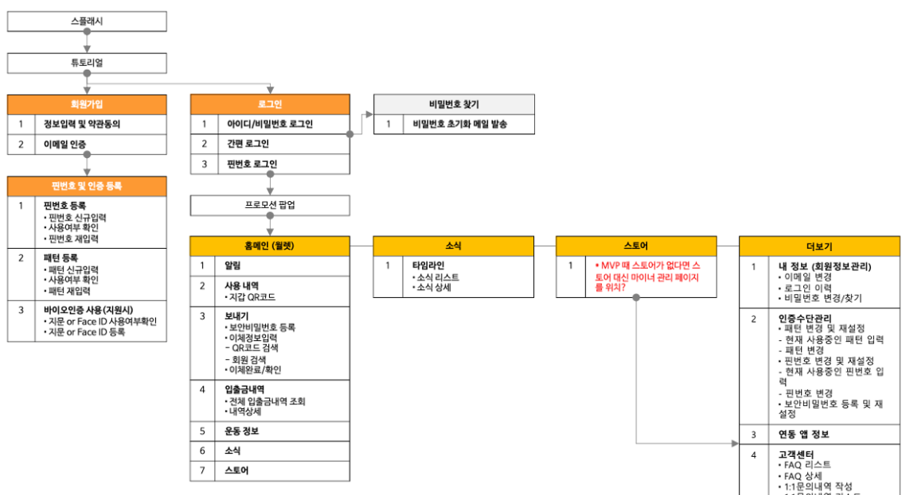
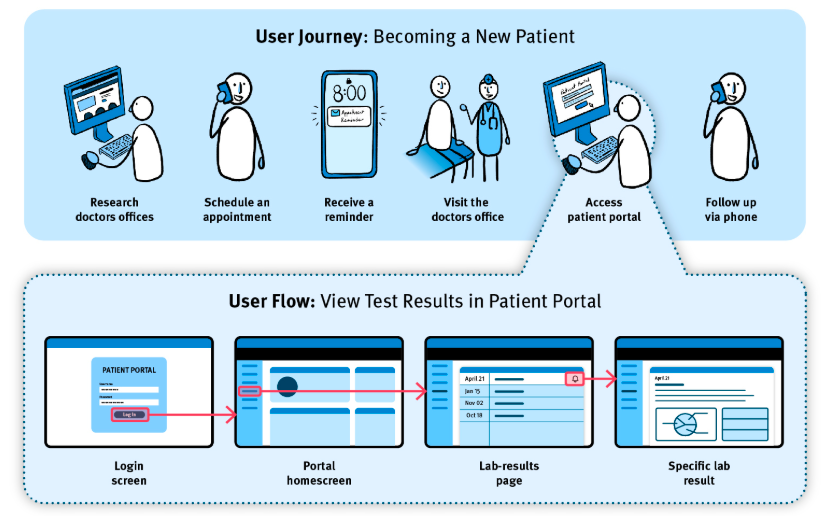
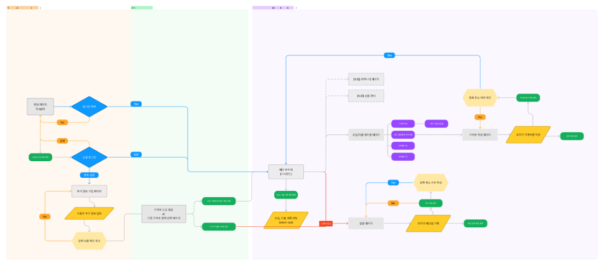

# [정보 구조(IA) 및 사용자 흐름(User Flow)](https://velog.io/@rlatjdgh9612/UIUX-%EC%A0%95%EB%B3%B4%EA%B5%AC%EC%A1%B0-%EA%B8%B0%EB%8A%A5%EC%A0%95%EC%9D%98%EC%84%9C-%EC%99%80%EC%9D%B4%EC%96%B4%ED%94%84%EB%A0%88%EC%9E%84#1-%EC%A0%95%EB%B3%B4%EA%B5%AC%EC%A1%B0-ia-information-architecture)

AI 서비스의 화면과 흐름을 사용자 관점으로 설계하는 방법

---

## 오늘의 핵심 질문

- 사용자는 서비스 안에서 무엇을 먼저 봐야 할까?
- 어떤 정보와 기능을 어디에 배치해야 할까?
- 사용자가 목표를 달성하기까지 어떤 흐름을 지나야 할까?
- AI 결과가 나오는 서비스에서는 어떤 확인과 예외 흐름이 필요할까?

---

## 기능이 있어도 사용하기 어려운 서비스

좋은 기능이 있어도 사용자가 찾지 못하면 가치가 전달되지 않습니다.

- 필요한 메뉴가 어디 있는지 모른다
- 입력해야 할 정보가 너무 많다
- 다음에 무엇을 해야 하는지 헷갈린다
- AI 결과를 어떻게 해석해야 할지 모르겠다
- 저장, 수정, 다시 시도 흐름이 보이지 않는다

AI 기획자는 기능을 정의한 뒤  
**사용자가 그 기능을 자연스럽게 사용할 수 있는 구조**를 설계해야 합니다.

---

## 정보구조 (I.A: Information Architecture)란 무엇인가
IA는 서비스 안의 정보와 기능을 사용자가 이해하기 쉬운 방식으로 정리하는 설계입니다.

쉽게 말하면 다음을 정하는 일입니다.

- 어떤 정보가 있는가
- 어떤 기능이 있는가
- 무엇을 먼저 보여줄 것인가
- 어떤 메뉴나 화면에 묶을 것인가
- 사용자가 원하는 것을 어떻게 찾게 할 것인가

---


---

## IA는 화면 디자인이 아니다

IA는 화면을 예쁘게 꾸미는 일이 아닙니다.

IA는 화면이 만들어지기 전에  
**정보와 기능의 위치, 관계, 우선순위**를 정하는 일입니다.

| 구분 | 관심사 |
|---|---|
| IA | 정보와 기능을 어떻게 묶고 배치할 것인가 |
| 화면 디자인 | 각 화면을 어떻게 보이게 만들 것인가 |
| User Flow | 사용자가 어떤 순서로 이동할 것인가 |
| 콘텐츠 | 사용자가 읽고 이해할 문구와 데이터 |

IA가 흔들리면 디자인이 좋아도 사용자는 길을 잃습니다.

---

## AI 서비스에서 IA가 더 중요한 이유

AI 서비스는 일반 서비스보다 사용자가 확인해야 할 정보가 많습니다.

- 사용자가 입력한 조건
- AI가 만든 결과
- 결과가 나온 이유
- 결과를 수정하거나 다시 요청하는 방법
- AI가 할 수 없는 일
- 사용자가 직접 판단해야 하는 부분

AI 결과만 보여주면 충분하지 않습니다.  
사용자가 결과를 이해하고 다음 행동을 할 수 있어야 합니다.

---

## IA 설계의 기본 요소

IA를 설계할 때는 다음 요소를 함께 봅니다.

| 요소 | 설명 |
|---|---|
| 정보 | 사용자가 알아야 하는 내용 |
| 기능 | 사용자가 할 수 있는 행동 |
| 그룹 | 비슷한 정보와 기능의 묶음 |
| 우선순위 | 먼저 보여줄 것과 나중에 보여줄 것 |
| 이름 | 사용자가 이해할 수 있는 메뉴와 버튼 이름 |
| 이동 | 사용자가 다른 화면으로 가는 방법 |

좋은 IA는 사용자의 머릿속 분류와 서비스의 구조가 비슷합니다.

---

## IA 설계의 출발점

IA는 회사가 가진 기능 목록이 아니라 사용자 목표에서 시작합니다.

질문은 이렇게 바꿔야 합니다.

| 공급자 관점 | 사용자 관점 |
|---|---|
| 추천 기능을 어디에 넣을까? | 사용자는 언제 추천이 필요할까? |
| 분석 결과를 어떤 메뉴에 넣을까? | 사용자는 어떤 판단을 하려고 결과를 볼까? |
| 설정 화면을 어떻게 만들까? | 사용자는 무엇을 바꾸고 싶어 할까? |
| 히스토리를 보여줄까? | 사용자는 이전 결과를 왜 다시 보려 할까? |

IA의 기준은 내부 조직도가 아니라 사용자 목표입니다.

---

## IA 설계 순서

AI 기획자는 IA를 다음 순서로 정리할 수 있습니다.

1. 핵심 사용자의 목표를 확인한다
2. 사용자가 봐야 할 정보와 사용할 기능을 모두 적는다
3. 비슷한 정보와 기능을 묶는다
4. 사용자가 자주 쓰는 것과 중요한 것을 앞에 둔다
5. 메뉴와 화면 이름을 사용자 언어로 바꾼다
6. 처음 진입부터 결과 확인까지의 큰 구조를 점검한다
7. 예외 상황과 되돌아가는 길을 확인한다

---

## 좋은 IA의 기준

좋은 IA는 사용자가 많이 생각하지 않아도 이해됩니다.

- 중요한 것이 먼저 보인다
- 메뉴 이름이 쉽고 예측 가능하다
- 비슷한 정보가 한곳에 모여 있다
- 다음 행동으로 가는 길이 보인다
- 처음 사용하는 사람도 전체 구조를 짐작할 수 있다
- 나중에 기능이 늘어나도 구조가 쉽게 무너지지 않는다

IA의 핵심은 "정리"가 아니라 "이해 가능성"입니다.

---

## IA에서 피해야 할 구조

다음 구조는 사용자를 헷갈리게 만들 수 있습니다.

- 내부 팀 기준으로 메뉴를 나눈 구조
- 비슷한 기능이 여러 곳에 흩어진 구조
- 메뉴 이름이 너무 기술적인 구조
- 사용 빈도가 낮은 기능이 앞에 있는 구조
- AI 결과와 사용자 입력 조건이 분리되어 맥락을 잃는 구조
- 오류나 실패 상황에서 돌아갈 길이 없는 구조

사용자는 서비스 조직도를 배우고 싶어 하지 않습니다.  
사용자는 자기 문제를 해결하고 싶어 합니다.

---

## [User Journey란 무엇인가](https://www.nngroup.com/articles/user-journeys-vs-user-flows/)

User Journey는 사용자가 어떤 상황에서 서비스를 만나고, 사용하고, 결과를 받아들이는 전체 경험의 흐름입니다.

User Journey는 화면 이동만 보지 않습니다.

- 사용 전 기대
- 사용 중 행동
- 사용 중 감정
- 막히는 지점
- 결과를 보고 느끼는 신뢰
- 사용 후 다음 행동

즉, User Journey는 사용자의 경험을 시간 순서로 보는 방법입니다.

---


---

## User Journey가 필요한 이유

서비스는 화면 안에서만 일어나지 않습니다.

사용자는 서비스를 사용하기 전부터 이미 문제를 느끼고 있습니다.

- 메뉴를 고르기 어렵다
- 정보를 비교하기 귀찮다
- 무엇이 맞는 선택인지 확신이 없다
- 시간을 줄이고 싶다
- 실수하고 싶지 않다

User Journey는 사용자의 문제, 감정, 기대를 함께 보게 해 줍니다.

---

## User Journey의 기본 구성

User Journey는 보통 다음 항목으로 정리합니다.

| 항목 | 질문 |
|---|---|
| 단계 | 사용자는 어떤 순서를 지나가는가? |
| 행동 | 단계마다 무엇을 하는가? |
| 생각 | 사용자는 무엇을 궁금해하는가? |
| 감정 | 편한가, 불안한가, 답답한가? |
| Pain Point | 어디서 막히는가? |
| 기회 | 서비스가 어디서 도움을 줄 수 있는가? |

기획자는 기능뿐 아니라 사용자의 심리 흐름도 읽어야 합니다.

---

## Journey에서 봐야 할 감정 변화

기능은 작동해도 감정이 나쁘면 사용자는 떠날 수 있습니다.

AI 서비스에서는 특히 다음 감정이 중요합니다.

- 기대: AI가 내 문제를 잘 풀어 줄 것 같다
- 불안: 내 정보를 입력해도 괜찮을까?
- 의심: 이 추천을 믿어도 될까?
- 답답함: 왜 이런 결과가 나왔는지 모르겠다
- 안심: 이유와 수정 방법이 보여서 믿을 수 있다

User Journey는 이런 감정의 변화를 설계에 반영하게 해 줍니다.

---

## User Journey와 IA의 관계

User Journey는 사용자의 경험 흐름을 보여 줍니다.

IA는 그 경험을 가능하게 하는 정보 구조를 보여 줍니다.

| User Journey에서 보이는 것 | IA에서 반영할 것 |
|---|---|
| 사용자가 처음에 불안해한다 | 개인정보 안내와 입력 이유를 앞에 둔다 |
| 결과를 믿기 어려워한다 | 추천 이유와 기준을 결과 화면에 둔다 |
| 다시 수정하고 싶어 한다 | 조건 수정과 재추천 경로를 가깝게 둔다 |
| 이전 결과를 다시 보고 싶어 한다 | 저장 목록과 히스토리 구조를 만든다 |

Journey는 사용자의 마음을 보여 주고, IA는 그것을 구조로 옮깁니다.

---

## User Flow란 무엇인가

User Flow는 사용자가 특정 목표를 달성하기 위해 서비스 안에서 이동하는 경로입니다.

예를 들어:

> 사용자가 식단 추천을 받기 위해  
> 홈 화면에서 시작해 조건 입력, 결과 확인, 저장까지 이동하는 흐름

User Flow는 사용자의 행동 순서와 화면 전환을 구체적으로 보여 줍니다.

---


---

## User Flow는 왜 필요한가

User Flow를 작성하면 다음을 확인할 수 있습니다.

- 사용자가 목표까지 너무 오래 걸리지 않는가
- 불필요한 단계가 끼어 있지 않은가
- 다음 버튼이나 선택지가 명확한가
- 실패하거나 취소했을 때 돌아갈 길이 있는가
- AI 결과를 다시 요청하거나 수정하는 길이 있는가

흐름을 그려 보면 기능 목록에서는 보이지 않던 문제가 드러납니다.

---

## IA, Journey, Flow의 차이

세 개념은 비슷해 보이지만 보는 대상이 다릅니다.

| 구분 | 보는 것 | 핵심 질문 |
|---|---|---|
| IA | 정보와 기능의 구조 | 무엇이 어디에 있어야 하는가? |
| User Journey | 사용자의 전체 경험 | 사용자는 어떤 상황과 감정을 지나가는가? |
| User Flow | 서비스 안의 이동 경로 | 목표 달성까지 어떤 화면과 행동을 거치는가? |

IA는 지도, Journey는 여행 경험, Flow는 실제 이동 경로에 가깝습니다.

---

## User Flow의 기본 표현

User Flow는 복잡한 도구 없이도 다음 요소로 표현할 수 있습니다.

| 요소 | 의미 |
|---|---|
| 시작 | 사용자가 흐름에 들어오는 지점 |
| 화면 | 사용자가 보는 화면 |
| 행동 | 클릭, 입력, 선택, 확인 |
| 판단 | 조건에 따라 갈라지는 지점 |
| 결과 | 사용자가 도달하는 상태 |
| 예외 | 오류, 취소, 재시도, 빈 결과 |

> 중요한 것은 예쁜 도형보다 사용자가 실제로 어떤 선택을 하는지 보이는 것입니다.

---

## User Flow 작성 순서

User Flow는 다음 순서로 작성합니다.

1. 사용자의 목표를 하나 정한다
2. 시작 지점을 정한다
3. 목표 달성까지 필요한 화면과 행동을 순서대로 적는다
4. 사용자가 선택해야 하는 지점을 표시한다
5. 실패, 취소, 재시도 흐름을 추가한다
6. 마지막 결과 상태를 명확히 쓴다
7. 불필요한 단계가 없는지 줄인다

한 번에 전체 서비스를 그리기보다  
하나의 핵심 목표부터 그리는 것이 좋습니다.

---

## User Flow 예시

목표: 사용자가 오늘 점심 메뉴를 추천받는다.

```text
홈
→ 추천 시작
→ 조건 입력
→ 알레르기 입력 여부 확인
→ 추천 생성
→ 결과 화면
→ 추천 이유 확인
→ 저장 또는 다시 추천
```

이 흐름에서 중요한 것은 "추천 생성"보다  
사용자가 조건을 이해하고 결과를 판단하는 과정입니다.

---

## 판단 지점이 있는 Flow

AI 서비스에는 조건에 따라 갈라지는 지점이 자주 생깁니다.

```text
조건 입력
→ 필수 정보가 충분한가?
  → 예: 추천 생성
  → 아니오: 부족한 정보 안내
→ 추천 결과가 안전한가?
  → 예: 결과 표시
  → 아니오: 대체 결과 또는 안내 표시
```

판단 지점을 적으면 서비스가 사용자를 어떻게 보호하는지 보입니다.

---

## AI 서비스 Flow에서 꼭 봐야 할 흐름

AI 기능이 있는 서비스에서는 다음 흐름을 따로 확인해야 합니다.

- 입력 정보가 부족할 때
- AI 결과가 사용자의 조건과 맞지 않을 때
- 결과 신뢰도가 낮을 때
- 민감하거나 위험한 답변이 나올 수 있을 때
- 사용자가 결과를 수정하고 싶을 때
- 사용자가 왜 이런 결과가 나왔는지 알고 싶을 때
- 같은 요청을 다시 시도하고 싶을 때

AI 서비스의 흐름은 성공 경로만으로 충분하지 않습니다.

---

## 좋은 User Flow의 기준

좋은 User Flow는 다음 조건을 만족합니다.

- 시작과 끝이 분명하다
- 사용자의 목표가 하나로 명확하다
- 각 단계의 행동이 구체적이다
- 선택 지점이 빠져 있지 않다
- 실패와 되돌아가기 흐름이 있다
- 사용자가 다음 행동을 예측할 수 있다
- AI 결과 이후의 확인, 수정, 저장 흐름이 있다

Flow는 화면 수를 늘리기 위한 문서가 아니라  
사용자의 길을 짧고 분명하게 만드는 도구입니다.

---

## Flow에서 자주 생기는 문제

다음 문제는 실제 사용성을 떨어뜨립니다.

- 시작 지점은 있는데 끝 상태가 없다
- 입력 화면이 너무 길다
- 사용자가 왜 입력해야 하는지 모른다
- AI 결과가 나왔지만 다음 행동이 없다
- 오류가 나면 처음부터 다시 해야 한다
- 뒤로 가기, 수정, 취소 흐름이 없다
- 로그인이나 설정이 핵심 행동보다 먼저 강하게 요구된다

사용자는 목표를 이루고 싶지, 절차를 통과하고 싶은 것이 아닙니다.

---

## IA와 Flow를 함께 점검하기

IA와 Flow는 따로 작성해도 마지막에는 함께 봐야 합니다.

| 점검 질문 | 의미 |
|---|---|
| 중요한 기능이 찾기 쉬운 곳에 있는가? | IA 점검 |
| 사용자가 목표까지 자연스럽게 이동하는가? | Flow 점검 |
| 사용자가 중간에 길을 잃지 않는가? | IA와 Flow 공통 |
| 결과를 보고 다음 행동을 할 수 있는가? | Flow 점검 |
| 반복 사용 시 다시 찾기 쉬운가? | IA 점검 |

구조와 흐름이 맞아야 실제 사용 경험이 자연스러워집니다.

---

## AI 기획자의 IA 점검 질문

IA를 볼 때 다음 질문을 던져 봅니다.

- 사용자가 가장 자주 찾는 정보가 앞에 있는가?
- 메뉴 이름이 비전문가도 이해할 수 있는가?
- AI 결과와 결과의 이유가 같은 맥락에서 보이는가?
- 입력 조건, 결과, 수정 기능이 서로 떨어져 있지 않은가?
- 개인정보나 민감 정보 안내가 필요한 위치에 있는가?
- 나중에 기능이 추가되어도 구조가 유지될 수 있는가?

---

## AI 기획자의 Flow 점검 질문

User Flow를 볼 때 다음 질문을 던져 봅니다.

- 사용자의 목표가 한 문장으로 설명되는가?
- 목표까지 필요한 단계가 너무 많지 않은가?
- AI가 처리하는 동안 사용자는 무엇을 보게 되는가?
- 결과가 마음에 들지 않을 때 다시 시도할 수 있는가?
- 잘못된 입력이나 빈 결과가 나왔을 때 안내가 있는가?
- 사용자가 결과를 저장하거나 비교할 수 있는가?
- 결과를 믿기 위한 정보가 흐름 안에 있는가?

---

## IA와 User Flow를 연결한 예시

식단 추천 서비스의 핵심 구조와 흐름을 연결해 봅니다.

| IA 영역 | User Flow에서의 역할 |
|---|---|
| 홈 | 추천 시작 지점 |
| 조건 입력 | 개인화 추천을 위한 정보 수집 |
| 추천 결과 | AI 결과와 이유 확인 |
| 결과 조정 | 조건 수정, 다시 추천 |
| 저장 목록 | 마음에 드는 결과 보관 |
| 설정 | 반복 사용을 위한 기본 조건 관리 |

IA는 공간을 만들고, Flow는 그 공간을 지나가는 길을 만듭니다.

---

## 기획자가 설명할 수 있어야 하는 것

IA와 User Flow를 설계한 뒤에는 다음을 말할 수 있어야 합니다.

- 왜 이 메뉴 구조가 사용자에게 자연스러운가
- 왜 이 정보가 이 위치에 있어야 하는가
- 왜 이 흐름이 핵심 목표에 가장 짧은가
- 어디서 사용자가 불안하거나 막힐 수 있는가
- AI 결과를 사용자가 어떻게 확인하고 수정하는가
- 실패 상황에서 사용자를 어떻게 다시 흐름으로 돌려보내는가

설계의 목적은 문서를 만드는 것이 아니라  
팀이 같은 사용자 경험을 상상하게 만드는 것입니다.

---

## 오늘의 정리

- IA는 정보와 기능을 사용자가 이해하기 쉬운 구조로 정리하는 일이다
- User Journey는 사용자의 상황, 행동, 감정, Pain Point를 시간 순서로 보는 방법이다
- User Flow는 사용자가 목표를 달성하기 위해 서비스 안에서 이동하는 구체적인 경로다
- AI 서비스에서는 결과 설명, 수정, 재시도, 예외 흐름이 특히 중요하다
- 좋은 설계는 기능을 많이 보여주는 것이 아니라 사용자가 길을 잃지 않게 돕는 것이다

---

## 마지막으로 기억할 문장

서비스 구조는 회사가 만든 기능의 목록이 아닙니다.

**사용자가 자기 문제를 해결하기 위해  
이해하고, 선택하고, 이동하는 길**입니다.

---
# [예제영상> 카카오 골프예약 챗봇 역기획으로 배우는 IA 설계 방법](https://www.youtube.com/watch?v=om8RxX_T7vE)
- 목표설정, 정보나열, 그룹화, 분류
- IA를 다양한 산출물로 확장하기
- 인포메이션 아키텍처를 설계하는 목적

