# [Mermaid](https://mermaid.ai/app/dashboard)
Mermaid(머메이드)는 그림판이나 디자인 툴(Figma, PPT 등)을 사용하지 않고, 오직 텍스트(코드)만 입력해서 플로우차트, 시퀀스 다이어그램, Gantt 차트 등을 자동으로 그려주는 오픈소스 도구입니다.

> 쉽게 말해: "텍스트를 입력하면 알아서 그림으로 바꿔주는 다이어그램 자판기"라고 생각하면 됩니다.

---
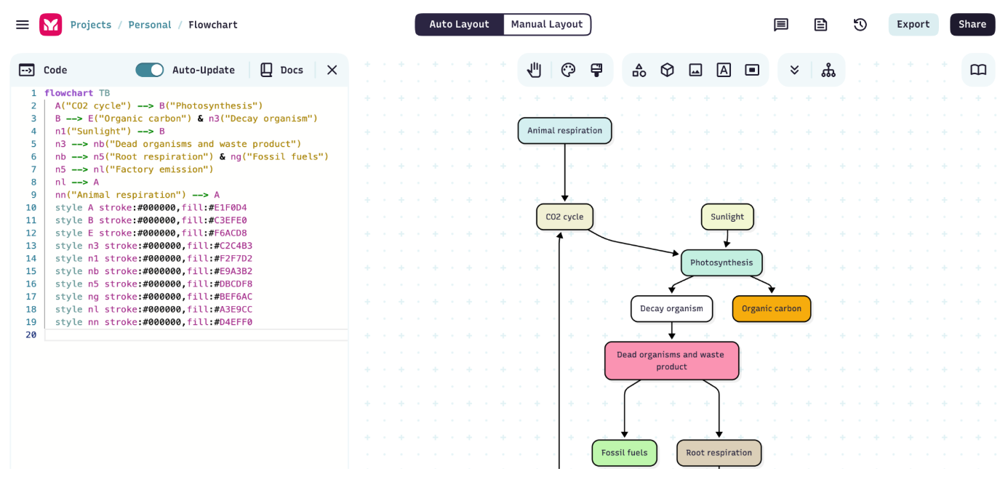

---
## 왜 사용할까요? (도입 배경)
기존에 보고서나 개발 문서에 다이어그램을 넣으려면 다음과 같은 번거로운 과정을 거쳐야 했습니다.
1. 다이어그램 그리기 사이트(draw.io 등)나 PPT를 켠다.
2. 마우스로 네모, 화살표를 일일이 배치하고 정렬한다.
3. (가장 큰 문제) 중간에 흐름이 하나 바뀌면 화살표를 다 지우고 처음부터 다시 배치해야 한다.
4. 이미지 파일로 내보내서 문서에 첨부한다.

> Mermaid는 이 모든 번거로움을 해결합니다. 마우스 손질 없이, 키보드 타이핑 몇 번이면 다이어그램이 완성되고 수정도 텍스트만 고치면 끝납니다.

---
## Mermaid의 강력한 장점
- **압도적인 수정의 편리함** : 화살표 방향을 바꾸거나 단계를 추가할 때, 코드 한 줄만 고치면 전체 레이아웃이 자동으로 재배치됩니다.

- **문서와의 높은 통합성** : GitHub, Notion, Obsidian, GitLab 등 학생들이 자주 쓰는 대부분의 협업 및 문서 도구에서 기본적으로 Mermaid를 지원합니다. 이미지 파일로 따로 저장할 필요가 없습니다.

- **가볍고 빠른 속도** : 마우스로 정렬 맞추느라 시간 버릴 필요 없이, 생각나는 로직을 텍스트로 바로 적으면 되기 때문에 작업 속도가 몇 배는 빨라집니다.

- **버전 관리(Git) 가능** : 이미지 파일은 변경 사항을 비교하기 어렵지만, Mermaid는 '텍스트'이기 때문에 Git을 통해 어떤 부분이 수정되었는지 명확하게 추적할 수 있습니다.

---
## IA, User Flow에서 Mermaid가 강력한 이유

---
**생각의 속도로 구조 잡기 (Brainstorming)** 
- 화면 구조나 유저 흐름을 구상할 때, Figma나 draw.io 같은 툴은 '도형 배치'에 신경 쓰느라 흐름이 끊깁니다. 
- Mermaid는 "메인 -> 마이페이지 -> 회원탈퇴"처럼 생각나는 대로 `텍스트만 치면 구조가 뚝딱 완성`됩니다.

**화면(노드) 추가/삭제의 자유로움** 
- 기획 초기에는 메뉴 구조(IA)가 수십 번씩 바뀝니다. 
- 중간에 메뉴 하나가 추가되어도 코 한 줄만 밀어 넣으면 `전체 트리 구조가 알아서 간격을 벌리며 재정렬`됩니다.

**개발자와의 소통 최적화**
- 기획서에 텍스트 코드로 흐름을 적어두면, 개발자들은 Git Diff(변경 사항 비교)를 통해 "어느 화면의 흐름이 어떻게 바뀌었는지" `코드 레벨에서 명확하게 파악`할 수 있습니다.

---
## 맛보기 예시 (얼마나 쉬울까?)
백문이 불여일견! 학생들이 직관적으로 이해할 수 있는 아주 간단한 로그인 로직 예시입니다.

> 작성하는 코드
```
graph TD
    A[로그인 페이지] --> B{아이디/비번 입력}
    B -- 일치 --> C[로그인 성공 / 메인 페이지]
    B -- 불일치 --> D[에러 메시지 표시]
    D --> A
```

---
> 실제로 그려지는 그림

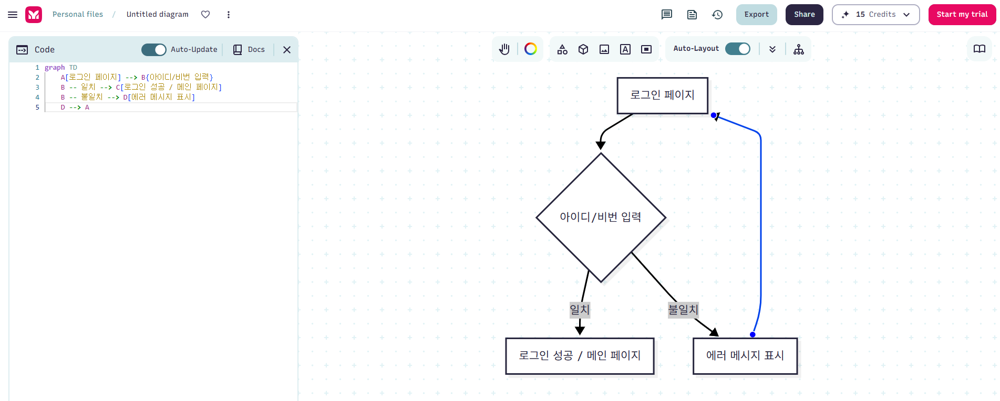

---
# Mermaid 실습 
> [Mermaid Tutorial](https://mermaid.ai/open-source/ecosystem/tutorials.html)

---
### [Mermaid 접속](https://mermaid.ai/app/dashboard)

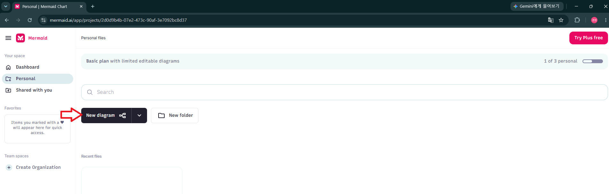

---
### 정보구조(IA).mmd 파일 적용

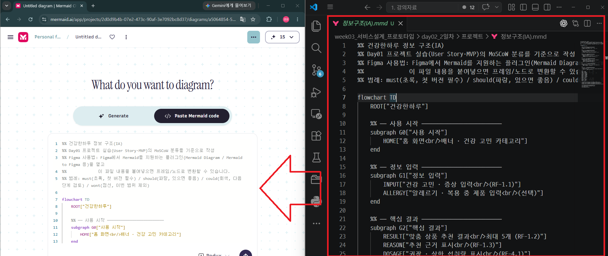

---
> 적용


---
> 결과 확인

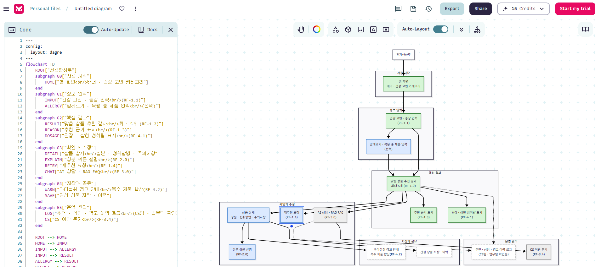

---
> SVG 변환 방법

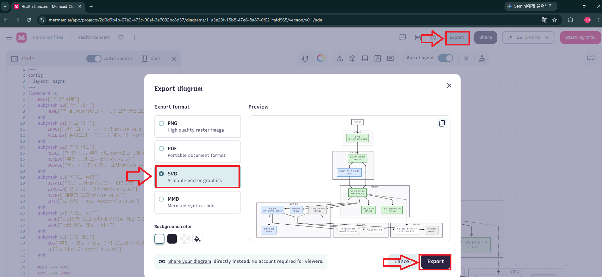

---
> 변환 된 SVG 확인

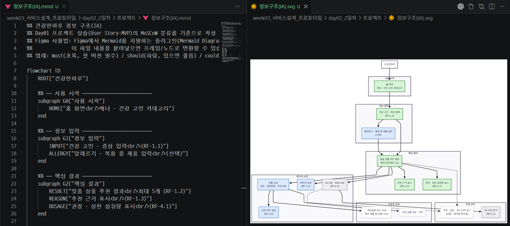

---
### 사용자흐름(User_Flow).mmd 파일 적용

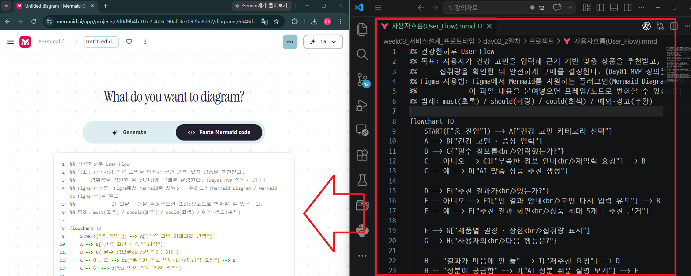

---
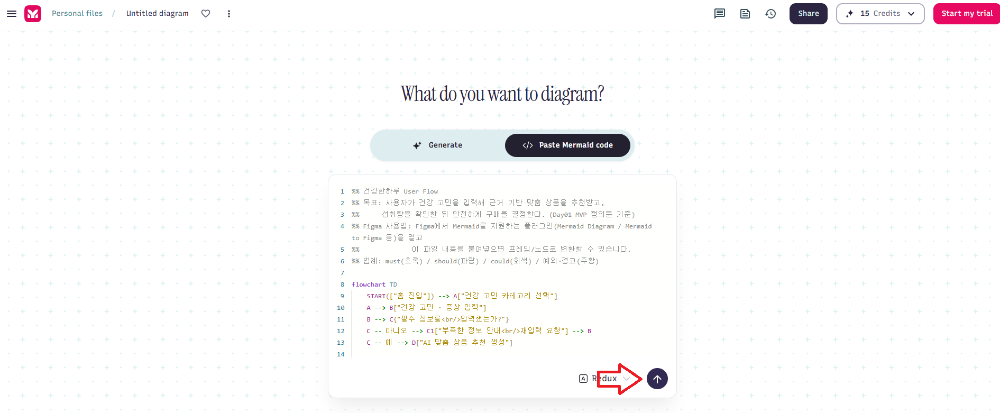

---
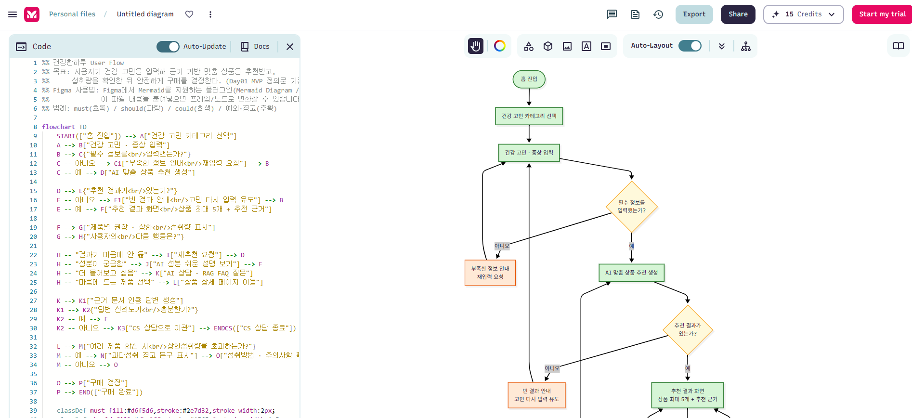

---
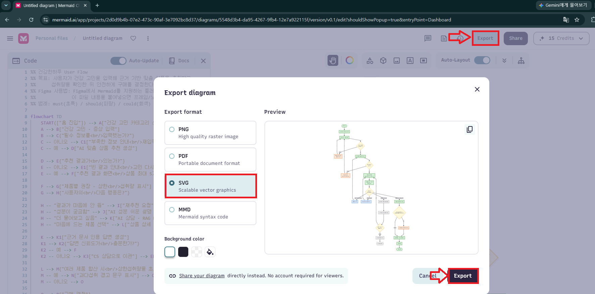

---
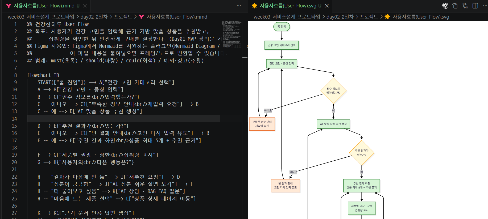

---
# [예제영상> Mermaid 다이어그램 자동화 예시들](https://www.youtube.com/watch?v=uBqCCqIBGVk&t=448s)
1. 회원가입 프로세스 다이어그램 
2. 쇼핑몰 전산 프로세스 다이어그램
3. PCB 기판 프로세스 다이어그램
4. 암보험 플랜 마케팅 프로세스 다이어그램
