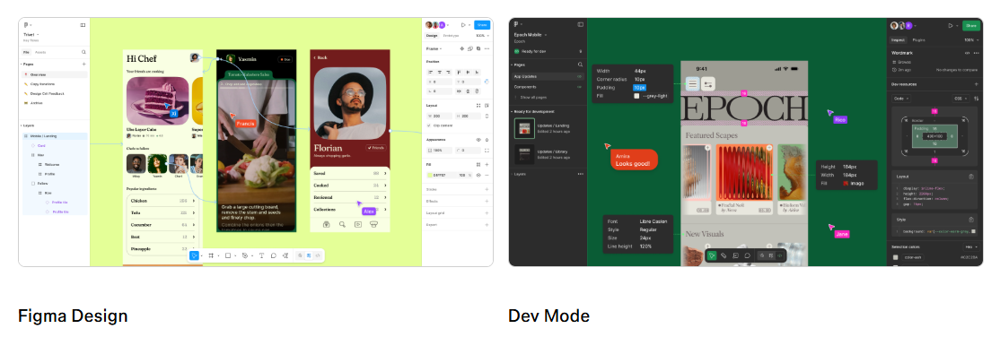
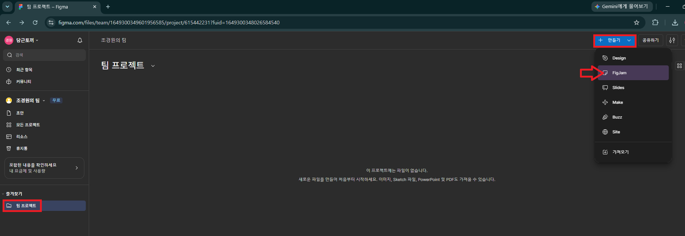
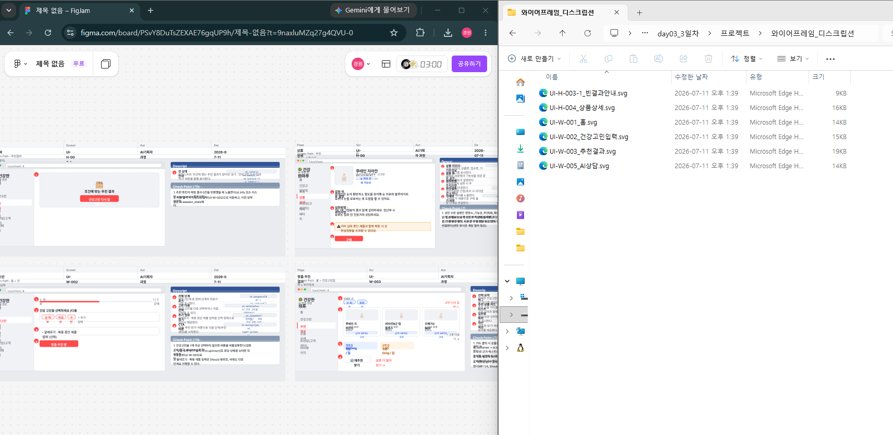
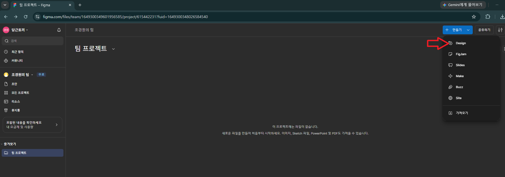
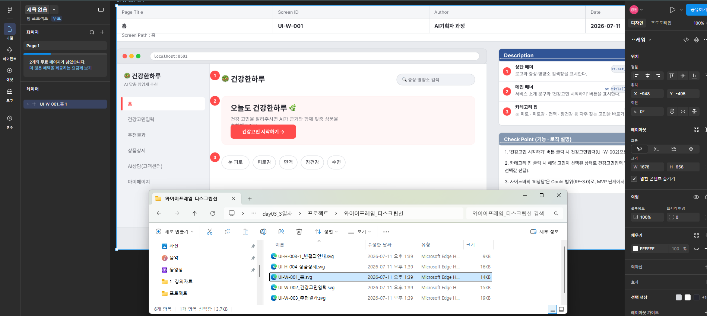

# [Figma](https://help.figma.com/hc/en-us/articles/14563969806359-What-is-Figma)
- Figma(피그마)는 웹 브라우저 기반의 실시간 협업 UI/UX 디자인·프로토타이핑 툴입니다. 
- 과거에는 기획자, 디자이너, 개발자가 각자 다른 툴을 쓰며 문서를 주고받았지만, 피그마는 하나의 캔버스 위에서 모든 직군이 동시에 접속해 작업할 수 있는 환경을 제공하며 업계 표준으로 자리 잡았습니다.

---

---
## 피그마의 핵심 장점

---
### 1. 실시간 클라우드 협업 (Web-based)
- 하나의 링크로 끝나는 소통: 별도의 설치 없이 웹 브라우저만 있으면 맥(Mac), 윈도우(Windows) 어디서나 접속할 수 있습니다.

- 동시 편집과 커서 추적: "여기 확인해 주세요"라고 말할 필요 없이, 상대방의 프로필 아이콘을 클릭하면 그 사람이 보고 있는 화면을 실시간으로 함께 볼 수 있어 미팅 효율이 극대화됩니다.

---
### 2. 기획-디자인-개발의 경계 붕괴 (Hand-off)
- ‘최종_진짜최종.pdf’의 종말: 기획서와 디자인 시안이 하나의 링크 안에서 실시간으로 업데이트되므로 버전 꼬임이 없습니다.

- 데브 모드(Dev Mode): 개발자는 피그마 안에서 UI 요소의 간격, 폰트 스타일, CSS/IOS/Android 코드까지 바로 추출할 수 있어 기획 의도가 개발에 정확히 반영됩니다.

---
### 3. 인터랙티브 프로토타이핑 (AI UX 검증의 핵심)
- 단순한 정적 이미지를 넘어 클릭, 스크롤, 마우스 오버에 반응하는 가짜 구동 화면(Prototype)을 아주 쉽게 만들 수 있습니다.

- AI 기획자에게 특히 중요한 이유: AI가 답변을 생성하는 동안의 로딩(Streaming) 상태나 스켈레톤 UI를 미리 구현해 보고, 실제 개발에 들어가기 전 사용성이 괜찮은지 완벽하게 시뮬레이션할 수 있습니다.

---
### 4. 강력한 컴포넌트(Component) 시스템
- 버튼, 입력창, 상단 바 등 자주 쓰는 UI 요소를 '마스터 컴포넌트'로 등록해 두면, 이를 복사해 쓴 모든 화면의 UI를 한 번에 수정할 수 있습니다.

- 배리언트(Variants) 기능을 통해 AI 프롬프트 창의 '입력 전 / 입력 중 / 에러 발생 / 전송 완료' 등 다양한 상태(State)를 체계적으로 관리할 수 있습니다.

---
# [Figma 사용해보기](https://www.figma.com/) 

---
### 팀 프로젝트 만들기 > Fig.Jam

---
> svg 파일 적용하기 

---
### 팀 프로젝트 만들기 > Design

---
> svg 파일 적용하기 

---
# [예제영상> 무료 피그마 사용법 A~Z까지 단 15분 컷](https://www.youtube.com/watch?v=mxZlOwbqUho)
- 피그마 디자인
- 피그마 설정
- 툴바 사용법 
- 프레임 
- 오토레이아웃
- 컨스트레인트
- 컴포넌트

