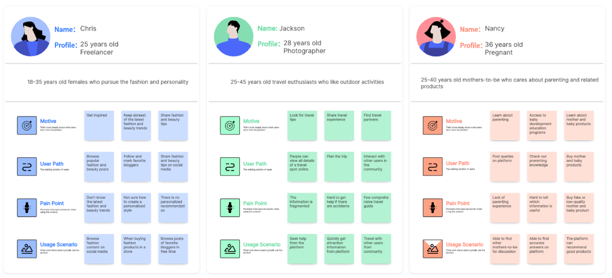
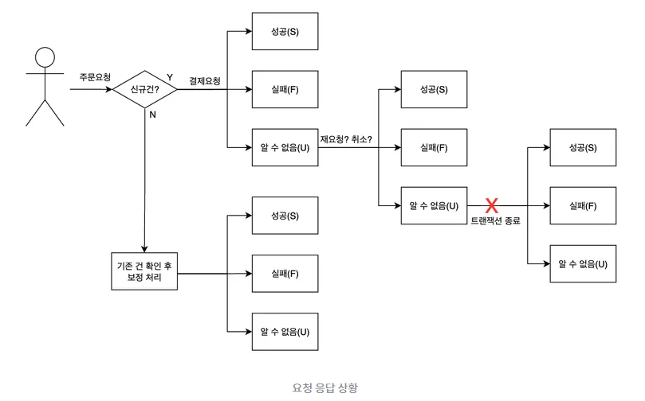

# 서비스 시나리오 및 예외 처리 설계

AI 서비스가 정상 상황과 문제 상황 모두에서 사용자를 안내하는 방법

---

## 오늘의 핵심 질문

- 사용자는 어떤 상황에서 서비스를 사용하게 될까?
- 사용자가 목표를 달성하는 정상 흐름은 어떻게 이어질까?
- 사용자가 막히거나 실패하는 상황은 어디서 생길까?
- 오류가 발생했을 때 어떤 문구와 행동 안내가 필요할까?
- AI 결과가 기대와 다를 때 서비스는 어떻게 대응해야 할까?

---

## 기능이 작동하는 것과 서비스가 완성되는 것은 다르다

기능이 작동해도 사용자가 막히면 서비스 경험은 끊깁니다.

예를 들어 추천 기능이 있어도 다음 상황을 생각해야 합니다.

- 사용자가 조건을 잘못 입력하면?
- 추천할 수 있는 결과가 없으면?
- AI가 너무 일반적인 답변을 하면?
- 사용자가 결과를 수정하고 싶으면?
- 네트워크 문제로 결과가 늦게 나오면?

AI 기획자는 "성공하는 화면"뿐 아니라  
**사용자가 막히는 순간의 안내와 회복 흐름**까지 설계해야 합니다.

---

# [User Scenario란 무엇인가](https://boardmix.com/kr/skills/user-scenario/)

User Scenario는 사용자가 특정 상황에서 서비스를 이용해 목표를 달성하는 과정을 이야기처럼 정리한 것입니다.

---
User Scenario는 다음을 함께 설명합니다.

- 사용자는 누구인가
- 어떤 상황에 놓여 있는가
- 어떤 목표를 가지고 있는가
- 어떤 행동을 순서대로 하는가
- 어떤 정보와 기능을 만나는가
- 어디서 만족하거나 막힐 수 있는가

즉, User Scenario는 기능을 실제 사용 상황으로 바꾸는 문서입니다.

---
> 페르소나 프로필은 특정 사용자 또는 사용자 그룹을 상세하게 묘사하는 도구이며 사용자 시나리오 작성 및 제품 디자인에서 중요한 역할을 합니다.



---
## User Scenario가 필요한 이유

기능 목록만 보면 서비스가 너무 이상적으로 보입니다.

하지만 시나리오로 보면 현실적인 질문이 생깁니다.

- 사용자가 처음에 무엇을 보고 시작하는가?
- 이 입력을 왜 해야 하는지 이해하는가?
- 결과가 나오기 전까지 기다릴 수 있는가?
- 결과가 마음에 들지 않을 때 무엇을 할 수 있는가?
- 오류가 났을 때 사용자가 다시 시도할 수 있는가?

시나리오는 기능의 빈틈을 발견하게 해 줍니다.

---

## User Story와 User Scenario의 차이

두 개념은 연결되어 있지만 역할이 다릅니다.

| 구분 | 설명 | 예시 |
|---|---|---|
| User Story | 사용자의 필요와 가치를 짧게 표현 | 나는 식단 관리자로서 알레르기를 반영한 메뉴를 추천받고 싶다 |
| User Scenario | 실제 사용 상황과 행동 흐름을 구체적으로 설명 | 점심시간 전 사용자가 조건을 입력하고 추천 결과를 확인한 뒤 저장한다 |

User Story는 "왜 필요한가"를 말하고,  
User Scenario는 "어떻게 사용되는가"를 보여 줍니다.

---

## User Flow와 User Scenario의 차이

User Flow는 화면과 행동의 이동 경로를 보여 줍니다.

User Scenario는 그 흐름이 일어나는 상황과 맥락을 함께 설명합니다.

| 구분 | 중심 질문 |
|---|---|
| User Flow | 사용자는 어떤 화면과 행동을 거치는가? |
| User Scenario | 사용자는 어떤 상황에서 왜 그렇게 행동하는가? |

Flow가 길이라면 Scenario는 그 길을 걷는 사용자의 상황입니다.

---

## 좋은 User Scenario의 구성

좋은 User Scenario에는 다음 요소가 들어갑니다.

| 요소 | 질문 |
|---|---|
| 사용자 | 누가 사용하는가? |
| 상황 | 언제, 어떤 문제 때문에 사용하는가? |
| 목표 | 사용자가 얻고 싶은 결과는 무엇인가? |

---
| 요소 | 질문 |
|---|---|
| 시작점 | 어디서 서비스를 시작하는가? |
| 행동 | 어떤 순서로 움직이는가? |
| 결과 | 마지막에 어떤 상태가 되는가? |
| 감정 | 어디서 안심하거나 불안해하는가? |
| 예외 | 어디서 막힐 수 있는가? |

> 시나리오는 기능 설명이 아니라 사용자의 경험 설명입니다.

---

## User Scenario 예시

건강 식단 추천 서비스를 예로 들어 봅니다.

> 점심 메뉴를 고민하는 직장인이 점심시간 20분 전에 서비스를 연다.  
> 사용자는 알레르기와 선호 음식을 입력하고 오늘의 식단 추천을 요청한다.  
> 서비스는 추천 메뉴와 추천 이유, 주의할 재료를 함께 보여 준다.  
> 사용자는 마음에 드는 메뉴를 저장하거나 조건을 조금 바꿔 다시 추천받는다.

이 시나리오에는 사용자, 상황, 목표, 행동, 결과가 모두 들어 있습니다.

---

## 시나리오가 너무 추상적일 때

약한 시나리오:

> 사용자는 AI 추천 서비스를 사용한다.

이 문장은 실제 설계에 도움이 되기 어렵습니다.

---
왜냐하면 다음 정보가 없기 때문입니다.

- 어떤 사용자인가
- 어떤 문제 상황인가
- 왜 추천이 필요한가
- 무엇을 입력하는가
- 결과를 보고 무엇을 하는가
- 실패하면 어떻게 되는가

시나리오는 구체적일수록 설계 판단에 도움이 됩니다.

---

## 시나리오가 너무 세부적일 때

반대로 시나리오가 너무 작은 동작까지 설명하면 읽기 어렵습니다.

예를 들어:

- 버튼 색상
- 아이콘 위치
- 문구의 모든 띄어쓰기
- 화면 좌표
- 세부 애니메이션

이런 내용은 화면 설계에서 다룰 수 있습니다.

User Scenario에서는 사용자의 상황, 목표, 행동, 판단 흐름에 집중합니다.

---

## User Scenario 작성 기준

AI 기획자는 시나리오를 쓸 때 다음 기준을 봅니다.

- 실제 사용자가 겪을 만한 상황인가?
- 사용자의 목표가 분명한가?
- 서비스의 핵심 기능이 자연스럽게 등장하는가?
- 사용자가 결과를 이해하고 다음 행동을 할 수 있는가?
- 막히는 지점이 함께 보이는가?
- AI가 판단하는 부분과 사용자가 판단하는 부분이 구분되는가?

좋은 시나리오는 정상 흐름과 예외 흐름의 출발점이 됩니다.

---
# 예외 처리 흐름

---
> [페이상품권 서버 개발 - 예외 처리 예시](https://tech.kakaopay.com/post/msa-transaction/)



---
## 정상 흐름이란 무엇인가

정상 흐름은 사용자가 의도한 대로 서비스를 사용해 목표를 달성하는 기본 경로입니다.

다른 말로는 주요 흐름, 기본 흐름, 성공 흐름이라고도 볼 수 있습니다.

정상 흐름은 다음을 보여 줍니다.

- 사용자가 어디서 시작하는가
- 어떤 정보를 입력하는가
- 서비스가 어떤 결과를 제공하는가
- 사용자가 결과를 어떻게 확인하는가
- 마지막에 어떤 상태에 도달하는가

정상 흐름은 서비스 경험의 중심 줄기입니다.

---

## 정상 흐름 예시

목표: 사용자가 오늘 먹을 수 있는 점심 메뉴를 추천받는다.

```text
홈 화면 진입
→ 추천 시작 선택
→ 알레르기와 선호 음식 입력
→ 식사 시간과 예산 선택
→ 추천 요청
→ 추천 결과 확인
→ 추천 이유와 주의사항 확인
→ 마음에 드는 메뉴 저장
```

이 흐름은 사용자가 막히지 않고 목표에 도달하는 기본 경로입니다.

---

## 정상 흐름을 작성할 때 필요한 질문

정상 흐름을 작성할 때는 다음을 확인합니다.

- 사용자의 시작점이 명확한가?
- 사용자가 무엇을 입력해야 하는가?
- 입력 이유를 사용자가 이해할 수 있는가?
- 결과가 나오기까지 기다리는 과정이 있는가?
- 결과 화면에서 핵심 정보가 먼저 보이는가?
- 사용자의 마지막 행동이 명확한가?

정상 흐름은 단순히 화면을 나열하는 것이 아닙니다.  
사용자가 목표를 달성하는 과정을 설명하는 것입니다.

---

## 정상 흐름만 있으면 부족한 이유

현실의 사용자는 항상 정상 흐름으로 움직이지 않습니다.

다음과 같은 상황이 자주 생깁니다.

- 필수 정보를 입력하지 않는다
- 너무 모호한 요청을 한다
- 조건이 서로 충돌한다
- 원하는 결과가 없다
- AI 결과가 부정확하거나 위험할 수 있다
..

그래서 정상 흐름 다음에는 반드시 예외 흐름을 설계해야 합니다.

---

## 예외 흐름이란 무엇인가

예외 흐름은 사용자가 목표를 달성하는 과정에서 문제가 생겼을 때의 대응 경로입니다.

예외 흐름은 오류만 의미하지 않습니다.

- 입력이 부족한 상황
- 조건이 맞지 않는 상황
- 결과가 없는 상황
- 사용자가 다른 선택을 하는 상황
- 시스템이 응답하지 않는 상황
- AI가 답변을 제한해야 하는 상황

예외 흐름의 목적은 사용자를 실패 상태에 버려두지 않는 것입니다.

---

## 대안 흐름과 예외 흐름

흐름을 볼 때는 대안 흐름과 예외 흐름을 구분하면 좋습니다.

| 구분 | 의미 | 예시 |
|---|---|---|
| 정상 흐름 | 가장 기본적인 성공 경로 | 조건 입력 후 추천 결과 확인 |
| 대안 흐름 | 사용자가 다른 선택을 해도 목표에 갈 수 있는 경로 | 조건을 수정하고 다시 추천 |
| 예외 흐름 | 문제가 발생해 안내와 회복이 필요한 경로 | 필수 정보 누락, 결과 없음, AI 응답 실패 |

대안 흐름은 선택의 문제이고, 예외 흐름은 회복의 문제입니다.

---

## 예외 흐름을 찾는 방법

예외 흐름은 각 단계마다 질문을 던져 찾습니다.

| 단계 | 예외 질문 |
|---|---|
| 시작 | 사용자가 로그인하지 않았거나 접근 권한이 없으면? |
| 입력 | 필수 정보를 빠뜨리거나 잘못 입력하면? |
| 처리 | 결과 생성이 오래 걸리거나 실패하면? |
| 결과 | 보여줄 결과가 없거나 조건과 맞지 않으면? |
| 확인 | 사용자가 결과를 믿지 못하거나 수정하고 싶으면? |
| 저장 | 저장에 실패하거나 이미 저장된 결과라면? |

예외 흐름은 정상 흐름의 각 단계에서 파생됩니다.

---

## AI 서비스에서 자주 생기는 예외

AI 서비스에서는 다음 예외를 특히 주의해야 합니다.

| 예외 상황 | 사용자가 느끼는 문제 |
|---|---|
| 입력이 모호함 | 무엇을 더 써야 하는지 모른다 |
| 데이터가 부족함 | 왜 결과가 없는지 이해하기 어렵다 |
| 결과 신뢰도가 낮음 | 추천을 믿어도 되는지 불안하다 |
| 위험하거나 민감한 요청 | 서비스가 어디까지 도와줄 수 있는지 모른다 |
| 응답 지연 | 멈춘 것처럼 느낀다 |
| 시스템 오류 | 다시 시도해야 하는지 알 수 없다 |

AI 예외는 기술 문제가 아니라 사용자 신뢰의 문제입니다.

---

## 예외 흐름 설계 순서

예외 흐름은 다음 순서로 설계합니다.

1. 정상 흐름의 각 단계를 나눈다
2. 각 단계에서 실패하거나 다른 선택을 하는 상황을 찾는다
3. 사용자가 무엇을 알 필요가 있는지 정리한다
4. 사용자가 다음에 할 수 있는 행동을 정한다
5. 오류 메시지와 버튼 문구를 연결한다
6. 사용자가 정상 흐름으로 돌아갈 수 있는 길을 만든다
7. 반복해서 같은 오류가 나지 않도록 입력이나 구조를 조정한다

좋은 예외 흐름은 사용자를 다시 앞으로 움직이게 합니다.

---

## 예외 흐름 예시: 필수 정보 누락

상황:

> 사용자가 알레르기 정보를 입력하지 않고 식단 추천을 요청한다.

흐름:

```text
조건 입력
→ 추천 요청
→ 필수 정보 누락 확인
→ 누락된 항목 안내
→ 사용자가 알레르기 정보 입력
→ 다시 추천 요청
→ 추천 결과 표시
```

핵심은 "실패"를 보여주는 것이 아니라  
무엇을 채우면 계속할 수 있는지 알려주는 것입니다.

---

## 예외 흐름 예시: 결과 없음

상황:

> 사용자의 조건이 너무 좁아 추천 가능한 메뉴가 없다.

흐름:

```text
추천 요청
→ 조건에 맞는 결과 없음
→ 결과가 없는 이유 안내
→ 완화할 수 있는 조건 제안
→ 조건 수정 또는 다시 입력
→ 추천 결과 재생성
```

결과 없음은 막다른 길이 아닙니다.  
서비스가 다음 선택지를 제안해야 합니다.

---

## 예외 흐름 예시: AI 응답 제한

상황:

> 사용자가 건강에 위험할 수 있는 단정적인 의학 조언을 요청한다.

흐름:

```text
사용자 요청 입력
→ 민감하거나 위험한 요청 확인
→ 서비스 제공 범위 안내
→ 일반 정보 또는 안전한 대안 안내
→ 전문가 상담 권장
→ 사용자가 다른 질문으로 전환
```

AI 서비스는 모든 요청에 답하는 것이 아니라  
안전하게 답할 수 있는 범위를 지켜야 합니다.

---

## 예외 흐름 예시: AI 응답 실패

상황:

> AI 응답 생성 중 일시적인 오류가 발생한다.

흐름:

```text
추천 요청
→ 응답 생성 실패
→ 일시적인 문제 안내
→ 다시 시도 버튼 제공
→ 입력 내용 유지
→ 사용자가 다시 요청
```

중요한 것은 사용자가 입력한 내용을 잃지 않게 하는 것입니다.

---

## 예외 흐름에서 피해야 할 대응

다음 대응은 사용자의 불안을 키웁니다.

- "오류가 발생했습니다"만 보여준다
- 사용자가 무엇을 잘못했는지 모호하게 말한다
- 처음 화면으로 강제로 돌려보낸다
- 입력한 내용을 모두 지운다
- 다음 행동을 제시하지 않는다
- 기술 용어와 오류 코드만 보여준다
- AI가 못 하는 일을 사용자가 이해하지 못하게 한다

예외 흐름의 핵심은 안내, 선택지, 회복입니다.

---

## 오류 메시지 설계란 무엇인가

오류 메시지 설계는 문제가 생겼을 때 사용자에게 상황과 다음 행동을 알려주는 문구를 설계하는 일입니다.

오류 메시지는 단순한 경고 문구가 아닙니다.

좋은 오류 메시지는 다음을 합니다.

- 무슨 일이 생겼는지 알려준다
- 왜 진행이 어려운지 설명한다
- 사용자가 다음에 할 행동을 제시한다
- 사용자의 불안과 책임감을 줄인다
- 서비스 신뢰를 유지한다

---

## 좋은 오류 메시지의 구성

오류 메시지는 보통 네 가지 요소로 생각할 수 있습니다.

| 요소 | 질문 |
|---|---|
| 상황 | 지금 무슨 일이 생겼는가? |
| 이유 | 왜 진행할 수 없는가? |
| 행동 | 사용자가 무엇을 하면 되는가? |
| 안심 | 입력값이나 상태가 안전하게 유지되는가? |

모든 메시지에 네 가지가 다 길게 들어갈 필요는 없습니다.  
하지만 사용자가 다음 행동을 알 수 있어야 합니다.

---

## 나쁜 오류 메시지와 좋은 오류 메시지

| 나쁜 메시지 | 좋은 메시지 |
|---|---|
| 오류가 발생했습니다 | 추천 결과를 불러오지 못했습니다. 잠시 후 다시 시도해 주세요. |
| 잘못된 입력입니다 | 알레르기 항목을 선택해야 추천을 시작할 수 있습니다. |
| 결과 없음 | 조건에 맞는 메뉴가 없습니다. 예산이나 제외 음식을 조정해 보세요. |
| 접근 불가 | 저장한 추천을 보려면 로그인이 필요합니다. |
| AI 응답 실패 | 일시적으로 답변을 만들지 못했습니다. 입력 내용은 유지되어 있습니다. |

좋은 메시지는 문제보다 해결 방법을 먼저 생각하게 합니다.

---

## 오류 메시지의 말투

오류 메시지는 짧고 구체적이어야 합니다.

좋은 말투의 기준:

- 사용자를 탓하지 않는다
- 기술 용어를 줄인다
- 다음 행동을 동사로 안내한다
- 불필요하게 무섭게 말하지 않는다
- 같은 상황에서는 같은 표현을 쓴다
- 중요한 정보는 숨기지 않는다

예외 상황일수록 서비스의 말투가 신뢰를 만듭니다.

---

## 오류 메시지에서 피해야 할 표현

다음 표현은 사용자를 더 혼란스럽게 만들 수 있습니다.

| 피해야 할 표현 | 이유 |
|---|---|
| 잘못하셨습니다 | 사용자를 탓하는 느낌을 준다 |
| 알 수 없는 오류 | 다음 행동을 알기 어렵다 |
| 시스템 에러 500 | 비전문가에게 의미가 없다 |
| 다시 하세요 | 무엇을 다시 해야 하는지 모호하다 |
| 사용 불가 | 왜 불가능한지, 대안이 무엇인지 모른다 |

오류 메시지는 내부 시스템의 말을 사용자 언어로 번역해야 합니다.

---

## AI 서비스 오류 메시지에서 중요한 점

AI 서비스의 오류 메시지는 특히 신뢰와 안전을 고려해야 합니다.

- AI가 할 수 없는 일을 솔직하게 말한다
- 결과가 제한된 이유를 쉬운 말로 설명한다
- 사용자가 수정할 수 있는 입력 조건을 알려준다
- 민감한 상황에서는 단정적인 답변을 피한다
- 입력 내용이 유지되는지 알려준다
- 필요하면 사람의 판단이나 전문가 상담을 안내한다

AI 오류 메시지는 단순한 실패 안내가 아니라 서비스의 책임 범위를 보여 줍니다.

---

## 상황별 오류 메시지 예시

| 상황 | 메시지 예시 |
|---|---|
| 필수 입력 누락 | 알레르기 정보를 선택해야 추천을 시작할 수 있습니다. |
| 조건 충돌 | 선택한 조건을 모두 만족하는 메뉴를 찾지 못했습니다. 제외 음식을 줄여 보세요. |

---
| 상황 | 메시지 예시 |
|---|---|
| 결과 없음 | 지금 조건에 맞는 추천 결과가 없습니다. 예산이나 식사 시간을 조정해 보세요. |
| 응답 지연 | 추천을 준비하는 데 시간이 조금 더 걸리고 있습니다. 잠시만 기다려 주세요. |
| AI 응답 실패 | 일시적으로 추천을 만들지 못했습니다. 입력 내용은 유지되어 있습니다. |
| 안전 제한 | 이 요청은 안전을 위해 답변 범위가 제한됩니다. 일반적인 정보로 다시 안내해 드릴게요. |

메시지는 상황과 다음 행동이 함께 보여야 합니다.

---

## 오류 메시지와 버튼은 함께 설계한다

오류 메시지만 있고 행동 버튼이 없으면 사용자는 멈춥니다.

| 오류 상황 | 메시지 이후 필요한 행동 |
|---|---|
| 필수 입력 누락 | 입력하러 가기 |
| 결과 없음 | 조건 수정하기 |
| 응답 실패 | 다시 시도하기 |
| 로그인 필요 | 로그인하기 |
| 저장 실패 | 다시 저장하기 |
| 안전 제한 | 질문 바꿔보기 |

문구와 버튼은 한 쌍으로 설계해야 합니다.

---

## 오류 메시지 위치도 중요하다

오류 메시지는 사용자가 문제를 해결할 수 있는 위치에 있어야 합니다.

- 입력 오류는 해당 입력 항목 가까이에 보여 준다
- 전체 처리 실패는 결과 영역이나 화면 상단에 보여 준다
- 저장 실패는 저장 버튼 근처에 보여 준다
- AI 답변 제한은 답변이 나오는 영역에 보여 준다
- 반복 오류는 도움말이나 고객지원 경로를 함께 보여 준다

메시지가 멀리 있으면 사용자는 무엇을 고쳐야 하는지 모릅니다.

---

## 정상 흐름과 예외 흐름을 함께 보는 방법

정상 흐름을 먼저 쓰고, 각 단계 옆에 예외를 붙여 봅니다.

| 정상 단계 | 가능한 예외 | 대응 |
|---|---|---|
| 조건 입력 | 필수 정보 누락 | 누락 항목 안내 |
| 추천 요청 | 응답 지연 | 진행 상태 표시 |
| 결과 표시 | 결과 없음 | 조건 수정 제안 |
| 결과 확인 | 신뢰 부족 | 추천 이유 제공 |
| 저장 | 저장 실패 | 다시 시도 안내 |

이렇게 보면 서비스가 어디서 사용자를 놓칠 수 있는지 보입니다.

---

## 시나리오 설계에서 AI 기획자가 봐야 할 것

AI 기획자는 다음을 특히 확인해야 합니다.

- AI가 답하는 지점과 사용자가 판단하는 지점이 구분되는가?
- AI 결과를 설명하는 정보가 충분한가?
- 사용자가 결과를 수정하거나 다시 요청할 수 있는가?
- 결과가 없을 때 대안 행동이 있는가?
- 민감하거나 위험한 요청을 제한하는 흐름이 있는가?
- 오류가 나도 입력 내용과 사용자의 맥락이 유지되는가?
- 메시지가 사용자를 탓하지 않고 다음 행동을 알려 주는가?

---

## 서비스 시나리오 점검 질문

User Scenario를 다 쓴 뒤에는 다음을 확인합니다.

- 사용자 상황이 실제적인가?
- 사용자의 목표가 분명한가?
- 정상 흐름의 시작과 끝이 명확한가?
- 각 단계에서 필요한 정보와 화면이 연결되는가?
- 사용자가 막힐 만한 지점이 빠져 있지 않은가?
- 예외 흐름이 정상 흐름으로 돌아갈 길을 제공하는가?
- 오류 메시지가 사용자의 다음 행동을 안내하는가?

시나리오는 한 번 쓰고 끝나는 문서가 아니라 설계를 점검하는 도구입니다.

---

## 오늘의 정리

- User Scenario는 사용자의 상황, 목표, 행동, 결과를 이야기처럼 정리하는 방법이다
- 정상 흐름은 사용자가 목표를 달성하는 기본 성공 경로다
- 예외 흐름은 입력 누락, 결과 없음, AI 응답 실패처럼 사용자가 막히는 상황의 회복 경로다
- 오류 메시지는 문제 상황, 이유, 다음 행동을 사용자 언어로 안내해야 한다
- AI 서비스에서는 예외 처리와 오류 메시지가 서비스 신뢰를 만드는 중요한 설계 요소다

---

## 마지막으로 기억할 문장

좋은 서비스는 사용자가 성공할 때만 친절한 것이 아닙니다.

**사용자가 막혔을 때  
무슨 일이 생겼는지 알려 주고,  
다시 앞으로 갈 수 있는 길을 보여 줍니다.**
