# Day 05 프로젝트: 건강한하루 FastAPI + Streamlit 프로토타입

Week01(요구사항정의서) → Week02(데이터·FastAPI 백엔드) → Week03 Day01~04(User Story·MVP, IA·User Flow, 화면설계서, 사용자 시나리오)의 결과물을 실제로 동작하는 화면으로 연결한 프로토타입입니다.

---
## 이번 실습에서 하는 일
- **backend/** : week02 day05에서 만든 FastAPI 서버를 그대로 재사용합니다(수정 없음).
- **frontend/** : week03 day03 화면설계서와 day04 예외 처리 흐름을 참고해 Streamlit 화면을 새로 만듭니다.
- 두 서버를 각각 실행하고, 브라우저에서 실제로 MVP 흐름(홈 → 건강고민입력 → 추천결과 → 상품상세)이 동작하는지 확인합니다.

---
## 프로젝트 구조
```
프로젝트/
├── backend/                     # week02 day05 FastAPI 백엔드 (그대로 재사용)
│   ├── app/                      # main.py, routers/, services/, models/, schemas/
│   ├── data/건강한하루.db
│   └── pyproject.toml
└── frontend/                    # 이번 주 새로 만드는 Streamlit 프론트엔드
    ├── streamlit_app/
    │   ├── app.py                 # 진입점: 화면 라우팅(session_state["page"])
    │   ├── config.py               # API 주소, 건강고민 목록 등 설정값
    │   ├── api_client.py           # backend 호출 + 예외 처리 공통 모듈
    │   ├── state.py                 # session_state 초기화 / 화면 이동(go)
    │   └── ui/                      # 화면별 모듈 (day03 Screen ID와 1:1 대응)
    │       ├── home.py               # UI-W-001 홈
    │       ├── concern_input.py      # UI-W-002 건강고민입력
    │       ├── result.py             # UI-W-003 추천결과 (+ 빈 결과 안내)
    │       ├── detail.py             # UI-H-004 상품상세
    │       ├── chat.py               # UI-W-005 AI상담 (Could, 자리표시자)
    │       └── components.py         # 사이드바, 오류 배너 등 공통 UI
    └── pyproject.toml
```

---
## RF 매핑 (백엔드 구현 범위는 week02 그대로)
| 요구사항 | Streamlit 화면 | 호출 API |
| --- | --- | --- |
| RF-1.1~1.4 맞춤 상품 추천 | 건강고민입력 → 추천결과 | `POST /recommendations` |
| RF-2.1~2.2 성분 쉬운 설명 | 상품상세 | `GET /nutrients/{nutrient_name}` |

---
| 요구사항 | Streamlit 화면 | 호출 API |
| --- | --- | --- |
| RF-4.1 권장/상한 섭취량 | 상품상세 | `GET /dosage/products/{product_id}` |
| RF-4.2 과다섭취 경고(확장) | 추천결과 하단 확장 기능 | `POST /dosage/overconsumption-check` |
| RF-3.0 AI상담/RAG FAQ | AI상담 | 없음(Could, backend 미구현 — 자리표시자) |

> RF-3(LLM/RAG)과 RF-2.3(관련 질문 추천)은 week02 backend에서 이미 범위 밖으로 정리된 항목입니다. Streamlit에서도 동일하게 "준비중"으로 표시합니다.

---
## 실행 방법

---
### 1) 백엔드 실행 (터미널 1)
```bash
cd backend
uv sync
uv run uvicorn app.main:app --reload --port 8001
```
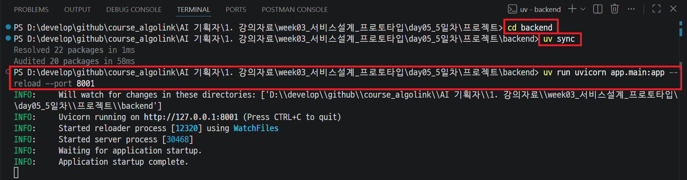

---
### 2) 프론트엔드 실행 (터미널 2, 백엔드 실행 중인 상태에서)
```bash
cd frontend
uv sync
uv run streamlit run streamlit_app/app.py
```
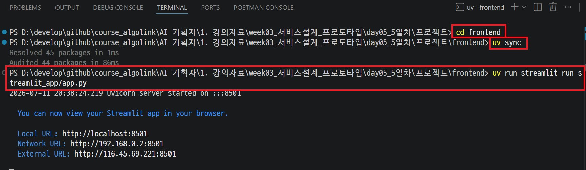

---
> 브라우저에서 `http://localhost:8501` 접속 → 사이드바에 " 백엔드 연결됨"이 보이면 정상입니다.

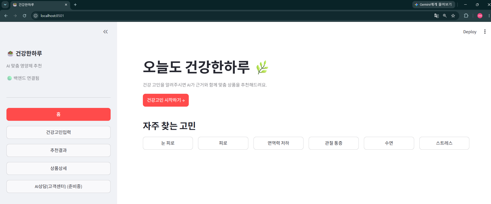

---
## 테스트 

---
### 화면 흐름으로 확인하기 (정상 시나리오)

---
1. **홈** — '눈 피로' 카테고리 칩 클릭

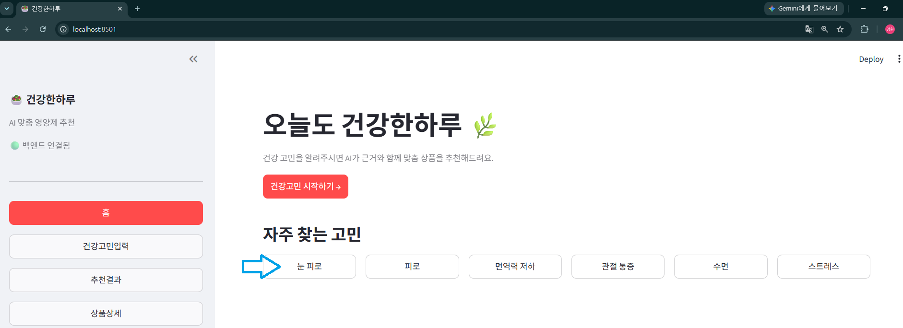

---
2. **건강고민입력** — 선택된 고민 확인 후 '맞춤 추천 받기' 클릭

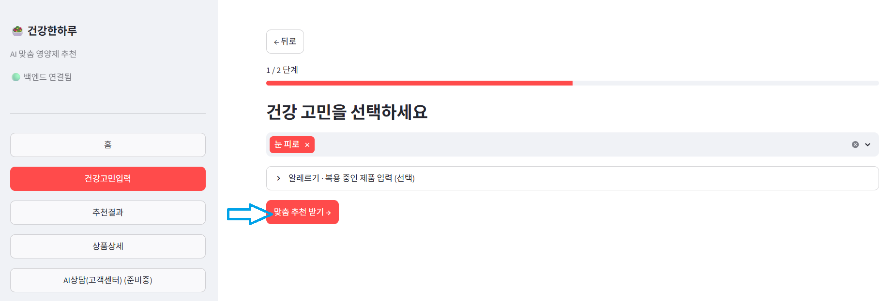

---
3. **추천결과** — 추천 상품 카드, 추천 근거, '상세보기' 클릭

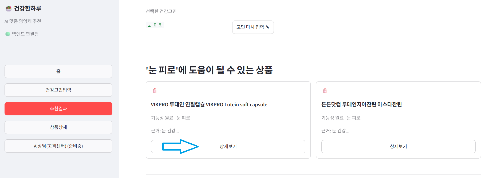

---
4. **상품상세** — 성분 쉬운 설명, 권장/상한 섭취량(연령대·성별 변경해보기), '구매하기' 클릭

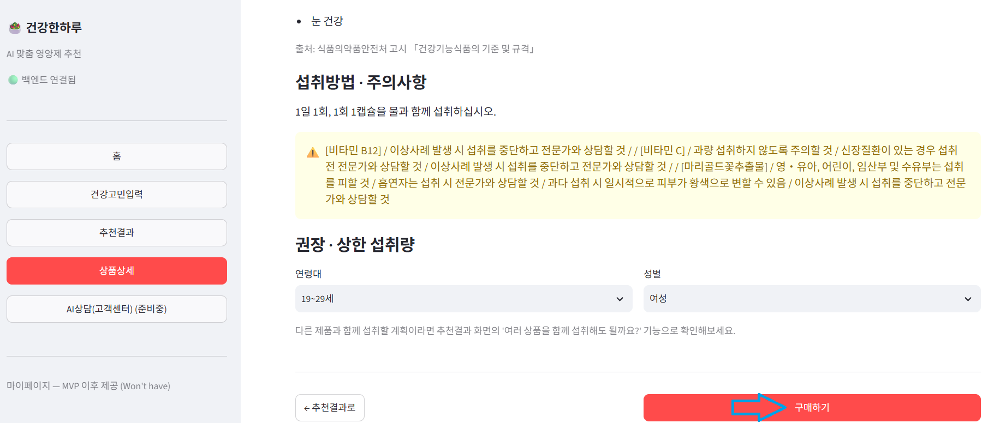

---
### 예외 흐름으로 확인하기

---
| 예외 | 재현 방법 | 확인할 화면 |
| --- | --- | --- |
| E1 필수 정보 누락 | 건강고민입력에서 아무것도 선택하지 않기 | 버튼 비활성화 + 안내 문구 |

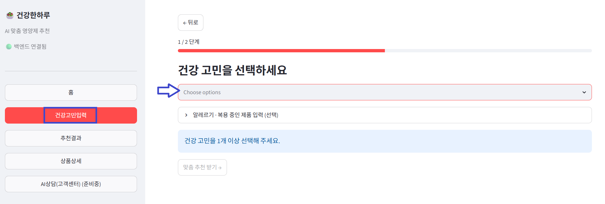

---
| 예외 | 재현 방법 | 확인할 화면 |
| --- | --- | --- |
| E3 과다섭취 경고 | 추천결과에서 동일 원료 상품 2개 이상 선택 후 확인 | 경고 배너 |

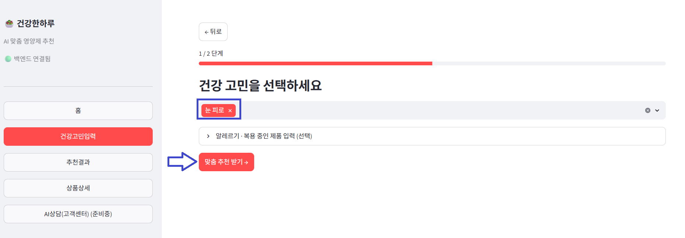

---
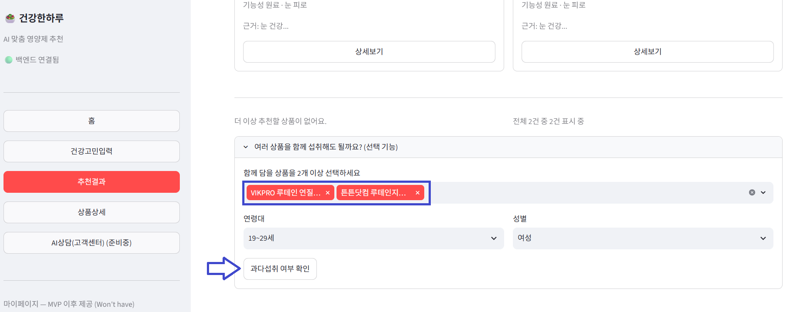

---
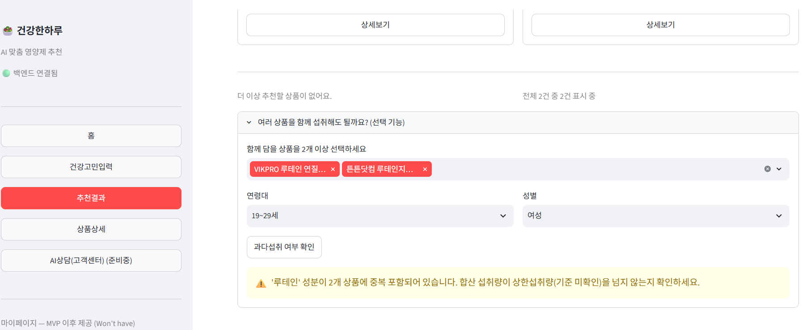

---
| 예외 | 재현 방법 | 확인할 화면 |
| --- | --- | --- |
| E5 연결 실패 | backend 서버를 끈 상태로 frontend만 접속 | 사이드바 + 오류 메시지 |

> backend 서버 중단: `Ctrl + C`

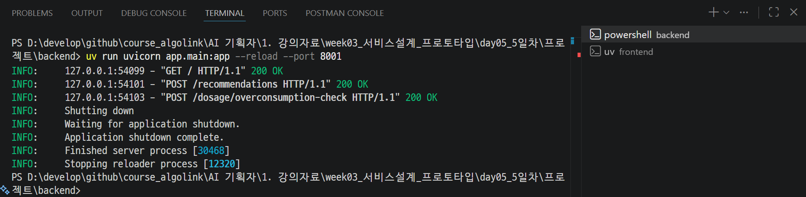

---
> 페이지 새로고침 후 확인 

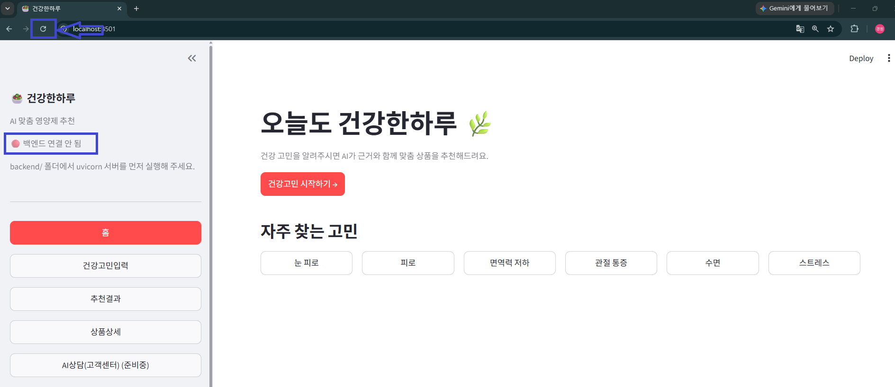

---
> frontend 서버 중단: `Ctrl + C`

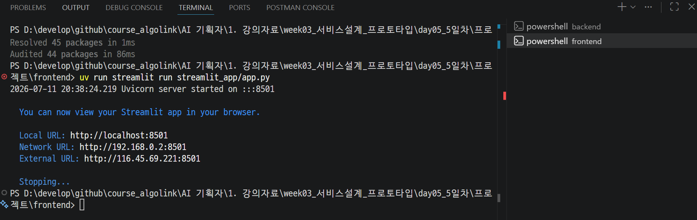

---
> 결과 확인 

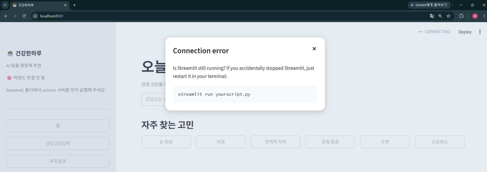

---
# [예제영상> Streamlit - Python으로 웹사이트 만들기](https://www.youtube.com/watch?v=XACHCUduqh0)
- Streamlit은 데이터 과학자들을 위한 도구입니다. 
- Python만으로 프론트 엔드를 구현해줍니다. 
- HTML, CSS, JavaScript는 몰라도 됩니다. 
- pandas, numpy 같은 라이브러리와 쉽게 연동 됩니다.  
- streamlit 클라우드를 이용하면 손쉽게 서버를 운영할 수 있습니다. 

