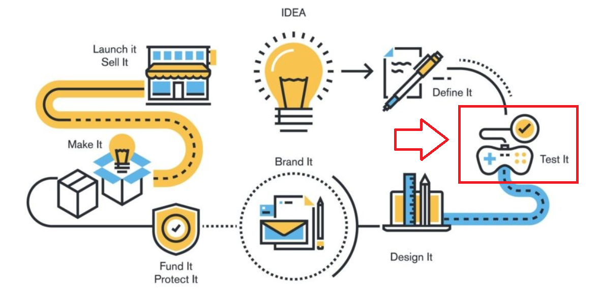
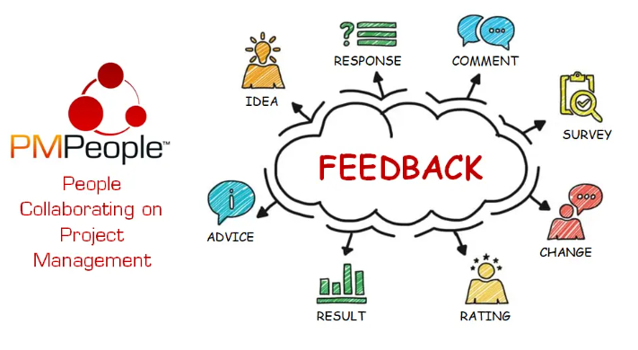

# 프로토타입 구현 및 검증

AI 서비스 아이디어를 빠르게 확인하고 개선하는 방법

---

## 오늘의 핵심 질문

- 프로토타입은 완성된 서비스와 무엇이 다를까?
- 프로토타입을 만드는 진짜 목적은 무엇일까?
- 사용자는 프로토타입을 보며 어떤 반응을 보여 줄까?
- 피드백은 어떻게 모으고, 어떻게 다음 버전에 반영해야 할까?
- AI 기능이 있는 프로토타입은 무엇을 더 조심해서 검증해야 할까?

---

## [프로토타입이란 무엇인가](https://www.linkedin.com/pulse/building-product-prototype-tools-techniques-reshu-bansal/)

프로토타입은 완성된 서비스를 만들기 전에 핵심 경험을 빠르게 확인하기 위해 만든 임시 모델입니다.

프로토타입은 다음을 보여 줍니다.

- 사용자가 어떤 화면을 보게 되는지
- 어떤 순서로 이동하는지
- 어떤 정보를 입력하는지
- 어떤 결과를 받는지
- 어디서 이해하거나 막히는지

> 프로토타입은 완성품이 아니라 **검증을 위한 대화 도구**입니다.

---


---

## 프로토타입은 왜 필요한가

기획 문서만으로는 사용자의 반응을 알기 어렵습니다.

문서에서는 자연스러워 보였던 흐름도 실제로 보여 주면 다르게 보일 수 있습니다.

- 사용자가 메뉴 이름을 이해하지 못한다
- 버튼을 눌러야 하는지 모른다
- 입력 항목이 부담스럽다고 느낀다
- AI 결과를 신뢰하지 않는다
- 오류 메시지를 보고도 무엇을 해야 할지 모른다

프로토타입은 이런 문제를 일찍 발견하게 해 줍니다.

---

## 프로토타입의 목적

프로토타입의 목적은 멋진 화면을 자랑하는 것이 아닙니다.

핵심 목적은 다음과 같습니다.

| 목적 | 설명 |
|---|---|
| 이해 확인 | 사용자가 화면과 문구를 이해하는지 본다 |
| 흐름 확인 | 목표까지 자연스럽게 이동하는지 본다 |
| 가치 확인 | 사용자가 결과를 유용하다고 느끼는지 본다 |
| 위험 확인 | 막히는 지점과 불안 요소를 찾는다 |
| 의사결정 | 무엇을 유지하고 바꿀지 정한다 |

프로토타입은 "만들었다"보다 "무엇을 알게 되었는가"가 중요합니다.

---

## 프로토타입으로 확인해야 할 것

AI 기획자는 프로토타입을 통해 다음을 확인해야 합니다.

- 사용자가 서비스의 목적을 바로 이해하는가?
- 첫 화면에서 무엇을 해야 할지 아는가?
- 입력 항목이 너무 어렵거나 많지 않은가?
- AI 결과가 사용자의 기대와 맞는가?
- 추천 이유나 답변 근거가 충분한가?
- 결과가 마음에 들지 않을 때 다시 시도할 수 있는가?
- 오류 상황에서 다음 행동이 보이는가?

프로토타입은 기능 수보다 사용자 판단을 확인하는 데 초점을 둡니다.

---

## 프로토타입이 아닌 것

프로토타입을 완성품처럼 생각하면 목적이 흐려집니다.

| 오해 | 바르게 보기 |
|---|---|
| 모든 기능이 작동해야 한다 | 핵심 흐름만 확인해도 된다 |
| 디자인이 완벽해야 한다 | 이해와 흐름 검증이 먼저다 |
| 개발이 끝나야 보여줄 수 있다 | 빠르게 보여주고 빨리 배운다 |
| 피드백은 출시 후 받는다 | 출시 전에도 충분히 배울 수 있다 |
| 사용자가 좋아하면 끝이다 | 왜 좋아하는지, 어디서 막히는지 봐야 한다 |

프로토타입은 완성도를 증명하는 문서가 아니라 가설을 확인하는 도구입니다.

---

## 프로토타입의 종류

프로토타입은 정교함에 따라 여러 단계로 나눌 수 있습니다.

| 구분 | 특징 | 확인하기 좋은 것 |
|---|---|---|
| 낮은 완성도 | 손그림, 간단한 와이어프레임 | 구조와 흐름 |
| 중간 완성도 | 클릭 가능한 화면 | 이동 경로와 문구 이해 |
| 높은 완성도 | 실제 서비스처럼 보이는 화면 | 사용감과 세부 반응 |
| 기능형 | 일부 기능이 실제로 작동 | 데이터, AI 결과, 처리 흐름 |

항상 높은 완성도가 좋은 것은 아닙니다.  
검증하려는 질문에 맞는 수준이면 충분합니다.

---

## 낮은 완성도 프로토타입

낮은 완성도 프로토타입은 빠르게 구조를 확인할 때 좋습니다.

예를 들어:

- 종이에 그린 화면
- 간단한 와이어프레임
- 메뉴 구조 그림
- 클릭은 되지 않지만 흐름을 설명할 수 있는 화면

장점은 빠르고 수정이 쉽다는 것입니다.

아직 큰 방향이 정해지지 않았다면 낮은 완성도로 먼저 확인하는 것이 좋습니다.

---

## 높은 완성도 프로토타입

높은 완성도 프로토타입은 실제 서비스에 가까운 느낌을 확인할 때 좋습니다.

예를 들어:

- 실제 색상과 문구가 들어간 화면
- 클릭 가능한 화면 전환
- 실제 데이터처럼 보이는 결과
- 로딩, 빈 결과, 오류 상태가 포함된 화면

단점은 만드는 데 시간이 더 걸리고, 사용자가 이미 완성된 서비스라고 오해할 수 있다는 점입니다.

---

## AI 서비스 프로토타입의 특징

AI 서비스 프로토타입은 일반 화면보다 더 확인할 것이 많습니다.

- 사용자가 AI에게 무엇을 기대하는가
- 입력 정보가 충분한가
- AI 결과가 유용하고 이해 가능한가
- 결과가 틀렸을 때 사용자가 알아차릴 수 있는가
- AI가 답하지 않아야 하는 상황이 있는가
- 사용자에게 결과 수정과 재시도 방법이 보이는가

AI 프로토타입은 화면만이 아니라  
**AI 결과를 사용자가 어떻게 받아들이는지**까지 확인해야 합니다.

---

## AI 프로토타입에서 가짜 결과를 써도 되는가

초기 검증에서는 실제 AI가 완전히 작동하지 않아도 됩니다.

다음처럼 보여줄 수 있습니다.

- 미리 준비한 추천 결과
- 사람이 만든 답변 예시
- 실제처럼 보이는 샘플 데이터
- AI가 답변한 것처럼 보이는 흐름

중요한 것은 속이는 것이 아니라, 검증 목적을 분명히 하는 것입니다.

> 지금은 기술 성능이 아니라  
> 사용자가 이 결과를 이해하고 가치 있다고 느끼는지를 확인하는 단계입니다.

---

## 프로토타입 구현 전에 정할 것

프로토타입을 만들기 전에 먼저 검증 질문을 정해야 합니다.

| 검증 질문 | 확인 방법 |
|---|---|
| 사용자가 첫 화면을 이해하는가? | 첫 화면을 보고 무엇을 할지 말하게 한다 |
| 입력 항목이 부담스럽지 않은가? | 입력 중 망설이는 지점을 본다 |
| 추천 결과가 유용한가? | 결과를 보고 선택할 수 있는지 본다 |
| 이유 설명이 충분한가? | 왜 이 결과가 나왔는지 설명할 수 있는지 본다 |
| 오류 메시지가 도움이 되는가? | 오류 후 다음 행동을 아는지 본다 |

프로토타입은 질문 없이 만들면 단순한 화면 제작이 됩니다.

---

## 좋은 검증 질문의 기준

좋은 검증 질문은 관찰할 수 있어야 합니다.

약한 질문:

> 사용자가 좋아할까?

좋은 질문:

> 사용자가 첫 화면을 보고 추천 시작 버튼을 찾을 수 있는가?

---
약한 질문:

> AI 결과가 괜찮을까?

좋은 질문:

> 사용자가 추천 이유를 보고 결과를 믿을 수 있다고 말하는가?

검증 질문은 사용자의 행동과 판단으로 확인할 수 있어야 합니다.

---

## 프로토타입 구현 범위 정하기

프로토타입은 모든 화면을 만들 필요가 없습니다.

우선 다음 범위부터 확인합니다.

- 사용자가 서비스를 시작하는 화면
- 핵심 정보를 입력하는 화면
- AI 결과를 확인하는 화면
- 결과를 수정하거나 다시 시도하는 흐름
- 결과가 없거나 오류가 나는 상태

특히 AI 서비스에서는 성공 화면만 만들면 부족합니다.  
신뢰와 회복 흐름을 함께 보여 줘야 합니다.

---

## 프로토타입에 포함할 상태

사용자는 여러 상태를 경험합니다.

| 상태 | 설명 |
|---|---|
| 기본 상태 | 사용자가 처음 보는 화면 |
| 입력 중 상태 | 사용자가 정보를 작성하는 화면 |
| 로딩 상태 | AI 결과를 기다리는 화면 |
| 성공 상태 | 결과가 정상적으로 나온 화면 |
| 빈 결과 상태 | 조건에 맞는 결과가 없는 화면 |
| 오류 상태 | 응답 실패나 입력 오류가 발생한 화면 |

이 상태들을 확인해야 실제 사용 흐름이 끊기지 않습니다.

---

## 프로토타입 검증이란 무엇인가

프로토타입 검증은 사용자가 프로토타입을 보거나 사용하면서 목표를 달성할 수 있는지 확인하는 과정입니다.

검증은 다음을 보는 일입니다.

- 사용자가 어디서 멈추는가
- 어떤 표현을 이해하지 못하는가
- 어떤 기능을 기대하는가
- 어떤 결과를 신뢰하지 못하는가
- 어떤 흐름이 불필요하게 길게 느껴지는가

검증은 평가가 아니라 학습입니다.

---

## 검증에서 중요한 태도

프로토타입 검증의 목적은 기획안을 방어하는 것이 아닙니다.

중요한 태도는 다음과 같습니다.

- 사용자가 틀렸다고 생각하지 않는다
- 설명하기 전에 먼저 관찰한다
- 좋은 반응보다 막히는 지점을 더 중요하게 본다
- 한 사람의 의견을 전체 결론으로 단정하지 않는다
- 반복해서 나타나는 신호를 찾는다
- 피드백을 기능 추가 요청으로만 해석하지 않는다

사용자의 말보다 행동에서 더 많은 단서를 얻을 수 있습니다.

---

## 사용자 피드백이란 무엇인가

사용자 피드백은 사용자가 서비스 경험에 대해 보여 주는 반응과 의견입니다.

피드백에는 여러 종류가 있습니다.

| 피드백 종류 | 예시 |
|---|---|
| 말로 표현한 의견 | 이 결과는 조금 믿기 어려워요 |
| 행동으로 보인 반응 | 버튼을 찾지 못하고 화면을 오래 본다 |
| 감정 반응 | 입력 항목에서 부담을 느낀다 |
| 기대 표현 | 결과를 비교해 보고 싶다고 말한다 |
| 불편 표현 | 왜 이 정보를 입력해야 하는지 모르겠다고 한다 |

좋은 기획자는 사용자의 말과 행동을 함께 봅니다.

---
# [피드백](https://community.pmpeople.ai/feedback-project-economy)



---
## 피드백을 받을 때의 질문

사용자에게는 정답을 유도하는 질문보다 경험을 말하게 하는 질문이 좋습니다.

좋은 질문:

- 이 화면을 처음 봤을 때 무엇을 해야 한다고 느꼈나요?
- 어떤 부분에서 망설였나요?
- 결과를 보고 어떤 판단을 할 수 있었나요?
- 추천 이유가 충분히 이해되었나요?
- 다시 시도하거나 수정하고 싶을 때 방법이 보였나요?
- 이 서비스가 실제 상황에서 도움이 될 것 같나요?

질문은 사용자의 실제 판단을 끌어내야 합니다.

---

## 피해야 할 질문

다음 질문은 좋은 피드백을 얻기 어렵습니다.

| 피해야 할 질문 | 이유 |
|---|---|
| 괜찮죠? | 긍정 답변을 유도한다 |
| 예쁘지 않나요? | 디자인 취향으로만 흐른다 |
| 이 기능 필요하죠? | 필요하다고 답하기 쉽다 |
| AI 결과 좋았죠? | 실제 신뢰 여부를 알기 어렵다 |
| 어떤 기능을 더 넣을까요? | 기능 추가 목록만 늘어날 수 있다 |

좋은 피드백 질문은 사용자가 느낀 문제와 판단 과정을 드러내야 합니다.

---

## 피드백을 기록하는 기준

피드백은 그냥 메모하면 나중에 판단하기 어렵습니다.

| 항목 | 기록 내용 |
|---|---|
| 상황 | 어떤 화면이나 흐름에서 나온 반응인가 |
| 사용자 말 | 사용자가 실제로 한 말 |
| 관찰 행동 | 사용자가 멈춘 지점, 클릭한 순서 |
| 문제 유형 | 이해 문제, 흐름 문제, 신뢰 문제, 기능 문제 |
| 영향도 | 핵심 목표 달성에 얼마나 큰 영향을 주는가 |
| 개선 방향 | 문구 수정, 구조 변경, 기능 조정 등 |

피드백은 느낌이 아니라 의사결정 근거가 되어야 합니다.

---

## 피드백을 해석할 때 주의할 점

사용자의 말은 중요하지만 그대로 모두 반영하면 안 됩니다.

예를 들어 사용자가 이렇게 말할 수 있습니다.

> 검색 기능이 있으면 좋겠어요.

이때 바로 검색 기능을 추가하기보다 질문해야 합니다.

- 사용자가 무엇을 찾지 못했는가?
- 메뉴 구조가 헷갈렸는가?
- 결과가 너무 많았는가?
- 추천 결과를 비교하고 싶었던 것인가?

피드백은 요청 그대로가 아니라 **그 뒤에 있는 문제를 찾아야 합니다.**

---

## 피드백 분류하기

피드백은 다음처럼 분류할 수 있습니다.

| 분류 | 의미 | 예시 |
|---|---|---|
| 이해 문제 | 화면이나 문구를 이해하지 못함 | 추천 시작 버튼이 보이지 않음 |
| 흐름 문제 | 목표까지 가는 길이 어색함 | 결과 수정 위치를 찾지 못함 |
| 신뢰 문제 | 결과를 믿기 어려움 | 추천 이유가 부족함 |
| 입력 문제 | 작성 부담이나 혼란이 큼 | 알레르기 입력 방식이 어렵다 |
| 예외 문제 | 막혔을 때 회복이 안 됨 | 결과 없음 후 다음 행동이 없다 |
| 가치 문제 | 결과가 도움이 되지 않음 | 추천이 너무 일반적이다 |

분류를 해야 무엇을 먼저 고칠지 보입니다.

---

## 피드백 우선순위 정하기

모든 피드백을 한 번에 반영할 수는 없습니다.

우선순위는 다음 기준으로 정합니다.

- 핵심 목표 달성에 직접 영향을 주는가?
- 여러 사용자에게 반복해서 나타나는가?
- 사용자가 중간에 이탈할 정도로 큰 문제인가?
- AI 결과의 신뢰와 안전에 영향을 주는가?
- 작은 수정으로 큰 개선을 만들 수 있는가?
- 다음 검증 전에 반드시 고쳐야 하는가?

피드백 반영도 기능 우선순위처럼 판단 기준이 필요합니다.

---

## 사용자 피드백 반영의 기본 흐름

피드백은 다음 순서로 반영합니다.

1. 피드백을 모은다
2. 비슷한 문제끼리 묶는다
3. 문제의 원인을 해석한다
4. 우선순위를 정한다
5. 개선 방향을 결정한다
6. 프로토타입을 수정한다
7. 다시 사용자 반응을 확인한다

피드백 반영은 한 번의 수정이 아니라 반복 과정입니다.

---

## 피드백을 반영하는 방식

피드백은 꼭 큰 기능 추가로 이어지지 않습니다.

| 피드백 문제 | 반영 방식 |
|---|---|
| 버튼을 못 찾음 | 버튼 위치와 문구 수정 |
| 입력 이유를 모름 | 입력 항목 옆 설명 추가 |
| 결과를 못 믿음 | 추천 이유와 근거 표현 강화 |
| 결과가 너무 많음 | 핵심 결과 먼저 보여주기 |
| 오류 후 막힘 | 다음 행동 버튼 추가 |
| AI 답변이 모호함 | 답변 형식과 제한 안내 개선 |

문제에 맞는 가장 작은 개선부터 생각하는 것이 좋습니다.

---

## AI 서비스 피드백에서 특히 봐야 할 것

AI 서비스에서는 다음 피드백이 중요합니다.

- 사용자가 AI 결과를 이해했는가?
- 사용자가 결과를 믿을 수 있다고 느끼는가?
- 결과가 틀릴 수 있다는 점을 받아들일 수 있는가?
- 수정하거나 다시 요청하는 흐름이 자연스러운가?
- AI가 답변하지 못하는 상황을 납득하는가?
- 사용자가 자신의 입력 정보가 어떻게 쓰이는지 이해하는가?

AI 서비스의 피드백은 기능 만족도뿐 아니라 신뢰와 책임 범위를 봐야 합니다.

---

## 피드백 반영 전후 비교

피드백은 반영 전후를 비교해야 의미가 있습니다.

| 구분 | 반영 전 | 반영 후 |
|---|---|---|
| 첫 화면 | 사용자가 시작 버튼을 찾지 못함 | 버튼 문구를 "오늘 추천받기"로 변경 |
| 입력 화면 | 알레르기 입력 이유를 모름 | "안전한 추천을 위해 필요해요" 설명 추가 |
| 결과 화면 | 추천을 믿기 어렵다고 느낌 | 추천 이유와 제외 기준 표시 |
| 오류 상황 | 결과 없음 후 멈춤 | 조건 수정 버튼과 완화 제안 추가 |

개선은 "바꿨다"가 아니라 "사용자 반응이 나아졌는가"로 판단합니다.

---

## 프로토타입 검증 결과를 정리하는 방법

검증 후에는 다음을 정리해야 합니다.

| 항목 | 질문 |
|---|---|
| 확인된 점 | 어떤 가설이 맞았는가? |
| 발견된 문제 | 사용자가 어디서 막혔는가? |
| 원인 해석 | 왜 그런 문제가 생겼는가? |
| 개선 결정 | 무엇을 바꿀 것인가? |
| 보류 결정 | 지금 반영하지 않을 것은 무엇인가? |
| 다음 검증 | 다음에는 무엇을 확인할 것인가? |

검증 결과는 다음 버전의 기획 근거가 됩니다.

---

## 반영하지 않을 피드백도 정해야 한다

사용자 피드백은 모두 소중하지만 모두 반영할 수는 없습니다.

반영하지 않을 수 있는 경우:

- 핵심 사용자와 거리가 먼 요구
- MVP 범위를 크게 벗어나는 기능
- 한 사람에게만 나타난 취향 문제
- 기술이나 운영 부담이 너무 큰 변경
- 더 많은 검증이 필요한 의견

중요한 것은 무시가 아니라 판단입니다.  
왜 지금 반영하지 않는지 설명할 수 있어야 합니다.

---

## 프로토타입 검증에서 흔한 실수

다음 실수를 조심해야 합니다.

- 화면을 설명해 주면서 검증한다
- 사용자가 좋다고 한 말만 기록한다
- 한 명의 강한 의견에 전체 방향을 바꾼다
- 모든 피드백을 기능 추가로 해석한다
- 오류와 빈 결과 화면을 검증하지 않는다
- AI 결과의 신뢰 문제를 디자인 문제로만 본다
- 피드백 반영 후 다시 확인하지 않는다

검증의 목적은 칭찬을 받는 것이 아니라 더 나은 판단을 얻는 것입니다.

---

## AI 기획자의 프로토타입 점검 질문

프로토타입을 볼 때 다음 질문을 던져 봅니다.

- 사용자가 첫 화면에서 서비스 목적을 이해하는가?
- 핵심 흐름이 너무 길거나 복잡하지 않은가?
- AI가 필요한 순간이 분명한가?
- AI 결과의 이유와 한계가 보이는가?
- 사용자가 결과를 수정하거나 다시 요청할 수 있는가?
- 빈 결과, 오류, 안전 제한 상태가 준비되어 있는가?
- 피드백을 반영한 뒤 무엇이 개선되었는가?

---

## 프로토타입 개선의 반복 구조

프로토타입은 한 번 만들고 끝나는 것이 아닙니다.

```text
가설 설정
→ 프로토타입 제작
→ 사용자 반응 관찰
→ 피드백 정리
→ 개선 방향 결정
→ 프로토타입 수정
→ 다시 검증
```

이 반복을 통해 서비스는 점점 사용자에게 맞는 형태로 다듬어집니다.

---

## 오늘의 정리

- 프로토타입은 완성품이 아니라 서비스 가설을 검증하기 위한 도구다
- 프로토타입의 목적은 화면 완성도보다 사용자 이해, 흐름, 가치, 신뢰를 확인하는 데 있다
- AI 서비스 프로토타입은 결과 설명, 수정, 재시도, 오류 상태까지 함께 확인해야 한다
- 사용자 피드백은 말과 행동을 함께 보고 문제 유형별로 정리해야 한다
- 피드백 반영은 모든 요청을 넣는 것이 아니라 핵심 문제를 찾아 우선순위에 따라 개선하는 과정이다

---

## 마지막으로 기억할 문장

프로토타입은 정답을 보여주는 것이 아닙니다.

**사용자 앞에서 우리의 가정을 확인하고,  
틀린 부분을 빨리 배우고,  
다음 버전을 더 낫게 만드는 도구**입니다.
