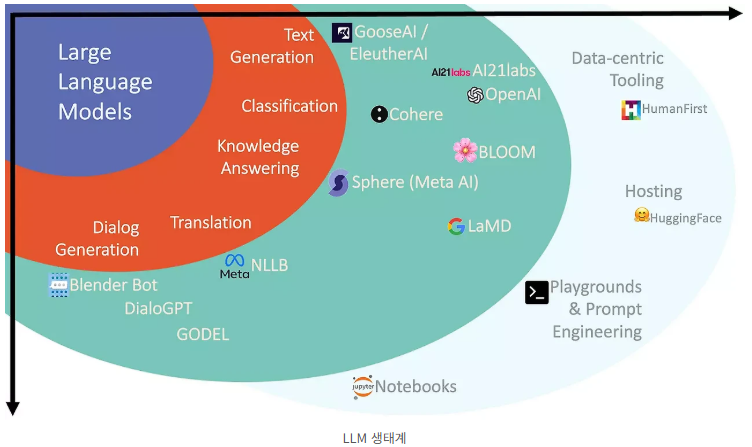
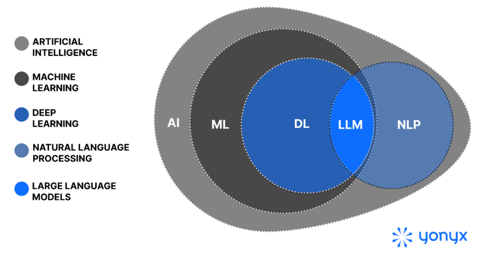
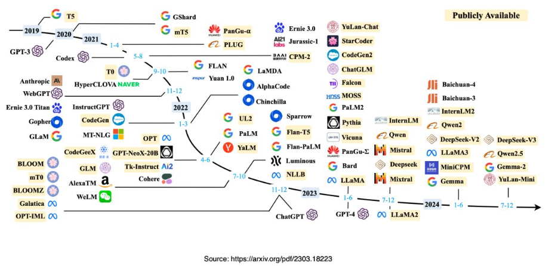
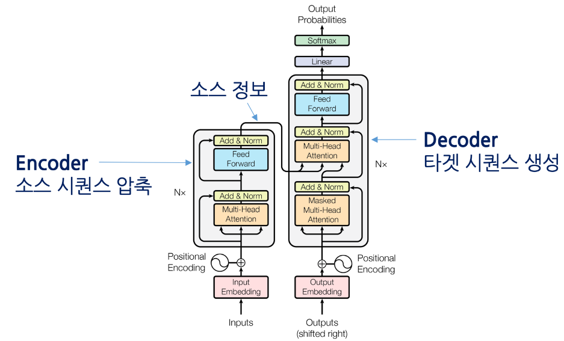
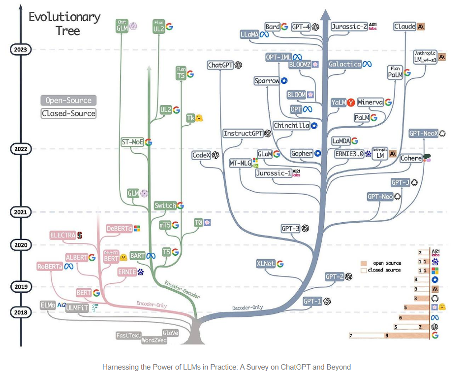

# [LLM (거대 언어 모델, Large Language Model) 이란,]((https://didi-universe.tistory.com/entry/LLM-%EA%B1%B0%EB%8C%80%EC%96%B8%EC%96%B4%EB%AA%A8%EB%8D%B8-LLMLarge-Language-Model-%EC%9D%B4%EB%9E%80#google_vignette)) 
> 대용량의 언어 모델을 의미합니다.
- LLM은 딥 러닝 알고리즘과 통계 모델링을 통해 자연어 처리(Natural Language Processing, NLP) 작업을 수행하는 데에 사용합니다.
- 이 모델은 사전에 대규모의 언어 데이터를 학습하여 문장 구조나 문법, 의미 등을 이해하고 생성할 수 있습니다.

---


---
## [NLP vs LM vs LLM](https://corp.yonyx.com/customer-service/nlp-vs-llm/)

| 구분    | NLP               | LM                             | LLM                     |
| ----- | ----------------- | ------------------------------ | ----------------------- |
| 의미    | 자연어 처리 분야 전체      | 언어를 예측하는 모델                    | 매우 큰 규모의 언어 모델          |
| 목표    | 사람의 언어를 이해하고 처리   | 다음 단어(토큰) 예측                   | 다양한 언어 작업을 하나의 모델로 수행   |
| 입력    | 텍스트               | 텍스트                            | 텍스트, 이미지, 음성 등(멀티모달 가능) |
| 출력    | 분류, 번역, 요약 등 다양   | 다음 토큰                          | 대화, 코딩, 번역, 추론 등        |

---


---
## LLM 역사 
- 1세대 (Word Embedding): 단어를 숫자 벡터로 표현
- 2세대 (BERT): 문장을 이해하는 모델
- 3세대 (GPT): 문장을 생성하는 모델
- 4세대 (ChatGPT): 사람과 자연스럽게 대화하는 AI
- 5세대 (Reasoning LLM): 추론, 계획 수립, 도구 사용, AI Agent까지 수행

> Word2Vec(단어 표현) → BERT(언어 이해) → GPT(언어 생성) → ChatGPT(대화형 AI) → Llama·Gemma·Qwen 등 오픈소스 LLM → 추론·멀티모달·AI Agent 중심의 최신 LLM으로 발전하고 있습니다.

---


---
## LLM 발전 과정
> 현재의 대표적인 LLM(GPT, Llama, Qwen, Gemma 등)은 거의 모두 Transformer 기반이며, 특히 Decoder-only Transformer 구조를 사용합니다.

---
### [Transformer Model](https://forest62590.tistory.com/48)

```
입력 문장
    │
    ▼
┌─────────────┐
│   Encoder   │  ← 입력을 이해(Understanding)
└─────────────┘
       │
       │ Context (의미 정보)
       ▼
┌─────────────┐
│   Decoder   │  ← 출력 생성(Generation)
└─────────────┘
       │
       ▼
출력 문장
```

---


---
### [LLM의 세부 발전 과정](https://data-scientist-jeong.tistory.com/41)

- 분홍 가지는 `인코더 전용 모델`
- 녹색 가지는 `인코더-디코더 모델`
- 파란 가지는 `디코더 전용 모델`



---
> 구조 비교

| 구조                  | 역할      | 대표 모델      | 주요 활용            |
| ------------------- | ------- | ---------- | ---------------- |
| **Encoder**         | 입력을 이해  | BERT       | 분류, 검색, 임베딩, NER |
| **Decoder**         | 문장을 생성  | GPT, Llama | 대화, 생성, 코딩, 요약   |
| **Encoder-Decoder** | 이해 후 생성 | T5, BART   | 번역, 요약, 질의응답     |

---
# [예제영상> LLM 설명](https://www.youtube.com/watch?v=HnvitMTkXro)
- LLM 동작원리
