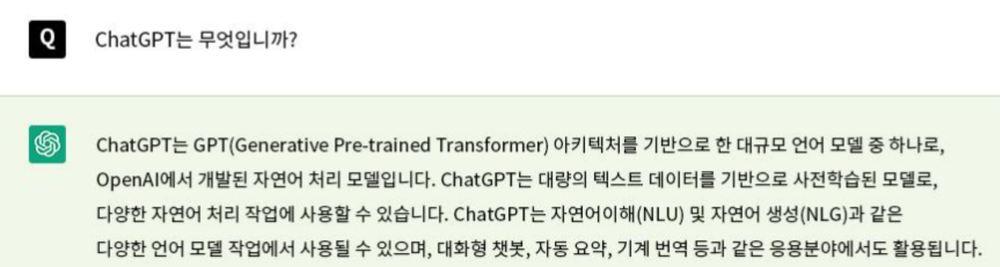
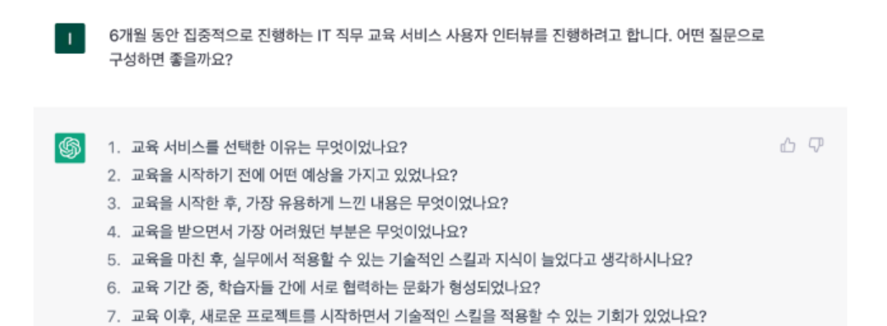
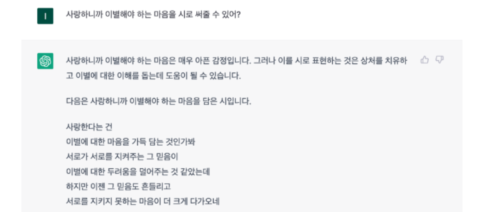
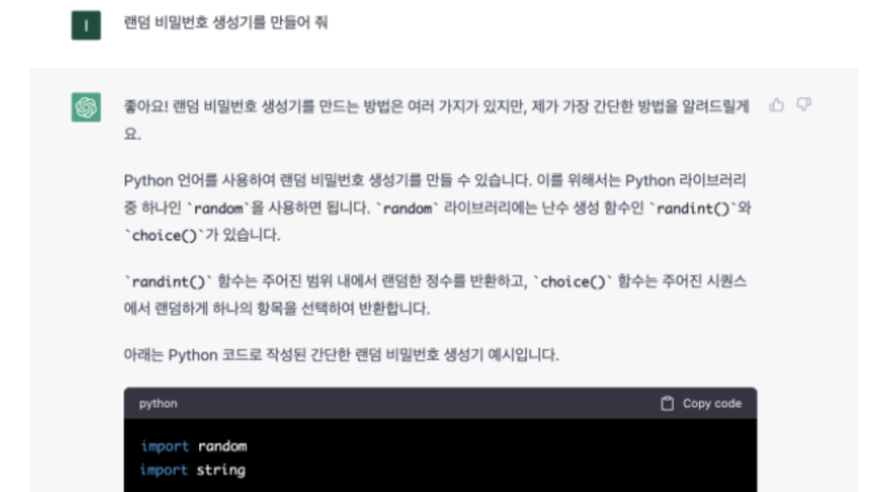
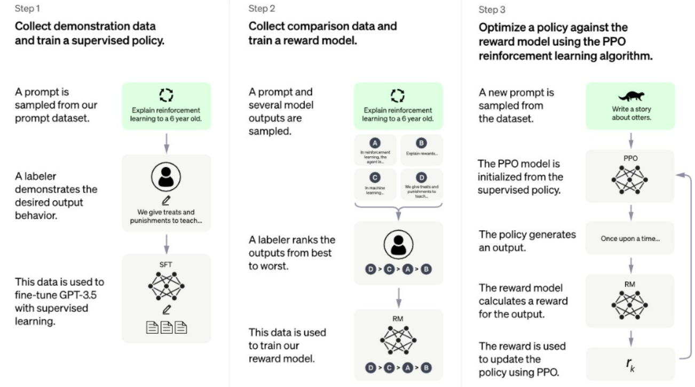
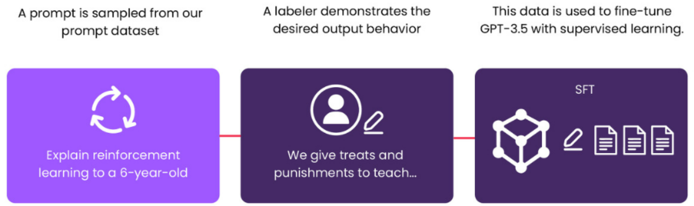
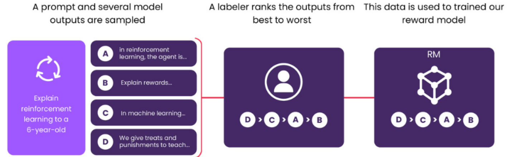
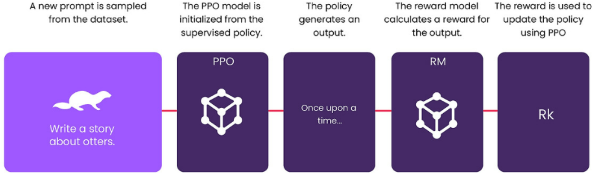
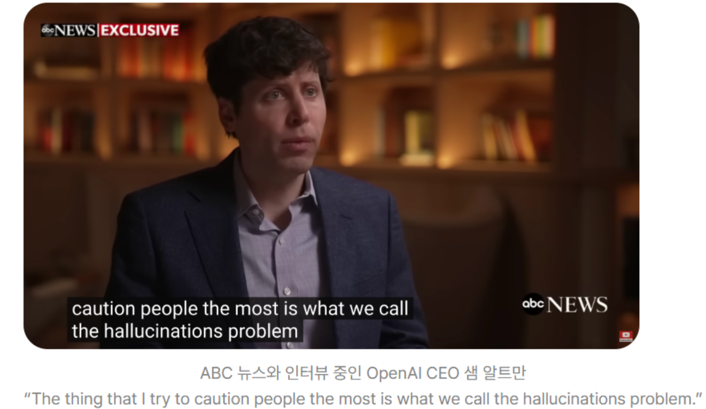
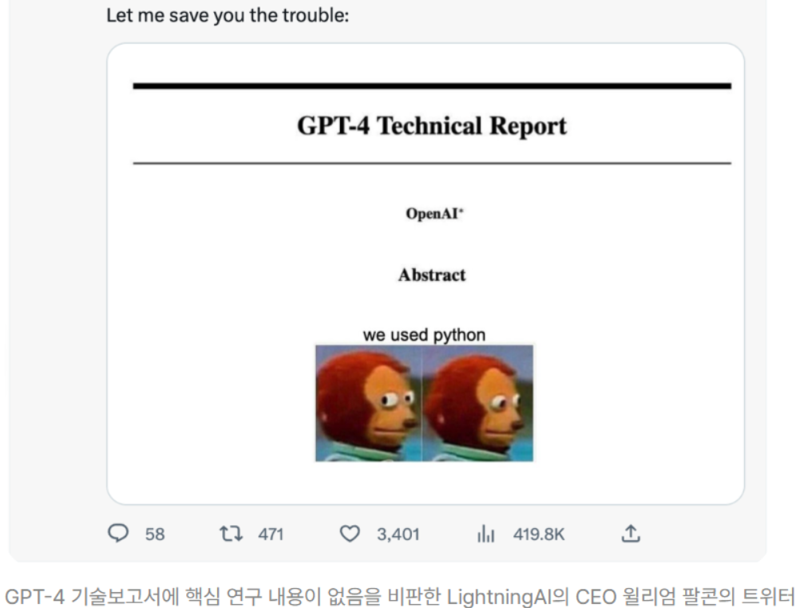

# [ChatGPT](https://chatgpt.com/)
- ChatGPT는 미국의 AI 연구재단 OpenAI(오픈에이아이)가 2022년 11월 공개한 초거대 언어 모델 GPT-3.5 기반 대화형 인공지능 챗봇입니다. ChatGPT 홈페이지(https://chat.openai.com/chat) 에서 누구나 회원 가입만 하면 무료로 이용할 수 있죠.
- GPT는 ‘Generative Pre-trained Transformer’의 약자로 머신러닝으로 방대한 데이터를 ‘미리 학습(Pre-trained)’해 이를 문장으로 ‘생성(Generative)’하는 생성 AI입니다. 사용자가 채팅 하듯 질문을 입력하면 ChatGPT는 학습한 데이터를 기반으로 ‘사람처럼’ 문장으로 답을 해줍니다.

---

---
## ChatGPT 활용법 및 활용 사례

---
### 정보 얻기
- ChatGPT는 방대한 데이터를 학습했기 때문에 많은 다양한 지식과 정보를 얻기에 좋습니다.
- 현재는 인터넷에 연결되지 않아 실시간으로 업데이트 되는 정보를 확인할 수는 없지만 일반적인 주제에 대해서는 충분한 데이터를 갖고 있어 정보를 얻기에 충분합니다.
- 단순하게 지식, 정보를 얻을 수도 있지만 새로운 아이디어를 도출해야 할 때 영감을 받는 데에 도움을 받을 수도 있습니다.

---

---
### 글쓰기
- ChatGPT의 가장 강력한 기능, 바로 글쓰기입니다.
- ChatGPT는 자연어 처리 기술을 바탕으로 문장을 생성할 수 있기 때문에, 글쓰기 분야에서도 유용하게 사용됩니다.
- 다양한 분야의 지식을 갖고 있고, 다양한 상황에 적응할 수 있도록 학습했기 때문에 생성 가능한 글의 스펙트럼이 넓습니다.
- 논문, 보고서, 에세이 등 팩트 기반의 글부터 시, 소설, 광고 카피 등 창의력과 상상력이 필요한 형태의 글쓰기도 가능합니다.

---

---
### 코딩하기
- ChatGPT로 코딩도 할 수 있는데요. 예를 들어, “파이썬으로 간단한 계산기를 만들어 달라”고 질문을 던지면, ChatGPT는 파이썬으로 계산기를 만드는 방법을 친절하게 알려줍니다. 이를 통해 새로운 프로그래밍 기술을 배울 수도 있고, 더 나아가 프로그램을 만들 수도 있을 것입니다.
- 개발자의 경우 다른 개발 언어로 쓰여진 라이브러리를 내가 쓰는 개발 언어로 변환할 수도 있고, 코딩할 내용을 자연어로 명령해 코드를 수정하고 보완할 수 있습니다. 또 ChatGPT에게 자신이 쓴 코드 리뷰나 주석 달기 등을 명령할 수도 있습니다.

---

---
## [ChatGPT 학습과정](https://brunch.co.kr/@joonmomdiary/77)

---

---
### 1단계: 데모 데이터 수집 및 지도 학습(Supervised Learning)
- Reddit, Wikipedia, 전자문서화 되어 있는 수 많은 책, 논문 등을 통해 질문-대답이 쌍을 이루고 있는 데이터셋을 생성합니다.
- 생성된 데이터셋을 사용하여 지도학습(Supervised Learning)을 수행합니다.

---

---
### 2단계: 비교 데이터 수집 및 보상 모델 훈련
- 예상 질문(Prompt)에 대한 다양한 예상 답안(Model Output) 데이터셋을 수집합니다.
- 그후, 인간(Labeler)이 예상 답안에 대한 순위를 매깁니다.
- 이 데이터셋은 보상 모델(Reward Model)을 훈련하는 데 사용합니다.

---

---
### 3단계: PPO 강화 학습 알고리즘을 사용하여 보상 모델 정책 최적화
- Proximal Policy Optimization(PPO) 강화 학습 알고리즘을 사용하여 보상 모델에 대한 정책을 최적화한다.

---

---
## ChatGPT 한계

---
### 여전한 오류 가능성
- GPT-4가 여러 면에서 향상됐지만 인공지능으로서의 한계는 여전합니다. - 인공지능의 대표적인 허점인 할루시네이션(Hallucination, 환각) 등 잠재적 위험에 대한 문제가 완전히 해결되지는 않은 것이죠.
- 할루시네이션은 인공지능이 오류가 있는 데이터를 학습해 틀린 답변을 맞는 말처럼 제시하는 현상입니다.

---

---
### 폐쇄적인 GPT-4 기술 보고서
- OpenAI는 GPT-4를 공개하며 기술 보고서도 함께 내놓았습니다. 기술 보고서를 통해 이전 버전과 비교해 더 나아진 성능 등을 소개하고 설명했죠.
- 하지만 GPT-4 기술 보고서에서 모델의 크기, 학습 데이터, 학습 방법 등 초거대 AI 모델을 개발하는 데 필요한 핵심 정보는 보이지 않습니다.
- OpenAI의 이러한 행보에 초거대 AI 모델 개발 경쟁이 치열해지면서 창립 초기 비전과 다르게 기술 독점으로 전략을 바꾼 것이 아니냐는 비판이 이어지고 있습니다.

---

---
# [예제영상> 트랜스포머, ChatGPT가 트랜스포머로 만들어졌죠](https://www.youtube.com/watch?v=g38aoGttLhI&t=493s)
- LLM 동작원리
- 단어 임베딩
- 소프트멕스
