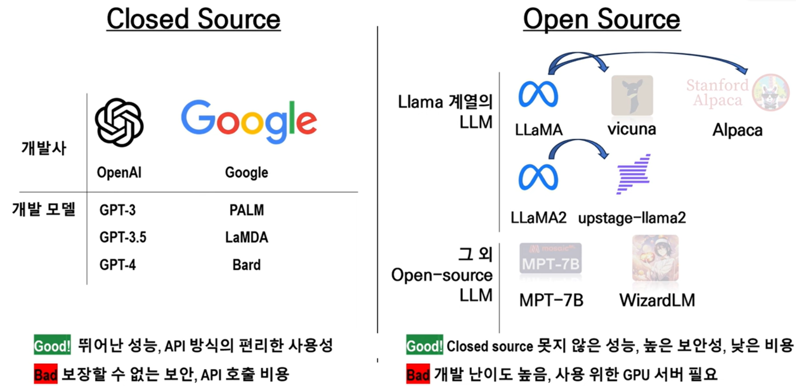
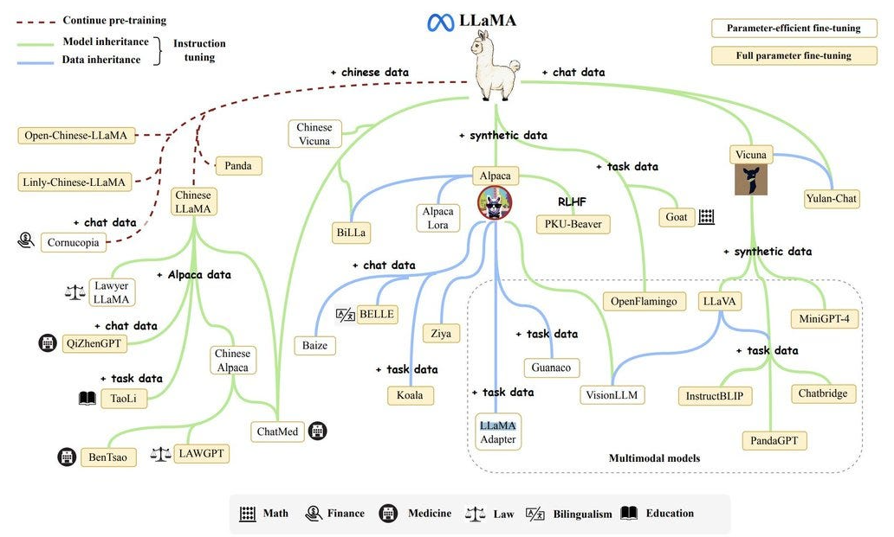

# [Open Source LLM](https://datasciencedojo.com/blog/open-source-llm/)
- Open Source LLM(Open Source Large Language Model) 은 모델의 가중치(Weights)와 사용 방법이 공개되어 누구나 다운로드하여 직접 실행하거나 파인튜닝할 수 있는 대규모 언어 모델입니다.
- 반대로, 모델의 내부 가중치를 공개하지 않고 API로만 사용할 수 있는 모델을 Closed Source LLM이라고 합니다.

---
## Open Source vs Closed Source

| 구분       | Open Source LLM             | Closed Source LLM     |
| -------- | --------------------------- | --------------------- |
| 모델 다운로드  | 가능                        | 불가능                 |
| 로컬 실행    | 가능                        | 불가능(API 사용)         |
| 파인튜닝     | 가능                        | 제한적 또는 불가능            |
| 모델 구조 확인 | 대부분 가능                      | 비공개                 |
| 비용       | GPU만 있으면 자체 운영 가능           | API 사용량에 따라 과금        |
| 대표 모델    | Llama, Qwen, Gemma, Mistral | GPT-5, Claude, Gemini |

---

---
### Open Source 특징 
| 특징 | 설명 |
|------|------|
| **모델 공개** | 모델 가중치(Weights)가 공개되어 누구나 다운로드 가능 |
| **로컬 실행** | 인터넷 없이 개인 PC나 GPU 서버에서 직접 실행 가능 |
| **파인튜닝 가능** | 기업이나 기관의 데이터로 맞춤형 AI 모델 개발 가능 |
| **비용 절감** | API 사용료 없이 자체 인프라에서 운영 가능 |
| **커스터마이징** | 프롬프트, 모델, RAG, AI Agent 등 자유롭게 확장 가능 |
| **데이터 보안** | 민감한 데이터를 외부 API로 전송하지 않고 내부에서 처리 가능 |
| **활발한 생태계** | 전 세계 개발자들이 다양한 파생 모델과 도구를 지속적으로 개발 |
| **다양한 크기 제공** | 1B, 7B, 14B, 32B, 70B 등 목적에 맞는 모델 선택 가능 |

---
### Closed Source 특징 
| 특징 | 설명 |
|------|------|
| **모델 비공개** | 모델 가중치(Weights)가 공개되지 않음 |
| **API 기반 사용** | 대부분 클라우드 API를 통해서만 사용 가능 |
| **파인튜닝 제한** | 모델 자체를 수정하거나 파인튜닝하기 어려움(일부 서비스는 제한적으로 지원) |
| **최신 성능** | 일반적으로 최고 수준의 성능과 추론 능력 제공 |
| **운영 부담 없음** | GPU 서버 구축이나 모델 관리 없이 바로 사용 가능 |
| **사용량 기반 과금** | API 호출량(Token)에 따라 비용 발생 |
| **빠른 도입** | 별도 설치 없이 API Key만으로 바로 개발 가능 |

---
## 대표적인 Open Source LLM

| 모델          | 개발사        | 특징                   |
| ----------- | ---------- | -------------------- |
| Llama 4     | Meta       | 가장 널리 사용되는 오픈 웨이트 계열 |
| Qwen3       | Alibaba    | 다국어, 코딩, 추론 성능 우수    |
| Gemma 3     | Google     | 경량 모델부터 대형 모델까지 제공   |
| Mistral     | Mistral AI | 작은 크기 대비 높은 성능       |
| DeepSeek-R1 | DeepSeek   | 추론(Reasoning)에 강점    |

---
# [LLaMA(Large Language Model Meta AI)](https://developer.meta.com/ai/)
- LLaMA(Large Language Model Meta AI) 는 Meta AI가 개발한 오픈소스(정확히는 오픈 웨이트) 대규모 언어 모델(LLM) 입니다.

쉽게 말하면,
> Meta에서 개발한 GPT와 같은 생성형 AI 모델입니다.

---

---
## GPT vs LLaMA

| 항목        | GPT    | LLaMA      |
| --------- | ------ | ---------- |
| 개발사       | OpenAI | Meta       |
| 사용 방식     | API 중심 | 모델 다운로드 가능 |
| 로컬 실행     | ❌      | ✅          |
| 파인튜닝      | 제한적    | ✅          |
| 기업 맞춤형 AI | 제한적    | 매우 적합      |

---
## 왜 유명할까?
- LLaMA 이전에도 다양한 LLM이 있었지만, 대부분 API 형태로만 제공되었습니다.
- Meta는 LLaMA의 모델 가중치(Weights) 를 공개하여 누구나 다운로드하고 연구하거나 파인튜닝할 수 있도록 했습니다.

즉,
> LLaMA(Large Language Model Meta AI)는 Meta AI가 개발한 오픈 웨이트 대규모 언어 모델로, 로컬 실행과 파인튜닝이 가능하여 오픈소스 LLM 생태계를 크게 성장시킨 대표적인 생성형 AI 모델입니다.

---
## LLaMA 생태계(Family Tree)

---
> 모델을 이어받을 수도 있고(Model Inheritance), 데이터를 이어받을 수도 있으며(Data Inheritance), 추가 사전학습(Continue Pre-training)을 통해 성능을 높일 수도 있습니다.

| 색상       | 의미                    | 설명                        |
| -------- | --------------------- | ------------------------- |
| 🔴 갈색 점선 | Continue Pre-training | 기존 모델을 추가 데이터로 계속 사전학습    |
| 🟢 초록색   | Model Inheritance     | 기존 모델을 기반으로 새로운 모델 생성     |
| 🔵 파란색   | Data Inheritance      | 기존 데이터셋이나 학습 데이터를 이어받아 학습 |

---
### LLaMA 생태계 주요 모델들 

| 모델 | 기반 모델 | 특징 | 활용 분야 |
|------|----------|------|----------|
| **LLaMA** | - | Meta의 기반(Foundation) 모델 | 모든 파생 모델의 출발점 |
| **Alpaca** | LLaMA | Instruction Tuning을 적용한 대표 모델 | 질의응답, 대화 |
| **Vicuna** | LLaMA | Chat 데이터로 학습한 고성능 챗봇 | 대화형 AI |
| **PKU-Beaver** | Alpaca | RLHF 학습용 데이터셋 및 모델 | 안전성(RLHF) 연구 |
| **LLaVA** | Vicuna | 이미지 + 텍스트를 이해하는 멀티모달 모델 | 이미지 질의응답(VQA) |

