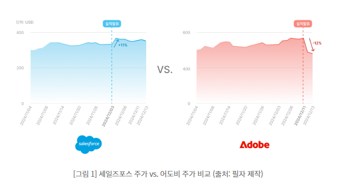

# AI 기능 기획 및 ROI 검토

AI를 넣을지, 어떻게 넣을지, 넣을 가치가 있는지 판단하는 방법

---

## 오늘의 핵심 질문

- 이 문제는 정말 AI로 풀어야 할까?
- AI를 넣으면 사용자 경험이 좋아질까?
- 데이터와 기술 조건은 충분할까?
- 운영 비용보다 기대 효과가 클까?
- 실패했을 때 사용자를 보호할 수 있을까?

---

## AI 기능 기획이 중요한 이유

AI는 강력하지만 모든 문제의 답은 아닙니다.

AI를 넣는다고 서비스가 자동으로 좋아지지는 않습니다.

- 단순 규칙이나 검색이 더 적합할 수 있다
- 데이터가 부족하면 결과 품질이 낮아질 수 있다
- 사용자가 AI 결과를 신뢰하지 않을 수 있다
- 비용과 운영 부담이 예상보다 커질 수 있다

> AI 기획자는 "AI를 넣자"보다  
> **왜 AI가 필요한가**를 설명할 수 있어야 합니다.

---

## AI 기능 기획의 출발점

AI 기능 기획은 기술이 아니라 사용자 문제에서 시작합니다.

| 질문 | 의미 |
|---|---|
| 사용자는 무엇 때문에 불편한가? | 해결해야 할 문제 |
| 기존 방식은 왜 부족한가? | AI가 필요한 이유 |
| AI가 도와줄 판단은 무엇인가? | AI의 역할 |
| 사람이 확인해야 할 부분은 무엇인가? | 책임과 자동화 범위 |

AI 기능은 기술 소개가 아니라 사용자 문제 해결 수단입니다.

---

## AI 적용 가능성 분석이란

AI 적용 가능성 분석은 어떤 문제에 AI를 적용하는 것이 적절한지 판단하는 과정입니다.

핵심은 다음 다섯 가지입니다.

- 문제 적합성
- 사용자 가치
- 데이터와 맥락
- 결과 검증 가능성
- 실패 위험

적용 가능성은 "할 수 있나"보다 먼저  
**해야 할 이유가 있나**를 묻는 과정입니다.

---

## AI가 잘 맞는 일

AI는 많은 정보를 바탕으로 판단을 보조하거나 결과 후보를 만들 때 유용합니다.

| 유형 | 예시 |
|---|---|
| 요약 | 긴 문서의 핵심 내용 정리 |
| 분류 | 문의 내용을 유형별로 나누기 |
| 추천 | 조건에 맞는 후보 제안 |
| 생성 | 답변, 문장, 초안 만들기 |
| 질의응답 | 문서나 데이터 기반 질문에 답하기 |

AI는 정답 하나를 찾는 문제보다  
맥락에 맞는 판단을 돕는 문제에 더 잘 맞습니다.

---

## AI가 꼭 필요하지 않은 일

다음 상황에서는 AI보다 단순한 방식이 더 나을 수 있습니다.

| 상황 | 더 적절한 방식 |
|---|---|
| 기준이 명확한 계산 | 공식, 규칙, 계산식 |
| 정확한 항목 찾기 | 검색, 필터, 정렬 |
| 변하지 않는 안내 | FAQ, 고정 문구 |
| 단순 승인 절차 | 조건문, 체크리스트 |
| 책임이 큰 최종 판단 | 전문가 검토, 사람 승인 |

AI를 쓰지 않는 결정도 좋은 기획입니다.

---

## 기준 1: 문제 적합성

AI가 필요한 문제인지 먼저 봅니다.

판단 질문:

- 사용자가 정보가 많아서 판단하기 어려워하는가?
- 사용자의 상황에 따라 답이 달라지는가?
- 단순 검색보다 요약, 해석, 추천이 필요한가?
- 반복적으로 같은 판단을 해야 하는가?

문제가 모호하면 AI 기능도 모호해집니다.

---

## 기준 2: 사용자 가치

AI 기능은 사용자에게 분명한 이익을 줘야 합니다.

| 사용자 가치 | 질문 |
|---|---|
| 시간 절약 | 탐색이나 작성 시간이 줄어드는가? |
| 판단 보조 | 더 나은 선택을 하게 돕는가? |
| 개인화 | 사용자의 조건에 맞는 결과를 주는가? |
| 이해 향상 | 복잡한 정보를 쉽게 설명하는가? |
| 신뢰 형성 | 이유와 근거를 보여 주는가? |

AI 기능의 가치는 기술이 아니라 사용자의 전후 변화로 판단합니다.

---

## 기준 3: 데이터와 맥락

AI가 좋은 결과를 내려면 적절한 정보가 필요합니다.

확인할 질문:

- AI가 참고할 데이터가 있는가?
- 데이터가 최신이고 신뢰할 만한가?
- 사용자의 입력만으로 충분한가?
- 근거 문서나 상품 정보가 필요한가?
- 개인정보나 민감 정보를 다루는가?

AI는 빈 공간에서 마법처럼 답을 만드는 것이 아닙니다.

---

## 기준 4: 결과 검증 가능성

AI 결과는 "그럴듯함"만으로 판단하면 안 됩니다.

| 검증 기준 | 질문 |
|---|---|
| 정확성 | 틀린 정보가 없는가? |
| 관련성 | 사용자 조건에 맞는가? |
| 일관성 | 비슷한 조건에서 품질이 유지되는가? |
| 설명 가능성 | 왜 그런 결과인지 이해되는가? |
| 안전성 | 위험하거나 부적절한 답을 피하는가? |

측정할 수 없는 AI 기능은 개선하기 어렵습니다.

---

## 기준 5: 실패 위험

AI는 틀릴 수 있습니다.

그래서 실패했을 때의 영향도 함께 봐야 합니다.

- 추천이 부정확하면 사용자가 잘못 선택할 수 있다
- 답변이 과장되면 서비스 신뢰가 낮아진다
- 민감한 조언을 단정하면 안전 문제가 생길 수 있다
- 개인정보가 노출되면 법적 문제가 생길 수 있다
- 오류 후 회복 흐름이 없으면 사용자가 이탈한다

AI 기능은 성공 가능성만이 아니라 실패 비용도 함께 봐야 합니다.

---

## AI 적용 가능성 점검표

AI 기능 후보는 다음 질문으로 빠르게 점검할 수 있습니다.

| 기준 | 확인 질문 |
|---|---|
| 문제 강도 | 반복적이고 중요한 불편인가? |
| AI 적합성 | 규칙보다 AI가 더 나은가? |
| 데이터 준비도 | 참고할 데이터가 충분한가? |
| 검증 가능성 | 품질을 평가할 기준이 있는가? |
| 위험도 | 실패해도 회복할 수 있는가? |
| 비용 효과 | 비용보다 기대 효과가 큰가? |

낮은 항목은 제외가 아니라 보완 계획의 대상입니다.

---

## AI 기능 유형별 기획 포인트

같은 AI라도 기능 유형에 따라 봐야 할 포인트가 다릅니다.

| 기능 유형 | 기획 포인트 |
|---|---|
| 챗봇 | 답변 범위, 근거, 실패 대응 |
| 추천 | 추천 기준, 제외 조건, 이유 설명 |
| 요약 | 누락 위험, 핵심성, 원문 범위 |
| 분류 | 분류 기준, 애매한 사례 처리 |
| 에이전트 | 작업 권한, 실행 전 확인, 실패 복구 |

기능 이름보다 중요한 것은 AI가 맡는 역할입니다.

---

## 자동화 수준 정하기

AI 기능은 모두 자동으로 처리할 필요가 없습니다.

| 수준 | 설명 | 예시 |
|---|---|---|
| 보조 | AI가 후보나 초안을 제안 | 추천 후보 제시 |
| 반자동 | 사람이 확인 후 적용 | 상담 답변 초안 검토 |
| 자동 | AI가 바로 실행 | 조건에 맞는 알림 발송 |
| 제한 자동 | 낮은 위험에서만 자동 처리 | 정해진 범위의 반복 응답 |

위험이 클수록 사람의 확인 단계를 남기는 것이 좋습니다.

---

## 기술적 타당성이란

기술적 타당성은 기획한 AI 기능을 실제 서비스에서 구현하고 운영할 수 있는지 판단하는 것입니다.

AI 기획자도 다음을 이해해야 합니다.

- 어떤 데이터가 필요한가
- 어떤 AI 모델이나 서비스가 필요한가
- 서비스 흐름에 어떻게 연결되는가
- 응답 속도는 사용자가 받아들일 수 있는가
- 비용과 품질 관리는 가능한가

기술적 타당성은 "가능/불가능"보다  
**어떤 조건에서 가능한가**를 찾는 과정입니다.

---

## 기술적 타당성의 주요 항목

| 항목 | 확인 질문 |
|---|---|
| 데이터 | 필요한 데이터가 있고 사용할 수 있는가? |
| 모델 | 해당 작업에 적합한 모델이 있는가? |
| 통합 | 기존 서비스 흐름에 연결할 수 있는가? |
| 속도 | 사용자가 기다릴 만한가? |
| 품질 | 결과를 평가하고 개선할 수 있는가? |
| 보안 | 민감 정보가 안전하게 처리되는가? |
| 운영 | 비용과 오류를 지속 관리할 수 있는가? |

기술 검토는 기획을 현실로 옮기는 조건을 확인하는 일입니다.

---

## 데이터와 모델 타당성

데이터와 모델은 AI 기능 품질을 좌우합니다.

확인할 질문:

- 데이터가 실제로 존재하고 신뢰할 수 있는가?
- 최신성이 중요한 데이터인가?
- 사용 권한과 개인정보 문제는 없는가?
- 한국어 품질이 충분한 모델인가?
- 필요한 맥락을 충분히 넣을 수 있는가?
- 답변 형식과 금지 범위를 제어할 수 있는가?

데이터가 부족하면 AI 기능보다 데이터 확보 전략이 먼저입니다.

---

## API형 AI와 자체 운영 AI

AI를 사용하는 방식도 타당성에 영향을 줍니다.

| 구분 | 장점 | 주의할 점 |
|---|---|---|
| API형 AI | 빠른 도입, 운영 부담 낮음 | 사용량 비용, 외부 전송, 의존성 |
| 자체 운영 AI | 데이터 통제, 커스터마이징 | 서버 비용, 운영 난이도, 성능 관리 |

초기 서비스는 API형으로 빠르게 검증하고,  
민감 데이터나 비용 규모가 커질 때 자체 운영을 검토할 수 있습니다.

---

## 서비스 통합 타당성

AI 기능은 모델 호출만으로 완성되지 않습니다.

서비스 흐름 안에서 연결되어야 합니다.

- AI 기능이 어느 화면에서 시작되는가?
- 사용자 입력은 어디서 받는가?
- AI 결과는 어디에 표시되는가?
- 결과를 저장하거나 수정할 수 있는가?
- 실패했을 때 다시 시도할 수 있는가?
- 운영자가 품질을 확인할 수 있는가?

AI 기능은 서비스 경험의 일부입니다.

---

## 품질과 운영 타당성

AI 기능은 출시 후에도 계속 관리해야 합니다.

기획 단계에서 다음을 생각해야 합니다.

- 좋은 답변의 기준은 무엇인가?
- 나쁜 답변은 어떻게 발견하는가?
- 사용자 신고나 피드백을 받을 수 있는가?
- 위험한 답변을 막는 기준이 있는가?
- 사용량 증가에 따른 비용을 감당할 수 있는가?
- 오류가 났을 때 누가 확인하는가?

운영이 불가능한 AI 기능은 장기적으로 서비스 품질을 떨어뜨립니다.

---

## 기술적 타당성 판단

검토 결과는 가능/불가능만으로 나누지 않아도 됩니다.

| 판단 | 의미 |
|---|---|
| 바로 가능 | 데이터, 모델, 흐름이 충분히 준비됨 |
| 조건부 가능 | 일부 보완 후 가능 |
| 검증 필요 | 작은 프로토타입으로 먼저 확인 |
| 보류 | 현재 조건에서는 위험이나 비용이 큼 |
| 제외 | AI보다 다른 방식이 적합함 |

현실적인 판단은 다음 행동을 정하게 해 줍니다.

---
# [ROI란 무엇인가](https://www.samsungsds.com/kr/insights/the-importance-of-roi-in-ai-projects.html)

ROI는 Return on Investment의 약자입니다.

AI 기능에서는 다음 질문을 뜻합니다.

> AI 기능을 만들고 운영하는 비용보다  
> 사용자 가치와 비즈니스 효과가 더 큰가?

ROI는 돈만 보는 것이 아닙니다.  
시간 절약, 만족도, 품질 개선, 위험 감소도 함께 봅니다.

---

## AI 프로젝트에서 ROI가 더 중요한 이유

AI 프로젝트는 일반 기능보다 비용과 불확실성이 큽니다.

- 모델 사용 비용이 계속 발생할 수 있다
- 데이터 준비와 품질 관리가 필요하다
- 결과가 틀릴 수 있어 운영 리스크가 있다
- 사용자가 신뢰하지 않으면 효과가 낮아진다

그래서 AI 프로젝트는 "기술이 된다"만으로 충분하지 않습니다.  
**투자한 만큼 실제 가치가 생기는지**를 설명해야 합니다.

---

## 같은 매출 성장, 다른 평가

두 기업 모두 AI 기능을 제공하고 매출 성장도 있었지만, 시장 평가는 달랐습니다.

| 구분 | 시장이 본 핵심 |
|---|---|
| 세일즈포스 | AI가 업무 자동화와 생산성 향상으로 이어지는 흐름이 비교적 명확했다 |
| 어도비 | 생성형 AI 기능은 강력했지만 수익화와 투자 대비 효과에 대한 우려가 있었다 |

AI 기능은 기술력뿐 아니라  
**그 기술이 어떻게 돈, 시간, 만족도, 생산성으로 연결되는지** 보여 줘야 합니다.

---

---

## 도입 기업도 ROI에서 자유롭지 않다

AI를 직접 개발하지 않고 도입하는 기업도 ROI를 봐야 합니다.

AI는 사용량이 늘수록 비용이 함께 커질 수 있기 때문입니다.

| 사례 | 배울 점 |
|---|---|
| 와일리 | 고객 서비스에 AI를 적용해 업무 효율과 운영 비용 개선 효과를 만들었다 |
| 맥도날드 | AI 주문 자동화 실험에서 주문 오류와 고객 경험 문제가 커져 테스트를 종료했다 |

AI 도입 성공은 기술 도입 자체가 아니라  
**고객 경험과 업무 성과가 실제로 개선되는가**에 달려 있습니다.

---

---

## ROI를 측정해야 하는 이유 1: 자원 배분

AI 프로젝트는 시간, 예산, 인력이 많이 들어갑니다.

ROI를 보면 다음 판단이 쉬워집니다.

- 어떤 AI 기능에 먼저 투자할지
- 어떤 기능은 범위를 줄일지
- 어떤 기능은 보류할지
- 어떤 프로젝트가 가장 큰 가치를 만드는지

ROI는 비용을 줄이기 위한 도구가 아니라  
**중요한 곳에 자원을 집중하기 위한 기준**입니다.

---

## ROI를 측정해야 하는 이유 2: 리스크 관리

AI 프로젝트는 기대 효과뿐 아니라 위험도 함께 봐야 합니다.

- 결과가 틀릴 위험
- 데이터 품질 문제
- 고객 경험 악화
- 운영 비용 증가
- 개인정보와 보안 이슈

ROI를 측정하면 AI 기능이 비용 대비 효과를 내고 있는지,  
예상하지 못한 위험을 만들고 있지는 않은지 확인할 수 있습니다.

---

## ROI를 측정해야 하는 이유 3: 신뢰 확보

AI 프로젝트는 단기 재무 성과가 바로 보이지 않을 수 있습니다.

그래서 이해관계자에게 다음을 설명해야 합니다.

- 어떤 문제가 개선되었는가
- 사용자는 어떤 가치를 얻었는가
- 업무 효율은 얼마나 좋아졌는가
- 고객 만족도는 개선되었는가
- 앞으로 더 투자할 이유가 있는가

ROI는 AI 프로젝트가 실제 가치를 만든다는 근거가 됩니다.

---

## AI ROI를 높이기 위한 준비

| 준비 요소 | 기획자가 볼 질문 |
|---|---|
| 데이터 정의와 선별 | AI에 필요한 데이터가 무엇인지 정했는가? |
| 전략 목표와 정렬 | AI 기능이 서비스 목표와 연결되는가? |
| 단계적 구현과 KPI | 작은 범위로 검증하고 측정 지표를 정했는가? |

AI ROI는 출시 후 계산하는 숫자가 아니라  
기획 단계부터 준비해야 하는 판단 기준입니다.

---

## 데이터는 많을수록 좋은가

AI 프로젝트에서 데이터는 많기만 해서는 충분하지 않습니다.

중요한 것은 목적에 맞는 데이터입니다.

- 어떤 데이터를 쓸지 정의한다
- 불필요한 데이터는 제외한다
- 데이터 품질과 출처를 확인한다
- 민감 정보 사용 여부를 점검한다
- AI가 이해할 수 있게 분류하거나 정리한다

데이터가 정리되지 않으면 AI 품질도 ROI도 흔들립니다.

---

## 목표와 KPI를 먼저 정한다

ROI를 측정하려면 먼저 목표와 KPI가 있어야 합니다.

예를 들어 AI 챗봇이라면 다음처럼 볼 수 있습니다.

| 목표 | KPI 예시 |
|---|---|
| 상담 업무 감소 | 상담원 연결 비율 감소 |
| 사용자 문제 해결 | 답변 후 문제 해결률 |
| 고객 만족 향상 | CSAT, NPS |
| 처리 속도 개선 | 평균 응답 시간 |
| 운영 비용 절감 | 문의 1건당 처리 비용 |

KPI가 없으면 AI가 좋아졌는지 나빠졌는지 말하기 어렵습니다.

---

## ROI 측정의 핵심 구성

AI ROI를 볼 때는 세 가지를 함께 정리합니다.

| 구성 | 질문 |
|---|---|
| 비즈니스 과제와 목표 | 어떤 문제를 해결하려는가? |
| 적합한 솔루션 | AI가 그 문제에 맞는 해결 방식인가? |
| 기대 효과 | 정량적, 정성적 효과가 무엇인가? |

즉, ROI는 단순 계산식이 아니라  
문제, 해결책, 효과를 연결하는 설명 구조입니다.

---

## 정량 효과와 정성 효과

AI의 효과는 숫자로 보이는 것과 숫자로 바로 보이지 않는 것이 함께 있습니다.

| 구분 | 예시 |
|---|---|
| 정량 효과 | 처리 시간 감소, 문의 감소, 전환율 증가, 비용 절감 |
| 정성 효과 | 고객 만족, 브랜드 신뢰, 사용 편의성, 직원 만족 |

정량 효과만 보면 사용자 경험을 놓칠 수 있고,  
정성 효과만 보면 투자 판단이 흐려질 수 있습니다.

둘을 함께 봐야 합니다.

---

## AI ROI 측정 흐름

강의에서는 ROI 측정을 다음 흐름으로 이해하면 됩니다.

1. 목표와 KPI를 정한다
2. 현재 기준선을 확인한다
3. 기대되는 수익 증가나 비용 절감을 추정한다
4. 데이터, 개발, 운영 비용을 계산한다
5. 정성적 효과도 함께 정리한다
6. 단기 효과와 장기 효과를 나누어 본다
7. 정기적으로 결과를 다시 검토한다

ROI는 한 번 계산하고 끝나는 숫자가 아니라  
계속 조정하는 관리 기준입니다.

---

## 기준선이 필요한 이유

AI 도입 후 좋아졌는지 알려면 도입 전 상태를 알아야 합니다.

예를 들어:

- 현재 문의 처리 시간은 얼마인가?
- 사용자는 어디서 가장 많이 이탈하는가?
- 상담원 연결 비율은 얼마인가?
- 추천 결과 선택률은 얼마인가?
- 고객 만족도는 어느 수준인가?

기준선이 없으면 AI의 효과를 설명하기 어렵습니다.

---

## AI를 도입하지 않을 때의 비용

ROI는 AI 도입 비용만 보는 것이 아닙니다.

도입하지 않을 때 생기는 비용도 함께 봐야 합니다.

- 반복 업무가 계속 늘어난다
- 고객 응대 속도가 느려진다
- 개인화 경험을 제공하지 못한다
- 경쟁 서비스보다 편의성이 낮아진다
- 운영 인력이 계속 추가로 필요하다

AI를 도입하지 않는 선택도 비용과 위험을 가질 수 있습니다.

---

## AI 기획자의 ROI 설명 방식

AI 기능을 제안할 때는 다음 문장 구조로 설명하면 좋습니다.

> 이 AI 기능은 [사용자 문제]를 줄이기 위해 필요합니다.  
> 현재는 [기존 방식의 한계]가 있고,  
> AI를 적용하면 [정량 효과]와 [정성 효과]를 기대할 수 있습니다.  
> 다만 [비용과 위험]이 있으므로,  
> 먼저 [작은 범위]에서 [KPI]로 검증하겠습니다.

ROI는 숫자만이 아니라 설득 가능한 기획 논리입니다.

---

## 오늘의 ROI 정리

- AI 프로젝트는 비용, 데이터, 품질, 운영 리스크가 크기 때문에 ROI가 중요하다
- ROI는 투자 대비 돈만 보는 것이 아니라 시간, 품질, 만족도, 신뢰까지 함께 본다
- 데이터 정의, 전략 목표 정렬, 단계적 구현, KPI 설정이 ROI의 출발점이다
- 정량 효과와 정성 효과를 함께 봐야 AI의 실제 가치를 설명할 수 있다
- AI 기획자는 "AI를 넣는다"보다 "왜 투자할 가치가 있는가"를 설명해야 한다

