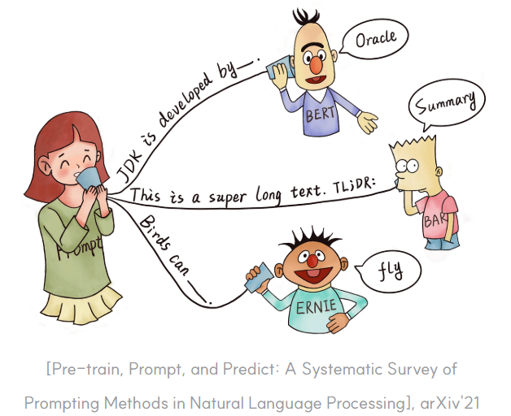
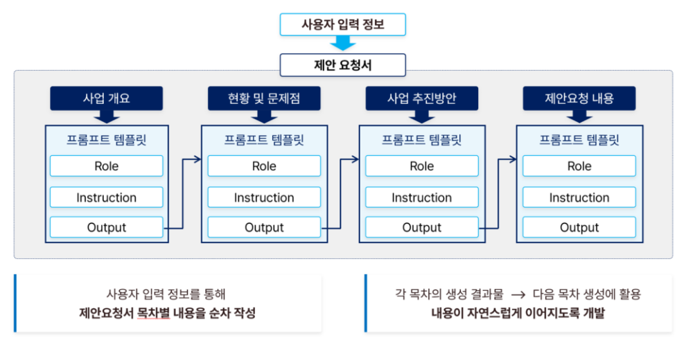

# 프롬프트 설계와 AI 기능 정의

AI가 서비스 안에서 어떤 역할을 해야 하는지 문장으로 설계하는 방법

---

## 오늘의 핵심 질문

- 프롬프트는 단순한 질문과 무엇이 다를까?
- AI에게 어떤 역할과 기준을 알려줘야 할까?
- System Prompt와 User Prompt는 어떻게 다를까?
- 좋은 답변을 얻으려면 어떤 정보를 함께 줘야 할까?
- 프롬프트 설계서는 어떤 항목으로 작성해야 할까?

---
# [프롬프트란 무엇인가](https://codingsmu.tistory.com/162)

프롬프트는 AI에게 주는 지시와 맥락입니다.

단순히 질문 한 문장이 아니라 다음을 포함할 수 있습니다.

- AI의 역할
- 사용자의 요청
- 참고해야 할 정보
- 지켜야 할 규칙
- 답변 형식
- 하지 말아야 할 행동
- 예외 상황에서의 안내

프롬프트는 AI 기능의 동작 방식을 설명하는 기획 문장입니다.

---


---

## 프롬프트가 중요한 이유

AI 기능은 모델만으로 완성되지 않습니다.

같은 모델을 써도 프롬프트에 따라 결과가 크게 달라질 수 있습니다.

- 답변의 말투가 달라진다
- 포함하는 정보가 달라진다
- 결과 형식이 달라진다
- 지켜야 할 규칙이 달라진다
- 사용자가 느끼는 신뢰가 달라진다

AI 기획자는 AI에게 무엇을 시킬지뿐 아니라  
**어떤 기준으로 답하게 할지** 정의해야 합니다.

---

## [Prompt Engineering이란](https://tech.hancom.com/%ED%94%84%EB%A1%AC%ED%94%84%ED%8A%B8-%EC%97%94%EC%A7%80%EB%8B%88%EC%96%B4%EB%A7%81%EC%9D%B4%EB%9E%80-%EB%B6%80%EC%A0%9C-2024-%EC%84%9C%EC%9A%B8-%ED%94%84%EB%A1%AC%ED%94%84%ED%86%A4/)

Prompt Engineering은 AI가 원하는 방향으로 답하도록 지시, 맥락, 형식을 설계하는 방법입니다.

여기서 중요한 것은 "AI를 속이는 문장"이 아닙니다.

핵심은 다음 세 가지입니다.

- 무엇을 해야 하는지 분명히 말한다
- 어떤 기준으로 해야 하는지 알려준다
- 어떤 형식으로 답해야 하는지 정한다

좋은 프롬프트는 AI가 추측해야 할 부분을 줄입니다.

---
> 예시: 프롬프트 구성 및 아키텍처



---

## 좋은 프롬프트의 기본 요소

| 요소 | 질문 |
|---|---|
| 역할 | AI는 어떤 역할로 답해야 하는가? |
| 목표 | 사용자가 얻고 싶은 결과는 무엇인가? |
| 맥락 | 어떤 배경 정보가 필요한가? |
| 규칙 | 반드시 지켜야 할 기준은 무엇인가? |
| 형식 | 어떤 구조로 답해야 하는가? |
| 제한 | 하지 말아야 할 것은 무엇인가? |

프롬프트는 길게 쓰는 것이 아니라 필요한 정보를 빠뜨리지 않는 것이 중요합니다.

---

## 나쁜 프롬프트와 좋은 프롬프트

나쁜 예시:

> 건강식 추천해줘.

좋은 예시:

> 너는 건강식 추천 도우미야.  
> 사용자의 알레르기와 선호 음식을 반영해 점심 메뉴 3개를 추천해줘.  
> 각 메뉴마다 추천 이유와 주의할 재료를 함께 써줘.  
> 의학적 진단처럼 단정하지 말고 일반적인 식단 선택 도움으로 안내해줘.

좋은 프롬프트는 역할, 조건, 형식, 제한을 함께 알려줍니다.

---

## Prompt Engineering의 기본 원칙

프롬프트를 설계할 때는 다음 원칙을 기억합니다.

- 모호한 표현보다 구체적인 표현을 쓴다
- AI의 역할을 분명히 정한다
- 사용자의 입력 조건을 알려준다
- 답변 형식을 미리 정한다
- 금지해야 할 답변을 명확히 한다
- 결과가 틀릴 수 있는 상황을 고려한다

AI에게 "잘해줘"라고 말하는 것보다  
좋은 답변의 기준을 알려주는 것이 중요합니다.

---

## 프롬프트는 기능 정의와 연결된다

프롬프트는 별도의 문장이 아니라 AI 기능 정의의 일부입니다.

| 기능 정의 | 프롬프트에서 정해야 할 것 |
|---|---|
| 사용자 문제 | 어떤 상황의 사용자에게 답하는가 |
| AI 역할 | 추천, 요약, 상담, 분류 중 무엇을 하는가 |
| 입력 정보 | 어떤 정보를 받아야 하는가 |
| 결과 형식 | 어떤 구조로 답해야 하는가 |
| 예외 처리 | 답할 수 없을 때 어떻게 안내하는가 |

AI 기능을 기획한다는 것은 프롬프트의 기준을 정한다는 뜻이기도 합니다.

---

## System Prompt란 무엇인가

System Prompt는 AI 기능의 기본 규칙을 정하는 프롬프트입니다.

서비스 안에서 AI가 항상 지켜야 할 기준을 담습니다.

---
예를 들어:

- AI의 역할
- 답변 말투
- 답변 범위
- 금지해야 할 내용
- 안전 기준
- 출력 형식
- 모르는 경우의 대응

System Prompt는 사용자가 매번 입력하지 않아도 유지되어야 하는 서비스 규칙에 가깝습니다.

---

## System Prompt에 넣기 좋은 내용

System Prompt에는 변하지 않는 기준을 넣습니다.

| 항목 | 예시 |
|---|---|
| 역할 | 너는 건강기능식품 추천을 돕는 AI 상담 도우미다 |
| 범위 | 일반적인 정보 제공과 선택 보조만 한다 |
| 제한 | 질병 진단이나 치료 효과를 단정하지 않는다 |
| 말투 | 초보자도 이해할 수 있게 쉽게 설명한다 |
| 형식 | 추천 이유, 주의사항, 다음 행동을 나누어 답한다 |
| 예외 | 정보가 부족하면 추가 질문을 한다 |

System Prompt는 AI 기능의 운영 원칙을 담습니다.

---

## User Prompt란 무엇인가

User Prompt는 사용자가 실제로 입력하는 요청입니다.

사용자의 상황, 질문, 조건이 들어갑니다.

예를 들어:

> 저는 카페인을 피하고 싶고, 점심 이후에 피곤함이 심해요.  
> 비타민이나 영양제를 추천받고 싶어요.

User Prompt는 매번 달라질 수 있습니다.

그래서 System Prompt가 기본 기준을 잡고,  
User Prompt가 개별 상황을 전달합니다.

---

## System Prompt와 User Prompt의 차이

| 구분 | System Prompt | User Prompt |
|---|---|---|
| 역할 | AI의 기본 규칙 | 사용자의 개별 요청 |
| 작성 주체 | 서비스 기획자와 운영자 | 사용자 |
| 변화 | 비교적 고정 | 매번 달라짐 |
| 내용 | 역할, 말투, 제한, 형식 | 질문, 조건, 상황 |
| 목적 | 서비스 품질 유지 | 사용자 문제 전달 |

두 프롬프트가 잘 맞아야 AI 기능이 안정적으로 작동합니다.

---

## System Prompt 예시

건강 추천 서비스의 System Prompt는 다음처럼 설계할 수 있습니다.

```text
너는 건강한 식단 선택을 돕는 AI 도우미다.
사용자의 조건을 반영해 일반적인 식단 정보를 제공한다.
질병 진단, 치료 효과, 의학적 확정 표현은 하지 않는다.
추천할 때는 이유와 주의사항을 함께 설명한다.
정보가 부족하면 바로 추천하지 말고 필요한 정보를 질문한다.
답변은 쉬운 한국어로 작성한다.
```

핵심은 AI의 역할과 책임 범위를 분명히 하는 것입니다.

---

## User Prompt 예시

같은 서비스에서 사용자는 다음처럼 요청할 수 있습니다.

```text
오늘 점심 메뉴를 추천해줘.
매운 음식은 피하고 싶고, 견과류 알레르기가 있어.
예산은 1만 원 이하였으면 좋겠어.
```

이 User Prompt에는 사용자의 조건이 들어 있습니다.

AI는 System Prompt의 기준 안에서  
User Prompt의 조건을 반영해 답해야 합니다.

---

## 프롬프트에 넣어야 할 맥락

AI가 좋은 답을 하려면 충분한 맥락이 필요합니다.

| 맥락 종류 | 예시 |
|---|---|
| 사용자 정보 | 알레르기, 선호, 예산, 목표 |
| 서비스 정보 | 추천 가능한 상품, 메뉴, 정책 |
| 상황 정보 | 시간, 목적, 사용 장소 |
| 제한 조건 | 금지 표현, 제외 대상, 답변 범위 |
| 출력 기준 | 표, 목록, 짧은 요약, 단계별 안내 |

맥락이 부족하면 AI는 추측으로 답할 가능성이 커집니다.

---

## 답변 형식을 정해야 하는 이유

답변 형식이 없으면 AI 결과가 매번 달라질 수 있습니다.

예를 들어 추천 기능에서는 다음 형식을 정할 수 있습니다.

| 항목 | 설명 |
|---|---|
| 추천 결과 | 사용자가 선택할 후보 |
| 추천 이유 | 왜 이 결과가 적절한지 |
| 주의사항 | 조심해야 할 조건 |
| 다음 행동 | 수정, 저장, 다시 추천 등 |

형식은 사용자 경험을 안정적으로 만듭니다.

---

## 금지 조건도 설계해야 한다

프롬프트는 해야 할 일뿐 아니라 하지 말아야 할 일도 정해야 합니다.

예를 들어:

- 의학적 진단처럼 단정하지 않는다
- 근거 없는 효능을 말하지 않는다
- 사용자의 민감 정보를 불필요하게 반복하지 않는다
- 모르는 내용을 확신하듯 말하지 않는다
- 서비스 범위를 벗어난 요청은 안전하게 거절한다

금지 조건은 AI 기능의 신뢰와 안전을 지키는 장치입니다.

---

## 프롬프트 설계서란 무엇인가

프롬프트 설계서는 AI 기능에 사용할 프롬프트의 목적, 구조, 규칙을 정리한 문서입니다.

프롬프트 설계서는 다음을 위해 필요합니다.

- AI 기능의 역할을 팀이 함께 이해한다
- 답변 품질 기준을 명확히 한다
- 개발자와 디자이너가 같은 기준으로 구현한다
- 테스트할 질문과 기대 답변을 준비한다
- 운영 중 수정 이력을 관리한다

프롬프트 설계서는 AI 기능의 요구사항 문서입니다.

---

## 프롬프트 설계서의 기본 항목

| 항목 | 작성 내용 |
|---|---|
| 기능명 | 어떤 AI 기능인가 |
| 사용자 상황 | 누가 어떤 문제로 사용하는가 |
| AI 역할 | AI가 맡을 일 |

---
| 항목 | 작성 내용 |
|---|---|
| 입력 정보 | 사용자가 제공해야 할 정보 |
| System Prompt | 기본 역할과 규칙 |
| User Prompt 예시 | 사용자가 입력할 수 있는 요청 |
| 출력 형식 | 답변 구조 |
| 예외 처리 | 정보 부족, 범위 초과, 오류 대응 |
| 품질 기준 | 좋은 답변과 나쁜 답변의 기준 |

처음부터 완벽할 필요는 없지만, 판단 기준은 보여야 합니다.

---

## 기능명과 사용자 상황

프롬프트 설계서는 먼저 어떤 문제를 푸는지 분명히 해야 합니다.

예시:

| 항목 | 내용 |
|---|---|
| 기능명 | 건강 식단 추천 AI |
| 핵심 사용자 | 점심 메뉴를 빠르게 고르고 싶은 직장인 |
| 사용 상황 | 점심시간 전, 알레르기와 선호를 반영한 메뉴가 필요함 |
| 사용자 목표 | 안전하고 부담 없는 식사 후보를 빠르게 선택 |

AI 기능은 사용자 상황이 선명할수록 프롬프트도 선명해집니다.

---

## AI 역할과 입력 정보

AI가 무엇을 받아 무엇을 해야 하는지 정리합니다.

| 항목 | 예시 |
|---|---|
| AI 역할 | 조건에 맞는 식단 후보를 추천하고 이유를 설명한다 |
| 필수 입력 | 알레르기, 선호 음식, 제외 음식 |
| 선택 입력 | 예산, 식사 시간, 건강 목표 |
| 참고 정보 | 추천 가능한 메뉴 목록, 주의 재료 |

입력 정보가 부족하면 AI는 정확한 결과를 내기 어렵습니다.

---

## 출력 형식 정의

답변 형식은 사용자 화면과 연결됩니다.

예시:

```text
1. 추천 메뉴
2. 추천 이유
3. 주의할 재료
4. 다른 선택지가 필요한 경우
```

출력 형식이 정해지면 화면 설계, 오류 메시지, 테스트 기준도 더 명확해집니다.

---

## 예외 처리 정의

프롬프트 설계서에는 답할 수 없는 상황도 포함해야 합니다.

| 상황 | AI 대응 |
|---|---|
| 필수 정보 부족 | 추가 질문을 한다 |
| 조건에 맞는 결과 없음 | 조건 완화 방법을 제안한다 |
| 위험한 요청 | 답변 범위를 제한하고 안전한 대안을 안내한다 |
| 근거 부족 | 확정적으로 말하지 않고 확인 필요성을 알린다 |

예외 처리가 있어야 AI 기능이 실제 서비스에서 안전하게 작동합니다.

---

## 품질 기준 정의

좋은 답변과 나쁜 답변의 기준을 미리 정합니다.

---
좋은 답변:

- 사용자 조건을 반영한다
- 추천 이유가 이해된다
- 주의사항을 빠뜨리지 않는다
- 과장하거나 단정하지 않는다
- 다음 행동을 안내한다

---
나쁜 답변:

- 조건을 무시한다
- 근거 없이 확신한다
- 너무 길거나 모호하다
- 위험한 표현을 사용한다

---

## 프롬프트 설계에서 흔한 실수

다음 실수를 조심해야 합니다.

- AI 역할을 너무 넓게 정한다
- 사용자 입력 조건을 충분히 정의하지 않는다
- 답변 형식을 정하지 않는다
- 금지해야 할 표현을 빠뜨린다
- 예외 상황을 생각하지 않는다
- 한두 개 예시만 보고 품질이 좋다고 판단한다
- 프롬프트 수정 이력을 관리하지 않는다

프롬프트는 한 번에 완성되는 문장이 아니라 계속 개선되는 설계입니다.

---

## AI 기획자의 점검 질문

프롬프트 설계서를 볼 때 다음을 확인합니다.

- 이 프롬프트는 어떤 사용자 문제를 해결하는가?
- AI의 역할과 책임 범위가 분명한가?
- 사용자가 제공해야 할 정보가 명확한가?
- 결과 형식이 화면에 사용하기 좋은가?
- 정보 부족이나 위험 요청에 대한 대응이 있는가?
- 좋은 답변과 나쁜 답변의 기준이 있는가?

이 질문에 답할 수 있어야 AI 기능이 안정적으로 정의됩니다.

---

## 오늘의 정리

- Prompt Engineering은 AI가 원하는 방향으로 답하도록 역할, 맥락, 규칙, 형식을 설계하는 일이다
- System Prompt는 서비스가 항상 지켜야 할 AI의 기본 규칙이다
- User Prompt는 사용자가 매번 입력하는 개별 요청과 조건이다
- 프롬프트 설계서는 AI 기능의 목적, 입력, 출력, 예외, 품질 기준을 정리한 문서다
- 좋은 프롬프트는 AI에게 더 많은 말을 하는 것이 아니라 더 명확한 기준을 주는 것이다

---

## 마지막으로 기억할 문장

프롬프트는 AI에게 던지는 질문이 아니라  
서비스가 AI에게 맡기는 역할의 정의입니다.

**AI가 무엇을 해야 하고,  
무엇을 하지 말아야 하며,  
어떤 기준으로 답해야 하는지 정하는 것**이 프롬프트 설계입니다.
