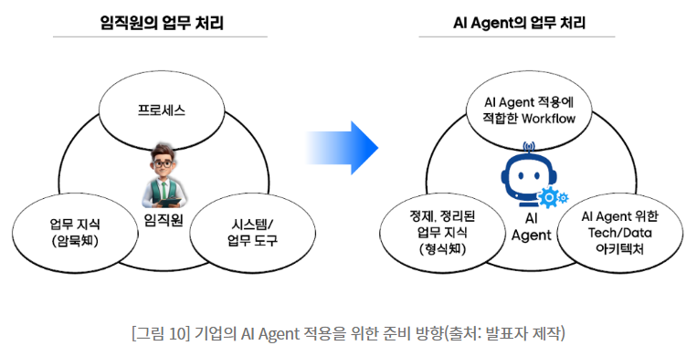
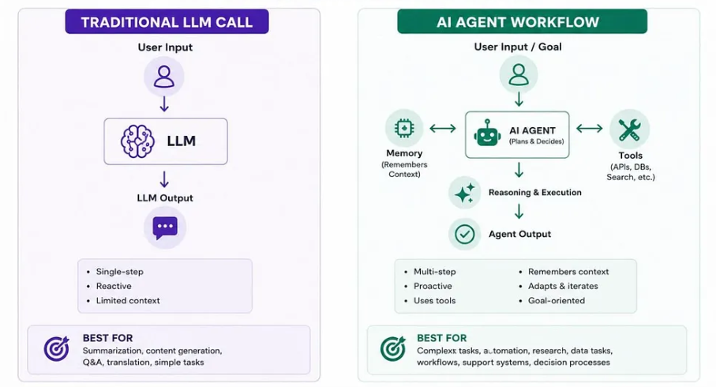
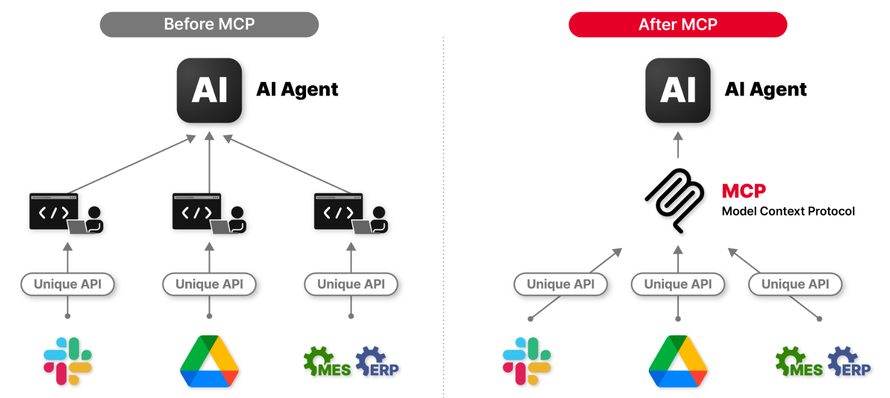

# AI 에이전트 이해 및 서비스 설계

AI가 답변을 넘어 도구를 사용하고 업무 흐름을 수행하는 방식

---

## 오늘의 핵심 질문

- AI Agent는 일반 챗봇과 무엇이 다를까?
- AI가 도구를 사용한다는 것은 어떤 의미일까?
- Tool Calling과 MCP는 어떤 역할을 할까?
- AI가 업무를 수행할 때 어디까지 맡겨야 할까?
- Workflow 기반 AI 서비스는 어떻게 설계해야 할까?

---

## AI 서비스의 흐름 변화

초기의 AI 서비스는 주로 질문에 답하는 형태였습니다.

하지만 최근 AI 서비스는 점점 더 많은 일을 합니다.

- 사용자의 요청을 이해한다
- 필요한 정보를 찾는다
- 외부 도구를 호출한다
- 여러 단계를 순서대로 처리한다
- 결과를 요약하고 다음 행동을 제안한다

즉, AI는 "답변 생성기"에서  
**업무 수행을 돕는 실행형 서비스 구성 요소**로 확장되고 있습니다.

---

## [AI Agent란 무엇인가](https://www.samsungsds.com/kr/insights/ai-agents-insight-and-actions.html)

일반적인 챗봇이 "질문에 답하는 역할"에 가깝다면, AI Agent는 "목표를 달성하기 위해 여러 단계를 수행하는 역할"에 가깝습니다.

---
예를 들어:

- 사용자의 요청을 이해한다
- 어떤 정보가 필요한지 판단한다
- 필요한 도구를 선택한다
- 결과를 확인한다
- 다음 단계를 이어 간다

AI Agent의 핵심은 **판단 + 도구 사용 + 단계 수행**입니다.

---


---

## [챗봇과 AI Agent의 차이](https://medium.com/@ankit.wadhwa.ost/why-ai-agents-the-real-difference-between-an-llm-call-and-an-ai-agent-0800d120a281)

| 구분 | 일반 챗봇(Only LLM) | AI Agent |
|---|---|---|
| 중심 역할 | 질문에 답변 | 목표 달성을 위한 행동 수행 |
| 정보 사용 | 대화 맥락 중심 | 외부 데이터와 도구 활용 |
| 흐름 | 한 번의 답변 중심 | 여러 단계의 처리 가능 |
| 결과 | 설명, 요약, 안내 | 조회, 생성, 비교, 실행 보조 |
| 설계 초점 | 답변 품질 | 업무 흐름과 책임 범위 |

AI Agent는 더 많은 일을 할 수 있지만, 그만큼 설계 기준도 더 중요합니다.

---


---

## AI Agent가 필요한 상황

AI Agent는 다음과 같은 상황에 적합합니다.

- 사용자의 요청이 여러 단계로 이루어진다
- 외부 데이터 조회가 필요하다
- 도구를 사용해야 답할 수 있다
- 반복 업무를 줄이고 싶다
- 사용자가 매번 절차를 직접 수행하기 어렵다
- 결과를 비교하거나 판단해야 한다

단순한 답변으로 충분하다면 Agent가 필요하지 않을 수 있습니다.

---

## AI Agent가 필요하지 않은 상황

다음 상황에서는 일반 챗봇이나 규칙 기반 기능이 더 적절할 수 있습니다.

- 단순 FAQ 안내
- 고정된 메뉴 선택
- 명확한 계산 결과 제공
- 검색과 필터로 충분한 정보 탐색
- 사용자가 직접 선택하는 것이 더 안전한 업무
- 실패했을 때 위험이 큰 자동 실행

Agent는 강력하지만 복잡합니다.  
복잡한 구조가 사용자 가치로 이어질 때만 도입해야 합니다.

---

## AI Agent의 기본 구성

AI Agent를 설계할 때는 다음 요소를 함께 봅니다.

| 요소 | 설명 |
|---|---|
| 목표 | Agent가 달성해야 할 일 |
| 역할 | 어떤 관점과 책임으로 행동하는가 |
| 입력 | 사용자가 제공하는 요청과 조건 |

---
| 요소 | 설명 |
|---|---|
| 도구 | Agent가 사용할 수 있는 기능 |
| 지식 | 참고할 데이터와 문서 |
| 판단 기준 | 언제 어떤 행동을 선택하는가 |
| 제한 | 하지 말아야 할 행동 |
| 결과 | 사용자에게 어떤 형태로 보여주는가 |

Agent 설계는 AI에게 맡길 업무 범위를 정하는 일입니다.

---

## AI Agent 예시

건강 식단 추천 서비스를 예로 들어 봅니다.

일반 챗봇:

> 사용자가 질문하면 식단 정보를 설명한다.

AI Agent:

> 사용자의 알레르기와 선호 조건을 확인하고,  
> 메뉴 데이터에서 가능한 후보를 찾고,  
> 조건에 맞지 않는 항목을 제외한 뒤,  
> 추천 이유와 주의사항을 정리해 보여 준다.

차이는 답변을 만드는 것에서 끝나는지,  
필요한 절차를 따라 결과를 구성하는지에 있습니다.

---

## Agent 설계에서 가장 중요한 질문

AI Agent를 만들기 전에 먼저 물어야 합니다.

- Agent가 달성해야 할 목표는 무엇인가?
- 사용자는 어떤 상황에서 Agent를 필요로 하는가?
- Agent가 직접 해도 되는 일은 무엇인가?
- 사람 확인이 필요한 일은 무엇인가?
- 어떤 도구와 데이터가 필요한가?
- 실패했을 때 어떻게 회복할 것인가?
- 사용자는 Agent가 한 일을 이해할 수 있는가?

Agent는 똑똑해 보이는 것보다 안전하고 예측 가능해야 합니다.

---

## Tool Calling이란 무엇인가

Tool Calling은 AI 모델이 외부 기능이나 데이터가 필요하다고 판단했을 때, 정해진 도구를 호출하도록 하는 방식입니다.

예를 들어 AI가 다음 일을 할 수 있게 됩니다.

- 날씨 조회
- 데이터베이스 검색
- 문서 검색
...

AI가 모든 지식을 내부에 갖고 있는 것이 아니라,  
필요한 순간에 외부 도구를 사용하도록 만드는 구조입니다.

---

## Tool은 무엇인가

Tool은 AI가 사용할 수 있도록 서비스가 제공하는 기능입니다.

| Tool 예시 | 역할 |
|---|---|
| 상품 검색 | 조건에 맞는 상품 후보 조회 |
| 일정 조회 | 가능한 시간 확인 |
| 계산기 | 정확한 수치 계산 |
| 문서 검색 | 내부 문서나 정책 확인 |
| 데이터베이스 조회 | 최신 정보 가져오기 |
| 알림 발송 | 사용자에게 결과 전달 |

기획자는 AI가 어떤 Tool을 쓸 수 있어야 하는지 정의해야 합니다.

---

## Tool Calling의 기본 흐름

Tool Calling은 보통 다음 흐름으로 이해할 수 있습니다.

```text
사용자 요청
→ AI가 필요한 도구 판단
→ 도구 호출 요청
→ 서비스가 도구 실행
→ 실행 결과를 AI에게 전달
→ AI가 최종 답변 생성
```

중요한 점은 AI가 직접 모든 것을 실행하는 것이 아니라,  
서비스가 정해 둔 도구와 권한 안에서만 행동한다는 것입니다.

---

## Tool Calling이 필요한 이유

AI 모델만으로는 부족한 상황이 있습니다.

- 최신 정보가 필요하다
- 정확한 계산이 필요하다
- 내부 데이터 조회가 필요하다
- 사용자의 계정 상태를 확인해야 한다
- 실제 업무 시스템과 연결해야 한다

Tool Calling은 AI가 더 현실적인 서비스 기능을 수행하게 해 줍니다.

---

## Tool Calling 설계에서 봐야 할 것

AI 기획자는 Tool을 기능 목록처럼만 보면 안 됩니다.

다음 질문을 함께 봐야 합니다.

- 이 Tool은 어떤 사용자 문제를 해결하는가?
- 언제 AI가 이 Tool을 사용해야 하는가?
- Tool을 잘못 쓰면 어떤 위험이 있는가?
- 실행 전 사용자 확인이 필요한가?
- Tool 실행 결과를 어떻게 보여 줄 것인가?
- 실패했을 때 어떤 안내가 필요한가?

Tool은 AI 기능의 능력이자 동시에 위험 지점입니다.

---

## Tool 권한 설계

모든 Tool을 AI에게 자유롭게 열어 주면 위험할 수 있습니다.

권한 수준을 나누어 생각합니다.

| 권한 수준 | 예시 | 설계 포인트 |
|---|---|---|
| 조회 | 상품 검색, 일정 확인 | 비교적 낮은 위험 |
| 생성 | 문서 초안, 추천 결과 작성 | 검토와 수정 필요 |
| 변경 | 예약 변경, 데이터 수정 | 사용자 확인 필요 |
| 실행 | 결제, 발송, 삭제 | 강한 제한과 승인 필요 |

AI가 할 수 있는 일보다  
AI가 해도 되는 일을 먼저 정해야 합니다.

---
# [MCP란 무엇인가](https://ahha.ai/2025/04/14/mcp/)

MCP는 Model Context Protocol의 약자입니다.

---
AI 애플리케이션이 외부 시스템, 데이터, 도구와 연결되는 방식을 표준화하려는 프로토콜입니다.

쉽게 말하면:

> AI가 여러 서비스의 데이터와 도구를  
> 일관된 방식으로 연결해 사용할 수 있게 하는 규칙

공식 문서에서는 MCP를 AI 애플리케이션을 외부 시스템과 연결하는 개방형 표준으로 설명합니다.

---


---

## MCP가 필요한 이유

AI 서비스가 커질수록 연결해야 할 대상이 많아집니다.

- 파일
- 데이터베이스
- 검색 도구
- 사내 시스템
- 디자인 도구
- 업무 관리 도구
- 외부 API

각 연결을 매번 다르게 만들면 복잡해집니다.

MCP는 AI가 외부 시스템과 연결되는 방식을 더 일관되게 만들기 위한 접근입니다.

---

## Tool Calling과 MCP의 관계

Tool Calling과 MCP는 경쟁 개념이 아니라 함께 볼 수 있습니다.

| 구분 | 역할 |
|---|---|
| Tool Calling | AI가 특정 기능을 호출하는 방식 |
| MCP | AI 애플리케이션과 외부 도구를 연결하는 표준화된 방법 |

Tool Calling이 "AI가 도구를 쓰는 행위"라면,  
MCP는 "도구를 연결하고 제공하는 공통 규칙"에 가깝습니다.

기획자는 둘을 모두 **AI가 어떤 일을 할 수 있게 할 것인가**라는 관점에서 이해하면 됩니다.

---

## MCP를 기획 관점에서 이해하기

기획자가 MCP를 깊은 개발 구조로 이해할 필요는 없습니다.

대신 다음 질문을 볼 수 있어야 합니다.

- AI가 어떤 외부 정보에 접근해야 하는가?
- 어떤 도구를 사용할 수 있어야 하는가?
- 어떤 시스템과 연결되어야 하는가?
- 접근 권한은 어디까지 허용할 것인가?
- 사용자는 AI가 어떤 데이터를 사용했는지 이해할 수 있는가?

MCP는 기술 연결의 문제이면서 동시에 서비스 권한과 신뢰의 문제입니다.

---

## Agent 설계에서 Tool과 MCP가 바꾸는 것

Tool과 MCP가 있으면 AI 기능의 범위가 넓어집니다.

하지만 기획자가 정해야 할 것도 많아집니다.

- 어떤 데이터에 접근할 수 있는가
- 어떤 행동을 실행할 수 있는가
- 어떤 행동은 승인 후 실행해야 하는가
- 실행 결과를 어떻게 사용자에게 설명하는가
- 오류나 실패는 어떻게 처리하는가
- 기록과 감사가 필요한가

연결이 많아질수록 서비스 설계는 더 세심해야 합니다.

---

## Workflow 기반 AI 서비스란

Workflow 기반 AI 서비스는 사용자의 목표를 여러 단계의 흐름으로 나누고, 각 단계에서 AI와 도구의 역할을 정한 서비스입니다.

예를 들어:

```text
요청 이해
→ 필요한 정보 확인
→ 데이터 조회
→ 후보 생성
→ 기준에 따라 비교
→ 사용자 확인
→ 최종 결과 제공
```

Workflow는 Agent가 무작정 행동하지 않도록 기준과 순서를 제공합니다.

---

## Workflow가 필요한 이유

AI Agent에게 모든 판단을 맡기면 결과가 예측하기 어려워질 수 있습니다.

Workflow는 다음을 분명하게 만듭니다.

- 어떤 단계가 먼저인지
- 어떤 정보가 필요한지
- 어떤 Tool을 언제 쓰는지
- 어디서 사용자 확인이 필요한지
- 실패하면 어디로 돌아가는지
- 최종 결과를 어떻게 보여줄지

좋은 Workflow는 AI의 자유도를 줄이는 것이 아니라 서비스 품질을 안정화합니다.

---

## Workflow 설계의 기본 요소

| 요소 | 질문 |
|---|---|
| 시작 조건 | 사용자는 어떤 요청으로 시작하는가? |
| 입력 정보 | 어떤 정보가 필요하고 부족하면 어떻게 할까? |
| 단계 | 어떤 순서로 처리할까? |
| Tool | 각 단계에서 어떤 도구를 사용할까? |
| 판단 기준 | 결과를 어떻게 비교하거나 선택할까? |
| 승인 지점 | 사용자가 확인해야 하는 단계는 어디인가? |
| 종료 상태 | 최종적으로 무엇을 제공할까? |

Workflow는 AI 서비스의 사용자 흐름과 운영 흐름을 연결합니다.

---

## Workflow 예시: 식단 추천 Agent

건강 식단 추천 Agent의 Workflow는 다음처럼 볼 수 있습니다.

```text
사용자 요청 입력
→ 알레르기와 선호 정보 확인
→ 메뉴 데이터 조회
→ 제외 조건 적용
→ 후보 3개 선정
→ 추천 이유와 주의사항 작성
→ 사용자가 저장 또는 다시 추천 선택
```

이 흐름에서 AI는 추천 이유를 만들고,  
Tool은 메뉴 데이터를 조회하며,  
사용자는 최종 선택을 합니다.

---

## Workflow 예시: 고객 문의 Agent

고객 문의 Agent는 다음 흐름으로 설계할 수 있습니다.

```text
문의 내용 입력
→ 문의 유형 분류
→ 관련 정책 문서 검색
→ 답변 초안 생성
→ 위험하거나 민감한 내용 확인
→ 사용자에게 답변 제공 또는 상담원 연결
```

모든 문의를 자동 처리하는 것이 아니라,  
위험한 경우 사람에게 넘기는 기준이 중요합니다.

---

## Human-in-the-loop

Human-in-the-loop은 중요한 단계에서 사람이 확인하거나 승인하는 구조입니다.

AI Agent에서는 특히 중요합니다.

- 결제
- 예약 변경
- 데이터 삭제
- 민감한 조언
- 법적, 의료적, 금융적 판단
- 고객에게 자동 발송되는 메시지

AI가 제안하고 사람이 확인하는 구조는  
서비스 신뢰와 안전을 높이는 방법입니다.

---

## Agent 서비스의 예외 흐름

Agent는 여러 단계를 수행하기 때문에 예외 상황도 많아집니다.

| 예외 상황 | 대응 |
|---|---|
| 정보 부족 | 추가 질문 |
| Tool 실패 | 재시도 또는 대체 안내 |
| 권한 부족 | 접근 권한 안내 |
| 결과 없음 | 조건 완화 제안 |
| 위험 요청 | 범위 제한과 안전한 대안 |
| 사용자 확인 필요 | 실행 전 승인 요청 |

Agent 서비스는 성공 흐름보다 예외 흐름 설계가 더 중요할 수 있습니다.

---

## Agent 기능 정의서에 들어갈 항목

AI Agent를 기획할 때는 다음 항목을 정리합니다.

| 항목 | 내용 |
|---|---|
| Agent 목표 | 어떤 사용자 문제를 해결하는가 |
| 사용자 상황 | 언제, 누가 사용하는가 |
| 사용 가능한 Tool | 조회, 검색, 계산, 생성, 실행 도구 |
| Workflow | 단계별 처리 순서 |

---
| 항목 | 내용 |
|---|---|
| 권한 범위 | AI가 할 수 있는 일과 할 수 없는 일 |
| 승인 기준 | 사람 확인이 필요한 지점 |
| 예외 처리 | 실패, 결과 없음, 위험 요청 대응 |
| 성공 지표 | 사용률, 완료율, 시간 절감, 오류율 |

Agent 설계서는 AI 기능의 행동 범위를 설명하는 문서입니다.

---

## AI 기획자의 Agent 점검 질문

Agent 설계를 볼 때 다음을 확인합니다.

- Agent가 해결할 문제가 명확한가?
- 일반 챗봇이 아니라 Agent가 필요한 이유가 있는가?
- 어떤 Tool을 왜 사용하는지 설명할 수 있는가?
- Tool 사용 권한과 제한이 정해져 있는가?
- Workflow가 사용자 목표와 연결되는가?
- 사람 확인이 필요한 지점이 있는가?
- 실패했을 때 사용자에게 돌아갈 길이 있는가?

Agent는 능력보다 통제가 중요합니다.

---

## Agent 설계에서 흔한 실수

다음 실수를 조심해야 합니다.

- AI에게 너무 넓은 목표를 준다
- 사용할 도구를 기능 목록처럼만 나열한다
- Tool 사용 실패를 고려하지 않는다
- 사용자 승인 없이 중요한 작업을 실행한다
- AI가 왜 그런 행동을 했는지 설명하지 않는다
- Workflow 없이 Agent가 알아서 하게 둔다
- 품질과 비용을 지속 관리할 기준이 없다

Agent는 똑똑한 AI가 아니라 잘 설계된 서비스 흐름으로 봐야 합니다.

---

## 오늘의 정리

- AI Agent는 목표 달성을 위해 판단하고 도구를 사용하며 여러 단계를 수행하는 AI 시스템이다
- Tool Calling은 AI가 외부 기능이나 데이터를 사용하도록 하는 방식이다
- MCP는 AI 애플리케이션과 외부 시스템을 연결하는 표준화된 접근이다
- Workflow 기반 AI 서비스는 AI의 행동을 단계, 도구, 승인, 예외 흐름으로 구조화한다
- AI 기획자는 Agent의 능력보다 역할, 권한, 실패 대응, 사용자 신뢰를 먼저 설계해야 한다

---

## 마지막으로 기억할 문장

AI Agent는  
무엇이든 알아서 하는 AI가 아닙니다.

**정해진 목표 안에서,  
허용된 도구를 사용하고,  
설계된 흐름을 따라,  
사용자가 이해할 수 있는 결과를 만드는 서비스 구조**입니다.

---
# [예제영상> AI 에이전트, 지금 모르면 뒤처집니다! 핵심 원리 총정리](https://www.youtube.com/watch?v=Z3DfXuEscb0)
- AI 에이전트 기본 개념
- AI 에이전트의 구조와 작동 방식
- AI 에이전트의 종류와 활용 사례


