# Day 05 프로젝트: 건강한하루 AI 에이전트(RF-3) 구현

week03 day05에서 만든 "건강한하루" FastAPI + Streamlit 프로토타입에, week04 day04
"AI 에이전트 챗봇 설계(외부 인터넷 조회 도구)" 문서에서 정의한 RF-3 AI상담을
**Tool을 사용하는 AI Agent**로 실제 구현합니다.

---
## 이번 실습에서 하는 일
- **backend/** : week03 day05 FastAPI 서버를 그대로 가져와, RF-3 AI상담을 위한
  Agent(`agent_service.py`)와 `POST /chat` API를 새로 추가합니다.
- **frontend/** : "준비중" 자리표시자였던 AI상담 화면(`ui/chat.py`)을 실제
  대화형 채팅 UI로 교체합니다.
- Agent가 내부 DB(상품·영양소)를 먼저 조회하고, 최신 뉴스·리콜/회수처럼 내부
  DB에 없는 질문만 TavilySearch 기반 외부 Tool을 호출하는지 확인합니다.

---
## 왜 Agent로 확장하는가
day04 설계문서에서 정리한 것처럼, 아래 질문들은 내부 DB만으로는 답할 수 없습니다.

| 질문 예시 | 이유 |
| --- | --- |
| "이 제품 최근에 리콜된 적 있어?" | 내부 DB에 회수·판매중지 정보가 없음 |
| "루테인 관련 최신 뉴스 있어?" | 내부 DB는 등록 시점 정보만 보유 |
| "요즘 사람들이 많이 찾는 영양제가 뭐야?" | 내부 DB는 트렌드가 아니라 등록 상품만 담고 있음 |

> 이런 최신 정보 질문에 답하려면, AI가 스스로 "내부 DB로 될지 / 외부 조회가
> 필요한지"를 판단하고 필요한 Tool을 선택해 호출하는 **Agent 구조**가 필요합니다.

---
## 프로젝트 구조
```
프로젝트/
├── backend/                          # week03 day05 FastAPI 백엔드 + RF-3 Agent
│   ├── app/
│   │   ├── core/config.py             # GROQ_API_KEY, TAVILY_API_KEY 등 Agent 설정 추가
│   │   ├── routers/chat.py            # 신규: POST /chat
│   │   ├── schemas/chat.py            # 신규: ChatRequest/ChatResponse
│   │   └── services/agent_service.py  # 신규: LangChain Agent + Tool 4종
│   ├── .env.example                   # 신규: GROQ_API_KEY / TAVILY_API_KEY 템플릿
│   ├── data/건강한하루.db
│   └── pyproject.toml                 # langchain / langchain-groq / langchain-tavily 추가
└── frontend/
    └── streamlit_app/
        ├── api_client.py               # chat() 함수 추가
        ├── state.py                    # chat_messages(대화 이력) 상태 추가
        └── ui/
            ├── chat.py                  # UI-W-005: 자리표시자 → 실제 채팅 UI
            └── components.py            # 사이드바 AI상담 메뉴 "구현됨"으로 변경
```

---
## Agent가 사용하는 Tool 4종
| Tool | 범위 | 역할 |
| --- | --- | --- |
| `search_internal_product` | 내부 | 상품명·주요원료·관련증상 키워드로 상품 DB 조회 |
| `search_internal_nutrient` | 내부 | 영양소 이름으로 기능성·근거 DB 조회 |

---
| Tool | 범위 | 역할 |
| --- | --- | --- |
| `search_supplement_news` | 외부 | TavilySearch(`topic="news"`)로 성분·제품 최신 뉴스 검색 |
| `search_recall_alert` | 외부 | TavilySearch(`topic="general"`)로 회수·판매중지·부작용 경보 검색 |

> 외부 Tool 2종은 식품안전나라·식약처·네이버뉴스 등 신뢰 가능한 도메인으로
> `include_domains`를 제한했습니다. 모든 Tool은 **조회 권한만** 가지며,
> 구매취소·신고접수 같은 실행 행위는 하지 않습니다.

---
## System Prompt 원칙 (day04 설계문서 반영)
```text
1. 내부 데이터로 답할 수 있으면 내부 데이터를 우선 사용한다.
2. 최신 뉴스·리콜/회수·트렌드처럼 내부 데이터에 없는 질문만 외부 Tool을 사용한다.
3. Tool을 사용했다면 반드시 검색 결과의 출처 URL을 함께 제시한다.
4. Tool 결과에도 없는 내용은 확신하듯 말하지 않는다.
5. 회수·부작용 경보를 발견하면 반드시 CS 상담 연결을 안내한다(직접 연결 금지).
6. 의학적 진단·구매/신고 대행처럼 조회를 넘어서는 요청은 CS 상담 연결로 안내한다.
```

---
## RF 매핑
| 요구사항 | Streamlit 화면 | 호출 API |
| --- | --- | --- |
| RF-1.1~1.4 맞춤 상품 추천 | 건강고민입력 → 추천결과 | `POST /recommendations` |
| RF-2.1~2.2 성분 쉬운 설명 | 상품상세 | `GET /nutrients/{nutrient_name}` |
| RF-4.1~4.2 복용/과다섭취 안내 | 상품상세, 추천결과 | `GET /dosage/products/{id}`, `POST /dosage/overconsumption-check` |
| **RF-3.0 AI상담(Agent, 신규)** | **AI상담** | **`POST /chat`** |

---
## 승인 기준 (Human-in-the-loop)
| 상황 | 처리 방식 |
| --- | --- |
| 일반 뉴스 조회 | AI가 바로 답변(자동, 저위험) |
| 회수·부작용 경보 발견 | AI가 안내는 하되, **CS 상담 연결은 사용자가 직접 버튼을 눌러야** 함(자동 연결 금지) |
| Tool 호출 실패·타임아웃 | "최신 정보를 가져오지 못했다"고 안내 후 내부 DB 근거로만 답변 |
| API 키 미설정 | `POST /chat`이 503과 함께 안내 메시지를 반환 |

---
## 실행 방법

---
### 0) 사전 준비 — API 키 발급 및 .env 설정
```bash
cd backend
cp .env.example .env
```
`.env`에 아래 두 값을 채워 넣습니다.
- `GROQ_API_KEY` : https://console.groq.com  발급
- `TAVILY_API_KEY` : https://app.tavily.com  발급

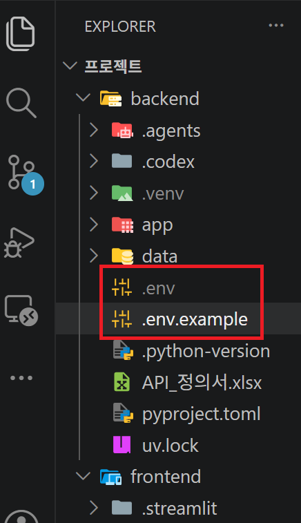

---
### 1) 백엔드 실행 (터미널 1)
```bash
cd backend
uv sync
uv run uvicorn app.main:app --reload --port 8001
```
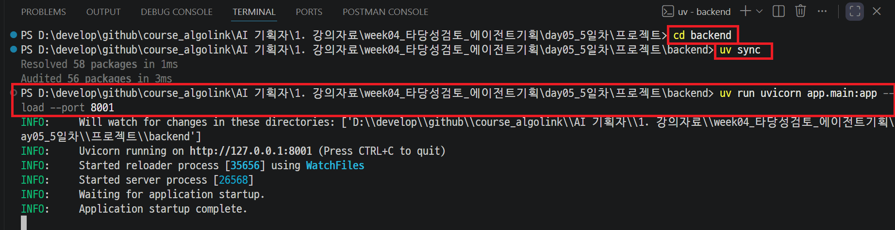

---
`http://localhost:8001/docs`에서 `POST /chat`이 목록에 보이면 정상입니다.

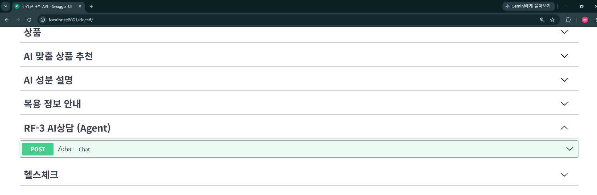

---
### 2) 프론트엔드 실행 (터미널 2, 백엔드 실행 중인 상태에서)
```bash
cd frontend
uv sync
uv run streamlit run streamlit_app/app.py
```
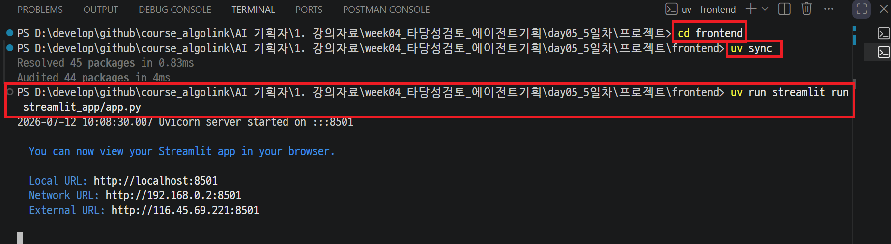

---
브라우저에서 `http://localhost:8501` 접속 → 사이드바 "AI상담(고객센터)" 클릭.

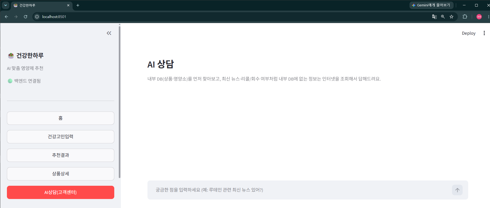

---
## 테스트 시나리오

---
### 정상 시나리오 1 — 내부 DB로 답변 (Tool 미사용)

---
1. AI상담 화면에서 "루테인이 어떤 성분이야?"처럼 내부 DB에 있는 성분을 질문

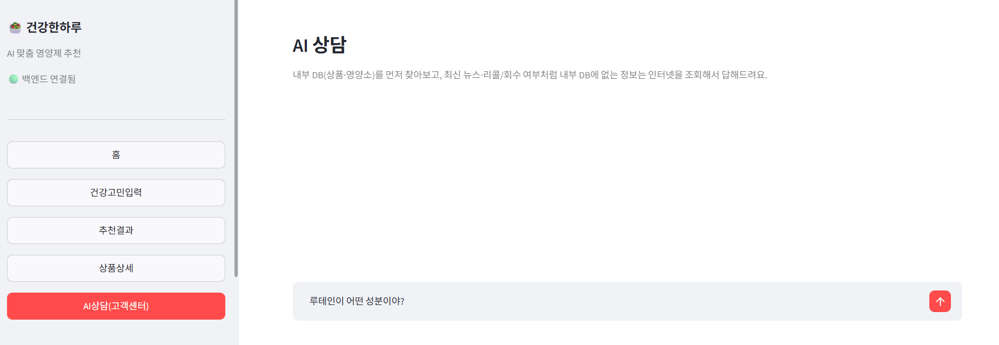

---
2. **기대 결과**: `search_internal_nutrient` Tool만 호출되고, 내부 DB의 기능성·근거가 출처와 함께 답변에 포함된다. 외부 Tool은 호출되지 않는다.

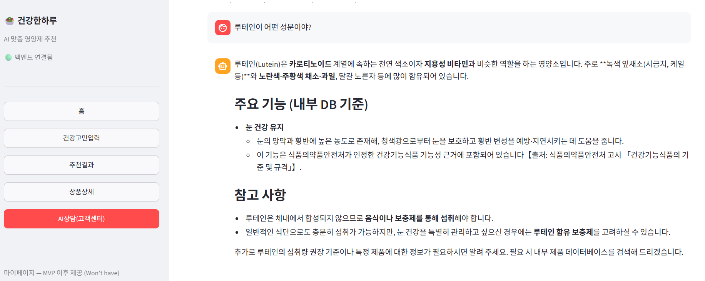

---
### 정상 시나리오 2 — 외부 뉴스 검색 (Tool 사용)

---
1. "루테인 관련 최신 뉴스 있어?"처럼 최신 정보를 요구하는 질문 입력

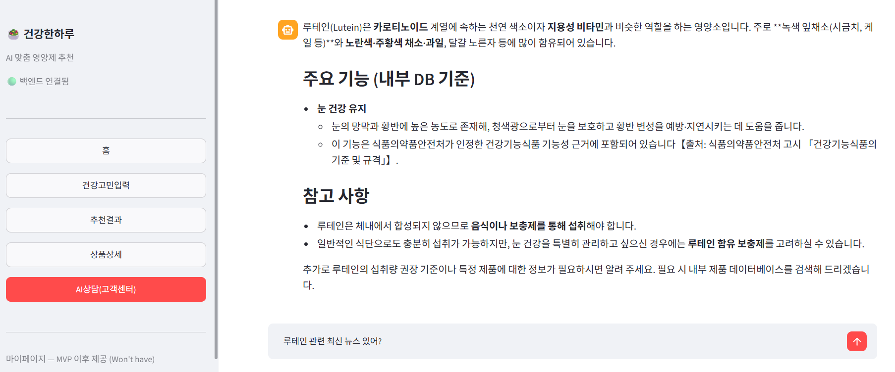

---
2. **기대 결과**: `search_supplement_news` Tool이 호출되고, 답변 하단 "출처" 펼치기에 뉴스 기사 URL이 표시된다.

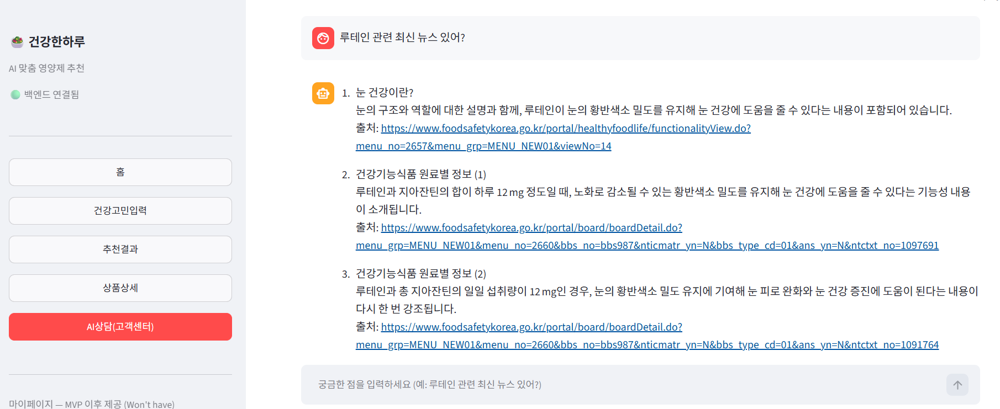

---
### 예외 시나리오 1 — 회수·경보 발견 (Human-in-the-loop)

---
1. "홍삼정 리미티드 스틱 제품 회수된 적 있어?"처럼 리콜 여부를 묻는 질문 입력

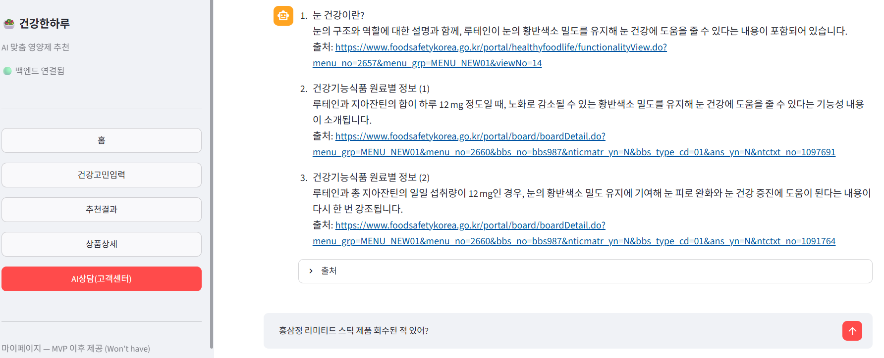

---
2. **기대 결과**: `search_recall_alert` Tool이 경보를 찾으면, 답변과 함께 "CS 상담 연결을 권장해요" 경고 배너 + `CS 상담 연결하기` 버튼이 노출된다. 

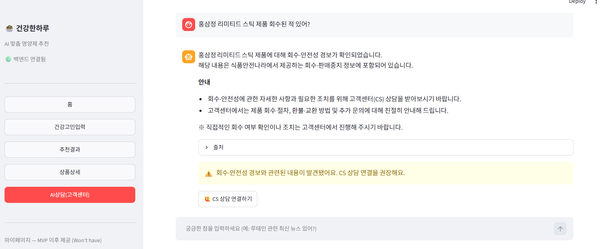

---
## 정리
- RF-3 AI상담을 "규칙 기반 자리표시자"에서 **내부 DB + 외부 인터넷 조회 Tool을 스스로 선택하는 Agent** 로 확장했습니다.

- 모든 외부 조회는 **조회 전용** 이며, 위험 정보(회수·경보) 발견 시에도 최종 CS 연결은 사람이 직접 선택하도록 설계해 day04 문서의 Human-in-the-loop 원칙을 지켰습니다.
