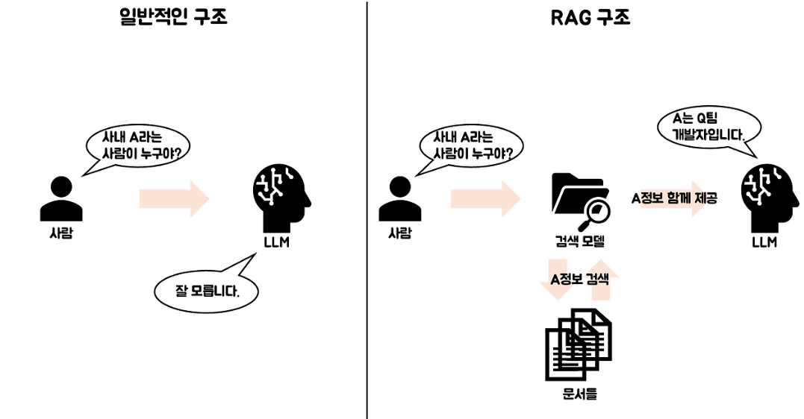
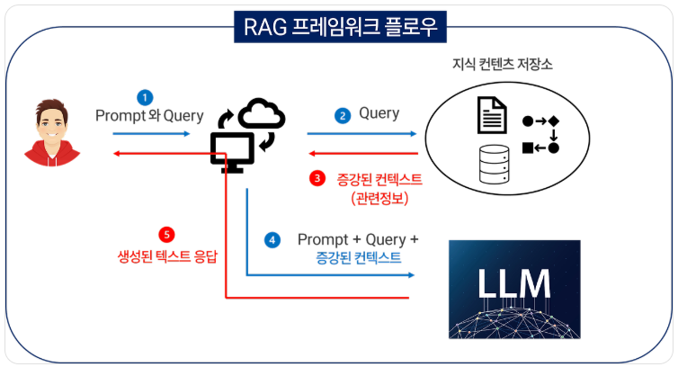
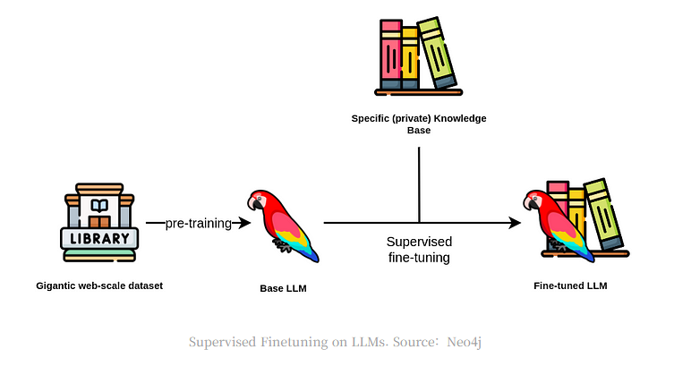
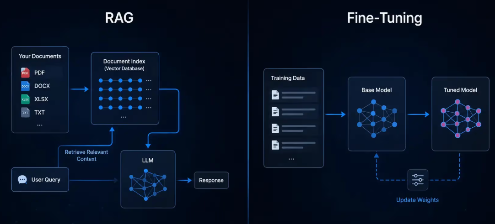

# RAG 서비스 이해 및 적용 판단

AI가 외부 지식을 찾아보고 답하게 만드는 서비스 기획 방법

---

## 오늘의 핵심 질문

RAG를 이해할 때 가장 중요한 질문은 이것입니다.

> 이 AI 기능은 모델이 이미 알고 있는 지식만으로 충분한가?

기획자는 다음을 판단해야 합니다.

- 사용자가 어떤 정보를 필요로 하는가?
- 그 정보가 자주 바뀌는가?
- 답변에 근거 자료가 필요한가?
- 일반 AI 답변만으로 신뢰할 수 있는가?

---
# [RAG란?](https://jaeyoon-95.tistory.com/272)

RAG는 **Retrieval-Augmented Generation** 의 줄임말입니다.

---
**1. Retrieval**
> R에 해당하는 "Retrieval"의 의미는 번역된 "검색"이라는 의미보다는 `"어디선가 가져오는 것, 집어 오는 것"`입니다.

**2. Augmented**
> A에 해당하는 Augmented는 "증강되었다"란 뜻입니다.` 즉 원래 것에 뭔가 덧붙이거나 보태어 더 충실하게 좋아졌다는 뜻입니다.`

**3. Generation**
> G, 생성이라는 Generation을 이야기합니다. `생성은 프롬프트라고 하는 사용자 질문/질의에 대한 응답을 텍스트로 생성하는 것을 의미`합니다.

---
쉽게 말하면,

> AI가 답변하기 전에 필요한 자료를 먼저 검색하고,
> 그 자료를 바탕으로 답변을 생성하는 방식입니다.

RAG는 AI에게 모든 지식을 외우게 하는 방식이 아닙니다.
필요할 때 관련 문서를 찾아보고 답하도록 만드는 방식입니다.

---

---

## 일반 LLM 답변과 RAG 답변의 차이

| 구분 | 일반 LLM 답변 | RAG 답변 |
|---|---|---|
| 답변 근거 | 모델이 학습한 일반 지식 | 연결된 문서, DB, 매뉴얼 |
| 최신 정보 | 약할 수 있음 | 문서가 최신이면 반영 가능 |
| 출처 확인 | 어려울 수 있음 | 참고 문서 기반 확인 가능 |
| 서비스 신뢰도 | 주제에 따라 흔들림 | 업무 지식이 있을 때 유리 |

RAG는 AI를 더 똑똑하게 만드는 것보다
**답변의 근거를 서비스 안에 연결하는 방법**에 가깝습니다.

---

## [RAG의 기본 흐름](https://yozm.wishket.com/magazine/detail/2828/)

RAG 서비스는 보통 다음 순서로 작동합니다.

1. 사용자가 질문한다
2. 질문과 관련된 문서를 찾는다
3. 찾은 문서에서 필요한 내용을 가져온다
4. AI가 문서를 참고해 답변한다
5. 사용자에게 답변과 근거를 보여준다

기획자는 이 흐름에서 "어떤 문서를 참고해야 하는가"와
"답변에 어떤 근거를 보여줘야 하는가"를 정의해야 합니다.

---

---

## RAG가 필요한 이유

AI 서비스에서 RAG가 필요한 이유는 크게 세 가지입니다.

- **최신성**: 가격, 정책, 상품 정보처럼 계속 바뀌는 정보가 필요함
- **정확성**: 내부 문서나 업무 기준에 맞춰 답해야 함
- **근거성**: 사용자가 답변의 출처를 확인해야 함

예를 들어 건강기능식품 쇼핑몰에서
"임산부가 먹어도 되는 제품인가요?"라는 질문은
일반 상식보다 제품 설명, 성분, 주의사항 문서를 기준으로 답해야 합니다.

---

## 언제 RAG를 사용하는가?

다음 조건에 해당하면 RAG를 검토할 수 있습니다.

| 상황 | RAG 검토 이유 |
|---|---|
| 상품, 정책, 공지처럼 정보가 자주 바뀜 | 최신 문서를 반영해야 함 |
| 회사 내부 기준에 맞춰 답해야 함 | 일반 지식만으로 부족함 |
| 답변의 출처가 중요함 | 근거 문서 제시가 필요함 |
| 사용자가 구체적인 문서를 찾기 어려움 | AI가 대신 찾아 요약할 수 있음 |
| 같은 질문이 반복됨 | 문서 기반 자동 응답 가치가 큼 |

RAG는 "AI가 모르는 것을 알려주는 장치"가 아니라
"서비스가 가진 지식을 AI가 활용하게 하는 구조"입니다.

---

## RAG가 특히 잘 맞는 서비스

RAG는 문서나 정보가 많은 서비스에서 효과적입니다.

- 고객센터 FAQ 답변
- 상품 정보 기반 추천
- 사내 규정 검색
- 계약서, 매뉴얼, 정책 문서 질의응답
- 연구 보고서 또는 자료 요약
- 교육 콘텐츠 검색과 설명

공통점은 사용자가 원하는 답이
어딘가의 문서 안에 이미 존재한다는 점입니다.

---

## RAG가 필요하지 않을 수도 있는 경우

모든 AI 기능에 RAG가 필요한 것은 아닙니다.

| 상황 | 더 적합한 접근 |
|---|---|
| 단순 문장 작성이나 톤 변경 | 일반 LLM 프롬프트 |
| 창의적 아이디어 발산 | 일반 LLM 프롬프트 |
| 고정된 규칙 기반 분류 | 룰 또는 간단한 모델 |
| 참고할 문서가 거의 없음 | RAG 효과가 낮음 |
| 문서 품질이 낮고 정리가 안 됨 | 먼저 데이터 정비 필요 |

RAG는 답변의 원천이 될 자료가 준비되어 있을 때 의미가 있습니다.

---

## 기획자가 판단해야 할 질문

RAG 적용 여부를 판단할 때는 다음 질문을 던집니다.

- 답변에 반드시 참고해야 할 문서가 있는가?
- 문서가 최신 상태로 관리될 수 있는가?
- 사용자가 답변의 근거를 확인해야 하는가?
- 잘못된 답변이 서비스 신뢰에 큰 영향을 주는가?
- 검색된 문서가 실제로 질문에 도움이 되는가?

이 질문에 "예"가 많을수록 RAG 적용 가능성이 높습니다.

---
# [Fine-tuning이란?](https://ariz1623.tistory.com/347)

Fine-tuning은 기존 AI 모델을 특정 목적에 맞게 추가 학습시키는 방식입니다.

---

---
예를 들어 다음과 같은 경우를 생각할 수 있습니다.

- 특정 말투나 응답 형식을 안정적으로 유지하고 싶음
- 특정 업무 유형의 판단 패턴을 반복 학습시키고 싶음
- 분류, 요약, 변환 같은 작업 방식을 일정하게 만들고 싶음

Fine-tuning은 외부 문서를 매번 찾아보게 하는 것이 아니라
모델의 응답 습관과 패턴을 조정하는 방식에 가깝습니다.

---

## [RAG와 Fine-tuning의 핵심 차이](https://nexios.in/blog/rag-vs-fine-tuning)

| 구분 | RAG | Fine-tuning |
|---|---|---|
| 목적 | 필요한 정보를 찾아 답변 | 모델의 응답 방식 조정 |
| 지식 반영 | 외부 문서 연결 | 학습 데이터에 반영 |
| 최신 정보 대응 | 문서 교체로 비교적 쉬움 | 다시 학습이 필요할 수 있음 |
| 근거 제시 | 문서 출처 제시 가능 | 출처 제시는 별도 설계 필요 |
| 적합한 상황 | 지식 검색, 문서 기반 Q&A | 말투, 형식, 판단 패턴 개선 |

---
짧게 정리하면,

> RAG는 "무엇을 참고할지"의 문제이고, Fine-tuning은 "어떻게 답할지"의 문제입니다.

---

## RAG와 Fine-tuning 선택 기준

| 기획 질문 | 더 가까운 선택 |
|---|---|
| 최신 문서를 반영해야 하는가? | RAG |
| 답변에 출처가 필요한가? | RAG |
| 회사 문서나 상품 정보를 찾아야 하는가? | RAG |
| 말투와 출력 형식을 안정화해야 하는가? | Fine-tuning |
| 특정 작업 패턴을 반복 학습해야 하는가? | Fine-tuning |
| 둘 다 필요한가? | RAG와 Fine-tuning 조합 |

실제 서비스에서는 둘 중 하나만 선택하지 않고 
RAG와 Fine-tuning을 함께 검토할 수도 있습니다.

---

## RAG 적용 시 주의할 점

RAG를 붙인다고 자동으로 좋은 답변이 나오지는 않습니다.

- 문서가 부정확하면 답변도 부정확해짐
- 검색된 문서가 질문과 맞지 않으면 엉뚱한 답이 나옴
- 문서가 너무 길거나 복잡하면 핵심을 놓칠 수 있음
- 출처 표시가 없으면 사용자가 답변을 검증하기 어려움
- 오래된 문서가 섞이면 신뢰도가 떨어짐

RAG의 품질은 AI 모델만이 아니라
**문서 품질, 검색 품질, 답변 설계**가 함께 결정합니다.

---

## RAG 기능 정의 시 확인할 것

기획자는 RAG 기능을 정의할 때 다음을 정리해야 합니다.

| 항목 | 기획자가 정할 내용 |
|---|---|
| 사용자 질문 | 어떤 질문에 답할 것인가 |
| 참고 자료 | 어떤 문서와 데이터를 사용할 것인가 |
| 답변 범위 | 어디까지 답하고 어디서 멈출 것인가 |
| 근거 표시 | 출처를 어떻게 보여줄 것인가 |
| 실패 안내 | 자료가 없을 때 어떻게 안내할 것인가 |

RAG 기능은 "AI 채팅창을 만든다"가 아니라
"어떤 지식을 어떤 방식으로 꺼내 쓸 것인가"를 설계하는 일입니다.

---

## 오늘의 정리

RAG는 AI가 외부 지식을 검색해 답변하도록 만드는 방식입니다.

오늘의 핵심은 세 가지입니다.

1. RAG는 문서 기반 답변과 근거 제시가 필요할 때 유용하다
2. RAG는 최신 정보, 내부 지식, 출처 확인이 중요한 서비스에 적합하다
3. Fine-tuning은 지식 검색보다 응답 방식과 패턴을 조정하는 데 가깝다

기획자의 역할은 기술 이름을 고르는 것이 아니라
**사용자 문제에 맞는 지식 활용 방식을 판단하는 것**입니다.

---
# [예제영상> 초보자들을 위한 RAG 개념 20분 마스터클래스](https://www.youtube.com/watch?v=NbrN-NwKvuc)
- RAG란 무엇인가, 왜 필요한가
- Embedding과 벡터: 텍스트를 숫자로 바꾸는 원리
- 청킹과 Parser: 문서를 어떻게 잘라야 검색이 되는가
- 벡터 데이터베이스: 숫자를 저장하고 검색하는 방법
- RAG 파이프라인 전체 흐름 정리
- 실무에서 RAG가 실패하는 진짜 원인
- Dense, Sparse Embedding과 하이브리드 서치
- Reranker: 검색 결과를 정밀하게 재평가하기
- 고급 기법: Contextual Retrieval
- 고급 기법: Late Chunking

