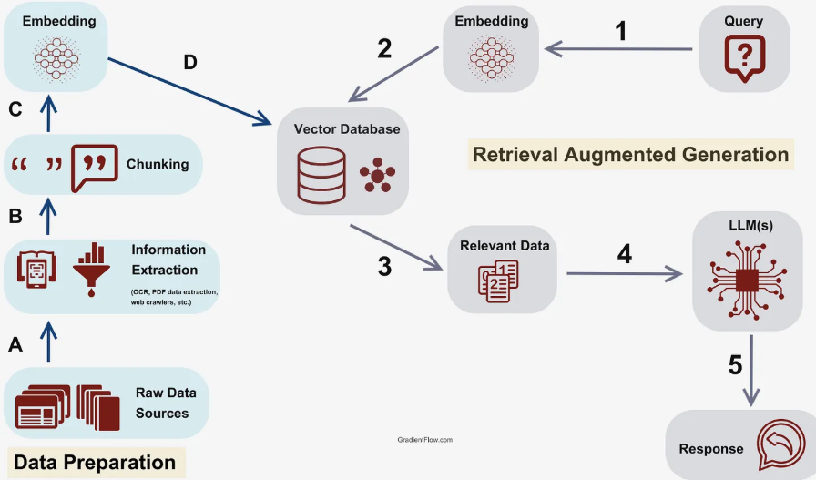
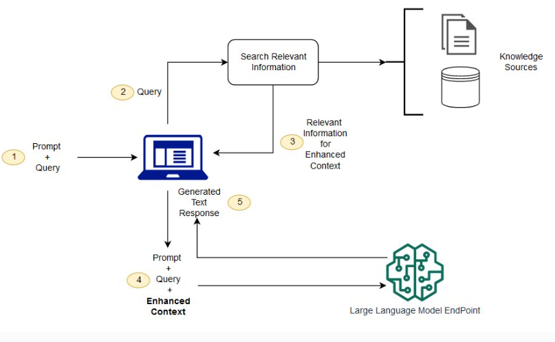
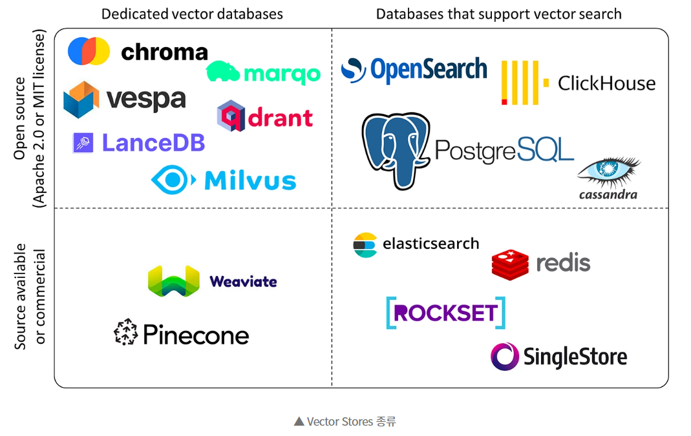

# RAG 서비스 구조 이해

검색과 생성이 함께 움직이는 AI 서비스 구조

---

## 오늘의 핵심 질문

RAG 서비스는 AI가 혼자 답하는 구조가 아닙니다.

기획자는 다음 흐름을 이해해야 합니다.

- 사용자의 질문은 어디로 들어가는가?
- 관련 문서는 누가 찾아오는가?
- 찾아온 문서는 어디에 저장되어 있는가?
- LLM은 어떤 정보를 보고 답변하는가?
- 답변의 근거는 어떻게 사용자에게 보여주는가?

RAG 구조를 이해하면 AI 답변 품질을 어디서 개선해야 할지 판단할 수 있습니다.

---
## [RAG 서비스 전체 구조](https://gradientflow.substack.com/p/best-practices-in-retrieval-augmented)

RAG는 크게 네 요소로 구성됩니다.

| 요소 | 역할 |
|---|---|
| 사용자 질문 | 사용자가 알고 싶은 내용을 입력함 |
| Retriever | 질문과 관련된 문서를 찾아옴 |
| Vector DB | 의미 기준으로 검색할 문서를 저장함 |
| LLM | 검색된 문서를 바탕으로 답변을 생성함 |

핵심은 **검색된 근거를 바탕으로 생성한다**는 점입니다.

---

---

## [RAG 기본 흐름](https://aws.amazon.com/what-is/retrieval-augmented-generation/)

RAG 서비스는 보통 다음 순서로 작동합니다.

1. 사용자가 질문한다
2. 질문을 검색에 적합한 형태로 바꾼다
3. Vector DB에서 관련 문서를 찾는다
4. Retriever가 필요한 문서 조각을 선택한다
5. LLM에게 질문과 문서 조각을 함께 전달한다
6. LLM이 근거를 참고해 답변한다
7. 사용자에게 답변과 출처를 보여준다

이 흐름을 한 문장으로 줄이면 **찾고, 읽고, 답하는 구조**입니다.

---

---
# RAG를 구성하는 세 가지 핵심

오늘은 세 가지 요소를 중심으로 봅니다.

| 구성 요소 | 기획자가 이해할 질문 |
|---|---|
| Retriever | 어떤 문서를 찾아와야 하는가? |
| Vector DB | 문서는 어떤 방식으로 저장되어 있는가? |
| LLM | 찾아온 문서를 어떻게 답변으로 바꾸는가? |

RAG 기능을 기획할 때는 이 세 요소가 서로 어떻게 연결되는지 봐야 합니다.

---
## 1. Retriever란?

Retriever는 사용자의 질문과 관련 있는 문서를 찾아오는 역할을 합니다.

쉽게 말하면,

> AI가 답하기 전에 먼저 참고할 자료를 찾아주는 검색 담당자입니다.

Retriever는 최종 답변을 만드는 것이 아니라 LLM이 답변할 때 사용할 근거 후보를 가져옵니다.

---

### Retriever가 하는 일

Retriever는 다음 일을 수행합니다.

- 사용자 질문의 의미를 파악함
- 질문과 관련된 문서 조각을 찾음
- 너무 관련 없는 문서는 제외함
- 더 관련성이 높은 문서를 우선순위로 정함
- 필요한 경우 카테고리, 날짜, 권한 조건으로 필터링함

Retriever가 잘못된 문서를 가져오면 LLM도 좋은 답변을 만들기 어렵습니다.

---

### 좋은 Retriever의 기준

좋은 Retriever는 많이 찾는 것보다 잘 찾는 것이 중요합니다.

| 기준 | 확인 질문 |
|---|---|
| 관련성 | 질문과 직접 관련 있는 문서를 찾았는가? |
| 충분성 | 답변에 필요한 정보가 빠지지 않았는가? |
| 정확성 | 잘못된 문서나 오래된 문서가 섞이지 않았는가? |
| 우선순위 | 가장 중요한 문서가 먼저 선택되었는가? |
| 제한 조건 | 권한, 카테고리, 날짜 조건을 지켰는가? |

기획자는 Retriever를 "검색 엔진"이 아니라 **답변 근거를 고르는 장치**로 이해하면 됩니다.

---
## 2. Vector DB란?

Vector DB는 문서 조각을 의미 기준으로 찾을 수 있게 저장하는 공간입니다.

일반 검색이 같은 단어를 찾는 데 강하다면, Vector DB는 표현이 달라도 의미가 가까운 문서를 찾는 데 강합니다.

예를 들어 사용자가 "임산부가 먹어도 되나요?"라고 물었을 때 "임신 중 섭취 주의사항"이 담긴 문서를 찾을 수 있습니다.

---
### [Vector DB 종류](https://incodom.kr/VectorDB)

| 특징 | Pinecone | Weaviate | Milvus | Chroma |
| :--- | :--- | :--- | :--- | :--- |
| **라이센스** | 클라우드 기반 (상업용) | 오픈 소스 | 오픈 소스 | 오픈 소스 |
| **확장성** | 클라우드 확장성 우수 | 분산 환경 지원 | 고도의 분산 지원 | 제한적 (경량) |
| **배포 옵션** | 클라우드 전용 | 클라우드 및 온프레미스 | 클라우드 및 온프레미스 | 로컬 및 클라우드 |
| **사용 사례** | 대규모 서비스 | 하이브리드 검색 앱 | 멀티모달 검색 엔진 | LLM 기반 프로토타이핑 |

---

---

### Vector DB에 저장되는 것

Vector DB에는 보통 다음 정보가 들어갑니다.

| 저장 정보 | 설명 |
|---|---|
| Chunk 내용 | 검색 대상이 되는 문서 조각 |
| Embedding | 문서 의미를 숫자로 바꾼 값 |
| 메타데이터 | 상품명, 문서 유형, 작성일, 권한 등 |
| 출처 정보 | 사용자가 근거를 확인할 수 있는 문서 위치 |

Vector DB는 단순한 저장소가 아니라 RAG가 근거를 찾기 위해 사용하는 지식 검색 기반입니다.

---

### Vector DB에서 기획자가 볼 것

기획자는 Vector DB의 내부 기술보다 다음 기준을 확인해야 합니다.

- 어떤 문서가 들어가는가
- 문서가 어떤 단위로 나뉘어 있는가
- 메타데이터가 검색 조건으로 충분한가
- 오래된 문서가 제거되거나 갱신되는가
- 사용자에게 보여줄 출처 정보가 있는가
- 접근 권한이 필요한 문서가 섞여 있지 않은가

Vector DB 품질은 검색 품질과 답변 신뢰도에 직접 영향을 줍니다.

---
## 3. LLM의 역할

LLM은 검색된 문서를 바탕으로 사용자에게 자연스러운 답변을 만듭니다.

RAG에서 LLM은 모든 지식을 기억해서 답하는 존재가 아닙니다.

LLM의 역할은 다음과 같습니다.

- 사용자 질문을 이해함
- 검색된 문서에서 필요한 내용을 읽음
- 문서 내용을 바탕으로 답변을 구성함
- 불확실한 내용은 단정하지 않음
- 필요한 경우 출처나 제한 조건을 함께 안내함

RAG에서는 LLM이 **찾아온 근거를 잘 사용하도록 설계**해야 합니다.

---

### LLM에 전달되는 정보

LLM은 보통 다음 정보를 함께 받습니다.

| 정보 | 예시 |
|---|---|
| 사용자 질문 | "이 제품을 임산부가 먹어도 되나요?" |
| 검색된 문서 | 제품 성분, 섭취 주의사항, FAQ |
| 답변 규칙 | 문서에 없는 내용은 추측하지 말 것 |
| 출력 형식 | 결론, 근거, 주의사항 순서로 답변 |

LLM에게 어떤 정보를 어떤 순서로 줄지에 따라 답변 품질이 달라집니다.

---

### 검색 + 생성 흐름

RAG의 핵심은 검색과 생성을 분리해서 보는 것입니다.

| 단계 | 담당 | 설명 |
|---|---|---|
| 질문 입력 | 사용자 | 알고 싶은 내용을 입력함 |
| 검색 요청 | Retriever | 질문과 관련된 문서를 찾음 |
| 문서 검색 | Vector DB | 의미가 가까운 문서 조각을 반환함 |
| 답변 생성 | LLM | 문서를 참고해 답변을 작성함 |
| 결과 제공 | 서비스 화면 | 답변과 근거를 사용자에게 보여줌 |

검색이 약하면 근거가 약해지고, 생성이 약하면 설명이 약해집니다.

---

## 예시 흐름

사용자 질문:

> 이 비타민 제품을 임산부가 먹어도 되나요?

RAG는 다음처럼 동작합니다.

1. 질문에서 "비타민 제품", "임산부", "섭취 가능 여부"를 파악한다
2. Vector DB에서 해당 제품의 성분과 주의사항 문서를 찾는다
3. Retriever가 관련성이 높은 문서 조각을 선택한다
4. LLM이 문서를 참고해 답변을 만든다
5. 출처와 함께 "의사 상담 필요" 같은 주의사항을 안내한다

이 구조 덕분에 일반 상식이 아니라 서비스가 가진 문서를 기준으로 답할 수 있습니다.

---

## 검색이 실패하면 생기는 문제

RAG에서 검색이 실패하면 답변도 흔들립니다.

| 검색 문제 | 사용자 경험 |
|---|---|
| 관련 문서를 못 찾음 | AI가 일반적인 답변만 함 |
| 엉뚱한 문서를 찾음 | 질문과 맞지 않는 답변이 나옴 |
| 오래된 문서를 찾음 | 현재 정책과 다른 안내가 나옴 |
| 문서를 너무 많이 찾음 | 답변이 길고 핵심이 흐려짐 |
| 출처가 없는 문서를 찾음 | 사용자가 근거를 확인하기 어려움 |

RAG 품질 개선은 먼저 검색 결과를 확인하는 것에서 시작합니다.

---

## 생성이 실패하면 생기는 문제

검색된 문서가 좋아도 LLM의 답변 방식이 부족하면 문제가 생깁니다.

| 생성 문제 | 사용자 경험 |
|---|---|
| 문서에 없는 내용을 추가함 | 신뢰하기 어려운 답변이 됨 |
| 핵심을 요약하지 못함 | 사용자가 다시 읽어야 함 |
| 조건을 빠뜨림 | 위험하거나 부정확한 안내가 됨 |
| 출처를 연결하지 않음 | 답변 근거가 보이지 않음 |
| 표현이 모호함 | 사용자가 다음 행동을 알기 어려움 |

LLM은 자유롭게 말하게 두는 것이 아니라 근거 안에서 답하도록 규칙을 줘야 합니다.

---
# RAG 구조에서 품질을 좌우하는 것

RAG 답변 품질은 네 가지가 함께 결정합니다.

| 요소 | 품질에 미치는 영향 |
|---|---|
| 데이터 품질 | 정확하고 최신인 문서가 있어야 함 |
| 검색 품질 | 질문에 맞는 문서를 찾아야 함 |
| 프롬프트 품질 | LLM이 근거를 올바르게 사용해야 함 |
| 화면 설계 | 사용자가 답변과 출처를 이해해야 함 |

기획자는 답변이 나쁘다고 바로 LLM 문제로만 보면 안 됩니다.

---

## 기획자가 확인할 구조 질문

RAG 구조를 검토할 때는 다음을 확인합니다.

- 사용자의 대표 질문은 무엇인가
- 질문에 답할 문서가 실제로 존재하는가
- Retriever는 어떤 기준으로 문서를 고르는가
- Vector DB에는 어떤 문서와 메타데이터가 저장되는가
- LLM은 문서에 없는 내용을 어떻게 처리하는가
- 사용자에게 답변 근거를 어떻게 보여주는가
- 검색 결과가 없을 때 어떤 안내를 제공하는가

이 질문들이 RAG 기능 정의서의 핵심 검토 항목이 됩니다.

---

## 오늘의 정리

RAG 서비스 구조는 **검색 + 생성**으로 이해할 수 있습니다.

오늘의 핵심은 세 가지입니다.

1. Retriever는 질문과 관련된 문서 조각을 찾아오는 역할을 한다
2. Vector DB는 의미가 가까운 문서를 검색할 수 있게 저장하는 공간이다
3. LLM은 검색된 문서를 바탕으로 사용자에게 답변을 생성한다

기획자의 역할은 각 기술을 깊게 구현하는 것이 아니라 **사용자 질문이 올바른 근거와 답변으로 이어지는 흐름을 설계하는 것**입니다.

---
# [예제영상> 개념 설명 - VectorDB, 임베딩](https://www.youtube.com/watch?v=RJnX-TZTWbo)
- 벡터(Vector)란?
- VectorDB란?
- 임베딩(Embedding)이란?
- 유사도란?
