# Day 05 프로젝트 실습 - 건강한하루 최종 프로젝트 (RAG 포함)

---
## week04 day05 대비 무엇이 달라졌나

- week04에서는 `search_internal_product` / `search_internal_nutrient` 두 Tool이 SQLite를 `LIKE` 키워드 검색으로 조회했습니다. 
- week05에서는 이 두 Tool을 **`search_internal_knowledge` 하나로 합치고**, 내부 구현을 SQLite → 문서 Chunk → Chroma 벡터 검색(RAG)으로 바꿨습니다. 
- 외부 뉴스/회수 Tool 2종과 Agent 전체 구조, Human-in-the-loop 원칙(day04 문서)은 그대로입니다.

---
| 항목 | week04 day05 (`프로젝트_AI 에이전트 구현.md`) | week05 day05 (이번 프로젝트) |
| --- | --- | --- |
| 내부 조회 Tool | `search_internal_product`, `search_internal_nutrient` (2개, SQLite `LIKE`) | `search_internal_knowledge` (1개, Chroma 벡터 검색) |
| 검색 방식 | 키워드 일치 여부 | 질문 의미와 가까운 문서 top-k (임베딩 유사도) |
| 근거 표기 | Tool 결과를 답변에 인용만 함 | `[근거 N] 문서명` 라벨 → `참고_문서_목록`으로 분리 반환 |

---
| 항목 | week04 day05 (`프로젝트_AI 에이전트 구현.md`) | week05 day05 (이번 프로젝트) |
| --- | --- | --- |
| 응답 스키마 | `answer`, `출처_URL_목록`, `cs_상담_권장` | 좌측 + **`참고_문서_목록`(신규)** |
| 새 실패 모드 | GROQ/TAVILY 키 미설정 → 503 | 좌측 + **Ollama 미실행/임베딩 미준비 → `RagNotReadyError`** |
| 프론트 UI | "출처" 펼치기만 존재 | **"📎 근거 문서" 펼치기 추가**로 내부/외부 근거를 분리 표시 |

---
## RAG 파이프라인 (`rag_service.py`) — 새로 생긴 부분

1. **문서화**: SQLite 3개 테이블(`상품`, `영양소_기능성`, `영양소_섭취기준`)의 각 행을
   사람이 읽을 수 있는 한 단락짜리 Chunk 문서로 변환합니다 (`_build_*_documents`).
2. **임베딩**: 로컬 Ollama 임베딩 모델(`qwen3-embedding:0.6b`)로 각 문서를 벡터화합니다.
   → API 키가 필요 없는 대신, `ollama serve`가 떠 있어야 합니다.
3. **저장/검색**: Chroma 벡터저장소(`backend/data/chroma_db`)에 저장해두고,
   질문이 들어오면 `similarity_search`로 가장 가까운 문서 top-k(기본 3개)를 반환합니다.
4. **최초 1회 구축**: 컬렉션이 비어있을 때만 전체 문서를 다시 임베딩합니다.
   이번 프로젝트는 326개 문서로 미리 구축해 두었으므로 처음 실행 시 재구축은 없습니다.

---
## Agent가 이 RAG를 쓰는 방식 (`agent_service.py`)

- `search_internal_knowledge` Tool이 `rag_service.search()`를 호출하고, 결과를
  `[근거 1] 상품마스터 - 뉴메릿 ...` 형태 라벨과 함께 LLM에게 돌려줍니다.
- System Prompt 규칙 1·3이 "내부 지식베이스(RAG)를 항상 먼저 시도"하고
  "근거는 `[근거 N] 문서명` 라벨로, 외부 검색은 출처 URL로 표기"하도록 명시합니다.
- 응답 후처리에서 `[근거 N] ...` 라벨은 `참고_문서_목록`으로, `http(s)://` URL은
  `출처_URL_목록`으로 정규식으로 뽑아 분리합니다 (`_REFERENCE_LABEL_PATTERN`, `_URL_PATTERN`).
- 외부 뉴스(`search_supplement_news`)·회수 경보(`search_recall_alert`) Tool과
  회수 발견 시 CS 상담 연결 버튼만 노출하는 Human-in-the-loop 로직은 week04와 동일합니다.

---
## 폴더 구조

```
프로젝트/
├── backend/                      # FastAPI 서버
│   ├── app/
│   │   ├── routers/chat.py       # RF-3 /chat 엔드포인트 (변경 없음)
│   │   ├── services/
│   │   │   ├── agent_service.py  # ★ 내부 Tool을 RAG로 교체
│   │   │   └── rag_service.py    # ★ 신규: SQLite → Chunk → Chroma 벡터 검색
│   │   └── schemas/chat.py       # ★ 참고_문서_목록 필드 추가
│   ├── data/
│   │   ├──건강한하루.db           # week02 Day04에서 만든 원본 데이터
│   │   └── chroma_db/            # 미리 구축해 둔 벡터 인덱스 (326개 문서)
│   └── .env.example
└── frontend/                     # Streamlit 화면
    └── streamlit_app/ui/chat.py  # ★ "근거 문서" 영역 추가로 표시
```

★ 표시된 파일이 week04 Day05 대비 새로 추가/수정된 부분입니다.

---
## 실행 방법

---
### 1. 백엔드 (터미널 1)

```bash
cd backend

# GROQ_API_KEY, TAVILY_API_KEY 입력
cp .env.example .env   
```
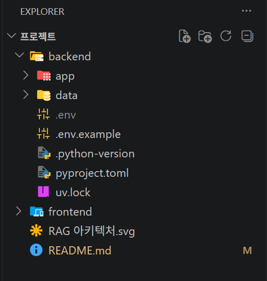

---
> FastAPI 서버 실행 
```bash
uv sync
uv run uvicorn app.main:app --reload --port 8001
```
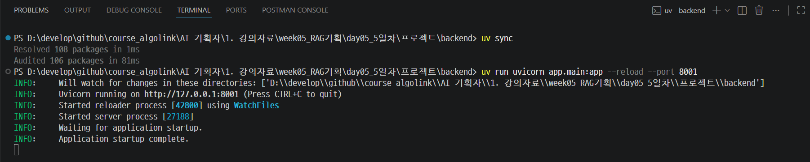

---
`http://localhost:8001/docs`에서 `POST /chat`이 보이면 정상입니다.

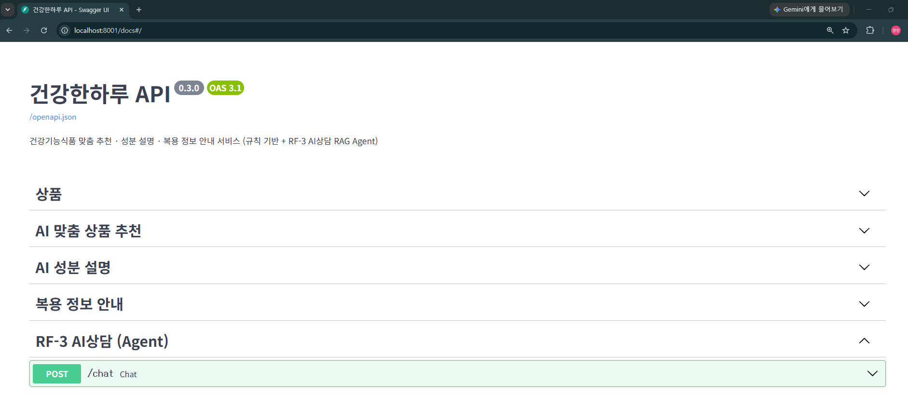

---
> AI상담(`/chat`)이 "요청이 지연되고 있어요" 오류를 낸다면?

로컬 Ollama 임베딩 모델을 처음 불러올 때 컴퓨터 사양에 따라 몇 초~수십 초가 걸릴 수 있습니다.
백엔드는 정상 동작 중이니, 아래처럼 프론트엔드 타임아웃을 늘려서 다시 실행해 보세요.
```bash
# Windows PowerShell
$env:HEALTHY_DAY_CHAT_TIMEOUT_SECONDS = "60"
uv run streamlit run streamlit_app/app.py
```

---
### 2. 프론트엔드 (터미널 2, 백엔드 실행 중인 상태에서)

```bash
cd frontend
uv sync
uv run streamlit run streamlit_app/app.py
```
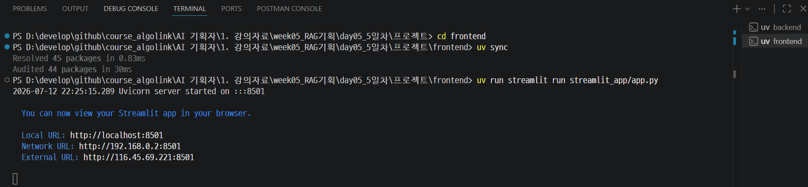

---
브라우저에서 `http://localhost:8501` 접속 → 사이드바 "AI상담(고객센터)" 클릭.

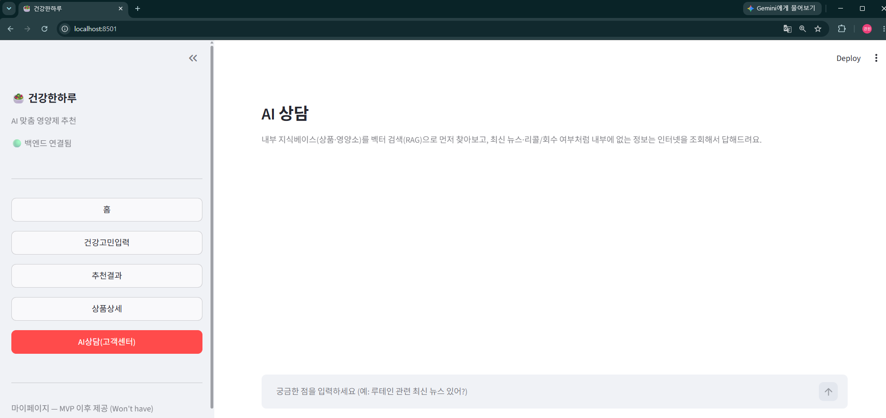

---
## 테스트 시나리오

---
### 시나리오 1 — 내부 지식베이스 RAG로 답변

---
1. AI상담 화면에서 "루테인이 어떤 성분이야?"처럼 내부 DB에 있는 성분을 질문

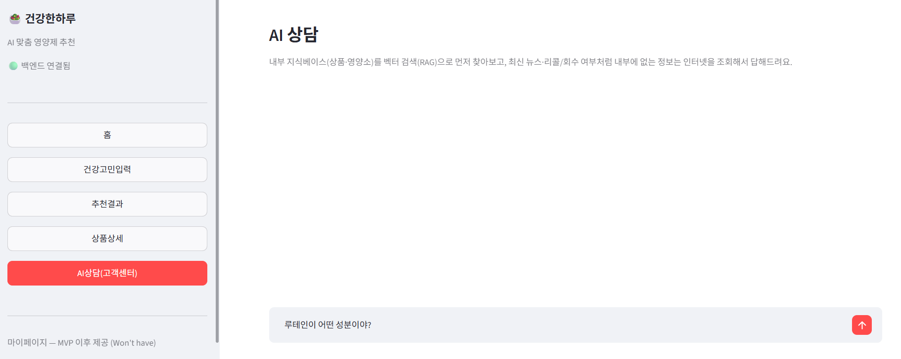

---
2. **기대 결과**: `search_internal_knowledge` Tool만 호출되고, 답변 아래 "근거 문서 (내부 지식베이스)" 펼치기에 `영양소_기능성_추천DB - 루테인` 같은 근거 라벨이 표시된다. "출처 (외부 검색)" 펼치기는 나타나지 않는다.

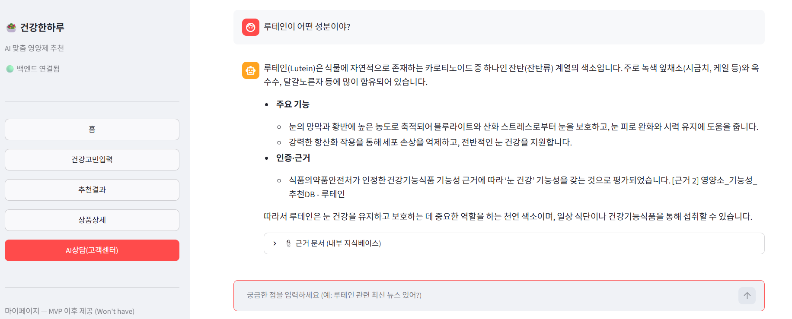

---
### 시나리오 2 — 외부 뉴스 검색 (Tool 사용)

---
1. "루테인 관련 최신 뉴스 있어?"처럼 최신 정보를 요구하는 질문 입력

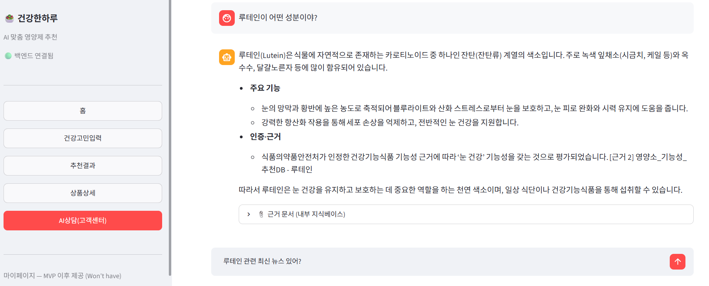

---
2. **기대 결과**: `search_supplement_news` Tool이 호출되고, 답변 아래 "출처 (외부 검색)" 펼치기에 뉴스 기사 URL이 표시된다.

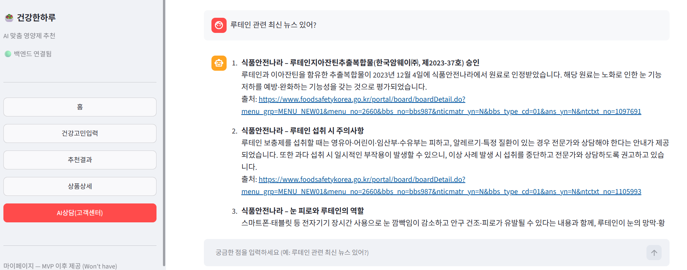

---
### 시나리오 3 — 회수·경보 발견 (Human-in-the-loop)

---
1. "홍삼정 리미티드 스틱 제품 회수된 적 있어?"처럼 리콜 여부를 묻는 질문 입력

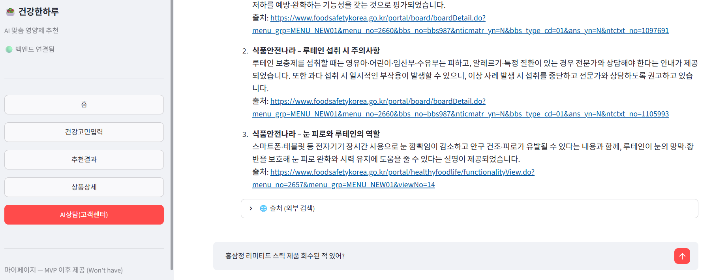

---
2. **기대 결과**: `search_recall_alert` Tool이 경보를 찾으면, 답변과 함께 "CS 상담 연결을 권장해요" 경고 배너 + `CS 상담 연결하기` 버튼이 노출된다. 자동으로 CS 상담에 연결되지 않고, 버튼을 직접 눌러야 한다.

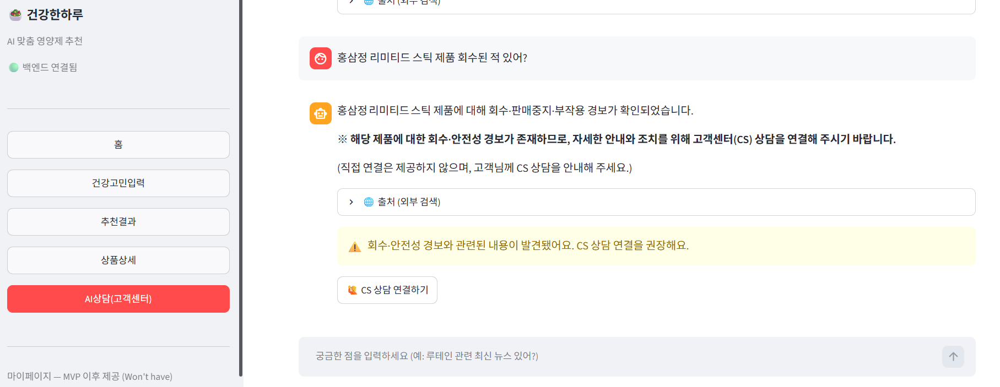

---
## 정리
- week04에서 만든 키워드(`LIKE`) 기반 내부 조회 Tool 2종을, week05에서 구축한
  Chroma + Ollama 임베딩 **RAG 벡터 검색 Tool 1종**으로 교체했습니다.
- 근거를 "내부 지식베이스(근거 문서 라벨)"와 "외부 검색(출처 URL)"으로 분리해
  응답 스키마와 화면에 각각 표시하도록 확장했습니다.
- 외부 조회는 여전히 **조회 전용**이며, 회수·경보 발견 시 CS 연결은 사람이 직접
  버튼을 눌러야 하는 Human-in-the-loop 원칙을 그대로 유지했습니다.
