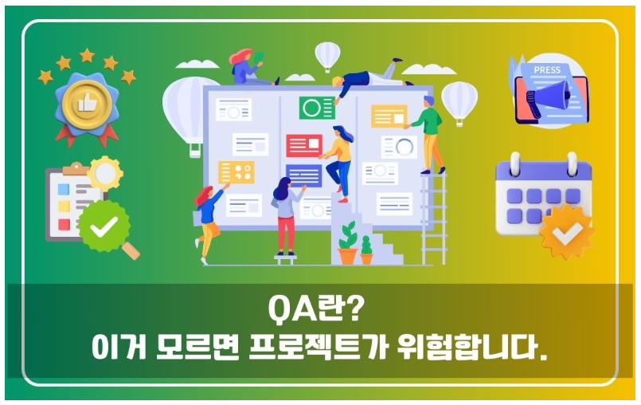
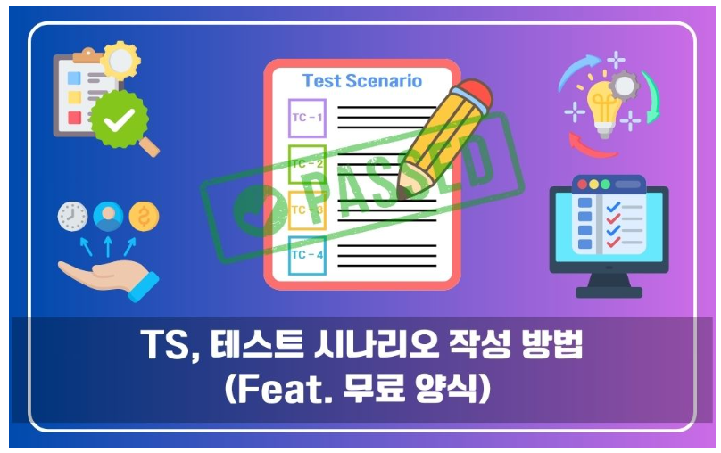
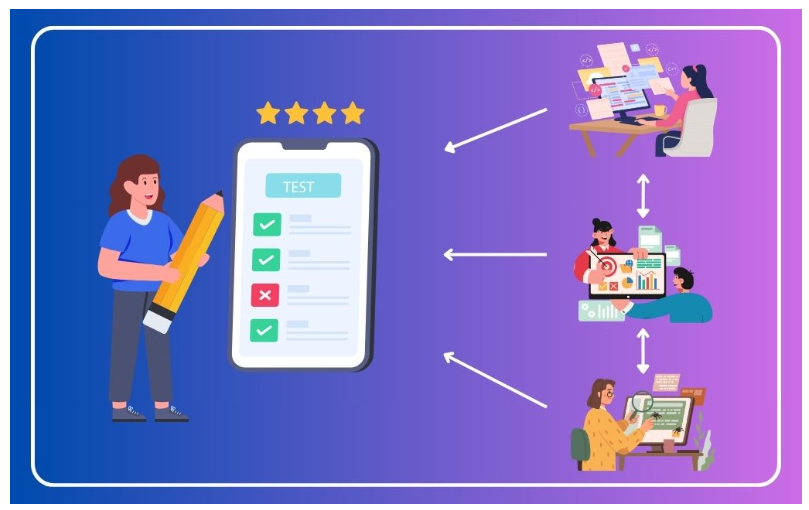
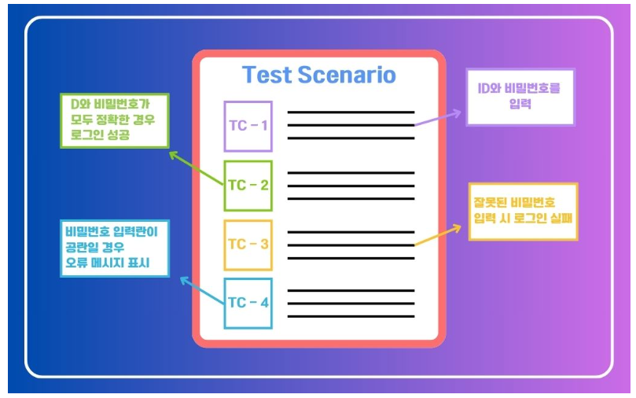
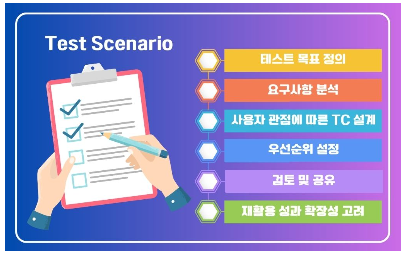

# AI 서비스 테스트 및 QA

AI 기능이 사용자에게 안정적으로 동작하는지 확인하는 방법

---

## 오늘의 핵심 질문

AI 서비스는 "응답이 나온다"만으로 품질을 판단할 수 없습니다.

기획자는 다음 질문에 답할 수 있어야 합니다.

- 사용자의 핵심 흐름이 정상적으로 작동하는가?
- 예외 상황에서도 사용자가 다음 행동을 알 수 있는가?
- AI 답변이 근거와 정책에 맞는가?
- 같은 질문에 일관된 품질로 응답하는가?
- 테스트 결과를 어떻게 개선으로 연결할 것인가?

AI 서비스 QA는 **기능 흐름과 AI 응답 품질을 함께 검증하는 과정**입니다.

---

## [QA란?](https://www.elancer.co.kr/blog/detail/300)

QA는 Quality Assurance의 줄임말로, 서비스 품질을 사전에 확인하고 관리하는 활동입니다.

---

---
AI 서비스에서 QA는 다음을 포함합니다.

| 구분 | 확인 내용 |
|---|---|
| 기능 QA | 버튼, 입력, 저장, 조회, 화면 이동이 작동하는가 |
| 데이터 QA | 필요한 데이터가 정확히 불러와지는가 |
| AI 응답 QA | 답변이 정확하고 안전하며 유용한가 |
| 예외 QA | 오류 상황에서 적절히 안내하는가 |
| 운영 QA | 반복 사용 시 품질이 유지되는가 |

AI 서비스 QA는 일반 기능 테스트보다 답변 품질과 안전성까지 함께 봅니다.

---

## [테스트 시나리오란?](https://www.elancer.co.kr/blog/detail/783)

테스트 시나리오는 서비스가 어떤 흐름으로 테스트되어야 하는지 정리한 문서입니다.

쉽게 말하면,

> 사용자가 어떤 상황에서 어떤 행동을 하고,
> 서비스가 어떤 결과를 보여줘야 하는지 정리한 테스트 흐름입니다.

테스트 시나리오는 세부 버튼 하나보다 사용자의 전체 흐름을 먼저 봅니다.

---

---

## 테스트 시나리오가 중요한 이유

테스트 시나리오가 있으면 다음 효과가 있습니다.

- 테스트 범위가 명확해짐
- 중요한 사용자 흐름을 놓치지 않음
- 기획자, 개발자, QA 담당자가 같은 기준으로 확인함
- 반복 테스트와 회귀 테스트에 재사용할 수 있음
- 결함이 발생했을 때 원인을 추적하기 쉬움

테스트 시나리오는 QA를 위한 체크리스트이자 협업 기준입니다.

---
> TS, 테스트 시나리오(Test Scenario)는 소프트웨어나 서비스의 품질을 확인하기 위해 수행해야 하는 테스트의 큰 흐름이나 방향을 정의한 문서입니다. 

---

## TS와 TC의 차이

테스트 시나리오(TS)와 테스트 케이스(TC)는 함께 사용됩니다.

| 구분 | 의미 | 예시 |
|---|---|---|
| 테스트 시나리오 | 사용자의 큰 흐름과 검증 방향 | 사용자가 상품 질문을 하고 AI 답변을 확인한다 |
| 테스트 케이스 | 실행 가능한 세부 확인 항목 | 질문 입력, 답변 생성, 출처 표시, 오류 안내 확인 |

---
> 목적과 배경을 명확히 해보면 TC가 모여서 TS가 된다고 이해할 수 있습니다.

---

## AI 서비스 테스트의 특징

AI 서비스 테스트는 일반 기능 테스트와 다릅니다.

| 일반 기능 테스트 | AI 서비스 테스트 |
|---|---|
| 정해진 결과가 나오는지 확인 | 답변 품질과 근거를 함께 확인 |
| 성공/실패가 비교적 명확함 | 부분적으로 맞거나 애매한 답변이 있을 수 있음 |
| 같은 입력은 같은 결과가 많음 | 같은 의도도 표현에 따라 답변이 달라질 수 있음 |
| 화면과 기능 중심 | 데이터, 프롬프트, 정책, 답변 중심 |

AI 테스트는 "작동 여부"와 "믿고 쓸 수 있는 답변인가"를 함께 봐야 합니다.

---

## 테스트 시나리오 작성 순서

테스트 시나리오는 다음 순서로 작성합니다.

1. 테스트 목표를 정한다
2. 사용자 흐름을 정리한다
3. 정상 케이스와 예외 케이스를 나눈다
4. 각 흐름의 기대 결과를 작성한다
5. AI 응답 검증 기준을 정한다
6. 우선순위를 정한다
7. 실행 결과와 개선점을 기록한다

테스트 시나리오는 실행 가능한 수준으로 구체적이어야 합니다.

---
> TS, 테스트 시나리오를 효과적으로 작성하기 위해서는 명확한 목표 설정과 구체적인 TC 작성이 필요합니다. 

---

## 1단계: 테스트 목표 정의

먼저 무엇을 검증할지 정해야 합니다.

| 목표 유형 | 예시 |
|---|---|
| 기능 검증 | 사용자가 질문을 입력하면 AI 답변이 표시되는가 |
| 데이터 검증 | 상품 정보와 주의사항이 올바르게 반영되는가 |
| 응답 품질 검증 | 답변이 정확하고 이해하기 쉬운가 |
| 보안 검증 | 개인정보와 금지 요청을 적절히 처리하는가 |
| 예외 검증 | 오류나 정보 부족 상황에서 안내가 적절한가 |

목표가 명확해야 테스트 결과도 명확하게 판단할 수 있습니다.

---

## 2단계: 사용자 흐름 정의

테스트 시나리오는 사용자의 관점에서 작성합니다.

예시 흐름:

1. 사용자가 상품 상세 화면에 들어간다
2. AI 질문 입력창에 질문을 입력한다
3. AI가 상품 문서와 FAQ를 참고해 답변한다
4. 사용자가 답변과 출처를 확인한다
5. 필요하면 추가 질문을 입력한다

기획자는 화면 단위보다 **사용자가 목표를 달성하는 흐름**을 먼저 봐야 합니다.

---

## 3단계: 기대 결과 작성

각 시나리오에는 기대 결과가 있어야 합니다.

| 항목 | 작성 예시 |
|---|---|
| 입력 | "임산부가 이 제품을 먹어도 되나요?" |
| 기대 동작 | AI가 관련 상품 문서와 주의사항을 검색함 |
| 기대 답변 | 확인된 근거 안에서 섭취 주의사항을 안내함 |
| 출처 표시 | 참고한 상품 문서 또는 FAQ가 표시됨 |
| 실패 기준 | 문서에 없는 효능을 단정하거나 출처를 누락함 |

기대 결과가 없으면 테스트가 감상으로 흐르기 쉽습니다.

---

## 정상 케이스란?

정상 케이스는 사용자가 의도한 흐름대로 서비스를 이용하는 상황입니다.

AI 서비스의 정상 케이스 예시는 다음과 같습니다.

- 사용자가 명확한 질문을 입력함
- 필요한 데이터와 문서가 존재함
- AI가 관련 근거를 찾아 답변함
- 답변에 결론, 근거, 주의사항이 포함됨
- 사용자가 답변을 보고 다음 행동을 결정할 수 있음

정상 케이스는 서비스가 기본 가치를 제공하는지 확인하는 기준입니다.

---

## 정상 케이스 예시

| 항목 | 내용 |
|---|---|
| 시나리오 | 사용자가 상품 섭취 방법을 질문한다 |
| 입력 | "하루에 몇 번 먹어야 하나요?" |
| 기대 결과 | 상품 문서의 섭취 방법을 기준으로 답변한다 |
| 검증 포인트 | 제품명, 섭취량, 주의사항, 출처가 맞는가 |
| 통과 기준 | 문서와 일치하며 사용자가 바로 이해할 수 있다 |

정상 케이스는 가장 자주 발생하는 질문부터 작성합니다.

---

## 예외 케이스란?

예외 케이스는 사용자가 예상과 다르게 행동하거나, 서비스가 답하기 어려운 상황입니다.

AI 서비스에서는 예외 케이스가 특히 중요합니다.

- 질문이 모호함
- 필요한 문서가 없음
- 검색 결과가 부정확함
- 사용자가 개인정보를 입력함
- 금지된 요청을 함
- AI가 근거 없는 답변을 만들 가능성이 있음

예외 케이스는 서비스 신뢰가 무너질 수 있는 지점을 미리 확인하는 과정입니다.

---

## 예외 케이스 예시

| 예외 상황 | 기대 대응 |
|---|---|
| 질문이 모호함 | 추가 정보를 요청함 |
| 관련 문서 없음 | 확인된 자료가 없다고 안내함 |
| 문서끼리 충돌 | 단정하지 않고 추가 확인을 안내함 |
| 개인정보 입력 | 민감 정보 입력을 피하도록 안내함 |
| 금지 요청 | 제한 이유와 안전한 대안을 제시함 |
| 시스템 오류 | 오류 사실과 다시 시도 방법을 안내함 |

예외 케이스는 "실패하지 않기"보다 "실패해도 안전하게 안내하기"가 핵심입니다.

---

## AI 응답 검증이란?

AI 응답 검증은 AI가 만든 답변이 서비스 기준에 맞는지 확인하는 과정입니다.

| 기준 | 확인 질문 |
|---|---|
| 정확성 | 근거 문서와 답변이 일치하는가 |
| 관련성 | 사용자의 질문에 직접 답하는가 |
| 완전성 | 필요한 조건과 주의사항이 빠지지 않았는가 |
| 명확성 | 사용자가 이해하기 쉬운가 |
| 안전성 | 위험하거나 금지된 내용을 피하는가 |
| 근거성 | 답변의 출처를 확인할 수 있는가 |

AI 응답 검증은 문장 품질보다 **서비스 기준에 맞는가**를 보는 일입니다.

---

## AI 응답 검증 단계

AI 응답은 다음 순서로 확인할 수 있습니다.

1. 질문 의도를 제대로 이해했는지 확인한다
2. 필요한 문서나 데이터를 참고했는지 확인한다
3. 답변 내용이 근거와 일치하는지 확인한다
4. 문서에 없는 내용을 추가하지 않았는지 확인한다
5. 개인정보나 금지 내용을 포함하지 않았는지 확인한다
6. 사용자가 다음 행동을 알 수 있는지 확인한다

AI 답변은 "그럴듯함"이 아니라 "검증 가능성"이 중요합니다.

---

## AI 응답 평가 척도

간단한 5점 척도로 AI 응답을 평가할 수 있습니다.

| 점수 | 판단 기준 |
|---|---|
| 5점 | 근거와 일치하고 바로 사용할 수 있음 |
| 4점 | 핵심은 맞지만 표현이나 구조 보완 필요 |
| 3점 | 일부 정보가 부족해 추가 확인 필요 |
| 2점 | 방향은 맞지만 사용하기 어려움 |
| 1점 | 의도 이해 실패, 근거 오류, 위험 답변 포함 |

점수만 남기지 말고 왜 그 점수인지 이유를 함께 기록해야 합니다.

---

## 결함 기록 방식

테스트 중 발견한 문제는 재현 가능하게 남겨야 합니다.

| 항목 | 작성 내용 |
|---|---|
| 테스트 ID | TC-001 |
| 사용자 질문 | 실제 입력한 질문 |
| 기대 결과 | 원래 나와야 하는 결과 |

---
| 항목 | 작성 내용 |
|---|---|
| 실제 결과 | AI가 실제로 응답한 내용 |
| 문제 유형 | 기능, 검색, 응답, 보안, 화면 |
| 심각도 | 높음, 중간, 낮음 |
| 개선 방향 | 프롬프트, 데이터, 화면, 정책 중 무엇을 고칠지 |

좋은 QA 기록은 문제를 다시 확인하고 고칠 수 있게 만듭니다.

---

## 우선순위 정하기

모든 테스트를 같은 깊이로 할 수는 없습니다.

우선순위는 다음 기준으로 정합니다.

- 사용자가 자주 사용하는 흐름인가
- 오류가 발생하면 피해가 큰가
- 개인정보나 금지 응답과 관련이 있는가
- 서비스 핵심 가치와 연결되는가
- 이전 테스트에서 자주 실패한 영역인가

AI 서비스에서는 사용 빈도와 위험도가 높은 시나리오를 먼저 확인합니다.

---

## 테스트 시나리오 작성 양식

| 항목 | 작성 내용 |
|---|---|
| 시나리오명 | 어떤 사용자 흐름을 검증하는가 |
| 테스트 목표 | 무엇을 확인하려는가 |
| 사전 조건 | 필요한 화면, 데이터, 권한 |
| 사용자 입력 | 질문, 클릭, 선택값 |
| 기대 결과 | 정상적으로 보여야 할 결과 |
| 예외 조건 | 실패하거나 제한해야 하는 상황 |
| AI 응답 기준 | 정확성, 근거성, 안전성 기준 |
| 통과 기준 | 어떤 상태면 통과인가 |

---

## 기획자가 확인할 질문

AI 서비스 테스트를 설계할 때는 다음을 확인합니다.

- 대표 사용자 흐름이 테스트 시나리오로 정리되어 있는가?
- 정상 케이스와 예외 케이스가 모두 포함되어 있는가?
- AI 응답의 정확성, 근거성, 안전성을 평가하는가?
- 실패했을 때 사용자에게 적절한 안내가 제공되는가?
- 테스트 결과가 개선 항목으로 연결되는가?
- 같은 시나리오를 반복 실행해 품질 변화를 볼 수 있는가?

QA는 출시 전 마지막 확인이 아니라 지속적으로 품질을 관리하는 기준입니다.

---

## 오늘의 정리

AI 서비스 테스트 및 QA는 기능과 응답 품질을 함께 검증하는 과정입니다.

오늘의 핵심은 세 가지입니다.

1. 테스트 시나리오는 사용자 흐름과 기대 결과를 정리하는 문서다
2. 정상 케이스와 예외 케이스를 함께 검증해야 서비스 신뢰를 지킬 수 있다
3. AI 응답 검증은 정확성, 근거성, 안전성, 유용성을 기준으로 판단한다

기획자의 역할은 테스트를 개발자에게 맡기는 것이 아니라
**사용자 관점에서 검증해야 할 흐름과 품질 기준을 정의하는 것**입니다.

---
# [예제영상> 테스트케이스 작성 가이드, 와이즈와이어즈](https://www.youtube.com/watch?v=E_hVdjEe-yk)
- 테스트 아이템 탐색 
- 수행 
- 결과 보고 

