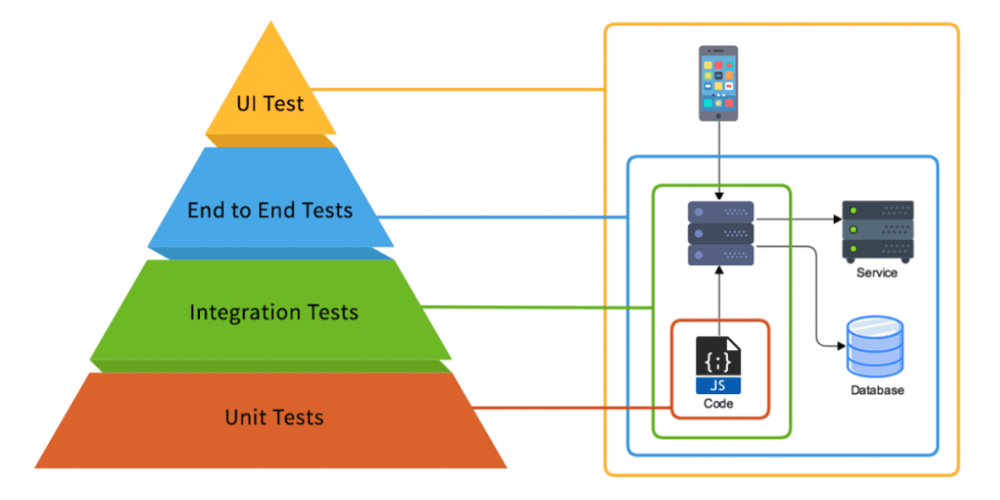

# [AI 서비스 테스트 이해](https://www.linkedin.com/pulse/unit-tests-vs-integration-end-to-end-ashraf-ragab/)

Unit Test, Integration Test, End-to-End Test의 차이와 AI 응답 검증 기준

---

---

## 오늘의 핵심 질문

AI 서비스 테스트는 단순히 "버튼이 눌리는가"만 확인하는 일이 아닙니다.

기획자는 다음 질문에 답할 수 있어야 합니다.

- 어떤 수준의 테스트가 필요한가?
- 기능 하나만 확인할 것인가, 연결 흐름까지 확인할 것인가?
- 사용자가 실제로 서비스를 쓰는 전체 흐름이 작동하는가?
- AI 응답이 정확하고, 근거가 있으며, 안전한가?
- 정상 케이스와 예외 케이스가 모두 검증되었는가?

테스트의 목적은 **서비스가 기대한 대로 작동한다는 근거를 만드는 것**입니다.

---

## Test란 무엇인가

테스트는 서비스가 의도한 기능, 품질, 안정성을 만족하는지 확인하는 과정입니다.

| 관점 | 확인 내용 |
|---|---|
| 기능성 | 사용자가 원하는 기능이 동작하는가 |
| 신뢰성 | 같은 조건에서 일관되게 동작하는가 |
| 성능 | 응답 속도와 처리 시간이 적절한가 |
| 보안 | 민감한 정보나 위험한 동작이 노출되지 않는가 |
| 사용성 | 사용자가 결과를 이해하고 다음 행동을 할 수 있는가 |

AI 서비스에서는 여기에 **응답 품질과 안전성** 검증이 추가됩니다.

---

## 테스트가 단계로 나뉘는 이유

서비스는 여러 요소가 연결되어 만들어집니다.

예를 들어 AI 상담 서비스는 다음 요소가 함께 움직입니다.

- 화면 입력
- API 요청
- 사용자 인증
- DB 조회
- RAG 검색
...

따라서 테스트도 한 가지 방식만으로는 충분하지 않습니다.

작은 기능을 빠르게 확인하는 테스트와 전체 흐름을 확인하는 테스트가 함께 필요합니다.

---

## 테스트 피라미드

테스트 피라미드는 테스트를 어떤 비율로 구성할지 설명하는 개념입니다.

| 단계 | 비중 | 특징 |
|---|---:|---|
| Unit Test | 많음 | 작고 빠르게 확인한다 |
| Integration Test | 중간 | 여러 요소의 연결을 확인한다 |
| End-to-End Test | 적음 | 실제 사용자 흐름 전체를 확인한다 |

Unit Test는 빠르고 안정적이기 때문에 많이 작성합니다.

End-to-End Test는 현실적인 검증에 강하지만 느리고 관리가 어렵기 때문에 핵심 흐름 위주로 작성합니다.

---

## 1. Unit Test란?

Unit Test는 가장 작은 단위의 기능을 독립적으로 확인하는 테스트입니다.

---
예를 들어 다음을 확인할 수 있습니다.

- 입력값 검증 함수가 잘못된 이메일을 거부하는가
- 가격 계산 함수가 올바른 금액을 반환하는가
- 금지어 필터가 위험한 입력을 감지하는가
- 응답 포맷 검사 로직이 필수 항목 누락을 찾는가

Unit Test는 전체 서비스가 아니라 **작은 기능 하나가 기대대로 동작하는지**를 봅니다.

---

## Unit Test의 장점과 한계

| 구분 | 내용 |
|---|---|
| 장점 | 빠르게 실행할 수 있다 |
| 장점 | 문제 위치를 찾기 쉽다 |
| 장점 | 코드 변경 후 기본 기능이 깨졌는지 바로 확인할 수 있다 |
| 한계 | 실제 사용자 흐름 전체를 보장하지는 않는다 |
| 한계 | 다른 시스템과 연결될 때 생기는 문제를 놓칠 수 있다 |

Unit Test는 작은 문제를 빨리 찾는 데 강합니다.

하지만 기능들이 함께 연결되었을 때의 문제는 Integration Test가 필요합니다.

---

## 2. Integration Test란?

Integration Test는 여러 기능이나 시스템 요소가 함께 연결되어 동작하는지 확인하는 테스트입니다.

---
AI 서비스에서는 다음 연결을 확인할 수 있습니다.

- Frontend와 API가 요청과 응답을 올바르게 주고받는가
- API와 DB가 필요한 데이터를 저장하고 조회하는가
- API와 RAG가 질문에 맞는 문서를 검색하는가
- RAG 결과가 LLM 프롬프트에 올바르게 전달되는가
- LLM 응답이 Guardrail 기준을 거쳐 화면에 표시되는가

Integration Test는 **각 요소가 함께 이어지는 방식**을 검증합니다.

---

## Integration Test에서 보는 것

통합된 시스템에서는 단일 기능 테스트에서 보이지 않던 문제가 나타날 수 있습니다.

| 확인 지점 | 예시 |
|---|---|
| 데이터 전달 | 화면 입력값이 API에서 다르게 해석되지 않는가 |
| 응답 형식 | API 응답을 화면이 제대로 표시할 수 있는가 |
| 저장과 조회 | DB에 저장된 데이터가 다시 정확히 조회되는가 |
| 검색 연결 | RAG 검색 결과가 LLM에 누락 없이 전달되는가 |
| 정책 연결 | Guardrail이 위험 응답을 적절히 차단하는가 |

Integration Test는 **연결 문제와 데이터 흐름 문제**를 찾는 데 중요합니다.

---

## 3. End-to-End Test란?

End-to-End Test는 사용자가 서비스를 이용하는 시작부터 끝까지의 전체 흐름을 검증하는 테스트입니다.

쉽게 말하면,

> 사용자가 실제로 서비스를 쓰는 순서대로
> 입력, 처리, 응답, 결과 확인까지 이어서 보는 테스트입니다.

E2E Test는 기능 목록보다 **사용자 목표 달성**을 기준으로 봅니다.

---

## End-to-End Test가 필요한 이유

개별 기능이 모두 정상이어도 전체 서비스는 실패할 수 있습니다.

예를 들어 다음 문제가 생길 수 있습니다.

- 화면 입력은 되었지만 API 요청 형식이 맞지 않음
- API 응답은 정상인데 화면에 결과가 표시되지 않음
- DB 데이터는 있지만 RAG 검색 대상에 포함되지 않음
- RAG 검색은 되었지만 LLM이 근거를 잘못 사용함
- AI 답변은 생성되었지만 사용자가 다음 행동을 알 수 없음

E2E Test는 이런 **전체 흐름의 실패**를 찾기 위한 검증입니다.

---

## End-to-End Test의 장점과 한계

| 구분 | 내용 |
|---|---|
| 장점 | 실제 사용자 경험에 가장 가깝게 확인할 수 있다 |
| 장점 | 여러 시스템이 연결된 상태의 문제를 발견할 수 있다 |
| 장점 | 출시 전 핵심 흐름이 작동하는지 판단하기 좋다 |
| 한계 | 실행 시간이 오래 걸릴 수 있다 |
| 한계 | 화면이나 외부 API 변화에 영향을 받기 쉽다 |
| 한계 | 모든 케이스를 E2E로 확인하면 관리 부담이 커진다 |

E2E Test는 핵심 사용자 흐름 위주로 설계하는 것이 좋습니다.

---

## 세 가지 테스트 비교

| 구분 | Unit Test | Integration Test | End-to-End Test |
|---|---|---|---|
| 검증 범위 | 기능 하나 | 여러 요소의 연결 | 사용자 흐름 전체 |
| 실행 속도 | 빠름 | 보통 | 느림 |
| 문제 발견 | 작은 로직 오류 | 연결과 데이터 흐름 오류 | 실제 사용 흐름 오류 |
| 예시 | 입력값 검증 함수 | API와 DB 연결 | 회원가입부터 결과 확인까지 |
| 기획자 관점 | 기준이 명확한가 | 요소 간 연결이 맞는가 | 사용자가 목표를 달성하는가 |

세 테스트는 경쟁 관계가 아니라 서로 다른 범위를 맡는 검증 방식입니다.

---

## AI 서비스에서 테스트가 더 어려운 이유

AI 서비스는 일반 기능보다 결과가 고정적이지 않을 수 있습니다.

같은 질문에도 표현이 달라질 수 있고, 문서 검색 결과에 따라 답변이 달라질 수 있습니다.

기획자는 다음 특성을 고려해야 합니다.

- 정답이 하나로 고정되지 않는 경우가 많다
- 답변이 그럴듯해 보여도 사실과 다를 수 있다
- 근거 문서와 다른 내용을 섞어 말할 수 있다
- 사용자 입력이 예상보다 다양하다
- 안전 정책과 금지 응답 기준이 필요하다

따라서 AI 서비스 테스트는 기능 동작과 함께 **응답 품질 기준**을 확인해야 합니다.

---

## AI 서비스 테스트 범위 예시

| 테스트 수준 | AI 서비스 예시 |
|---|---|
| Unit Test | 입력값 검사, 금지어 탐지, 응답 형식 검사 |
| Integration Test | API, RAG, LLM, Guardrail 연결 확인 |
| End-to-End Test | 사용자가 질문하고 답변과 출처를 확인하는 전체 흐름 |

예를 들어 사내 규정 챗봇이라면 다음을 나누어 볼 수 있습니다.

- Unit: 질문 텍스트가 비어 있으면 오류로 처리되는가
- Integration: 질문에 맞는 규정 문서가 검색되고 LLM에 전달되는가
- E2E: 사용자가 질문 후 이해 가능한 답변과 출처를 확인하는가

---

## 정상 케이스 검증

정상 케이스는 사용자가 기대한 방식대로 서비스를 이용하는 상황입니다.

예를 들어 AI 문서 검색 서비스라면 다음을 확인합니다.

| 항목 | 확인 질문 |
|---|---|
| 입력 | 사용자가 자연어 질문을 입력할 수 있는가 |
| 검색 | 질문과 관련 있는 문서가 검색되는가 |
| 응답 | AI가 질문에 맞는 답변을 제공하는가 |
| 근거 | 답변에 사용된 문서나 출처가 표시되는가 |
| 화면 | 사용자가 결과를 이해할 수 있는가 |

정상 케이스는 서비스의 기본 약속이 지켜지는지 확인하는 기준입니다.

---

## 예외 케이스 검증

예외 케이스는 사용자가 예상과 다른 입력을 하거나 시스템이 원하는 결과를 만들 수 없는 상황입니다.

예를 들어 다음을 확인합니다.

| 상황 | 기대 결과 |
|---|---|
| 질문이 비어 있음 | 입력을 요청하는 안내를 보여준다 |
| 검색 결과가 없음 | 근거가 부족하다고 안내한다 |
| 개인정보가 포함됨 | 민감정보 입력을 제한하거나 주의 문구를 보여준다 |
| 금지된 요청 | 정책상 답변할 수 없음을 안내한다 |
| LLM 응답 실패 | 잠시 후 다시 시도하라는 메시지를 보여준다 |

예외 케이스 테스트는 사용자가 실패 상황에서도 이유와 다음 행동을 알 수 있게 만드는 검증입니다.

---

## AI 응답 검증 기준

AI 응답은 "답변이 나왔다"만으로 통과시키기 어렵습니다.

| 기준 | 확인 질문 |
|---|---|
| 정확성 | 사실과 다르지 않은가 |
| 관련성 | 사용자 질문에 직접 답하고 있는가 |
| 근거성 | 검색된 문서나 제공된 정보에 기반하는가 |
| 완결성 | 필요한 설명을 빠뜨리지 않았는가 |
| 안전성 | 개인정보, 차별, 위험 행동을 유도하지 않는가 |
| 일관성 | 같은 조건에서 지나치게 다른 답을 하지 않는가 |

AI 응답 검증은 서비스 신뢰를 판단하는 핵심 테스트입니다.

---

## 테스트 시나리오 작성

테스트 시나리오는 검증할 상황을 구체적으로 적은 문서입니다.

| 항목 | 작성 내용 |
|---|---|
| 테스트 ID | TC-001처럼 식별 가능한 번호 |
| 테스트 수준 | Unit, Integration, E2E 중 어디에 해당하는가 |
| 목적 | 무엇을 확인하려는가 |
| 사전 조건 | 테스트 전에 필요한 상태는 무엇인가 |
| 입력값 | 사용자가 어떤 값을 입력하는가 |
| 기대 결과 | 어떤 결과가 나오면 통과인가 |
| 판정 기준 | 통과와 실패를 어떻게 구분하는가 |

---

## 테스트 결과 기록

테스트는 실행 후 결과를 남겨야 의미가 있습니다.

| 항목 | 기록 내용 |
|---|---|
| 테스트 ID | 어떤 시나리오를 실행했는가 |
| 실제 결과 | 실제로 어떤 결과가 나왔는가 |
| 판정 | 통과, 실패, 보류 중 무엇인가 |
| 문제 유형 | 화면, 데이터, 검색, 응답, 정책 중 어디인가 |
| 재현 조건 | 같은 문제가 다시 발생하는 조건은 무엇인가 |
| 확인자 | 누가 판단했는가 |

테스트 기록은 감상이 아니라 다음 판단을 위한 근거가 되어야 합니다.

---

## 기획자가 확인할 질문

AI 서비스 테스트에서 기획자는 다음 질문을 확인합니다.

- 이 테스트는 Unit, Integration, E2E 중 어디에 해당하는가?
- 핵심 사용자 흐름이 E2E로 검증되었는가?
- 정상 케이스와 예외 케이스가 모두 포함되었는가?
- AI 응답의 정확성, 근거성, 안전성을 확인했는가?
- 테스트 통과 기준이 주관적 표현이 아니라 확인 가능한 기준인가?
- 실패 상황에서 사용자가 이유와 다음 행동을 알 수 있는가?

기획자의 역할은 테스트 기준을 사용자 가치와 서비스 위험에 맞게 정의하는 것입니다.

---

## 오늘의 정리

AI 서비스 테스트는 기능이 실행되는지 확인하는 것에서 끝나지 않습니다.

오늘의 핵심은 세 가지입니다.

1. Unit Test는 작은 기능을 빠르게 확인한다
2. Integration Test는 시스템 요소 간 연결과 데이터 흐름을 확인한다
3. End-to-End Test는 실제 사용자 흐름 전체가 목표를 달성하는지 확인한다

AI 서비스에서는 여기에 응답의 정확성, 근거성, 안전성까지 함께 검증해야 합니다.

