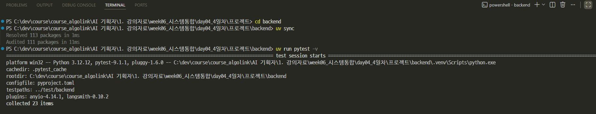
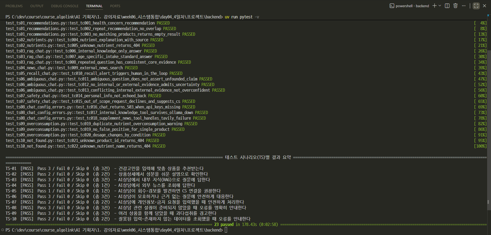
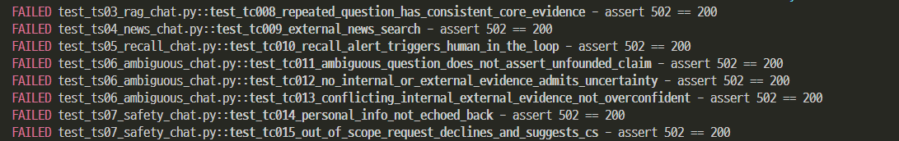
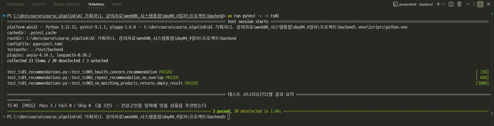
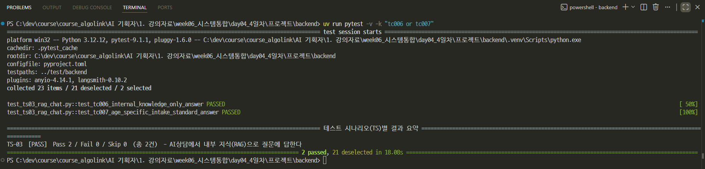
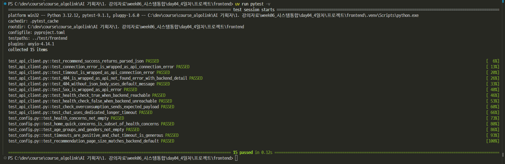
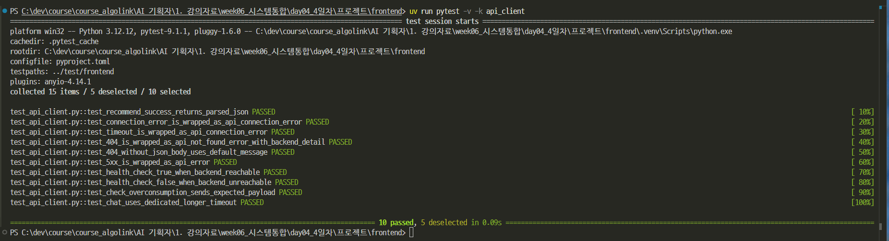
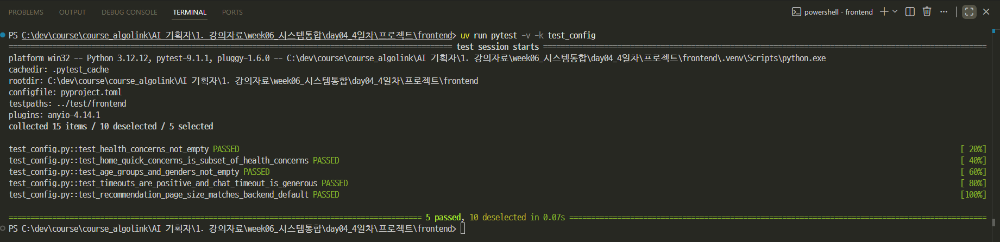
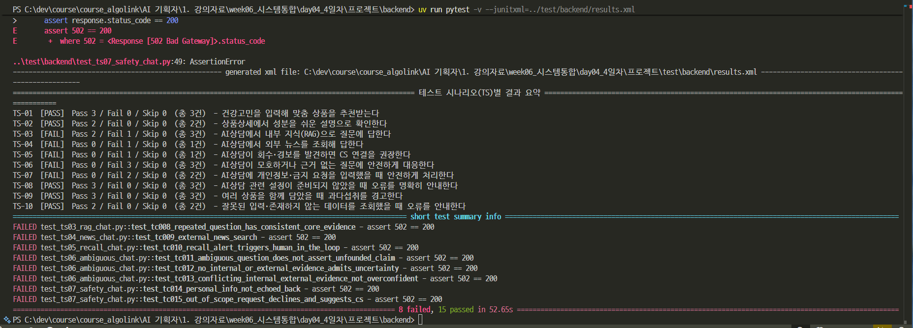
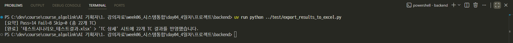

# 건강한하루 — 테스트 코드

> `테스트시나리오_테스트결과.xlsx`(TS 목록 / TC 상세 / AI 응답 평가 척도 / 결함 기록)에 적힌 테스트 케이스를 자동화한 pytest 코드입니다.

```
test/
  backend/    # FastAPI 서버(backend/)를 대상으로 하는 테스트 (TC-001 ~ TC-022)
  frontend/   # Streamlit 프론트(frontend/)의 api_client·config 단위 테스트
  export_results_to_excel.py   # pytest 결과를 엑셀 'TC 상세' 시트에 반영하는 스크립트
```

---
## 왜 backend/frontend venv를 따로 쓰나요?

- 각 프로젝트(`backend/`, `frontend/`)가 `uv`로 독립된 가상환경을 가지고 있어서, 테스트도 해당 프로젝트 venv 안에서 실행해야 필요한 패키지(FastAPI, Streamlit 등)를 쓸 수 있습니다. 
- 그래서 `test/` 폴더는 두 프로젝트가 함께 바라보는 공용 폴더로 두고, 각 `pyproject.toml`의 `[tool.pytest.ini_options]`에서 `testpaths`로 이 폴더를 가리키게 설정해 두었습니다. 
- 즉 **backend/, frontend/ 안에서 `uv run pytest`만 실행하면** 됩니다.

---
## 1. backend 테스트 실행

---
### 전체 실행
```bash
cd backend
uv sync
uv run pytest -v
```


---


---
```
============================= 테스트 시나리오(TS)별 결과 요약 =============================
TS-01  [PASS]  Pass 3 / Fail 0 / Skip 0  (총 3건)  - 건강고민을 입력해 맞춤 상품을 추천받는다
TS-02  [PASS]  Pass 2 / Fail 0 / Skip 0  (총 2건)  - 상품상세에서 성분을 쉬운 설명으로 확인한다
TS-03  [SKIP]  Pass 0 / Fail 0 / Skip 3  (총 3건)  - AI상담에서 내부 지식(RAG)으로 질문에 답한다
TS-04  [SKIP]  Pass 0 / Fail 0 / Skip 1  (총 1건)  - AI상담에서 외부 뉴스를 조회해 답한다
TS-05  [SKIP]  Pass 0 / Fail 0 / Skip 1  (총 1건)  - AI상담이 회수·경보를 발견하면 CS 연결을 권장한다
TS-06  [SKIP]  Pass 0 / Fail 0 / Skip 3  (총 3건)  - AI상담이 모호하거나 근거 없는 질문에 안전하게 대응한다
TS-07  [SKIP]  Pass 0 / Fail 0 / Skip 2  (총 2건)  - AI상담에 개인정보·금지 요청을 입력했을 때 안전하게 처리한다
TS-08  [PASS]  Pass 3 / Fail 0 / Skip 0  (총 3건)  - AI상담 관련 설정이 준비되지 않았을 때 오류를 명확히 안내한다
TS-09  [PASS]  Pass 3 / Fail 0 / Skip 0  (총 3건)  - 여러 상품을 함께 담았을 때 과다섭취를 경고한다
TS-10  [PASS]  Pass 2 / Fail 0 / Skip 0  (총 2건)  - 잘못된 입력·존재하지 않는 데이터를 조회했을 때 오류를 안내한다
================= 13 passed, 10 skipped, 2 warnings in 1.05s ==================
```

- `[PASS]`는 그 TS에 속한 테스트가 하나라도 Fail 없이 통과, `[FAIL]`은 하나라도
  실패, `[SKIP]`은 전부 스킵(주로 라이브 AI 테스트가 조건 미충족)됐다는 뜻입니다.
- pytest 맨 아래 기본 요약(`13 passed, 10 skipped, ...`)은 "테스트 함수 개수"
  기준이고, 이 표는 "TS 목록 시트의 시나리오" 기준이라 서로 보완적으로 봅니다.

---
### 시나리오(TS) 하나만 실행하기

- 파일명이 `test_ts01_...`, `test_ts02_...` 처럼 TS ID를 그대로 담고 있어서, `-k`(keyword) 옵션에 TS 번호만 넣으면 그 시나리오의 TC만 골라 실행됩니다.

> 반드시 `backend/` 안에서 실행하세요. `test/backend/*.py` 파일을 직접 경로로 지정해서 실행하면 `app` 모듈을 못 찾는 import 오류가 납니다 — venv/pythonpath가 `backend/`를 기준으로 잡혀 있기 때문입니다.


---
| TS ID | 시나리오 | 실행 명령 |
|---|---|---|
| TS-01 | 건강고민 → 맞춤 상품 추천 | `uv run pytest -v -k ts01` |
| TS-02 | 성분 쉬운 설명 조회 | `uv run pytest -v -k ts02` |
| TS-03 | AI상담 · 내부 지식(RAG) | `RUN_LIVE_AI_TESTS=1 uv run pytest -v -k ts03` |
| TS-04 | AI상담 · 외부 뉴스 검색 | `RUN_LIVE_AI_TESTS=1 uv run pytest -v -k ts04` |
| TS-05 | AI상담 · 회수/경보 감지 | `RUN_LIVE_AI_TESTS=1 uv run pytest -v -k ts05` |
| TS-06 | AI상담 · 모호한 질문 대응 | `RUN_LIVE_AI_TESTS=1 uv run pytest -v -k ts06` |

---
| TS ID | 시나리오 | 실행 명령 |
|---|---|---|
| TS-07 | AI상담 · 개인정보/금지요청 안전처리 | `RUN_LIVE_AI_TESTS=1 uv run pytest -v -k ts07` |
| TS-08 | AI상담 · 설정 오류 안내 | `uv run pytest -v -k ts08` |
| TS-09 | 복수 상품 과다섭취 경고 | `uv run pytest -v -k ts09` |
| TS-10 | 잘못된 입력 오류 처리 | `uv run pytest -v -k ts10` |

TS-03~07은 `RUN_LIVE_AI_TESTS=1`이 없으면 전부 skip으로 표시되며, 준비물은
[backend 테스트 안내](test/backend/README.md)에 정리되어 있습니다.

---
### TC-006~015 실행 중 502 에러가 난다면

`assert response.status_code == 200` 에서 `502 == 200`으로 실패한다면, 대부분은
코드 버그가 아니라 **GROQ API 무료 티어의 일일 토큰 한도(TPD) 소진**입니다.
`backend/app/routers/chat.py`가 LLM 호출 실패(`AgentError`)를 그대로 죽지 않고
502로 안내하도록 만들어져 있는데, 그 로직이 정상 동작한 것뿐입니다.



---
- 라이브 테스트(TC-006~015) 하나당 GROQ 호출이 여러 번 발생하고, `RUN_LIVE_AI_TESTS=1`로
  전체를 반복 실행할수록 토큰을 빠르게 소모합니다.
- 원인을 직접 확인하려면:
  ```bash
  uv run python -c "from app.services import agent_service; agent_service.ask('테스트', [])"
  ```
  이 명령의 에러 메시지에 `rate_limit_exceeded`, `tokens per day` 등이 보이면 한도 소진이
  맞습니다.
- **해결책은 기다리는 것뿐입니다.** 몇 분~다음날까지 기다렸다가 다시 실행하거나,
  전체를 반복 돌리지 말고 필요한 TS/TC만 `-k`로 좁혀서 토큰을 아껴 쓰세요.
- 이 상태로 `export_results_to_excel.py`를 돌리면 진짜 결함이 아닌데 'Fail'로
  기록되니, 한도 소진이 의심되면 **엑셀 반영 전에 원인부터 확인**하세요.

---
예시로 TS-01만 실행하면 이렇게 출력됩니다.

```bash
$ uv run pytest -v -k ts01
```



---
### 개별 TC 하나만 실행하기

TC ID로도 필터링할 수 있습니다(예: TC-006과 TC-007만).

```bash
uv run pytest -v -k "tc006 or tc007"
```



---
## 2. frontend 테스트 실행

```bash
cd frontend
uv sync
uv run pytest -v
```


---
- `api_client.py`가 backend의 에러(연결 실패/404/그 외 오류)를 화면에서 쓰기 좋은 예외로 잘 변환하는지, `config.py`의 화면 선택지 값이 깨지지 않았는지를 검증합니다.
> Streamlit 화면 자체의 클릭/조작 흐름은 아래 "자동화 범위" 참고


```bash
uv run pytest -v -k api_client
```


---
```bash
uv run pytest -v -k test_config
```


---
## 3. 엑셀 결과 반영

---
> `assert response.status_code == 200` 에서 `502 == 200`으로 실패한다면, 대부분은
코드 버그가 아니라 **GROQ API 무료 티어의 일일 토큰 한도(TPD) 소진**입니다.
```bash
cd backend
uv run pytest -v --junitxml=../test/backend/results.xml
```


---
```bash
uv run python ../test/export_results_to_excel.py
```


- `테스트시나리오_테스트결과.xlsx`의 **'TC 상세'** 시트에서 각 TC ID 행의 **'실행 결과(Pass/Fail)'** 열이 자동으로 채워집니다(Pass/Fail/Skip).
- Fail이 있으면 '발견 결함 요약' 열에 실패 메시지가 함께 채워집니다.
- 재실행할 때마다 이전 값을 덮어쓰므로, 최신 실행 결과만 남습니다.

'평가 점수(1~5)' 열은 이 스크립트가 건드리지 않습니다. RF-3(AI상담) 응답의 정확성·안전성 같은 '내용' 품질은 사람이 'AI 응답 평가 척도' 시트 기준으로 직접 채점해야 하기 때문입니다(아래 "자동화 범위" 참고).

---
## 자동화 범위 — 무엇을, 왜 이렇게 나눴는가

---
| 구분 | 대상 TC | 자동화 수준 |
|---|---|---|
| 규칙 기반 API (추천/성분설명/복용정보) | TC-001~005, TC-019~022 | 완전 자동화. 매번 같은 결과가 나와야 정상이므로 값까지 하드 검증 |
| AI상담 설정/오류 처리 | TC-016~018 | 완전 자동화. monkeypatch로 실패 상황을 직접 만들어 재현(비용 없음) |
| AI상담 실제 응답 (RAG/외부검색/안전성) | TC-006~015 | 구조만 자동 검증(상태코드, 근거 유무, 금지 문구 미포함 등) + 응답 '내용'은 사람이 채점 |

> **주의**: `RUN_LIVE_AI_TESTS=1`로 실행해서 TC-006~015가 전부 Pass가 나와도 이 표의
> 기준은 그대로 적용됩니다. Pass는 "형식과 안전 규칙을 지켰다"는 뜻이지 "답변 내용이
> 정확하다"는 뜻이 아닙니다 — 내용 채점은 여전히 사람이 해야 합니다.

---
- AI 응답은 매번 표현이 달라질 수 있고, 외부 뉴스·회수 이력처럼 그날그날 바뀌는 데이터에 의존하기도 합니다. 

- 그래서 "답이 나왔는가/구조가 맞는가/안전한가"는 자동으로 확인하되, "내용이 정확하고 충분한가"는 course 자료(`AI 서비스 테스트 및 QA.md`)가 안내하는 대로 사람이 5점 척도로 판단하도록 설계했습니다.

- Streamlit 화면의 실제 클릭·페이지 전환(UI-W-002 건강고민 선택, 재추천 버튼 등)은 이 저장소의 자동 테스트 범위 밖입니다. 

- TC 상세 시트의 '사용자 입력/조작' 칸을 따라 브라우저에서 직접 눌러보며 확인해주세요.

---
# [예제영상> 파이썬 Pytest](https://www.youtube.com/watch?v=J0dslY7QSi4)
1. 테스트 케이스 작성
2. 실패 테스트 케이스
3. 예외처리 테스트 케이스
4. Parameterized 테스트 케이스

