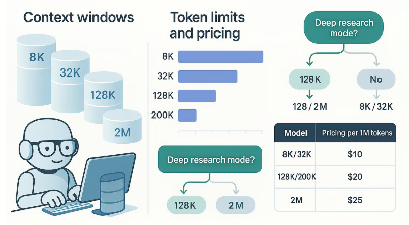
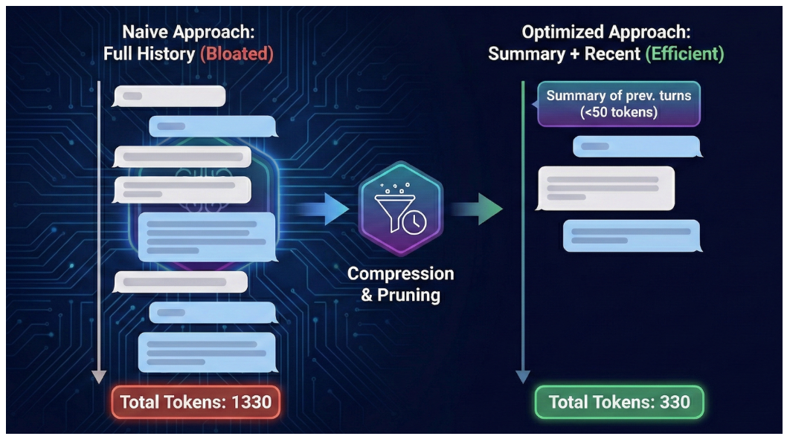
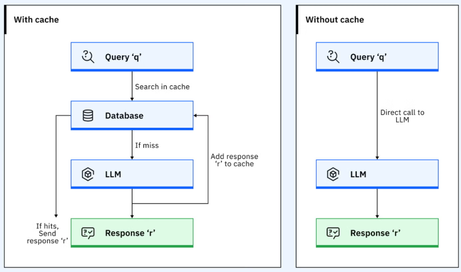

# AI 서비스 운영 및 비용 관리

LLM API 비용을 이해하고 안정적으로 운영하는 방법

---

## 오늘의 핵심 질문

AI 서비스는 만들어서 배포하면 끝나는 기능이 아닙니다.

기획자는 다음 질문에 답할 수 있어야 합니다.

- LLM API 비용은 어떤 기준으로 발생하는가?
- Token이 많아지면 비용과 속도에 어떤 영향이 있는가?
- 반복 요청을 줄여 비용을 최적화할 수 있는가?
- 운영 중 무엇을 모니터링해야 하는가?
- 비용, 품질, 속도 사이에서 어떤 기준으로 의사결정할 것인가?

AI 서비스 운영은 **품질을 유지하면서 비용과 위험을 관리하는 일**입니다.

---

## AI 서비스 운영이란?

AI 서비스 운영은 사용자가 실제로 서비스를 이용하는 동안 품질과 비용을 관리하는 활동입니다.

| 영역 | 확인 내용 |
|---|---|
| 비용 | API 호출과 Token 사용량이 적정한가 |
| 품질 | AI 답변이 정확하고 유용한가 |
| 속도 | 사용자가 기다릴 수 있는 시간 안에 응답하는가 |
| 안정성 | 오류와 실패가 반복되지 않는가 |
| 안전성 | 개인정보, 금지 응답, 위험 답변이 통제되는가 |

AI 서비스 운영은 기술 문제만이 아니라 서비스 지속 가능성의 문제입니다.

---

## LLM API 비용 구조

LLM API 비용은 보통 사용량 기반으로 발생합니다.

| 비용 요소 | 의미 |
|---|---|
| 입력 Token | 사용자의 질문, 시스템 지시, 참고 문서에 해당 |
| 출력 Token | AI가 생성한 답변에 해당 |
| 모델 종류 | 고성능 모델일수록 단가가 높을 수 있음 |
| 호출 횟수 | API를 몇 번 호출했는가 |
| 부가 기능 | 임베딩, 이미지, 음성, 도구 호출 등이 포함될 수 있음 |

실제 단가는 모델과 제공 업체에 따라 바뀌므로, 운영 전에는 최신 가격표를 확인해야 합니다.

---

## 비용이 커지는 주요 이유

LLM API 비용은 다음 상황에서 커질 수 있습니다.

- 질문마다 긴 시스템 프롬프트를 반복해서 보냄
- RAG 문서를 너무 많이 함께 전달함
- AI 답변이 불필요하게 길어짐
- 한 화면에서 여러 번 API를 호출함
- 사용자가 같은 질문을 반복함
- 고성능 모델이 필요 없는 상황에도 항상 비싼 모델을 사용함

비용 관리는 단가를 낮추는 것보다 **불필요한 사용량을 줄이는 것**에서 시작합니다.

---

## Token이란?

Token은 LLM이 문장을 처리하는 작은 단위입니다.

쉽게 말하면,

> AI가 글을 읽고 쓰기 위해 문장을 잘게 나눈 조각입니다.

한글, 영어, 숫자, 기호는 모델에 따라 Token으로 나뉘는 방식이 다를 수 있습니다.

기획자는 Token을 정확히 계산하는 전문가가 될 필요는 없지만,
글이 길어질수록 비용과 처리 시간이 늘어난다는 점은 이해해야 합니다.

---

---

## 입력 Token과 출력 Token

LLM 비용은 보통 입력과 출력으로 나누어 볼 수 있습니다.

| 구분 | 포함되는 내용 | 비용 영향 |
|---|---|---|
| 입력 Token | 사용자 질문, 시스템 프롬프트, 이전 대화, RAG 문서 | 길수록 비용 증가 |
| 출력 Token | AI가 생성한 답변 | 답변이 길수록 비용 증가 |

AI 서비스에서 비용을 줄이려면 입력과 출력 모두를 관리해야 합니다.

---

## Token이 서비스에 미치는 영향

Token은 비용뿐 아니라 서비스 경험에도 영향을 줍니다.

| 영향 | 설명 |
|---|---|
| 비용 | Token 사용량이 많을수록 API 비용 증가 |
| 속도 | 긴 입력과 출력은 응답 시간을 늘릴 수 있음 |
| 품질 | 너무 많은 문서를 넣으면 핵심이 흐려질 수 있음 |
| 안정성 | 길이가 제한을 넘으면 요청이 실패할 수 있음 |

Token 관리는 비용 절감뿐 아니라 응답 품질과 안정성을 위한 설계입니다.

---

## Token을 줄이는 기획 기준

Token을 줄인다고 무조건 좋은 것은 아닙니다.

중요한 것은 필요한 정보는 남기고 불필요한 정보는 줄이는 것입니다.

| 줄일 수 있는 항목 | 기획 판단 |
|---|---|
| 너무 긴 안내 문구 | 핵심 지시만 남김 |
| 반복되는 시스템 설명 | 공통 규칙으로 정리 |
| 불필요한 이전 대화 | 현재 질문에 필요한 맥락만 유지 |
| 과도한 RAG 문서 | 관련성 높은 문서만 전달 |
| 장황한 답변 | 답변 형식을 간결하게 제한 |

Token 절감은 사용자가 필요한 답을 더 빠르고 안정적으로 받게 만드는 방법입니다.

---

---

## 비용 산정의 기본식

정확한 비용은 모델 단가에 따라 달라지지만, 기본 구조는 단순합니다.

> 예상 비용 = 사용 횟수 × 평균 Token 사용량 × 모델 단가

기획자는 다음 항목을 추정해야 합니다.

- 하루 또는 월간 사용자 수
- 사용자 1명당 평균 질문 수
- 질문 1회당 평균 입력 Token
- 질문 1회당 평균 출력 Token
- 사용할 모델 종류
- RAG, 임베딩, 도구 호출 여부

비용 산정은 완벽한 예측보다 운영 전 위험을 가늠하기 위한 기준입니다.

---

## 비용 산정 시나리오

비용은 하나의 숫자로만 보면 위험합니다.

다음처럼 세 가지 시나리오로 보는 것이 좋습니다.

| 시나리오 | 의미 |
|---|---|
| 낮은 사용량 | 초기 사용자 또는 제한된 사용 |
| 보통 사용량 | 예상되는 일반적인 사용 |
| 높은 사용량 | 이벤트, 홍보, 갑작스러운 증가 |

AI 기능은 사용량이 늘수록 비용도 함께 늘 수 있으므로, 상한선과 알림 기준이 필요합니다.

---

## [캐싱이란?](https://www.ibm.com/kr-ko/think/tutorials/implement-prompt-caching-langchain)

캐싱은 자주 쓰는 결과를 저장해두고 다시 사용하는 방식입니다.

쉽게 말하면,

> 같은 요청에 대해 매번 새로 계산하지 않고,
> 이전 결과를 재사용해 비용과 시간을 줄이는 방법입니다.

AI 서비스에서 캐싱은 비용 최적화와 응답 속도 개선에 도움이 됩니다.

---

---

## AI 서비스에서 캐싱할 수 있는 것

| 캐싱 대상 | 예시 |
|---|---|
| 자주 묻는 질문의 답변 | 배송 정책, 환불 기준, 기본 안내 |
| RAG 검색 결과 | 같은 질문에 대한 관련 문서 목록 |
| 임베딩 결과 | 이미 변환한 문서나 질문의 벡터 |
| 시스템 프롬프트 일부 | 반복되는 고정 지시문 |
| 사용자 세션 정보 | 같은 대화 안에서 반복되는 조건 |

캐싱은 반복되는 작업을 줄이는 운영 전략입니다.

---

## 캐싱 시 주의할 점

캐싱은 비용을 줄이지만 항상 안전한 것은 아닙니다.

| 주의점 | 설명 |
|---|---|
| 최신성 | 정책이나 가격이 바뀌면 오래된 답변이 나갈 수 있음 |
| 개인정보 | 개인 맞춤 답변을 다른 사용자에게 재사용하면 안 됨 |
| 권한 | 사용자 권한에 따라 볼 수 있는 정보가 다를 수 있음 |
| 품질 | 잘못된 답변을 캐싱하면 같은 오류가 반복됨 |
| 삭제 기준 | 캐시를 언제 지울지 기준이 필요함 |

기획자는 무엇을 캐싱할 수 있고, 무엇을 캐싱하면 안 되는지 구분해야 합니다.

---

## 비용 최적화 방법

비용 최적화는 품질을 낮추는 일이 아닙니다.

| 방법 | 설명 |
|---|---|
| 모델 선택 | 쉬운 요청은 가벼운 모델, 어려운 요청은 고성능 모델 사용 |
| Token 제한 | 입력 문서와 출력 길이를 필요한 만큼만 유지 |
| RAG 문서 수 조정 | 관련성 높은 문서만 LLM에 전달 |
| 캐싱 활용 | 반복 요청은 재사용 |
| 답변 형식 고정 | 불필요하게 긴 답변 방지 |
| 호출 횟수 줄이기 | 한 흐름에서 API 호출을 과도하게 나누지 않음 |

좋은 최적화는 비용, 속도, 품질의 균형을 맞추는 것입니다.

---

## 비용 최적화의 기준

무조건 가장 저렴한 방식이 좋은 것은 아닙니다.

기획자는 다음 기준으로 판단합니다.

- 사용자가 체감하는 답변 품질이 유지되는가?
- 응답 시간이 너무 길어지지 않는가?
- 중요한 질문에서 정확성을 희생하지 않는가?
- 민감하거나 위험한 답변에서 안전성이 유지되는가?
- 운영 비용이 예상 가능한 범위에 있는가?

비용 최적화는 사용자 가치가 유지되는 선에서 이루어져야 합니다.

---

## 운영 모니터링이란?

운영 모니터링은 서비스가 실제로 잘 동작하는지 계속 확인하는 활동입니다.

| 모니터링 항목 | 확인 내용 |
|---|---|
| 사용량 | 호출 수, 사용자 수, 질문 수 |
| 비용 | 일별, 월별 API 비용 |
| Token | 평균 입력 Token, 평균 출력 Token |
| 속도 | 응답 시간, 지연 구간 |
| 오류 | API 실패, 검색 실패, 응답 실패 |
| 품질 | 낮은 평가, 신고, 재질문 비율 |
| 안전 | 개인정보 감지, 금지 응답 차단 |

---

## 운영 지표 예시

기획자가 볼 수 있는 기본 지표는 다음과 같습니다.

| 지표 | 의미 |
|---|---|
| API 호출 수 | AI 기능이 얼마나 사용되는가 |
| 평균 비용 | 질문 1회당 비용이 어느 정도인가 |
| 평균 응답 시간 | 사용자가 얼마나 기다리는가 |
| 실패율 | 오류나 무응답이 얼마나 발생하는가 |
| 재질문 비율 | 사용자가 답변에 만족하지 못했을 가능성 |
| 캐시 적중률 | 캐싱이 얼마나 효과적인가 |
| 금지 응답 차단 수 | 위험 요청이 얼마나 발생하는가 |

---

## 알림 기준이 필요한 이유

AI 서비스는 사용량이 갑자기 늘거나 답변 품질이 떨어질 수 있습니다.

따라서 사전에 알림 기준을 정해야 합니다.

| 상황 | 알림 기준 예시 |
|---|---|
| 비용 급증 | 하루 비용이 예상 범위를 초과함 |
| Token 급증 | 평균 입력 또는 출력 길이가 갑자기 증가함 |
| 오류 증가 | API 실패율이 일정 기준을 넘음 |
| 속도 저하 | 평균 응답 시간이 길어짐 |
| 안전 위험 | 개인정보 또는 금지 요청 감지가 증가함 |

알림 기준은 운영자가 빠르게 대응할 수 있게 만드는 안전장치입니다.

---

## 운영 중 개선 흐름

운영 데이터는 개선으로 이어져야 합니다.

1. 사용량과 비용을 확인한다
2. Token이 많이 쓰이는 구간을 찾는다
3. 응답 품질이 낮은 질문 유형을 찾는다
4. 오류와 지연이 발생하는 흐름을 확인한다
5. 캐싱, 프롬프트, RAG, 모델 선택을 조정한다
6. 개선 후 지표가 좋아졌는지 다시 확인한다

운영은 한 번 설정하고 끝나는 것이 아니라 계속 조정하는 과정입니다.

---

## 기획자가 확인할 질문

AI 서비스 운영과 비용 관리를 검토할 때는 다음을 확인합니다.

- 사용량이 늘어났을 때 비용이 어느 정도 증가하는가?
- Token을 많이 쓰는 화면이나 질문 유형은 무엇인가?
- 캐싱해도 되는 응답과 캐싱하면 안 되는 응답이 구분되어 있는가?
- 비용을 줄여도 답변 품질과 안전성이 유지되는가?
- 오류, 속도, 비용, 품질을 볼 수 있는 지표가 있는가?
- 비용이나 품질 이상 상황을 알려주는 기준이 있는가?

이 질문들이 AI 서비스 운영 전략의 기본 체크리스트가 됩니다.

---

## 오늘의 정리

AI 서비스 운영 및 비용 관리는 사용량, 비용, 품질, 안전성을 함께 보는 과정입니다.

오늘의 핵심은 네 가지입니다.

1. LLM API 비용은 주로 호출 수, 입력 Token, 출력 Token, 모델 단가에 영향을 받는다
2. Token은 비용, 속도, 품질, 안정성에 모두 영향을 준다
3. 캐싱과 모델 선택, Token 제한은 비용 최적화의 핵심 방법이다
4. 운영 모니터링은 비용 급증, 오류, 품질 저하를 빠르게 발견하기 위한 기준이다

기획자의 역할은 AI 기능을 만드는 데서 끝나지 않고
**지속 가능한 비용과 품질로 운영될 수 있는 기준을 설계하는 것**입니다.

---
# [예제영상> AI 모델과 토큰 개념](https://www.youtube.com/watch?v=5RF90hDY00E)
- LLM(대규모 언어 모델)의 기본 원리와 작동 방식
- 토큰의 개념과 토큰화 방식 (영어/한국어/코드)
- 입력 토큰과 출력 토큰의 차이와 비용 계산법
- 대화에서의 토큰 누적과 비용 증가 원리
- 토큰 기반 비용 최적화 전략 (모델 선택, 프롬프트 최적화)
- 한국어와 영어의 토큰 사용량 차이 분석

