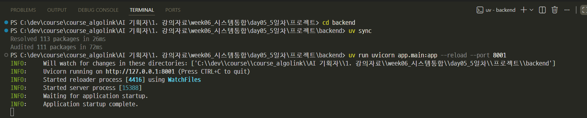
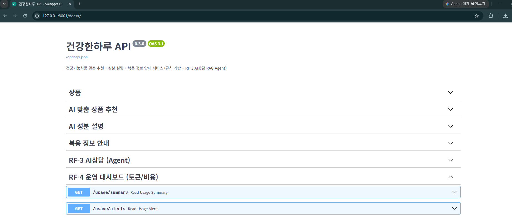
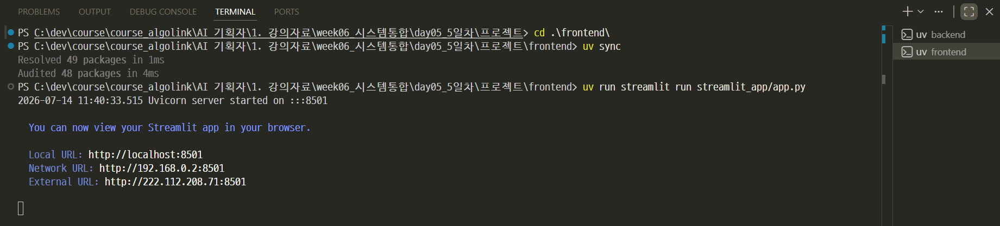
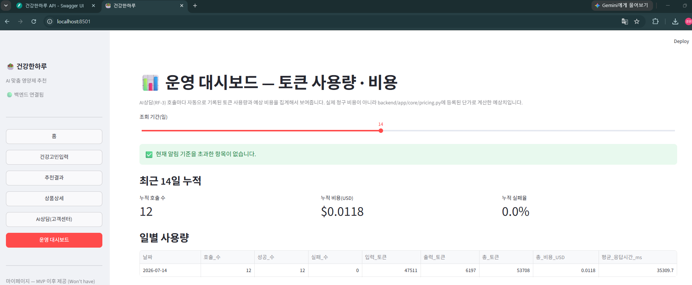
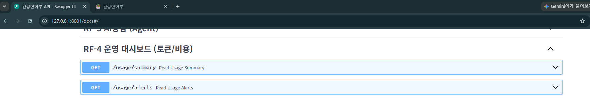
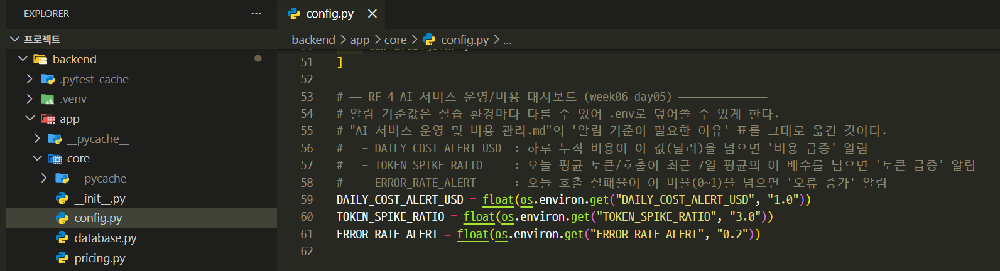
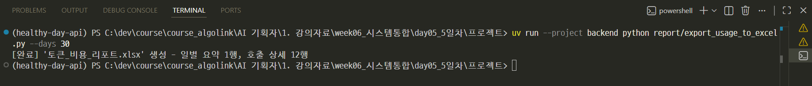
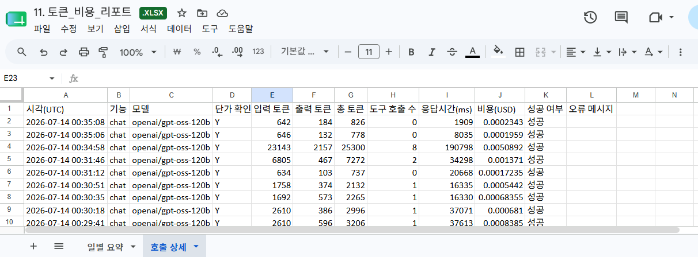
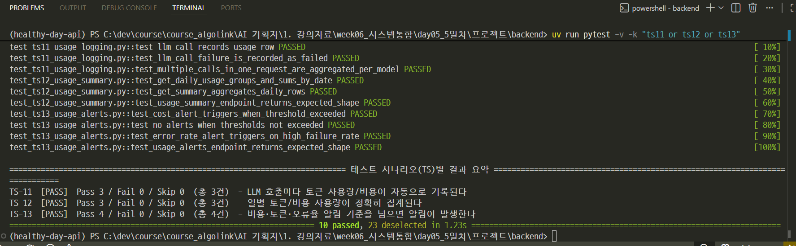

# 건강한하루 — 토큰 사용량 · 비용 자동 계산

> "AI 서비스 운영 및 비용 관리.md" 강의를 day04에서 만든 '건강한하루' AI상담(RF-3) 위에 실제로 적용한 RF-4(운영 대시보드) 구현이다.

---
>  day04가 "테스트시나리오를 pytest로 자동화"했다면, day05는 "LLM 호출을 토큰/비용으로 자동 계측"한다.

```
day05_5일차/프로젝트/
  backend/    # day04 backend + RF-4 사용량 계측/집계/알림 (app/core/pricing.py,
              # app/models/usage_log.py, app/services/usage_service.py,
              # app/routers/usage.py)
  frontend/   # day04 frontend + 운영 대시보드 화면 (ui/usage_dashboard.py)
  test/       # day04 테스트(TS-01~10) 그대로 + TS-11~13(사용량 계측/집계/알림)
  report/     # export_usage_to_excel.py — 토큰/비용 리포트 엑셀 생성
```


---
## 1. 무엇이 자동으로 계산되나

AI상담(`POST /chat`)을 호출할 때마다 `agent_service.ask()` 안에서 `usage_service.track_usage("chat")`가 다음을 자동으로 기록한다(사람이 직접 토큰을 세지 않는다).

| 계측 항목 | 방법 |
|---|---|
| 입력/출력 토큰 | LangChain `get_usage_metadata_callback()` — Tool 호출 루프로 LLM이 여러 번 불려도 모델별로 자동 합산 |
| 비용(USD) | `app/core/pricing.py`의 모델별 단가표 × 토큰 수 |
| 도구(Tool) 호출 수 | 응답 메시지 중 `ToolMessage` 개수 |

---
| 계측 항목 | 방법 |
|---|---|
| 응답 시간 | 요청 시작~끝 |
| 성공/실패 | 예외 발생 여부(실패해도 반드시 기록됨) |

기록은 SQLite(`backend/data/건강한하루.db`)의 `llm_usage_log` 테이블에 쌓인다.
이 테이블은 `app/models/usage_log.py`를 import하는 순간 없으면 자동으로 만들어지므로, 별도 마이그레이션이 필요 없다.

> `backend/app/core/pricing.py`의 단가는 예시값이다. 실습 전에 GROQ 콘솔의
> 최신 가격표로 반드시 갱신해야 한다("비용 산정의 기본식" 참고).

---
## 2. 실행 방법

---
### backend
```bash
cd backend
uv sync
uv run uvicorn app.main:app --reload --port 8001
```


---
> [접속](http://127.0.0.1:8001/docs#/)



---
### frontend
```bash
cd frontend
uv sync
uv run streamlit run streamlit_app/app.py
```


---
사이드바에서 **"운영 대시보드"** 메뉴로 들어가면 AI상담을 몇 번 사용한 뒤 일별 호출 수·토큰·비용·응답시간과 알림 상태를 바로 확인할 수 있다.

> [접속](http://localhost:8501/)



---
## 3. 집계 · 알림 API

| API | 설명 |
|---|---|
| `GET /usage/summary?days=14` | 최근 N일 일별 호출 수/토큰/비용/평균 응답시간/실패율 |
| `GET /usage/alerts` | 비용 급증 / 토큰 급증 / 오류 증가 여부 (기준값은 `.env`로 조정) |



---
알림 기준값(`backend/app/core/config.py`):



---
| 환경변수 | 기본값 | 의미 |
|---|---|---|
| `DAILY_COST_ALERT_USD` | 1.0 | 하루 누적 비용(USD)이 넘으면 '비용 급증' |
| `TOKEN_SPIKE_RATIO` | 3.0 | 오늘 평균 토큰/호출이 최근 7일 평균의 이 배수를 넘으면 '토큰 급증' |
| `ERROR_RATE_ALERT` | 0.2 | 오늘 호출 실패율이 이 비율을 넘으면 '오류 증가' |

---
## 4. 엑셀 리포트 생성

```bash
# day05_5일차/프로젝트 루트에서
uv run --project backend python report/export_usage_to_excel.py --days 30
```


---
`report/토큰_비용_리포트.xlsx`에 **'일별 요약'**(강의자료 '운영 지표 예시' 표와
동일한 구성)과 **'호출 상세'**(원자료) 두 시트를 새로 만들어 저장한다.



---
## 5. 테스트 실행

day04의 TS-01~10 테스트는 그대로 있고(회귀 확인용), RF-4 관련 TS-11~13이
추가됐다. 실제 GROQ API를 호출하지 않고 LangChain의 `FakeMessagesListChatModel`
(진짜 콜백 체인이 동작하는 가짜 ChatModel)로 결정적으로 검증하므로, 비용·시간이
들지 않고 `RUN_LIVE_AI_TESTS`도 필요 없다.

---
```bash
cd backend
uv run pytest -v -k "ts11 or ts12 or ts13"
```


---
| TS ID | 시나리오 |
|---|---|
| TS-11 | LLM 호출마다 토큰 사용량/비용이 자동으로 기록된다 |
| TS-12 | 일별 토큰/비용 사용량이 정확히 집계된다 |
| TS-13 | 비용·토큰·오류율 알림 기준을 넘으면 알림이 발생한다 |

전체 회귀는 day04와 동일하게 `uv run pytest -v` (AI상담 라이브 테스트는
`RUN_LIVE_AI_TESTS=1`일 때만 실행됨 — [test/backend/README.md](test/backend/README.md) 참고).
