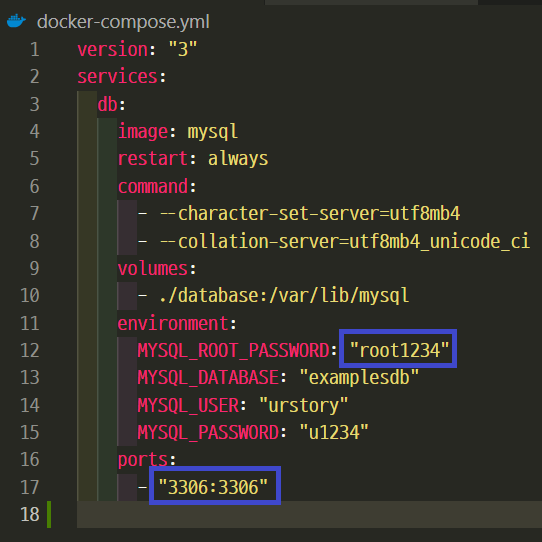
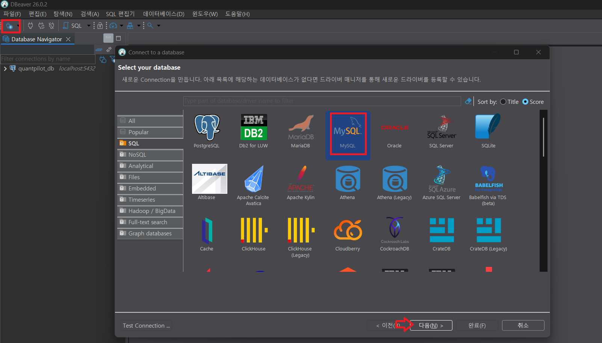
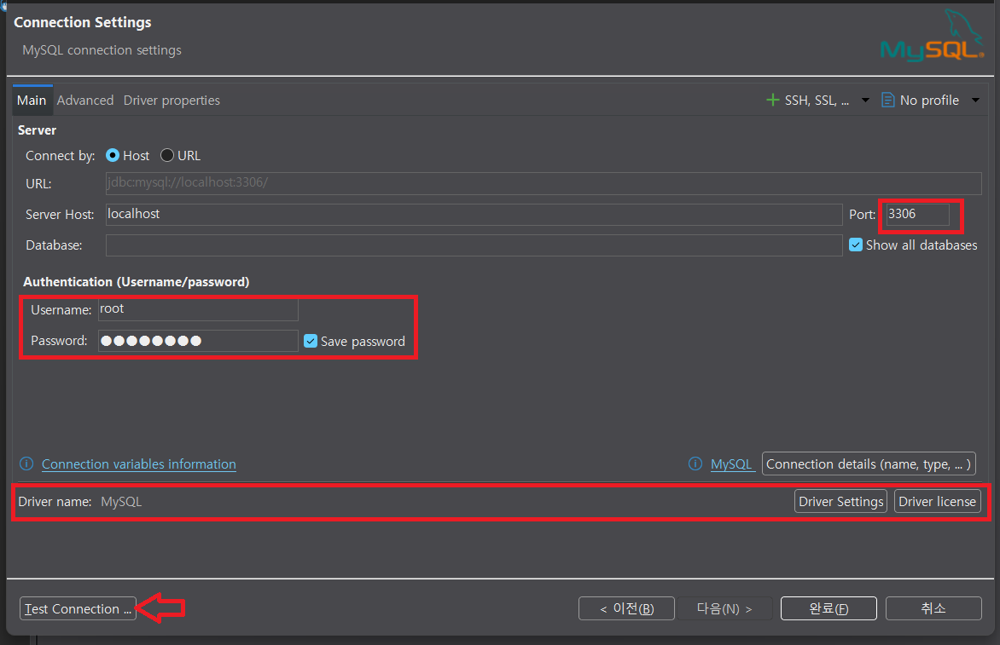
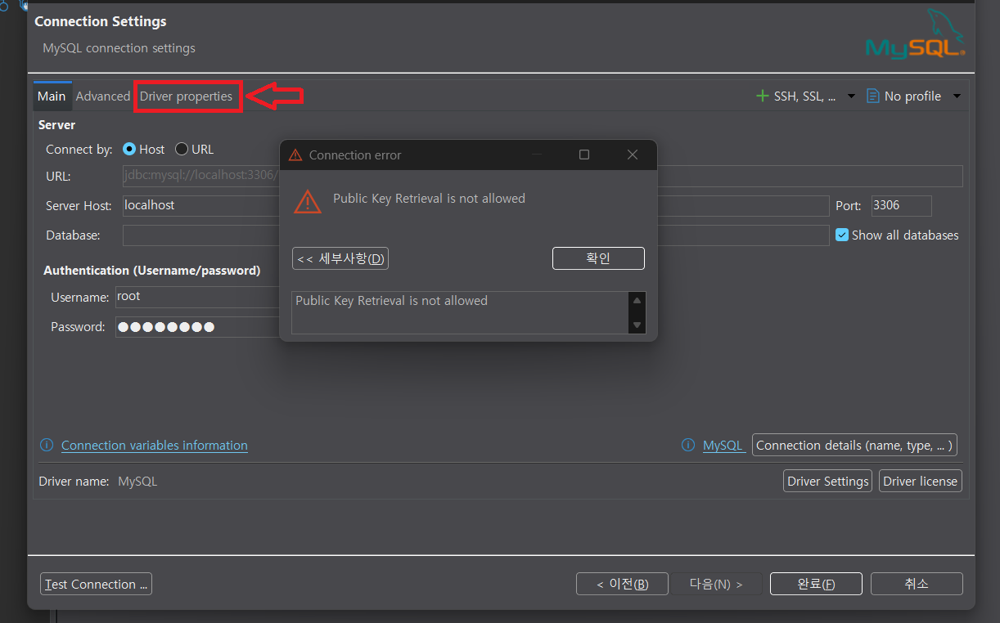
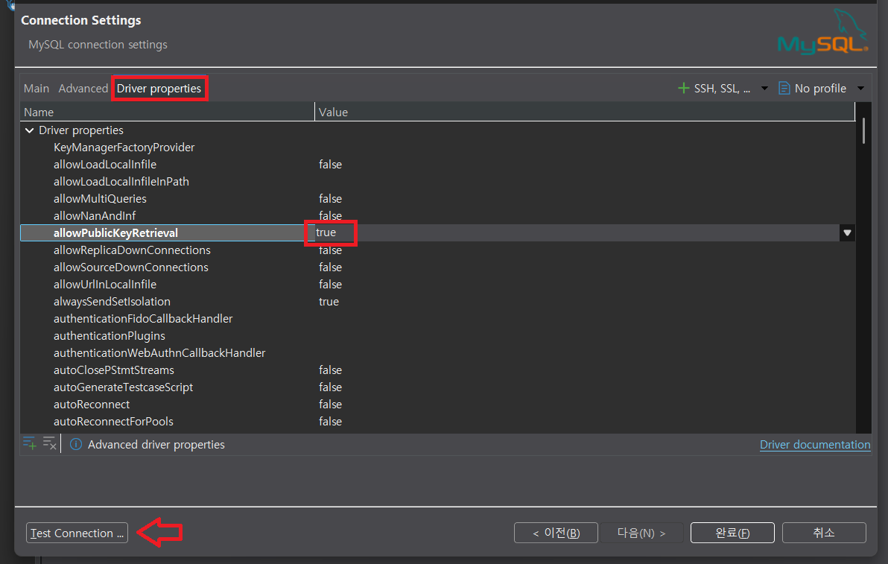
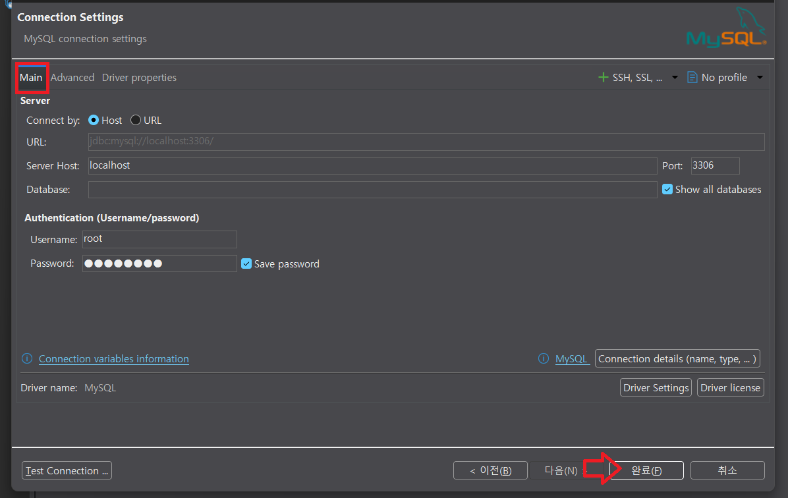
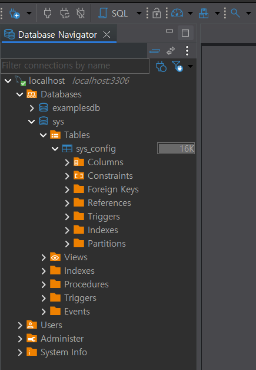
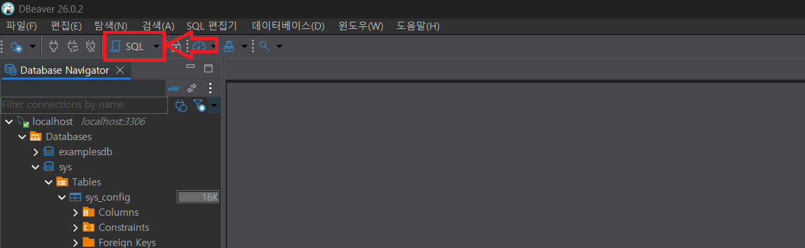
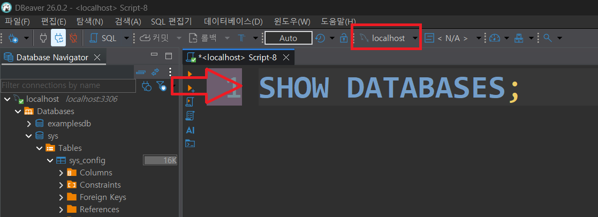
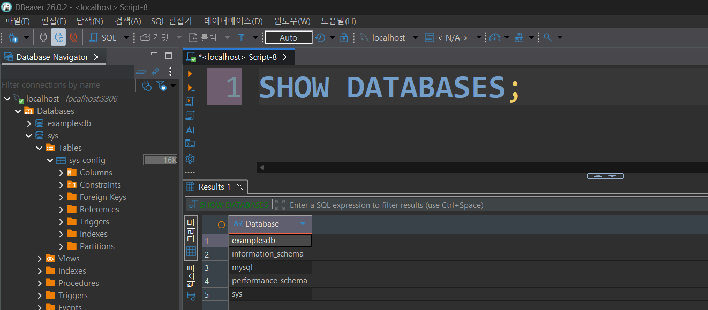

# DDL(Data Definition Language)
- 데이터베이스와 테이블을 정의, 수정, 삭제하는 구문 

---
## DDL에서 자주 쓰는 명령

| 명령 | 역할 |
|---|---|
| `CREATE` | 데이터베이스 객체를 생성 |
| `ALTER` | 기존 객체의 구조를 변경 |
| `DROP` | 객체를 삭제 |
| `TRUNCATE` | 데이터를 삭제하기 위해 내부적으로 테이블을 재생성(re-create)하는 방식 |

---
## 데이터베이스 
- 데이터베이스(Database)는 데이터를 체계적으로 저장하고 관리하며, 필요할 때 빠르게 조회·수정·삭제할 수 있도록 만든 저장소입니다.

---
> 데이터베이스 생성
```sql
CREATE DATABASE dbname;
```
> 데이터베이스 목록 보기
```sql
SHOW DATABASES;
```
> dbname 데이터베이스 사용
```sql
USE dbname;
```
> 데이터베이스 삭제
```sql
DROP DATABASE IF EXISTS dbname;
```

---
## 테이블 
> 테이블(Table)은 데이터베이스에서 같은 종류의 데이터를 행(Row)과 열(Column) 형태로 저장하는 구조입니다.

쉽게 설명하면
- `데이터베이스(Database)` = 파일 보관함
- `테이블(Table)` = 파일철(서류철)
- `행(Row)` = 개별 데이터(레코드)
- `열(Column)` = 데이터의 속성(필드)

---
### [데이터 타입](https://dev.mysql.com/doc/refman/8.0/en/data-types.html)

| 분류 | 대표 타입 | 예시 |
|---|---|---|
| 정수 | `TINYINT`, `INT`, `BIGINT` | 나이, 수량 |
| 실수/금액 | `DECIMAL(10,2)`, `FLOAT`, `DOUBLE` | 가격, 점수 |
| 문자 | `CHAR(n)`, `VARCHAR(n)`, `TEXT` | 이름, 설명 |
| 날짜/시간 | `DATE`, `TIME`, `DATETIME`, `TIMESTAMP` | 가입일, 생성 시각 |
| 참/거짓 | `BOOLEAN` | 활성 상태 |
| JSON | `JSON` | 유연한 추가 정보 |

---
### 제약 조건
- `NOT NULL`: 해당 필드는 NULL 값을 저장할 수 없음 
- `UNIQUE`: 해당 필드는 서로 다른 값을 가져야 함 
- `PRIMARY KEY`: 해당 필드는 `NOT NULL`과 `UNIQUE` 제약 조건의 특징을 모두 가짐 
- `FOREIGN KEY`: 다른 테이블과 연결해주는 역할 
- `DEFAULT`: 해당 필드의 기본값을 설정 


---
### 생성
> MySQL에서는 자동 증가 번호를 만들 때 `AUTO_INCREMENT`를 사용합니다.
```sql
CREATE TABLE students (
    student_id INT AUTO_INCREMENT COMMENT '수강생을 식별하는 자동 증가 기본키',
    name VARCHAR(50) NOT NULL COMMENT '수강생 이름',
    email VARCHAR(120) NOT NULL UNIQUE COMMENT '수강생 이메일, 중복 불가',
    birth_date DATE COMMENT '수강생 생년월일',
    created_at DATETIME NOT NULL DEFAULT CURRENT_TIMESTAMP COMMENT '수강생 등록 시각',
    PRIMARY KEY (student_id)
) COMMENT = '수강생 기본 정보';
```

---
### 조회
> 데이터베이스안의 테이블들 조회 
```sql
SHOW TABLES;
```
> 특정 테이블 상세 조회  
```sql
DESC MyTable;
```

---
### 수정 
> 테이블 수정 > 새로운 컬럼 추가
```sql
ALTER TABLE mytable ADD COLUMN new_column varchar(10) NOT NULL;
```
> 테이블 수정 > 컬럼 타입 변경
```sql
ALTER TABLE mytable MODIFY COLUMN modelnumber varchar(20) NOT NULL;
```
> 테이블 수정 > 컬럼 이름 변경
```sql
ALTER TABLE mytable CHANGE COLUMN modelnumber new_modelnumber varchar(10) NOT NULL
```

---
### 삭제
> 테이블의 모든 데이터를 삭제
```sql
TRUNCATE TABLE mytable;
```
> 테이블 수정 > 컬럼 삭제
```sql
ALTER TABLE mytable DROP COLUMN series;
```
> 테이블 삭제
```sql
DROP TABLE IF EXISTS mytable;
```

---
# 테스트- DBeaver

---
## root 계정 정보 확인 



---
## Connection 생성



---
> Test Connection



---
> (옵션) 만약 Public Key Retrieval is not allowed 발생하면,



---


---
> Test Connection 성공시, 완료 



---
> 생성된 Connection 확인 



---
## SQL 명령어 실행 



---
- 생성된 Connection 연결 확인 
- 명령어 입력 후 `Ctrl` + `Enter` 



---

