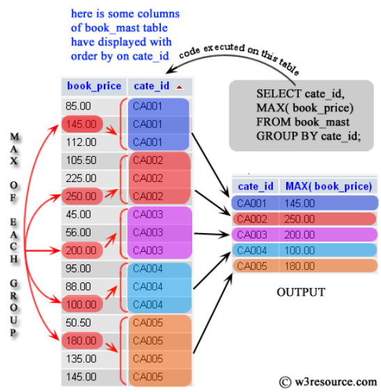
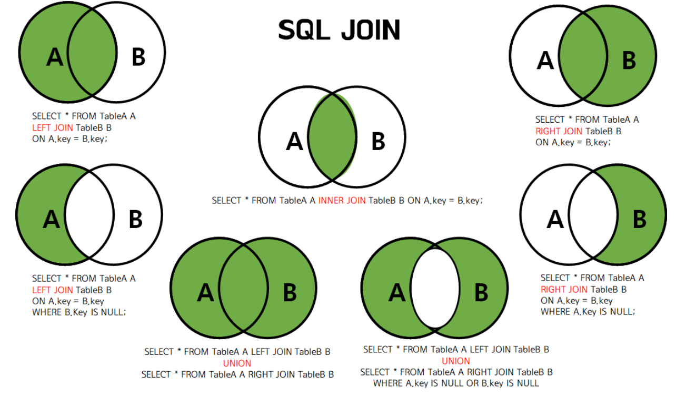
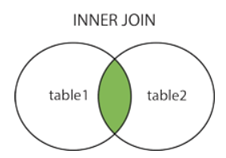
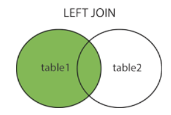

# DQL(Data Query Language)
> DQL(Data Query Language)은 데이터베이스에서 원하는 데이터를 조회하는 SQL 명령어

---
## 조건 조회 (Filtering)
- 조건 조회는 원하는 조건에 맞는 데이터만 조회하는 방법

```sql
SELECT
  컬럼
FROM 테이블
WHERE 1=1
  and 조건
ORDER BY 정렬기준
LIMIT 개수;
```

---
> 예시코드 
```sql
SELECT
    productCode,
    productName,
    MSRP
FROM products
WHERE 1=1
  AND MSRP >= 150
ORDER BY MSRP DESC
LIMIT 20;
```

---
### 자주 사용하는 비교 연산자
| 연산자      | 의미     |
| -------- | ------ |
| =        | 같다     |
| != 또는 <> | 같지 않다  |
| >        | 크다     |
| >=       | 크거나 같다 |
| <        | 작다     |
| <=       | 작거나 같다 |

---
### 논리 연산자
| 연산자 | 의미       |
| --- | -------- |
| AND | 모두 만족    |
| OR  | 하나 이상 만족 |
| NOT | 조건 부정    |

---
### 자주 사용하는 조건
| 조건      | 설명         |
| ------- | ---------- |
| BETWEEN | 범위 조회      |
| IN      | 여러 값 중 하나  |
| LIKE    | 문자열 패턴 검색  |
| IS NULL | NULL 여부 확인 |

---
### 실행 순서 
> 먼저 테이블을 선택하고 → 조건을 적용한 후 → 필요한 컬럼을 조회합니다.

```
FROM
 ↓
WHERE
 ↓
SELECT
```

---
## [집계 (Aggregation)](https://www.w3resource.com/mysql/aggregate-functions-and-grouping/aggregate-functions-and-grouping-in-mysql.php)
- 집계 함수는 여러 행을 하나의 결과로 계산하는 함수

---
### 대표적인 집계 함수
| 함수      | 설명   |
| ------- | ---- |
| COUNT() | 행 개수 |
| SUM()   | 합계   |
| AVG()   | 평균   |
| MAX()   | 최대값  |
| MIN()   | 최소값  |



---
### GROUP BY
> 같은 값을 가진 데이터를 하나의 그룹으로 묶습니다.

```sql
SELECT
    그룹컬럼,
    집계함수()
FROM 테이블
GROUP BY 그룹컬럼;
```

---
> 예시코드 
```sql
SELECT
    customerNumber,
    COUNT(*) AS order_count
FROM orders
GROUP BY customerNumber;
```

---
### HAVING
> 집계 결과에 조건을 적용합니다.

```
WHERE
   ↓
GROUP BY
   ↓
HAVING
```
- WHERE
  - 그룹화 이전 필터링
- HAVING
  - 그룹화 이후 필터링

---
> 예시코드 
```sql
SELECT
    customerNumber,
    COUNT(*) AS order_count
FROM orders
GROUP BY customerNumber
HAVING COUNT(*) >= 5;
```

---
### 실행 순서 

```
FROM
 ↓
WHERE
 ↓
GROUP BY
 ↓
HAVING
 ↓
SELECT
```

---
## [조인 (JOIN)](https://inpa.tistory.com/entry/MYSQL-%F0%9F%93%9A-JOIN-%EC%A1%B0%EC%9D%B8-%EA%B7%B8%EB%A6%BC%EC%9C%BC%EB%A1%9C-%EC%95%8C%EA%B8%B0%EC%89%BD%EA%B2%8C-%EC%A0%95%EB%A6%AC)
- 조인은 여러 테이블의 데이터를 연결하여 조회하는 기능입니다.
- 관계형 데이터베이스에서 가장 중요한 기능 중 하나입니다.

---


---
### INNER JOIN
> 양쪽 테이블에 모두 존재하는 데이터만 조회

```sql
select 
  u.userid, name 
from usertbl as u 
inner join buytbl as b 
  on u.userid=b.userid 
where 1=1
  and u.userid="111"; -- join을 완료하고 그다음 조건을 따진다.
```


---
### LEFT OUTER JOIN
> LEFT JOIN은 두 테이블이 있을 경우, 첫 번째 테이블을 기준으로 두 번째 테이블을 조합하는 JOIN
```sql
SELECT 
  STUDENT.NAME, 
  PROFESSOR.NAME 
FROM STUDENT 
LEFT OUTER JOIN PROFESSOR -- STUDENT를 기준으로 왼쪽 조인
  ON STUDENT.PID = PROFESSOR.ID 
WHERE 1=1
  and GRADE = 1;
```


---
## 서브쿼리 & CTE
- MySQL 8 이상에서는 CTE를 사용할 수 있습니다.
- `CTE(Common Table Expression)`는 WITH 문을 사용하여 임시 테이블처럼 사용할 수 있는 결과 집합을 정의하는 기능

---
### 서브쿼리 
> 예시코드 
```sql
SELECT *
FROM products
WHERE MSRP > (
    SELECT AVG(MSRP)
    FROM products
);
```

---
### CTE
> 예시코드 
```sql
WITH customer_order_stats AS (
    SELECT customerNumber, COUNT(*) AS order_count
    FROM orders
    GROUP BY customerNumber
)

SELECT *
FROM customer_order_stats
WHERE order_count >= 5;
```
