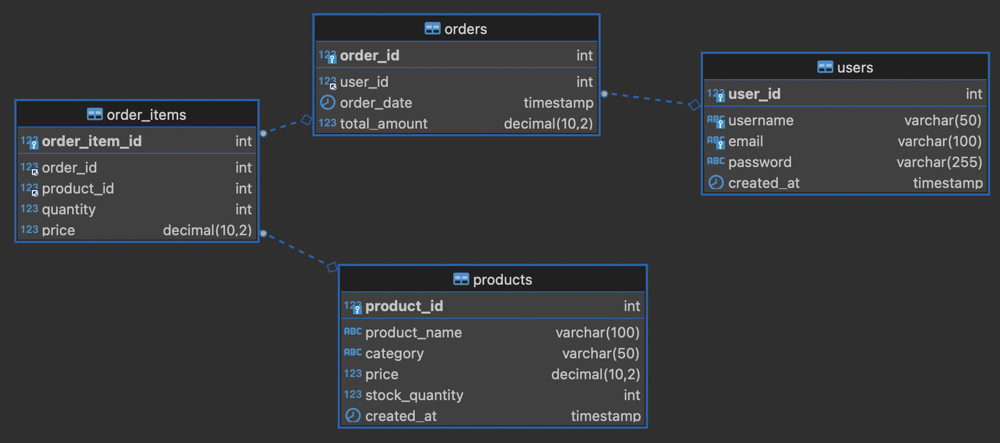

## SQL ERD - 개념 이해 및 테이블 생성

---
### 문제1: 다음 중 SQL ERD(Entity Relationship Diagram)의 정의로 가장 적절한 것은 무엇인가?
1) 데이터베이스에서 데이터를 검색하기 위해 사용하는 SQL 명령어이다.
2) 데이터베이스의 구조와 데이터 간의 관계를 시각적으로 표현한 다이어그램이다.
3) SQL 쿼리의 실행 계획을 그래프로 표현한 도구이다.
4) 데이터베이스에 저장된 데이터를 직접 수정하기 위한 프로그램이다.

#### 정답: 2
1) "데이터 검색을 위한 SQL 명령어" — ERD는 명령어가 아니라 설계 다이어그램입니다.
3) "SQL 쿼리 실행 계획 그래프" — 실행 계획(Execution Plan)은 쿼리 성능과 관련된 정보로 ERD와 목적이 다릅니다.
4) "데이터 직접 수정 프로그램" — ERD는 조작 툴이 아니라 설계 문서입니다.

---
### 문제2: 다음 중 ERD의 구성 요소와 설명이 잘못 연결된 것은 무엇인가?
1) 엔터티(Entity) - SQL에서 하나의 테이블로 표현된다.
2) 속성(Attribute) - 엔터티가 가진 구체적인 정보로, 테이블의 컬럼에 해당한다.
3) 관계(Relationship) - 엔터티 간의 연관성을 나타낸다.
4) 제약조건(Constraint) - ERD의 필수 구성 요소 중 하나이다.

#### 정답: 4
- 제약조건은 SQL에서 테이블 생성 시 사용되지만, ERD의 기본 구성 요소는 아니다.

---
### 문제3: 아래 ERD를 참고하여 테이블을 생성하세요.

