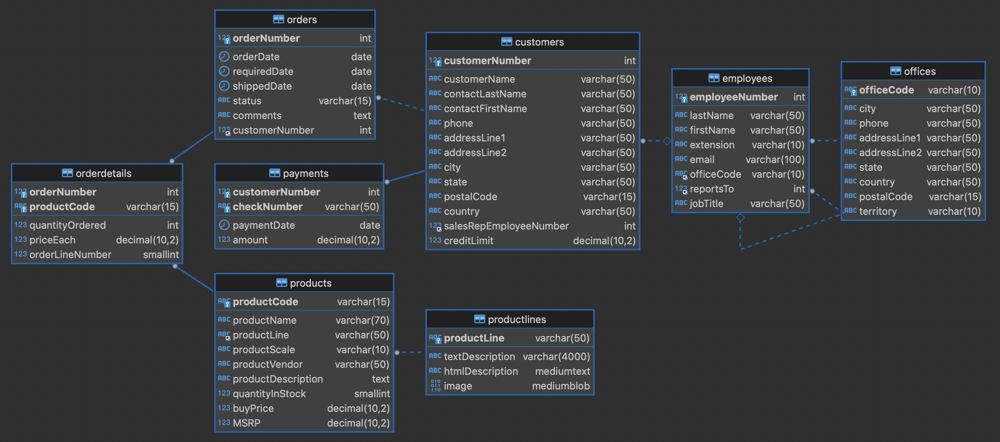

## 조회 문제 (JOIN + WHERE + GROUP BY + HAVING 활용)
`mysqlsampledatabase.sql`를 실행한 후 문제를 풀어주세요.

---
### 문제 1: 고객별 총 결제 금액
- customers와 payments 테이블을 이용하여 고객별 총 결제 금액을 구하시오.
- 단, 총 결제 금액이 50,000 이상인 고객만 조회하고, 고객 이름을 오름차순으로 정렬하세요.

---
### 문제 2: 제품 라인별 총 판매 수량
- orders, orderdetails, products, productlines 테이블을 이용하여 제품 라인별 총 판매 수량(quantityOrdered)을 구하세요.
- 단, 총 판매 수량이 1000 이상인 제품 라인만 조회하고, 총 판매 수량이 많은 순으로 정렬하세요.

---
### 문제 3: 영업사원별 고객 수와 평균 결제 금액
- employees, customers, payments 테이블을 사용하여 각 영업사원이 담당하는 고객 수와 고객들의 평균 결제 금액을 구하시오.
- 단, 평균 결제 금액이 5000 이상인 영업사원만 조회하고, 평균 결제 금액이 높은 순으로 정렬하세요.

