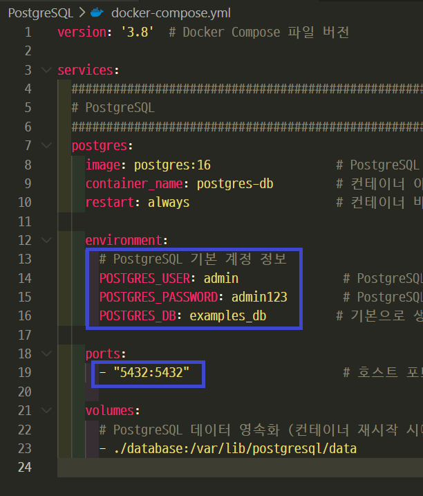
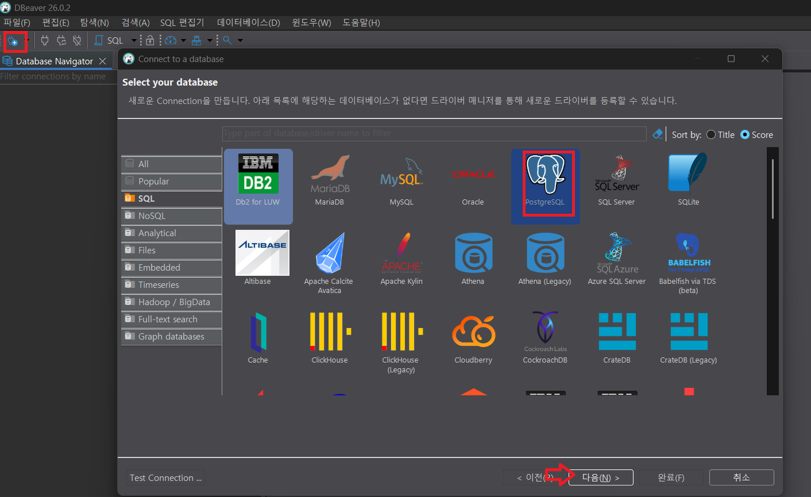
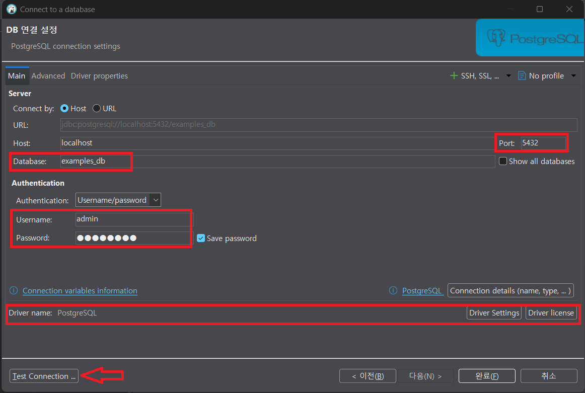
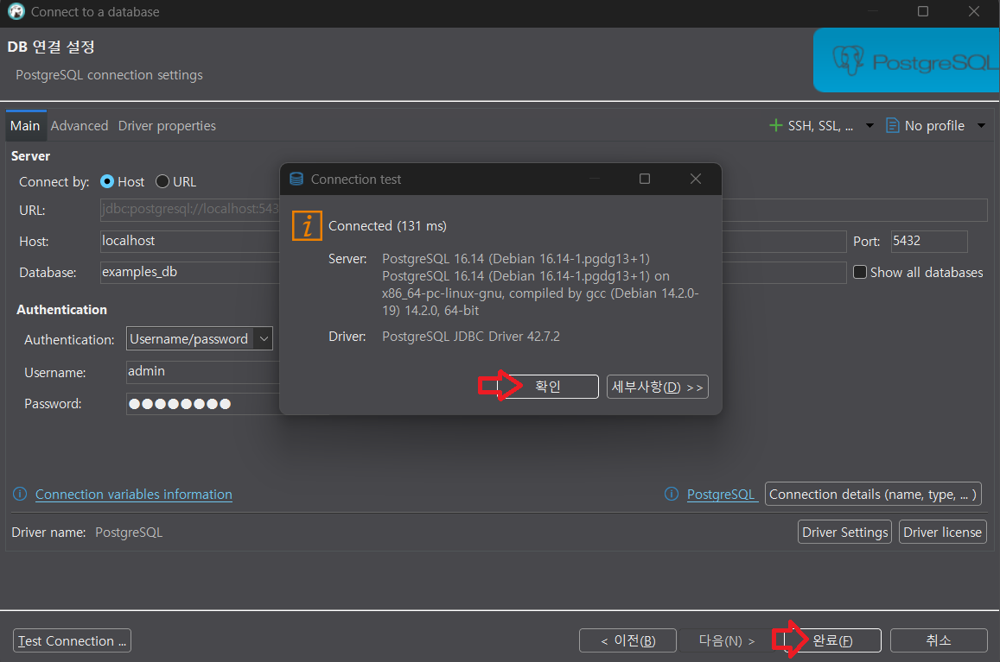
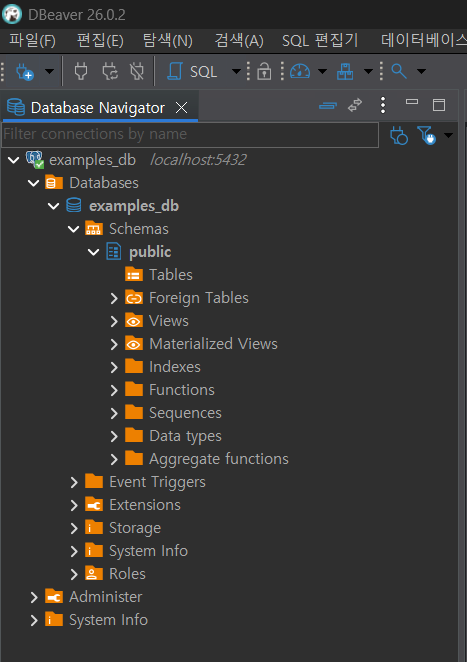
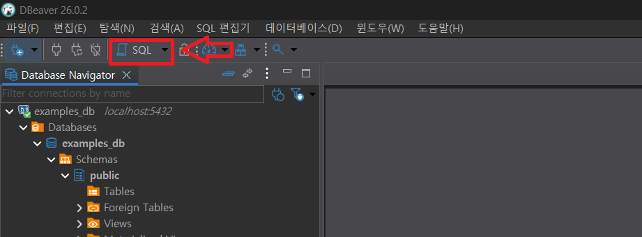
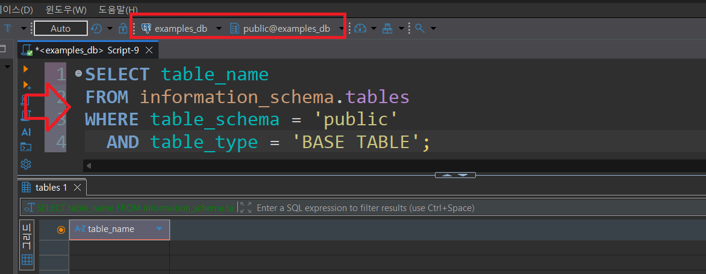

# PostgreSQL DDL 기초

DDL은 **Data Definition Language**의 줄임말입니다. 
데이터베이스 안에 어떤 테이블을 만들지, 각 컬럼은 어떤 값을 저장할지, 데이터가 지켜야 할 규칙은 무엇인지 정의합니다.

---
## DDL에서 자주 쓰는 명령

| 명령 | 역할 |
|---|---|
| `CREATE` | 데이터베이스 객체를 생성 |
| `ALTER` | 기존 객체의 구조를 변경 |
| `DROP` | 객체를 삭제 |
| `TRUNCATE` | 테이블 구조는 유지하고 데이터만 전체 삭제 |

> 이번 강의에서는 `CREATE TABLE`을 중심으로 다룹니다.

---
## 테이블을 만들기 전에 정할 것
테이블 설계는 다음 질문에서 시작합니다.

1. 어떤 대상을 저장할 것인가?
2. 대상의 속성은 무엇인가?
3. 각 속성에는 어떤 타입의 값이 들어가는가?
4. 반드시 있어야 하는 값은 무엇인가?
5. 중복되면 안 되는 값은 무엇인가?
6. 다른 테이블과 연결되는 값은 무엇인가?

---
## PostgreSQL 데이터 타입

| 분류 | 대표 타입 | 예시 |
|---|---|---|
| 정수 | `SMALLINT`, `INTEGER`, `BIGINT` | 나이, 수량 |
| 실수/금액 | `NUMERIC(10,2)`, `REAL`, `DOUBLE PRECISION` | 가격, 점수 |
| 문자 | `VARCHAR(n)`, `TEXT` | 이름, 설명 |
| 날짜/시간 | `DATE`, `TIME`, `TIMESTAMP`, `TIMESTAMPTZ` | 가입일, 생성 시각 |
| 참/거짓 | `BOOLEAN` | 활성 상태 |
| JSON | `JSONB` | 유연한 추가 정보 |

---
## 기본 테이블 생성

```sql
CREATE TABLE students (
    student_id INTEGER GENERATED ALWAYS AS IDENTITY PRIMARY KEY,
    name VARCHAR(50) NOT NULL,
    email VARCHAR(120) NOT NULL UNIQUE,
    birth_date DATE,
    created_at TIMESTAMPTZ DEFAULT now()
);
```

`GENERATED ALWAYS AS IDENTITY`는 PostgreSQL에서 자동 증가 번호를 만들 때 사용하는 권장 문법입니다.

---
## 테이블과 컬럼 주석

PostgreSQL에서는 `COMMENT ON` 문법으로 테이블과 컬럼에 설명을 남길 수 있습니다.
주석은 데이터 구조를 이해하는 데 도움을 주는 문서 역할을 합니다.

```sql
COMMENT ON TABLE students IS '수강생 기본 정보';
COMMENT ON COLUMN students.student_id IS '수강생을 식별하는 자동 증가 기본키';
COMMENT ON COLUMN students.name IS '수강생 이름';
COMMENT ON COLUMN students.email IS '수강생 이메일, 중복 불가';
```

테이블을 만든 뒤 바로 주석을 작성하면 ERD, DB 관리 도구, 협업 문서에서 컬럼의 의도를 더 쉽게 확인할 수 있습니다.

---
## 주석 확인하기

테이블 주석은 `obj_description()`으로 확인할 수 있습니다.

```sql
SELECT obj_description('students'::regclass, 'pg_class') AS table_comment;
```

컬럼 주석은 `col_description()`으로 확인할 수 있습니다.

```sql
SELECT
    column_name,
    col_description('students'::regclass, ordinal_position::int) AS column_comment
FROM information_schema.columns
WHERE table_schema = 'public'
  AND table_name = 'students'
ORDER BY ordinal_position;
```

---
## 제약조건

제약조건은 테이블에 저장되는 데이터의 규칙입니다.

| 제약조건 | 의미 |
|---|---|
| `PRIMARY KEY` | 행을 식별하는 대표 값 |
| `NOT NULL` | 반드시 값이 있어야 함 |
| `UNIQUE` | 같은 값을 중복 저장할 수 없음 |
| `CHECK` | 지정한 조건을 만족해야 함 |
| `DEFAULT` | 값을 생략했을 때 기본값 사용 |
| `FOREIGN KEY` | 다른 테이블의 값을 참조 |

---
## CHECK 예시

```sql
CREATE TABLE courses (
    course_id INTEGER GENERATED ALWAYS AS IDENTITY PRIMARY KEY,
    title VARCHAR(100) NOT NULL,
    price NUMERIC(10,2) NOT NULL CHECK (price >= 0),
    level VARCHAR(20) NOT NULL CHECK (
        level IN ('beginner', 'intermediate', 'advanced')
    )
);

COMMENT ON TABLE courses IS '강의 기본 정보';
COMMENT ON COLUMN courses.course_id IS '강의를 식별하는 자동 증가 기본키';
COMMENT ON COLUMN courses.title IS '강의명';
COMMENT ON COLUMN courses.price IS '강의 가격, 0 이상만 허용';
COMMENT ON COLUMN courses.level IS '강의 난이도';
```

`CHECK`는 금액이 음수가 되거나, 정해지지 않은 난이도가 입력되는 일을 막습니다.

---
## 관계형 데이터베이스의 관계

| 관계 | 예시 | 표현 방법 |
|---|---|---|
| 1:1 | 사용자와 사용자 상세 정보 | 한쪽 테이블의 PK를 다른 테이블 FK로 사용 |
| 1:N | 수강생과 수강 신청 | N쪽 테이블에 FK 저장 |
| N:M | 수강생과 강의 | 중간 테이블을 만들어 1:N + 1:N으로 분해 |

수강생은 여러 강의를 신청할 수 있고, 강의도 여러 수강생을 가질 수 있습니다.
따라서 `enrollments` 같은 중간 테이블이 필요합니다.

---
## 외래키 예시

```sql
CREATE TABLE enrollments (
    enrollment_id INTEGER GENERATED ALWAYS AS IDENTITY PRIMARY KEY,
    student_id INTEGER NOT NULL REFERENCES students(student_id),
    course_id INTEGER NOT NULL REFERENCES courses(course_id),
    enrolled_at DATE NOT NULL DEFAULT CURRENT_DATE,
    UNIQUE (student_id, course_id)
);

COMMENT ON TABLE enrollments IS '수강생과 강의의 수강 신청 관계';
COMMENT ON COLUMN enrollments.enrollment_id IS '수강 신청을 식별하는 자동 증가 기본키';
COMMENT ON COLUMN enrollments.student_id IS '수강 신청한 수강생 ID';
COMMENT ON COLUMN enrollments.course_id IS '신청한 강의 ID';
COMMENT ON COLUMN enrollments.enrolled_at IS '수강 신청일';
```

`REFERENCES`는 존재하지 않는 수강생이나 강의로 수강 신청을 만들 수 없게 합니다.

---
# 테스트 - DBeaver

---
## 계정 정보 확인 



---
## Connection 생성 



---
> Test Connection



---
> Test Connection 성공시, 완료 



---
> 생성된 Connection 확인 



---
## SQL 명령어 실행 



---
> 현재 스키마(public)의 테이블 조회
- 명령어 입력 후 `Ctrl` + `Enter`
```sql
SELECT table_name
FROM information_schema.tables
WHERE table_schema = 'public'
  AND table_type = 'BASE TABLE';
```


