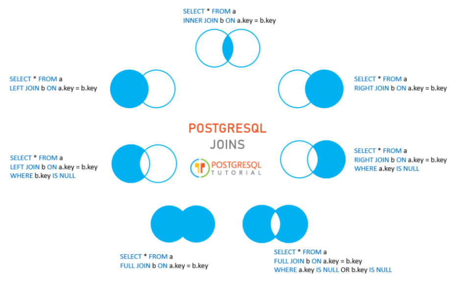
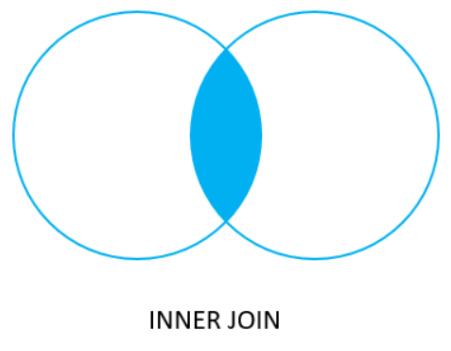
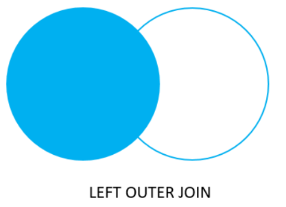

# DQL(Data Query Language)
> DQL(Data Query Language)은 데이터베이스에서 원하는 데이터를 조회하는 SQL 명령어입니다.

PostgreSQL DQL 실습은 `restore.sql`을 실행해 만든 DVD 대여점 샘플 데이터를 기준으로 합니다.

---
## 실습 데이터 준비
> `examples_db` 연결을 선택한 뒤 `restore.sql` 파일 전체를 실행합니다.

`restore.sql`은 DBeaver와 `psql`에서 바로 실행할 수 있는 수업용 SQL 파일입니다.

---
### 주요 테이블

| 테이블 | 설명 |
|---|---|
| `film` | 영화 기본 정보 |
| `customer` | 고객 정보 |
| `rental` | 대여 기록 |
| `payment` | 결제 기록 |
| `inventory` | 매장별 영화 재고 |
| `category` | 영화 카테고리 |
| `actor` | 배우 정보 |
| `address`, `city`, `country` | 주소 정보 |

---
## 조건 조회 (Filtering)
- 조건 조회는 원하는 조건에 맞는 데이터만 조회하는 방법입니다.

```sql
SELECT
  컬럼
FROM 테이블
WHERE 1=1
  AND 조건
ORDER BY 정렬기준
LIMIT 개수;
```

---
> 예시코드
```sql
SELECT
    title,
    rental_rate,
    rating
FROM film
WHERE 1=1
  AND rental_rate >= 4.99
ORDER BY rental_rate DESC, title
LIMIT 20;
```

---
### 자주 사용하는 비교 연산자

| 연산자 | 의미 |
|---|---|
| `=` | 같다 |
| `!=` 또는 `<>` | 같지 않다 |
| `>` | 크다 |
| `>=` | 크거나 같다 |
| `<` | 작다 |
| `<=` | 작거나 같다 |

---
### 논리 연산자

| 연산자 | 의미 |
|---|---|
| `AND` | 모두 만족 |
| `OR` | 하나 이상 만족 |
| `NOT` | 조건 부정 |

---
### 자주 사용하는 조건

| 조건 | 설명 |
|---|---|
| `BETWEEN` | 범위 조회 |
| `IN` | 여러 값 중 하나 |
| `LIKE` | 문자열 패턴 검색 |
| `ILIKE` | 대소문자 구분 없는 문자열 패턴 검색 |
| `IS NULL` | NULL 여부 확인 |

---
### 실행 순서
> 먼저 테이블을 선택하고 → 조건을 적용한 후 → 필요한 컬럼을 조회합니다.

```text
FROM
 ↓
WHERE
 ↓
SELECT
```

---
## 집계 (Aggregation)
- 집계 함수는 여러 행을 하나의 결과로 계산하는 함수입니다.

---
### 대표적인 집계 함수

| 함수 | 설명 |
|---|---|
| `COUNT()` | 행 개수 |
| `SUM()` | 합계 |
| `AVG()` | 평균 |
| `MAX()` | 최대값 |
| `MIN()` | 최소값 |


---
### GROUP BY
> 같은 값을 가진 데이터를 하나의 그룹으로 묶습니다.

```sql
SELECT
    그룹컬럼,
    집계함수()
FROM 테이블
GROUP BY 그룹컬럼;
```

---
> 예시코드
```sql
SELECT
    rating,
    COUNT(*) AS film_count
FROM film
GROUP BY rating
ORDER BY film_count DESC, rating;
```

---
### HAVING
> 집계 결과에 조건을 적용합니다.

```text
WHERE
 ↓
GROUP BY
 ↓
HAVING
```

- `WHERE`: 그룹화 이전 필터링
- `HAVING`: 그룹화 이후 필터링

---
> 예시코드
```sql
SELECT
    customer_id,
    COUNT(*) AS rental_count
FROM rental
GROUP BY customer_id
HAVING COUNT(*) >= 30
ORDER BY rental_count DESC, customer_id;
```

---
### 실행 순서

```text
FROM
 ↓
WHERE
 ↓
GROUP BY
 ↓
HAVING
 ↓
SELECT
```

---
## [조인 (JOIN)](https://daniel6364.tistory.com/entry/PostgreSQL-Joins)
- 조인은 여러 테이블의 데이터를 연결하여 조회하는 기능입니다.
- 관계형 데이터베이스에서 가장 중요한 기능 중 하나입니다.

---


---
### INNER JOIN
> 양쪽 테이블에 모두 존재하는 데이터만 조회합니다.

```sql
select
    a,
    fruit_a,
    b,
    fruit_b
from basket_a a
inner join basket_b b
    on a.fruit_a = b.fruit_b;
```


---
### LEFT OUTER JOIN
> 첫 번째 테이블을 기준으로 두 번째 테이블을 연결합니다.

```sql
select
    a,
    fruit_a,
    b,
    fruit_b
from basket_a a
left join basket_b b
    on a.fruit_a = b.fruit_b;
```


---
## 서브쿼리 & CTE
- 서브쿼리는 쿼리 안에 들어가는 또 다른 쿼리입니다.
- `CTE(Common Table Expression)`는 `WITH` 문을 사용하여 임시 테이블처럼 사용할 수 있는 결과 집합을 정의하는 기능입니다.

---
### 서브쿼리
> 예시코드
```sql
SELECT
    title,
    rental_rate
FROM film
WHERE rental_rate > (
    SELECT AVG(rental_rate)
    FROM film
)
ORDER BY rental_rate DESC, title;
```

---
### CTE
> 예시코드
```sql
WITH customer_rental_stats AS (
    SELECT
        customer_id,
        COUNT(*) AS rental_count
    FROM rental
    GROUP BY customer_id
)
SELECT *
FROM customer_rental_stats
WHERE rental_count >= 30
ORDER BY rental_count DESC;
```
