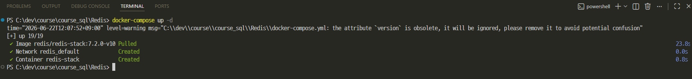

# [Redis](https://redis.io/)

- Redis는 데이터를 주로 메모리에 저장하는 키-값 기반 데이터 저장소입니다.
- 디스크보다 빠른 메모리에서 데이터를 읽고 쓰기 때문에 빠른 응답이 필요한
캐시, 세션, 카운터, 랭킹, 메시지 처리 등에 자주 사용합니다.
- Redis의 이름은 **Remote Dictionary Server**에서 왔습니다. 단순한 문자열뿐 아니라 List, Set, Sorted Set, Hash 같은 여러 자료구조를 제공합니다.

---
## 관계형 데이터베이스와 비교

| 구분 | 관계형 데이터베이스 | Redis |
|---|---|---|
| 데이터 위치 | 주로 디스크 | 주로 메모리 |
| 데이터 표현 | 테이블, 행, 열 | 키와 자료구조 |
| 조회 방식 | SQL | Redis 명령어 |
| 강점 | 복잡한 조회, 관계, 영구 보관 | 빠른 조회, 만료, 실시간 처리 |
| 대표 용도 | 주문·결제 원본 데이터 | 캐시·세션·랭킹·카운터 |

> Redis가 빠르다고 해서 관계형 데이터베이스를 모두 대체하는 것은 아닙니다.
> 주문과 결제 같은 중요한 원본 데이터는 관계형 데이터베이스에 저장하고, 자주 조회하는 결과를 Redis에 캐시하는 방식으로 함께 사용하는 경우가 많습니다.

---
## Redis의 주요 특징

1. 메모리 기반이라 읽기와 쓰기가 빠릅니다.
2. 키마다 만료 시간을 설정할 수 있습니다.
3. 다양한 자료구조와 원자적 명령을 제공합니다.
4. RDB 또는 AOF 방식으로 데이터를 디스크에 남길 수 있습니다.
5. 복제와 클러스터를 통해 가용성과 확장성을 높일 수 있습니다.

> 메모리는 유한하며 프로세스 종료이나 장애도 발생할 수 있습니다. 
> Redis를 사용할 때는 데이터의 중요도, 메모리 한도, 영속성 정책을 함께 결정해야 합니다.

---
## Redis 설치 및 접속 

---
### Redis 설치 with Docker
> Redis 폴더 이동 후 명령어 실행 

```shell
docker-compose up -d
```


---


---
### [Redis UI 접속](http://localhost:8001/) 
> http://localhost:8001/


---


---
### Redis Server 접속


---
> `redis-cli`를 실행한 뒤 다음 명령을 입력합니다.


---
## Redis 명령어

```redis
# Redis 서버가 정상적으로 동작하는지 확인 (응답: PONG)
PING

# greeting이라는 Key에 "Hello Redis" 문자열 저장
SET greeting "Hello Redis"

# greeting Key의 값을 조회
GET greeting

# greeting Key 삭제
DEL greeting

# 삭제된 greeting Key 조회
GET greeting
```


---
### 명령 구조 읽기

```text
명령어 키 값 또는 옵션
SET    greeting    "Hello Redis"
```

- `SET`: 수행할 작업
- `greeting`: 데이터를 찾기 위한 키
- `"Hello Redis"`: 저장할 값

---
## 서버 정보 확인

> `DBSIZE`: 현재 선택된 Redis 데이터베이스(DB)에 저장된 Key의 개수를 반환하는 명령어
Redis 버전, 실행 모드, 사용 메모리 정도만 찾아봅니다.


---
> `INFO server`: Redis 서버 자체의 상태 정보(Server Information)만 조회하는 명령어


---
> `INFO memory`: Redis의 메모리 사용 현황을 조회하는 명령어


