# 만료(Expiration)와 캐시(Cache)

---
| 구분         | 만료(Expiration)             | 캐시(Cache)                           |
| ---------- | -------------------------- | ----------------------------------- |
| 의미         | 일정 시간이 지나면 데이터를 자동 삭제하는 기능 | 자주 사용하는 데이터를 빠르게 조회하기 위해 임시 저장하는 기법 |
| 목적         | 데이터 수명(Lifetime) 관리        | 성능 향상                               |
| Redis 기능   | `EXPIRE`, `TTL`, `SETEX` 등 | Redis 자체를 캐시 저장소로 활용                |
| 반드시 함께 사용? | 아니요                      | 아니요                               |
| 관계         | 캐시에 자주 사용되는 기능             | 캐시 구현 시 만료를 많이 사용                   |

---
## 실무에서의 구분

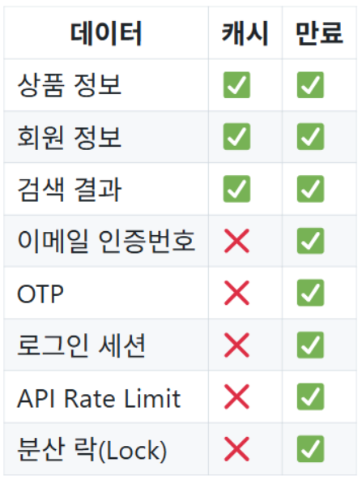

---
## 1. 만료 시간
> Redis는 키마다 유효 시간을 설정할 수 있습니다. 
> 시간이 지나면 키가 자동으로 사라지므로 `인증 코드`, `로그인 세션`, `캐시처럼 수명`이 있는 데이터에 적합합니다.

---
| 명령 | 설명 |
|---|---|
| `EXPIRE key seconds` | 초 단위 만료 시간 설정 |
| `PEXPIRE key milliseconds` | 밀리초 단위 만료 시간 설정 |
| `TTL key` | 남은 시간을 초 단위로 확인 |
| `PTTL key` | 남은 시간을 밀리초 단위로 확인 |
| `PERSIST key` | 만료 시간을 제거하여 영구 키로 변경 |

`TTL`의 특별한 반환값도 기억합니다.

- `-1`: 키는 있지만 만료 시간이 없음
- `-2`: 키가 없음


---
### 1-1. 만료 생성 예제 
> 저장 
```redis
SET auth:code:user7 482913
```
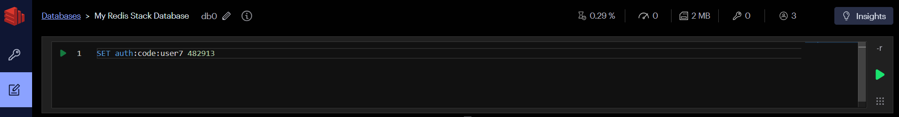

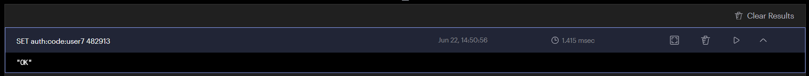

---
> 만료 생성
```redis
EXPIRE auth:code:user7 180
```
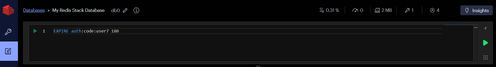

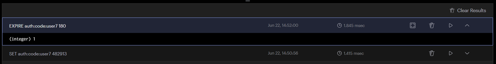

---
> 남은 시간을 초 단위로 확인
```redis
TTL auth:code:user7
```


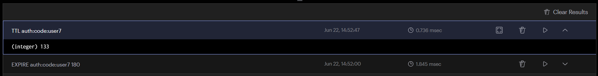

---
### 1-2. 만료 생성 예제
> 저장과 만료 설정을 한 명령으로 처리하는 방식이 더 간결하고 안전합니다.
```redis
SET auth:code:user8 482913 EX 180
```
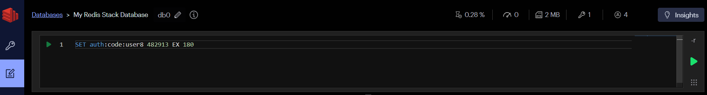

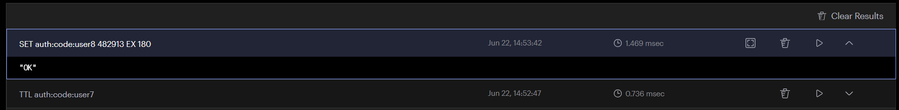

---
> 남은 시간을 초 단위로 확인
```redis
TTL auth:code:user8
```


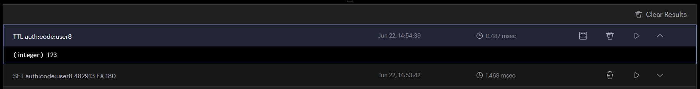

---
## 2. 캐시란?
> 캐시는 자주 사용하는 데이터의 복사본을 빠른 저장소에 두는 방식입니다.
> 애플리케이션이 데이터베이스를 매번 조회하지 않아도 되어 응답 시간이 짧아지고 원본 데이터베이스의 부하가 줄어듭니다.

```
Redis에 저장(아래처럼 두가지 의미가 있음)
        │
        ├── 원본 데이터 저장 → Storage (RDB가 없음)
        │
        └── 원본을 복사해서 저장 → Cache (원본 데이터를 RDB에 저장)
```

---
### Cache-Aside 흐름

1. 애플리케이션이 Redis에서 키를 조회합니다.
2. 값이 있으면 캐시 적중(hit)이며 바로 반환합니다.
3. 값이 없으면 캐시 실패(miss)이며 원본 DB를 조회합니다.
4. 조회 결과를 Redis에 TTL과 함께 저장합니다.
5. 사용자에게 결과를 반환합니다.

```text
요청 → Redis 조회 → 값 있음 → 즉시 응답
                 └→ 값 없음 → DB 조회 → Redis 저장 → 응답
```

---
| 용도           | 캐시인가? | 설명              |
| ------------ | ----- | --------------- |
| 상품 정보 캐시     | ✅     | DB 조회 결과를 임시 저장 |
| 회원 정보 캐시     | ✅     | DB 조회 결과를 임시 저장 |
| 검색 결과 캐시     | ✅     | 검색 결과를 임시 저장    |
| 로그인 세션       | ❌     | 로그인 상태 저장       |
| OTP          | ❌     | 인증번호 저장         |
| 이메일 인증       | ❌     | 인증 코드 저장        |
| 분산 락         | ❌     | 동시성 제어          |
| Rate Limiter | ❌     | API 호출 횟수 관리    |
| 실시간 랭킹       | ❌     | 순위 데이터 저장       |
| Pub/Sub 메시지  | ❌     | 메시지 전달          |

---
## 3. 상품 캐시 만들기

상품 1001의 조회 결과를 60초 동안 캐시합니다.

```redis
SET cache:product:1001 '{"id":1001,"name":"키보드","price":49000}' EX 60
GET cache:product:1001
TTL cache:product:1001
```

---
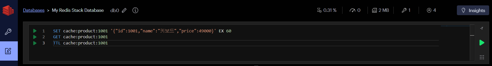

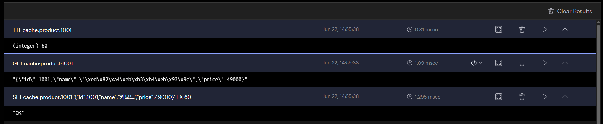

---
상품 정보가 수정되면 오래된 캐시를 삭제합니다.

```redis
DEL cache:product:1001
TTL cache:product:1001
```
> 다음 요청에서는 캐시 실패가 발생하고, 애플리케이션이 변경된 정보를 DB에서 다시 읽어 캐시에 저장합니다. 이를 캐시 무효화라고 합니다.

---
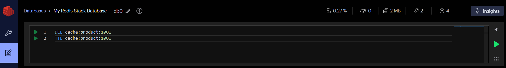

`TTL`의 특별한 반환값도 기억합니다.
- `-2`: 키가 없음

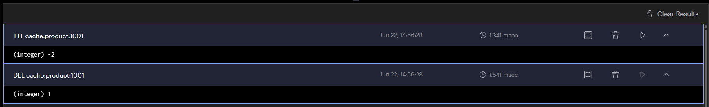

---
## 4. 캐시에서 생각할 문제

---
### 오래된 데이터
- 원본이 바뀌었는데 캐시가 남아 있으면 사용자는 예전 값을 봅니다. 
- 데이터 변경시 캐시를 삭제하고, 적절한 TTL을 설정합니다.

### 캐시 관통
- 존재하지 않는 데이터를 반복 조회하면 매번 DB까지 접근합니다. 
- 짧은 TTL의 빈 결과를 저장하거나 요청 단계에서 유효하지 않은 값을 차단할 수 있습니다.

---
### 캐시 스탬피드
- 인기 키가 만료된 순간 많은 요청이 동시에 DB를 조회할 수 있습니다. 
- TTL을 조금씩 다르게 주거나, 한 요청만 데이터를 갱신하도록 제어하는 방법을 고려합니다.

### 메모리 부족
- 모든 데이터를 캐시하면 메모리가 부족해집니다. 
- 필요한 데이터만 저장하고 TTL, 최대 메모리, 제거 정책을 함께 설정합니다.
