# String 활용

---
## 1. Redis String

String은 Redis의 가장 기본적인 자료형입니다. 텍스트, 정수, 실수, JSON, 직렬화된
데이터 등을 저장할 수 있습니다. 값의 최대 크기는 크지만, 큰 값을 많이 저장하면
네트워크와 메모리 비용이 커지므로 캐시 대상을 적절히 나누어야 합니다.

---
```redis
# message라는 Key에 "hello" 문자열 저장
SET message "hello"

# message의 값 조회
GET message
```
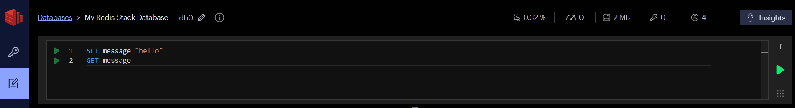

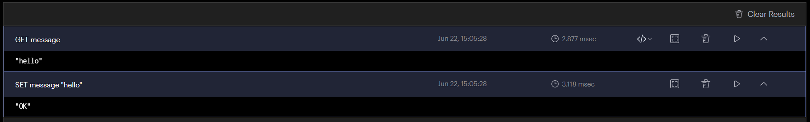

---
```redis
# message 문자열의 길이(문자 수) 조회
STRLEN message
```
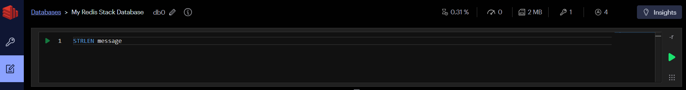

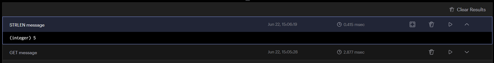

---
```redis
# message 문자열 끝에 " redis" 추가
APPEND message " redis"

# 변경된 message 값 조회
GET message
```


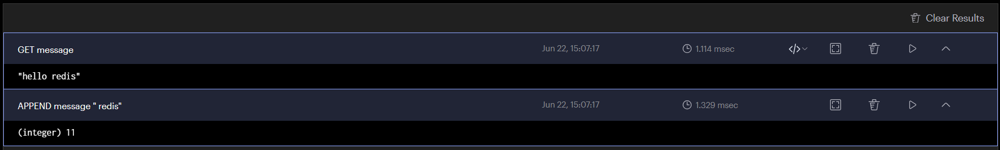

---
```redis
# message 문자열의 일부만 조회 (0번부터 4번 인덱스까지)
GETRANGE message 0 4
```


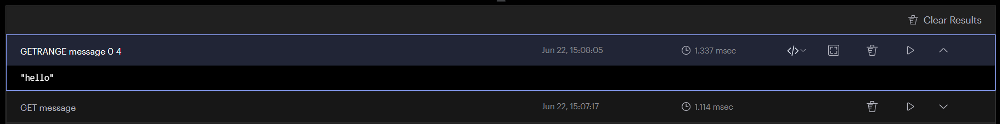

---
## 2. 여러 값 처리

```redis
MSET user:1:name "민수" user:2:name "지수" user:3:name "수진"
MGET user:1:name user:2:name user:3:name
```
> `MSET`과 `MGET`은 왕복 횟수를 줄일 수 있습니다. 
> 다만 서로 관련 없는 많은 키를 무제한으로 한 번에 요청하면 서버와 네트워크에 부담이 되므로 적절한 크기로 나눕니다.

---
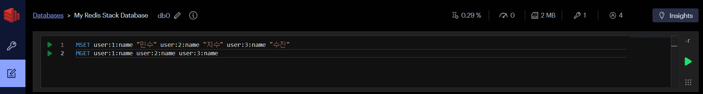

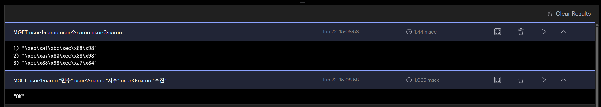

---
## 3. 카운터

---
- `INCR`: 값을 1 증가
```redis
SET article:100:views 0
INCR article:100:views
GET article:100:views
```
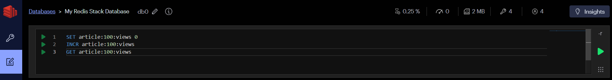

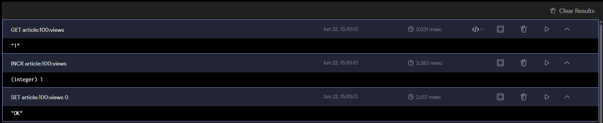

---
- `INCRBY`: 지정한 정수만큼 증가
- `INCRBYFLOAT`: 실수만큼 증가
```redis
INCRBY article:100:views 10
GET article:100:views
```
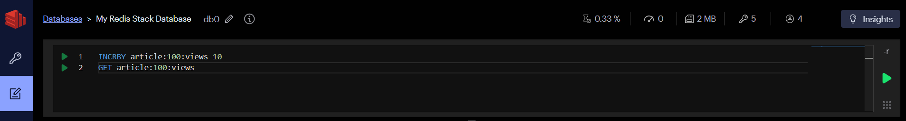

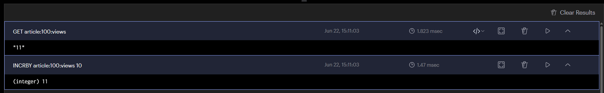

---
- `DECR`, `DECRBY`: 값을 감소
```redis
DECR article:100:views
GET article:100:views
```


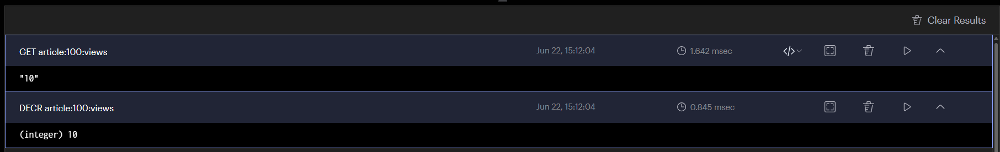

---
## 4. JSON 저장

```redis
SET cache:product:1001 '{"id":1001,"name":"키보드","price":49000}' EX 60
GET cache:product:1001
```
> JSON 문자열은 객체 전체를 한 번에 저장하고 읽기 쉽지만, 일부 필드만 수정하려면 전체 값을 읽어 다시 저장해야 합니다. `필드 단위 조회와 수정이 필요하면 Hash를 고려합니다.`

---
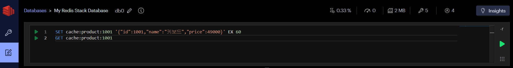

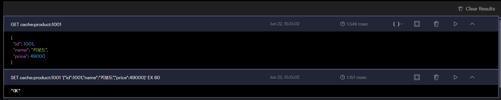
