# List

---
## 1. Redis List

List는 문자열 값을 순서대로 저장하는 자료구조입니다. 왼쪽과 오른쪽에서 값을
빠르게 넣거나 뺄 수 있어 최근 기록, 대기열, 간단한 큐에 적합합니다.

```text
왼쪽 <- [A] [B] [C] -> 오른쪽
```

---
## 2. 값 추가와 조회

- `LPUSH`: 왼쪽에 추가
```redis
DEL demo:list
LPUSH demo:list B
LPUSH demo:list A
```

---
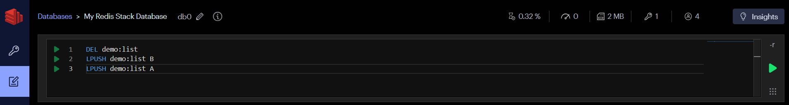

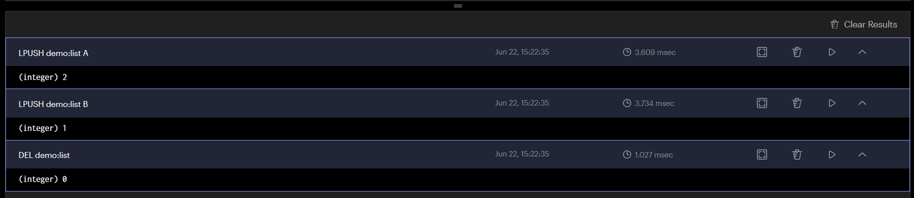

---
> browser에서 저장된 데이터 확인 

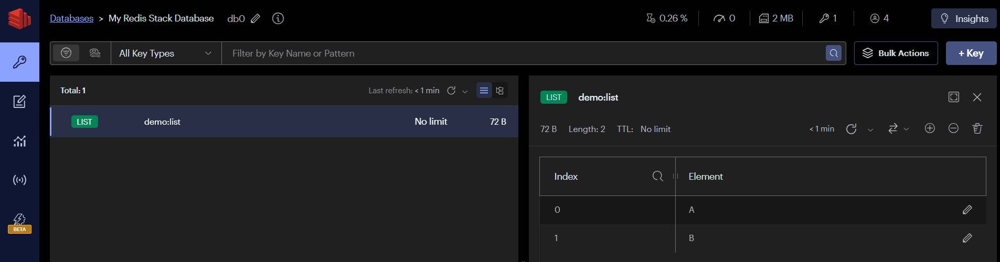

---
- `RPUSH`: 오른쪽에 추가
```redis
RPUSH demo:list C
```
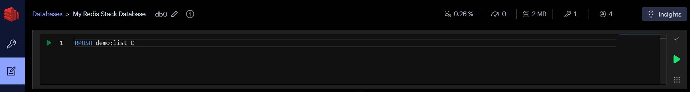

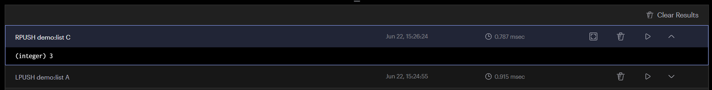

---
- `LRANGE key start stop`: 범위 조회
> 인덱스 `0`은 첫 번째 값이고 `-1`은 마지막 값입니다. 
> 따라서 `LRANGE key 0 -1`은 전체 목록을 조회합니다. 
> 운영 환경에서는 목록이 매우 길 수 있으므로 전체 대신 필요한 범위만 조회합니다.
```redis
LRANGE demo:list 0 -1
```
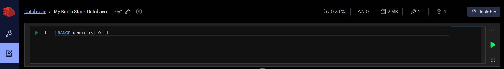

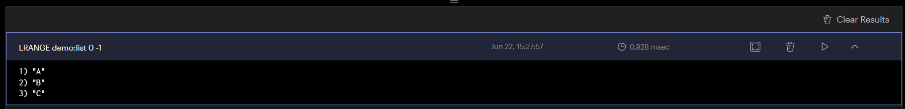

---
- `LLEN`: 목록 길이
```redis
LLEN demo:list
```


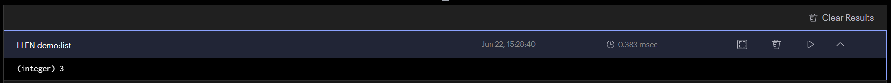

---
## 3. 값 꺼내기

> `LPOP`과 `RPOP`은 값을 반환하면서 목록에서 제거합니다. 
```redis
LPOP demo:list
RPOP demo:list
LRANGE demo:list 0 -1
```

---
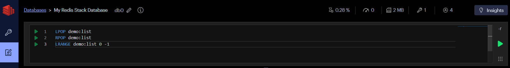

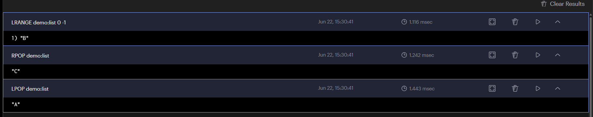

---
> 조회만 하려면 `LINDEX(단일 항목)` 또는 `LRANGE(범위 항목)`를, 리스트를 특정 범위로 영구적으로 잘라내려면 LTRIM을 사용합니다
```redis
LINDEX demo:list 0
LTRIM demo:list 0 9
```


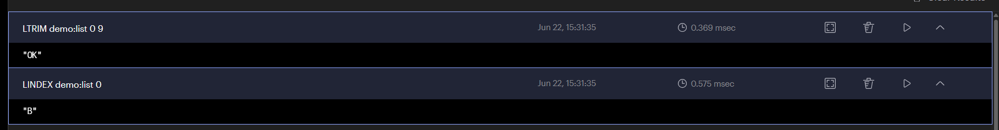

---
## 4. 최근 조회 상품

```redis
# 최근 본 상품 추가 (새 항목이 앞에 쌓임)
LPUSH user:7:recent-products 1001
LPUSH user:7:recent-products 1002
LPUSH user:7:recent-products 1003
LPUSH user:7:recent-products 1004
LPUSH user:7:recent-products 1005
LPUSH user:7:recent-products 1006
```
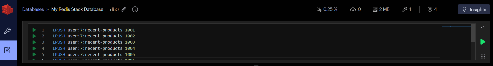

---
> 현재 상태: [1006, 1005, 1004, 1003, 1002, 1001]

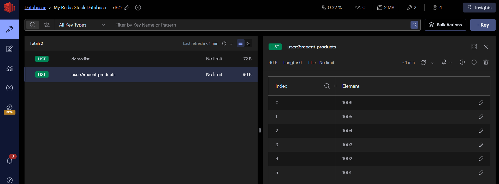

---
핵심 포인트는 두 가지예요.
- `LPUSH`로 새 상품을 앞에 추가 → 최신 순으로 자동 정렬
- `LTRIM 0 4` 로 5개 초과 시 오래된 항목을 자동 제거

> 실무에서는 상품을 추가할 때마다 이 두 명령어를 항상 같이 실행합니다.
```redis
# 최근 5개만 유지 (오래된 항목 1001 자동 제거)
LTRIM user:7:recent-products 0 4
```
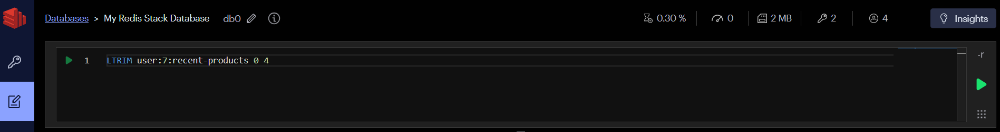

---
> 결과 확인: [1006, 1005, 1004, 1003, 1002]

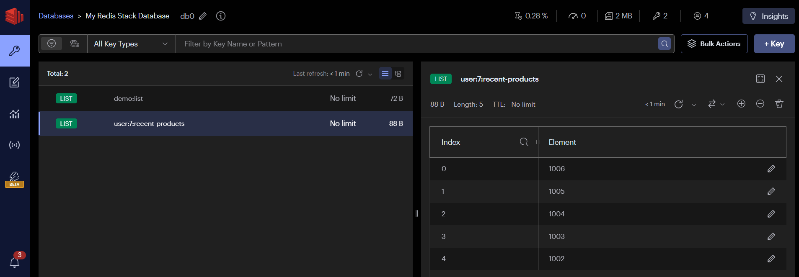

---
> 전체 데이터 조회 
```redis
LRANGE user:7:recent-products 0 -1
```
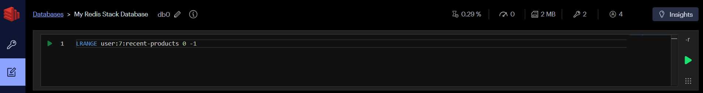

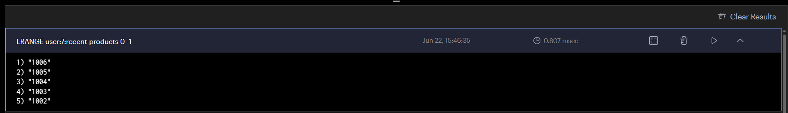

---
## 5. 작업 큐
> 생산자는 오른쪽에 작업을 추가하고 소비자는 왼쪽에서 꺼냅니다.

```
Servers(생산자) → [작업큐] → Worker A(소비자)가 꺼내서 처리 → 완료 표시
                              ↑
                    Worker B(소비자)는 못 가져감 (이미 누가 가져갔으니)
```
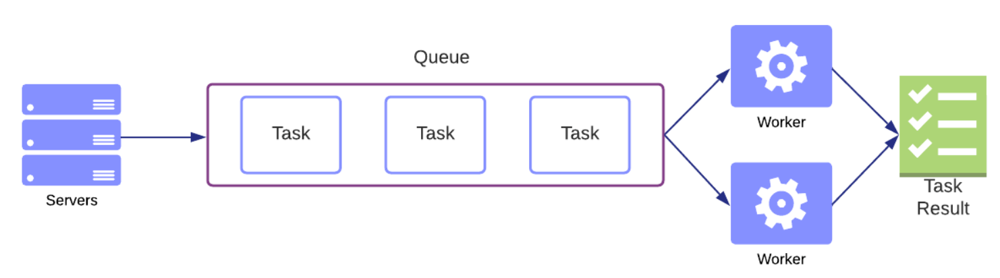

---
### Redis 큐가 필요한 3가지 이유
1. 속도 차이 흡수
    - 요청은 빠르게 들어오는데, 처리는 느릴 때
    - 예) 주문 접수(빠름) vs DB 저장 + 알림(느림)

2. 트래픽 폭주 방어
    - 갑자기 요청 1000개 와도 큐가 버퍼 역할
    - Worker는 자기 속도대로 처리

3. 서버 죽어도 작업 안 사라짐
    - 큐에 쌓여 있으니 서버 재시작 후 이어서 처리 가능

---
```redis
RPUSH queue:email '{"to":"user@example.com","template":"welcome"}'
LPOP queue:email
```
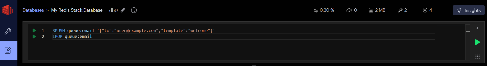

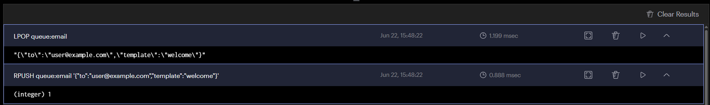

---
작업이 없을 때 계속 확인하는 대신 블로킹 명령을 사용할 수 있습니다.

```redis
BLPOP queue:email 10
```


> BLPOP은 결과를 기다리는 블로킹 명령어라서 Workbench에서 지원하지 않습니다.

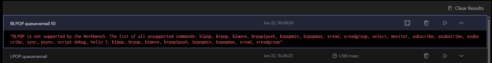

---
### BLPOP vs LPOP 차이

| | LPOP | BLPOP |
|--|--------|---------|
| 데이터 없을 때 | `nil` 즉시 반환 | 데이터 올 때까지 대기 |
| 용도 | 단순 조회 | 실시간 큐 처리 |
| Workbench UI | 지원 | 미지원 |

