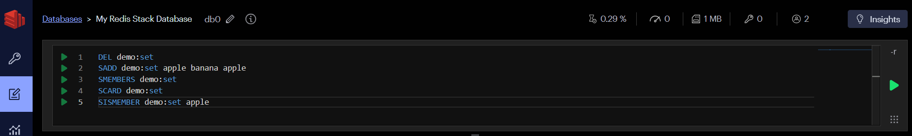
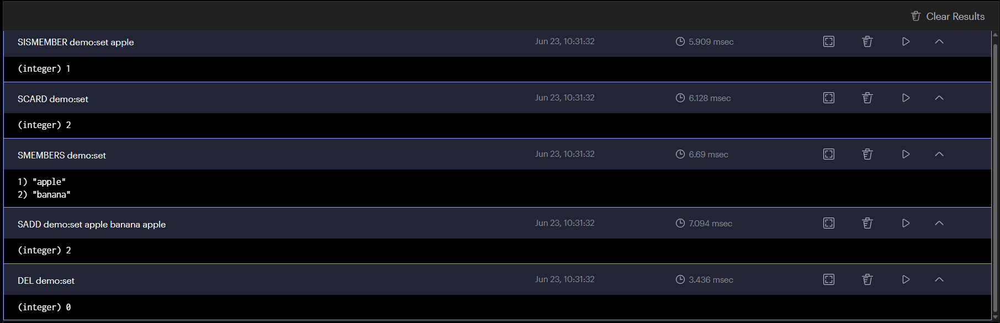
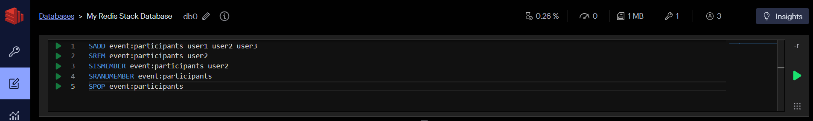
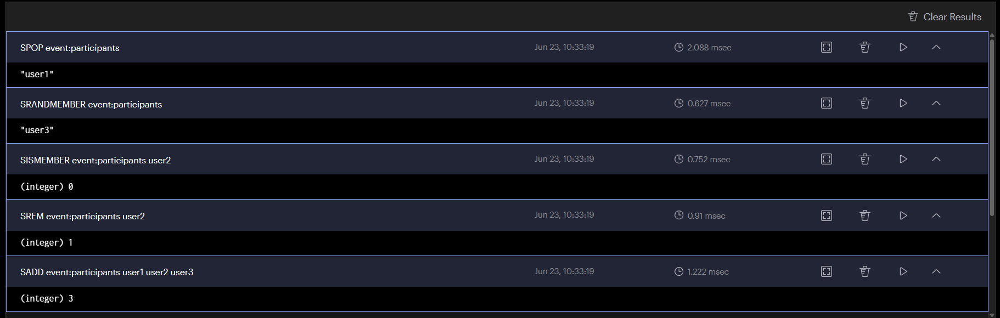
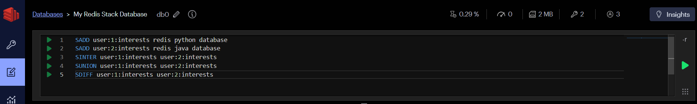
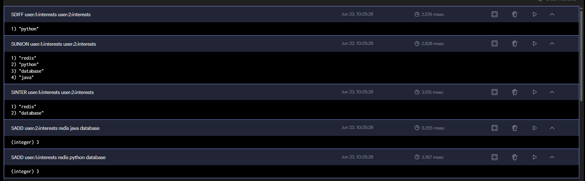
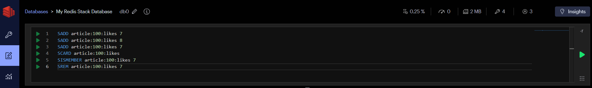
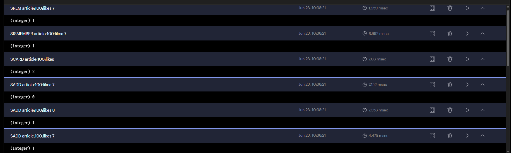

# Set

---
## List vs Set

| 항목 | List (리스트) | Set (셋) |
|------|-------------|---------|
| 한 줄 설명 | 순서가 있는 목록 | 중복 없는 모음 |
| 중복 값 | 허용 | 불허 |
| 순서 | 있음 (입력 순서 유지) | 없음 |
| 비유 | 줄 서있는 대기열 | 출석부 (이름 중복 없음) |
| 언제 쓰나? | 순서가 중요할 때 | 중복을 없애고 싶을 때 |

---
## 1. Redis Set
.
- `SADD`: Set에 멤버를 추가
- `SMEMBERS`: Set의 모든 멤버를 조회
- `SCARD`: Set의 멤버 수를 반환
- `SISMEMBER`: 특정 값이 Set에 존재하는지 확인 (1=있음, 0=없음)
```redis
DEL demo:set                  # demo:set 키 삭제 (초기화)
SADD demo:set apple banana apple  # Set에 apple, banana, apple 추가 (중복 apple은 무시됨)
SMEMBERS demo:set             # Set의 모든 멤버 조회
SCARD demo:set                # Set의 멤버 수 반환 (2)
SISMEMBER demo:set apple      # apple이 Set에 있는지 확인 (1=있음, 0=없음)
```

---




---
## 2. 추가, 삭제, 무작위 선택

- `SREM`: Set에서 특정 멤버를 삭제
- `SRANDMEMBER`: Set에서 랜덤 멤버를 조회 (삭제 안 함)
- `SPOP`: Set에서 랜덤 멤버를 꺼내고 삭제
```redis
SADD event:participants user1 user2 user3  # Set에 user1, user2, user3 추가
SREM event:participants user2              # Set에서 user2 제거
SISMEMBER event:participants user2         # user2가 Set에 있는지 확인 (0=없음)
SRANDMEMBER event:participants             # 랜덤으로 멤버 1개 조회 (제거 안 함)
SPOP event:participants                    # 랜덤으로 멤버 1개 꺼내기 (제거함)
```

---




---
## 3. 집합 연산

```redis
SADD user:1:interests redis python database      # user1의 관심사 추가: redis, python, database
SADD user:2:interests redis java database        # user2의 관심사 추가: redis, java, database
SINTER user:1:interests user:2:interests         # 교집합: 둘 다 가진 것 → {redis, database}
SUNION user:1:interests user:2:interests         # 합집합: 둘 중 하나라도 가진 것 → {redis, python, database, java}
SDIFF user:1:interests user:2:interests          # 차집합: user1만 가진 것 → {python}
```

| 명령어 | 의미 | 결과 |
|--------|------|------|
| SINTER | 교집합 | redis, database |
| SUNION | 합집합 | redis, python, database, java |
| SDIFF | 차집합 (기준 - 나머지) | python |

---




---
## 4. 게시글 좋아요

게시글마다 좋아요를 누른 사용자 번호를 Set으로 저장합니다.

```redis
SADD article:100:likes 7       # 게시글 100에 user7 좋아요 추가
SADD article:100:likes 8       # 게시글 100에 user8 좋아요 추가
SADD article:100:likes 7       # user7 좋아요 중복 추가 (무시됨)
SCARD article:100:likes        # 좋아요 수 조회 → 2 (중복 제거된 결과)
SISMEMBER article:100:likes 7  # user7이 좋아요 눌렀는지 확인 (1=눌렀음)
SREM article:100:likes 7       # user7 좋아요 취소
```

> 사용자 7이 여러 번 요청해도 한 번만 저장됩니다. `SCARD`는 좋아요 수,
`SISMEMBER`는 현재 사용자의 좋아요 여부를 알려 줍니다.

---




---
## 5. Set을 선택하는 기준

Set이 적합한 질문은 다음과 같습니다.

- 이 사용자가 이미 참여했는가?
- 고유 방문자는 누구인가?
- 두 사용자의 공통 관심사는 무엇인가?
- 중복 없이 태그를 관리하려면 어떻게 할까?

> 순위나 점수가 필요하면 `Sorted Set`, 필드와 값이 필요하면 `Hash`를 사용합니다.

