# Sorted Set

---
## Set vs Sorted Set

| 항목 | Set (셋) | Sorted Set (정렬된 셋) |
|------|---------|----------------------|
| 한 줄 설명 | 중복 없는 모음 | 점수 기준으로 정렬된 모음 |
| 중복 값 | 불허 | 불허 |
| 순서 | 없음 | 있음 (score 기준 자동 정렬) |
| 추가 정보 | 값만 저장 | 값 + score(점수) 함께 저장 |
| 비유 | 출석부 | 성적순 출석부 |
| 언제 쓰나? | 중복 제거가 필요할 때 | 순위, 랭킹이 필요할 때 |
| 대표 명령 | `SADD` `SMEMBERS` | `ZADD` `ZRANGE` `ZRANK` |

---
## 1. 점수 저장과 조회

- `ZADD`: 멤버와 점수 추가 또는 변경
```redis
DEL game:ranking                          # game:ranking 키 삭제 (초기화)
ZADD game:ranking 120 user:7             # user7을 점수 120으로 추가
```
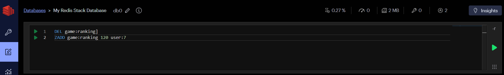

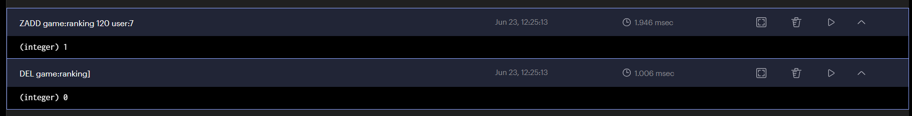

---
```redis
ZADD game:ranking 250 user:3 410 user:9  # user3(250), user9(410) 한번에 추가
```


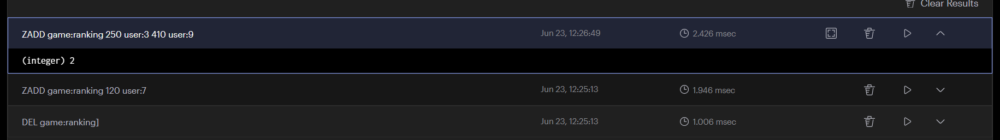

---
- `ZRANGE`: 낮은 점수부터 범위 조회
- `WITHSCORES`: 결과에 점수 포함
```redis
ZRANGE game:ranking 0 -1 WITHSCORES     # 전체 조회 (오름차순) → user7, user3, user9
```
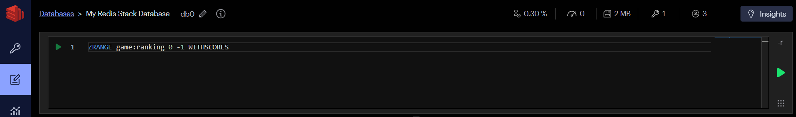

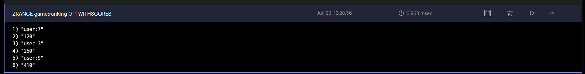

---
- `REV`: 높은 점수부터 역순 조회
```redis
ZRANGE game:ranking 0 -1 REV WITHSCORES # 전체 조회 (내림차순) → user9, user3, user7
```


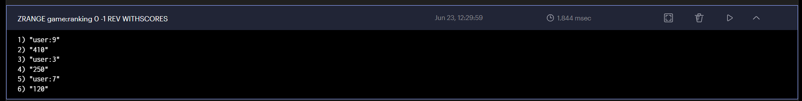

---
## 2. 점수 변경과 순위 확인
- `ZINCRBY`: Sorted Set의 점수를 지정한 값만큼 증가
```redis
ZINCRBY game:ranking 50 user:7  # user7 점수 50 증가 (120 → 170)
```
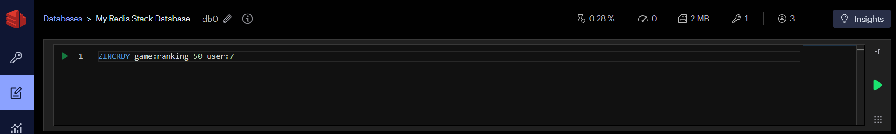

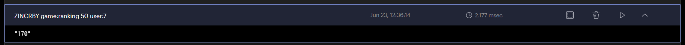

---
- `ZSCORE`: Sorted Set에서 특정 멤버의 점수를 조회
```redis
ZSCORE game:ranking user:7      # user7의 현재 점수 조회 → 170
```
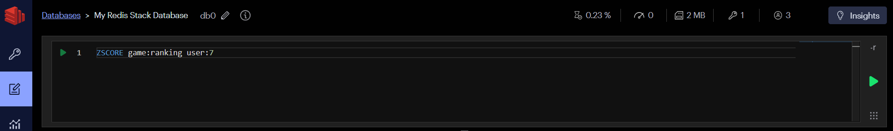

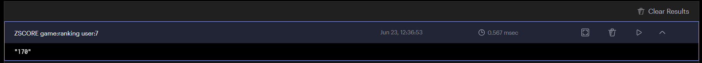

---
- `ZRANK`: 오름차순
```redis
ZRANK game:ranking user:7       # user7의 오름차순 순위 조회 → 0 (꼴찌, 0부터 시작)
```
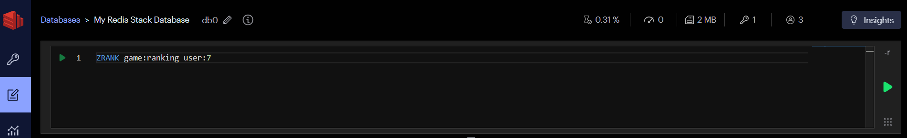

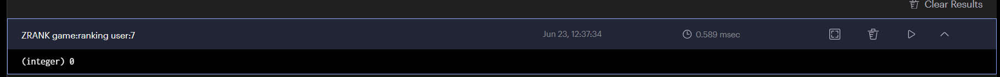

---
- `ZREVRANK`: 내림차순
```redis
ZREVRANK game:ranking user:7    # user7의 내림차순 순위 조회 → 2 (꼴찌, 0부터 시작)
```


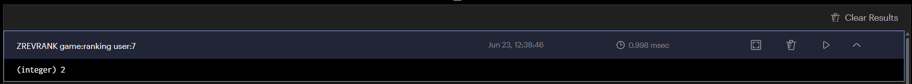

---
## 3. 범위 조회

> 상위 세 명을 조회합니다.
```redis
ZRANGE game:ranking 0 2 REV WITHSCORES
```


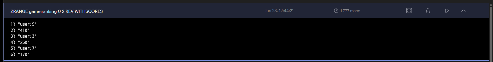

---
- `BYSCORE`: 점수 기준으로 범위를 지정
> 점수가 200 이상 500 이하인 사용자를 조회합니다.
```redis
ZRANGE game:ranking 200 500 BYSCORE WITHSCORES
```
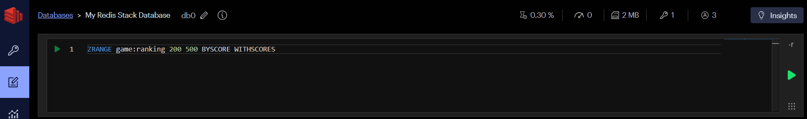

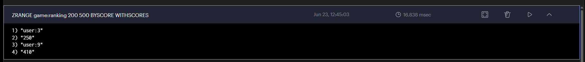

---
- `ZREM`: Sorted Set에서 특정 멤버를 삭제
> 점수나 순위 범위로 항목을 삭제할 수도 있습니다.
```redis
ZREM game:ranking user:7                 # game:ranking에서 user7 제거
```
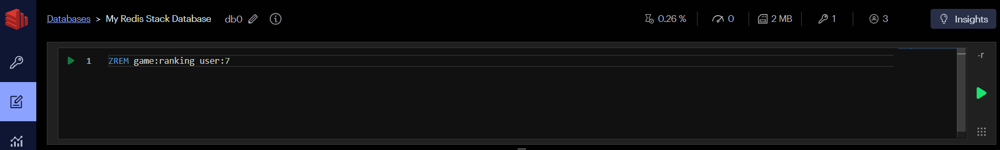

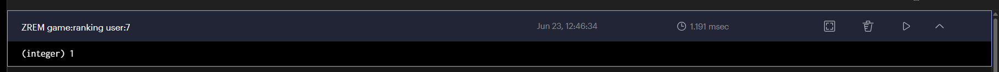

---
- `ZREMRANGEBYSCORE`: Sorted Set에서 점수 범위에 해당하는 멤버를 일괄 삭제
> 점수나 순위 범위로 항목을 삭제할 수도 있습니다.
```redis
ZREMRANGEBYSCORE game:ranking -inf 99   # 점수 99 이하인 멤버 전체 제거
```


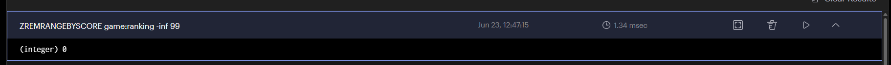

---
## 4. 실시간 인기 게시글

- `ZINCRBY`: Sorted Set의 점수를 지정한 값만큼 증가
> 게시글을 조회하거나 좋아요를 누르면 점수를 높입니다.
```redis
ZINCRBY ranking:articles:daily 1 article:100  # article:100 조회수 1 증가 (0 → 1)
ZINCRBY ranking:articles:daily 1 article:100  # article:100 조회수 1 증가 (1 → 2)
ZINCRBY ranking:articles:daily 5 article:200  # article:200 조회수 5 증가 (0 → 5)
ZRANGE ranking:articles:daily 0 9 REV WITHSCORES  # 상위 10개 조회 (내림차순) → article:200(5), article:100(2)
```

---
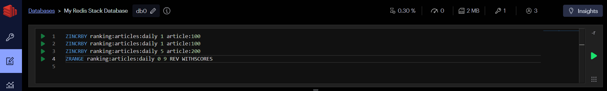

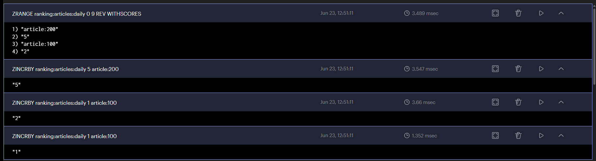

---
- `EXPIRE`: 키에 만료 시간(초) 을 설정
> 일별 랭킹 키에 TTL을 설정하면 오래된 랭킹을 자동으로 정리할 수 있습니다.
```redis
EXPIRE ranking:articles:daily 172800  # ranking:articles:daily를 172800초(48시간=2일) 후 자동 삭제
```
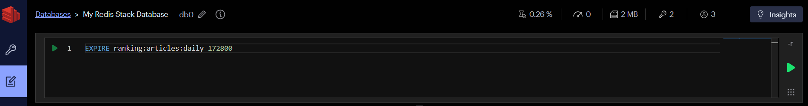

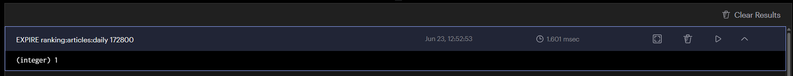

---
## 5. List, Set, Sorted Set 비교

| 질문 | 적합한 자료구조 |
|---|---|
| 입력된 순서가 중요한가? | List |
| 중복 없이 포함 여부만 필요한가? | Set |
| 중복 없이 점수와 순위가 필요한가? | Sorted Set |
