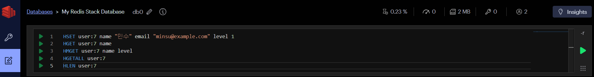
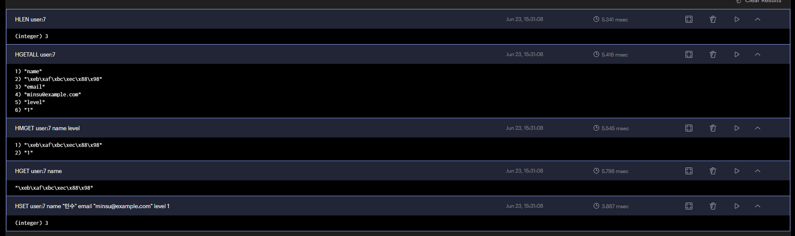
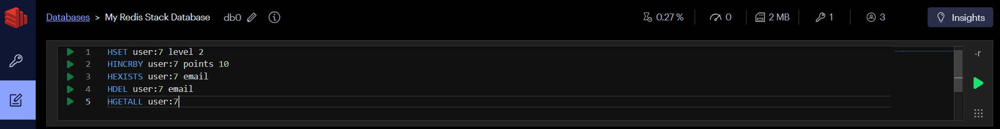
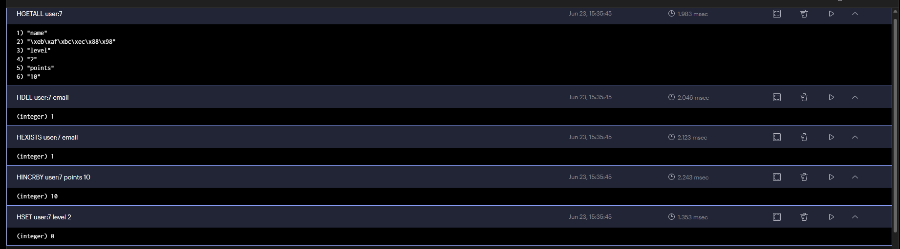
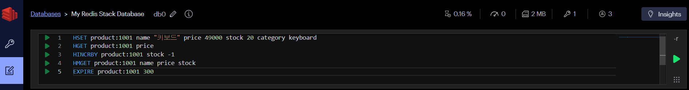
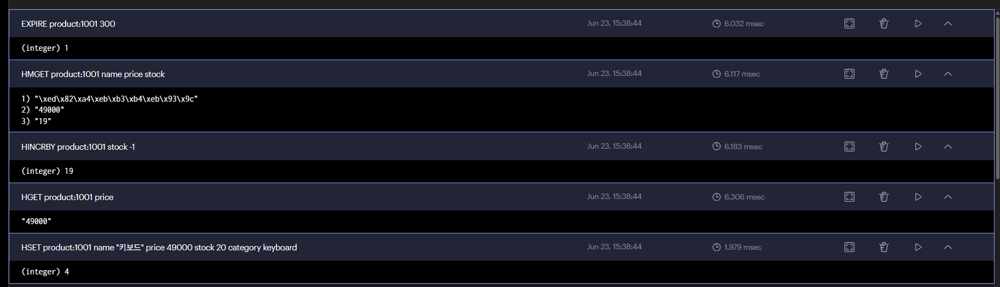
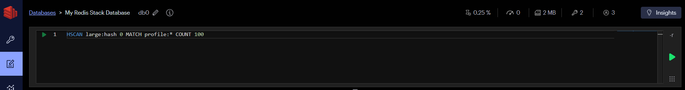
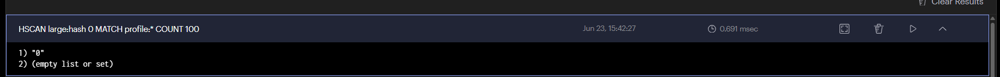

# Hash

---
## Sorted Set vs Hash

| 항목 | Sorted Set (정렬된 셋) | Hash (해시) |
|------|----------------------|------------|
| 한 줄 설명 | 점수 기준으로 정렬된 모음 | 필드-값 쌍으로 저장하는 객체 |
| 저장 형태 | 값 + score(점수) | field: value |
| 순서 | 있음 (score 기준) | 없음 |
| 비유 | 성적순 출석부 | 회원 정보 카드 |
| 언제 쓰나? | 순위, 랭킹이 필요할 때 | 객체 하나의 여러 속성 저장 |
| 대표 명령 | `ZADD` `ZRANGE` `ZRANK` | `HSET` `HGET` `HGETALL` |
| 트레이딩 예시 | 수익률 순위 랭킹 | 종목별 현재가·등락률·거래량 |

---
## 1. 필드 저장과 조회

- `HSET`: 하나 이상의 필드 저장
- `HGET`: 한 필드 조회
- `HMGET`: 여러 필드 조회
- `HGETALL`: 모든 필드와 값 조회
- `HLEN`: 필드 개수 조회
```redis
HSET user:7 name "민수" email "minsu@example.com" level 1  # user:7에 name, email, level 필드 추가
HGET user:7 name                                           # user:7의 name 필드 조회 → "민수"
HMGET user:7 name level                                    # user:7의 name, level 필드 동시 조회 → "민수", 1
HGETALL user:7                                             # user:7의 모든 필드와 값 조회
HLEN user:7                                                # user:7의 필드 수 조회 → 3
```
> 존재하지 않는 필드를 `HGET`하면 `(nil)`이 반환됩니다.

---




---
## 2. 필드 수정과 삭제

- `HINCRBY`: Hash의 특정 필드 값을 지정한 값만큼 증가
- `HINCRBYFLOAT`: Hash의 특정 필드 값을 소수점(실수)으로 증가
- `HEXISTS`: Hash에 특정 필드가 존재하는지 확인 (1=있음, 0=없음)
- `HDEL`: Hash에서 특정 필드를 삭제
```redis
HSET user:7 level 2          # user:7의 level 필드를 2로 수정 (덮어쓰기)
HINCRBY user:7 points 10     # user:7의 points 필드를 10 증가 (없으면 0에서 시작 → 10)
HEXISTS user:7 email         # user:7에 email 필드가 있는지 확인 → 1 (있음)
HDEL user:7 email            # user:7의 email 필드 삭제
HGETALL user:7               # user:7의 모든 필드와 값 조회 → name, level, points
```

---




---
## 3. 상품 객체 만들기

- `EXPIRE`: 키에 만료 시간(초) 을 설정
```redis
HSET product:1001 name "키보드" price 49000 stock 20 category keyboard  # product:1001에 name, price, stock, category 필드 추가
HGET product:1001 price                                                 # price 조회 → 49000
HINCRBY product:1001 stock -1                                           # stock 1 감소 (20 → 19)
HMGET product:1001 name price stock                                     # name, price, stock 동시 조회 → "키보드", 49000, 19
EXPIRE product:1001 300                                                 # 300초(5분) 후 자동 삭제
```
---




---
## 4. Hash와 JSON String 비교

| 구분 | Hash | JSON String |
|---|---|---|
| 일부 필드 조회 | 가능 | 전체 문자열을 읽어 파싱 |
| 일부 필드 수정 | 가능 | 전체 값을 다시 저장 |
| 중첩 객체 표현 | 직접 표현하기 불편 | 자연스럽게 표현 가능 |
| 애플리케이션 전달 | 필드 조립 필요 | JSON 그대로 전달 가능 |
| 숫자 증가 | `HINCRBY` 가능 | 파싱 후 수정 필요 |

> 항상 한 방식이 더 좋은 것은 아닙니다. 읽기와 수정 패턴, 객체의 중첩 구조, 직렬화 비용을 보고 선택합니다.

---
## 5. 큰 Hash 탐색

> `HGETALL`은 모든 필드를 한 번에 반환합니다. 필드가 매우 많다면 `HSCAN`으로 점진적으로 조회합니다.
```redis
HSCAN large:hash 0 MATCH profile:* COUNT 100  # large:hash에서 "profile:"로 시작하는 필드를 100개씩 나눠서 조회
```




