# 고급 자료구조

---
## 특징 

| 자료구조 | 특징 | 대표 명령어 | 활용 예시 |
|----------|------|-------------|-----------|
| Bitmap | 0/1 비트로 데이터 저장, 메모리 매우 적게 사용 | `SETBIT`, `GETBIT`, `BITCOUNT` | 출석 체크, 읽음 여부 |
| HyperLogLog | 중복 제거된 개수 근사치 추정, 오차 약 0.81% | `PFADD`, `PFCOUNT` | 순 방문자 수(UV) 집계 |
| Geospatial | 위도/경도 저장 후 거리 계산 및 반경 검색 | `GEOADD`, `GEODIST`, `GEOSEARCH` | 주변 매장 찾기 |
| Stream | 시간 순서대로 데이터 저장, 메시지 큐 | `XADD`, `XREAD`, `XLEN` | 로그 수집, 이벤트 처리 |

---
## 선택 기준

| 요구사항 | 자료구조 |
|---|---|
| 사용자별 출석 여부와 출석자 수 | Bitmap |
| 아주 많은 고유 방문자의 대략적인 수 | HyperLogLog |
| 반경 안의 가까운 매장 | Geospatial |
| 시간 순 이벤트와 소비자 처리 | Stream |

---
## 1. Bitmap: 예/아니오 기록

---
- `SETBIT`: 특정 offset 위치의 비트를 0 또는 1로 설정
```redis
SETBIT attendance:2026-06-19 1 1  # user1 출석 처리 (offset 1 → 1)
SETBIT attendance:2026-06-19 3 1  # user3 출석 처리 (offset 3 → 1)
SETBIT attendance:2026-06-19 7 1  # user7 출석 처리 (offset 7 → 1)
```
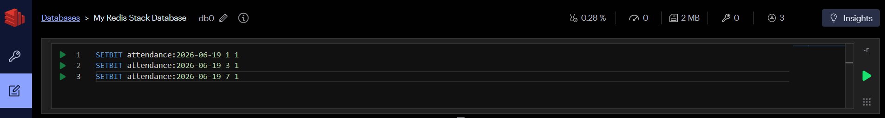

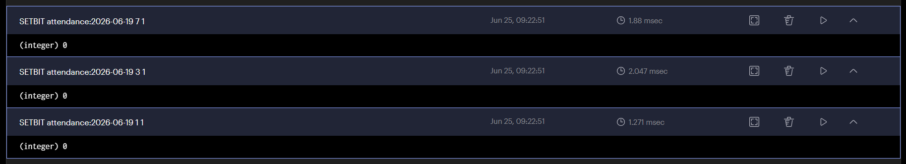

---
- `GETBIT`: 특정 offset 위치의 비트 값을 조회 (1=켜짐, 0=꺼짐)
- `BITCOUNT`: 비트 값이 1인 개수를 반환
```redis
GETBIT attendance:2026-06-19 3    # user3 출석 여부 확인 → 1 (출석)
GETBIT attendance:2026-06-19 4    # user4 출석 여부 확인 → 0 (미출석)
BITCOUNT attendance:2026-06-19    # 전체 출석 인원 수 조회 → 3
```
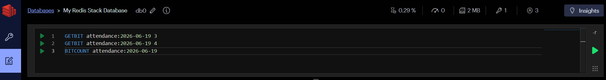

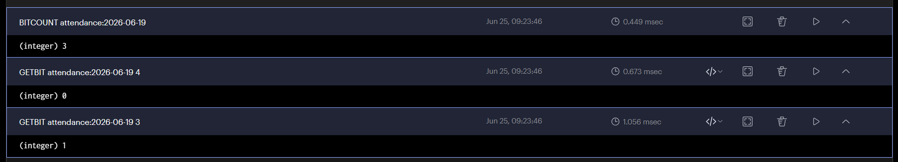

---
- `BITOP`: 여러 Bitmap 간의 비트 연산을 수행
```redis
# 6/19와 6/20 둘 다 출석한 유저 계산 → attendance:both에 저장
BITOP AND attendance:both attendance:2026-06-19 attendance:2026-06-20  

# 이틀 연속 출석 인원 수 조회
BITCOUNT attendance:both                                                
```
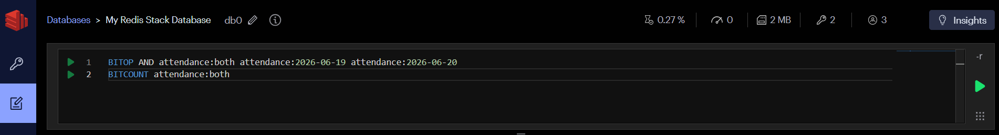

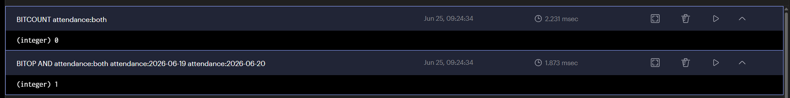

---

| 연산 | 의미 | 활용 예시 |
|------|------|-----------|
| `AND` | 둘 다 1인 것만 | 이틀 **모두** 출석한 유저 |
| `OR` | 하나라도 1인 것 | 이틀 중 **한 번이라도** 출석한 유저 |
| `XOR` | 둘 중 하나만 1인 것 | **한 날만** 출석한 유저 |
| `NOT` | 0 <-> 1 반전 | **미출석** 유저 |

---
## 2. HyperLogLog: 고유 개수 추정
- HyperLogLog는 `메모리를 거의 사용하지 않고 수억 건의 고유 개수를 추정`할 수 있는 자료구조입니다. 
- `결과는 근사치`이므로 과금, 정산, 사용자 목록 조회처럼 정확성이 필요한 경우에는 사용할 수 없습니다. 
- 대신 웹사이트의 순 방문자(UV), 앱 활성 사용자 수, 광고 노출 사용자 수 등 `작은 오차를 허용할 수 있는 통계 분석에 적합`합니다.

---
- `PFADD`: HyperLogLog에 요소(Element)를 추가
- `PFCOUNT`: HyperLogLog에 저장된 고유한 요소(Unique Elements)의 개수를 조회
```redis
# 2026-06-19 방문자(user1, user2, user3)를 HyperLogLog에 추가
# (중복된 user1은 자동으로 하나의 방문자로 처리)
PFADD visitors:2026-06-19 user1 user2 user3 user1

# 2026-06-19의 예상 순 방문자(Unique Visitors) 수 조회
# 결과: 3
PFCOUNT visitors:2026-06-19
```

---


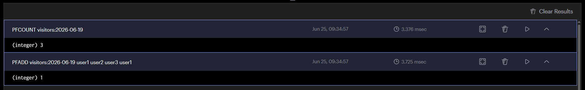

---
- `PFMERGE`: 여러 HyperLogLog를 하나로 합치기 
```redis
# 2026-06-20 방문자(user2, user4)를 HyperLogLog에 추가
PFADD visitors:2026-06-20 user2 user4

# 두 날짜의 HyperLogLog를 하나로 병합
# (중복 사용자(user2)는 한 명으로 계산)
PFMERGE visitors:two-days visitors:2026-06-19 visitors:2026-06-20

# 병합된 HyperLogLog의 예상 순 방문자 수 조회
# 결과: 4 (user1, user2, user3, user4)
PFCOUNT visitors:two-days
```

---
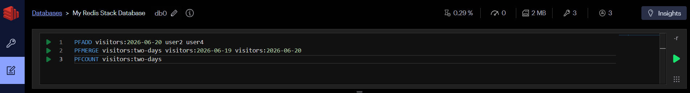

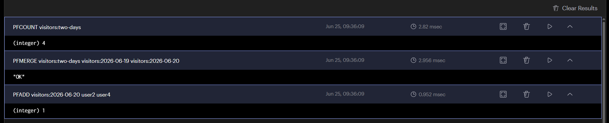

---
## 3. Geospatial: 위치 기반 검색
> 경도, 위도, 멤버 순서로 위치를 저장합니다.

- 주변 매장, 배달 가능 지점, 가까운 시설 검색에 활용할 수 있습니다. 
- Redis의 위치 검색은 지구 표면상의 근거리 검색에 유용하지만 복잡한 지도 도형과 공간 분석은 전문 공간 데이터베이스가 더 적합합니다.

---
- `GEOADD`: Redis GEO 자료구조에 위치(좌표)를 저장
```redis
# 서울 매장 위치(경도 126.9780, 위도 37.5665)를 stores에 추가
GEOADD stores 126.9780 37.5665 seoul-store

# 부산 매장 위치(경도 129.0756, 위도 35.1796)를 stores에 추가
GEOADD stores 129.0756 35.1796 busan-store
```


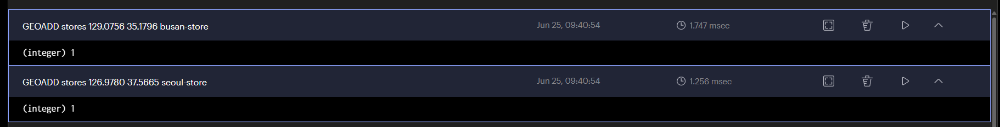

---
- `GEODIST`: Redis GEO 자료구조에 저장된 두 위치 사이의 거리를 계산
```redis
# 서울 매장과 부산 매장 사이의 거리를 km 단위로 조회
GEODIST stores seoul-store busan-store km
```
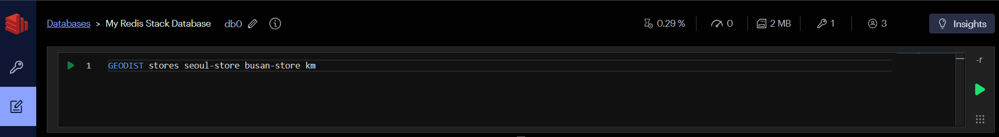

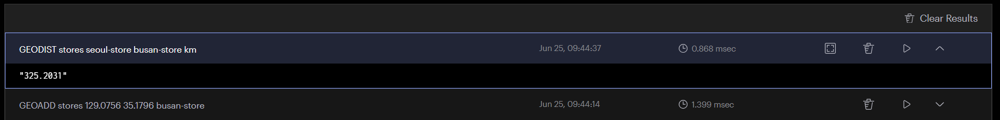

---
- `GEOSEARCH`: Redis GEO 자료구조에서 특정 위치를 기준으로 반경 또는 영역 안에 있는 위치를 검색
```redis
# 경도 127.0, 위도 37.5를 기준으로
# 반경 10km 이내의 매장을 가까운 순(ASC)으로 검색
GEOSEARCH stores FROMLONLAT 127.0 37.5 BYRADIUS 10 km ASC
```
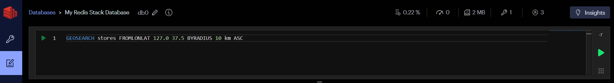

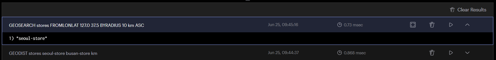

---
## 4. Stream: 이벤트 기록
> Stream은 시간 순서가 있는 이벤트 로그를 저장합니다. 각 항목은 고유 ID와 필드-값 쌍을 가집니다.

---
- `XADD`: Redis Stream에 새로운 메시지(이벤트)를 추가
- `*`를 사용하면 Redis가 ID를 생성합니다. 새 이벤트를 기다려 읽을 수 있습니다.
```redis
# 주문(order_id=1001)이 생성되었음을 Stream에 추가
XADD stream:orders * order_id 1001 status created

# 주문(order_id=1002)가 생성되었음을 Stream에 추가
XADD stream:orders * order_id 1002 status created
```
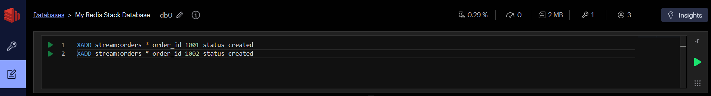

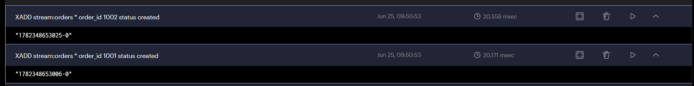

---
- `XRANGE`: Redis Stream에 저장된 메시지(이벤트)를 특정 범위만큼 조회
- `XLEN`: Redis Stream에 저장된 메시지(이벤트)의 개수를 조회
```redis
# Stream에 저장된 모든 메시지를 처음(-)부터 마지막(+)까지 조회
XRANGE stream:orders - +

# Stream에 저장된 전체 메시지(이벤트) 개수 조회
XLEN stream:orders
```

---
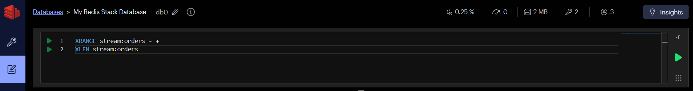

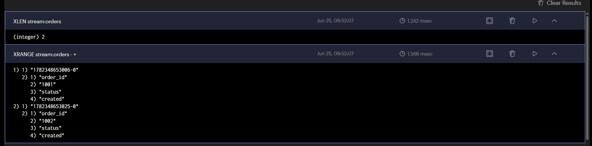

---
- `XREAD`: Redis Stream에서 새로운 메시지(이벤트)를 읽기
- `$`는 현재 마지막 메시지 이후부터 읽기 시작(기존 메시지는 읽지 않음)
```redis
# stream:orders에서 새로운 이벤트를 읽음
# BLOCK 10000은 새로운 이벤트가 없으면 최대 10초(10,000ms) 동안 대기
XREAD BLOCK 10000 STREAMS stream:orders $
```
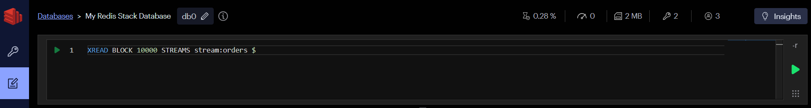

> Redis Insight Workbench가 XREAD 같은 Blocking 명령을 지원하지 않습니다.

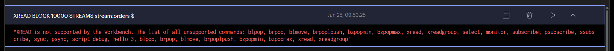

