# Git & Github with SSH 연결

---
### (옵션) 만약 github이 있다면, 삭제 
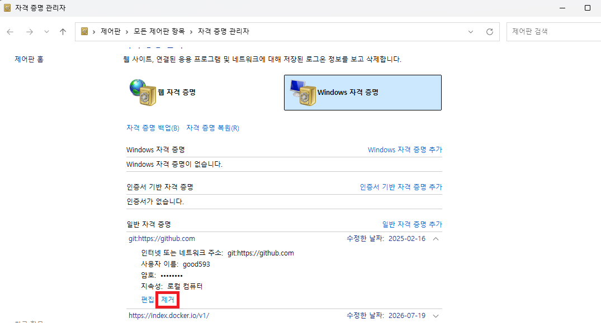

---
### (옵션) 만약 .ssh 폴더가 없다면, 실행 
```shell
PS> cd ~ 
PS> mkdir .ssh
```
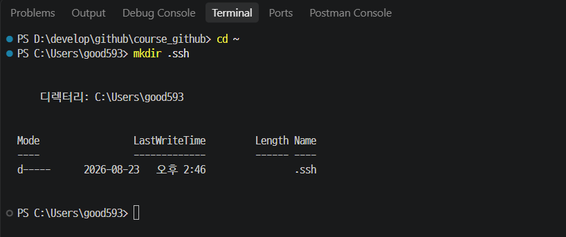

---
### 단계1: Windows에서 SSH Key 생성
> VS Code 터미널이나 PowerShell에서 실행하세요.
```shell
ssh-keygen -t ed25519 -C "GitHub에등록된이메일"  -f "$HOME\.ssh\id_ed25519_[적절하게 이름수정]"
```
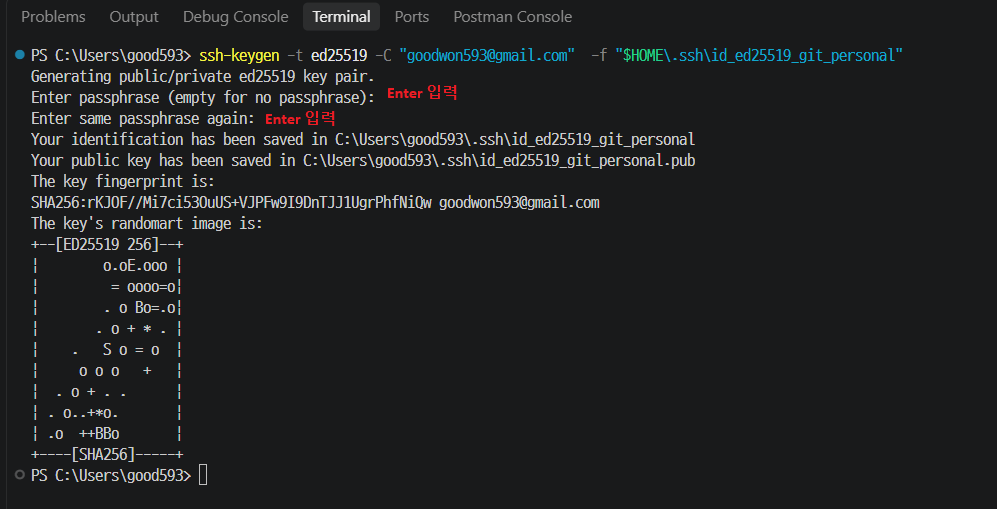

---
### 단계2: .pub 파일을 GitHub에 등록 

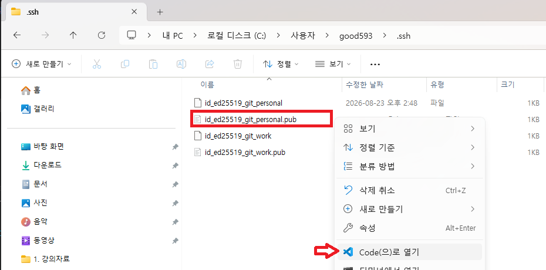

---
> ssh hub 복사

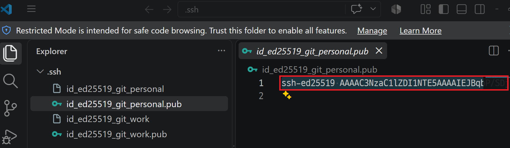

---
> Github > Settings

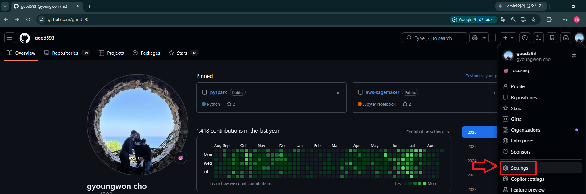

---
> SSH > ssh hub 키 등록 

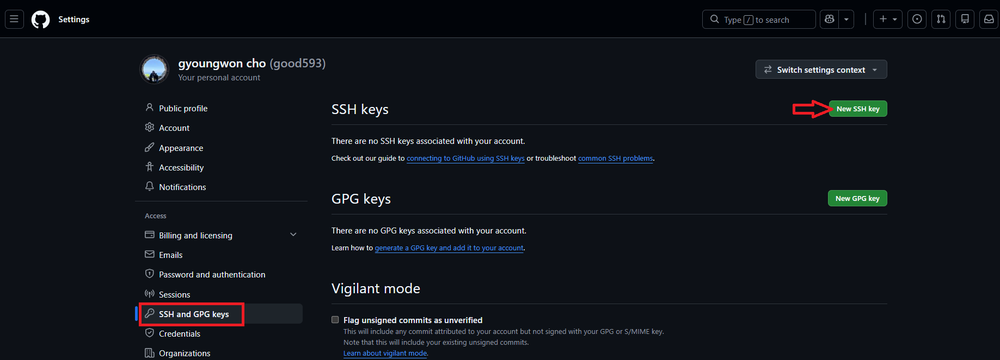

---
> ssh hub 저장

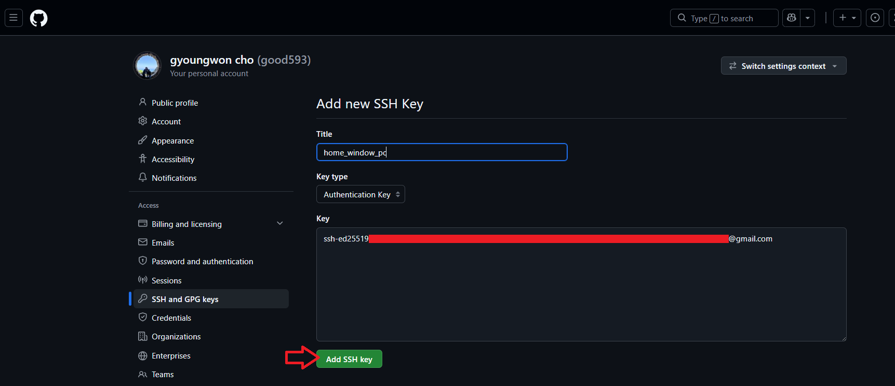

---
> 확인 

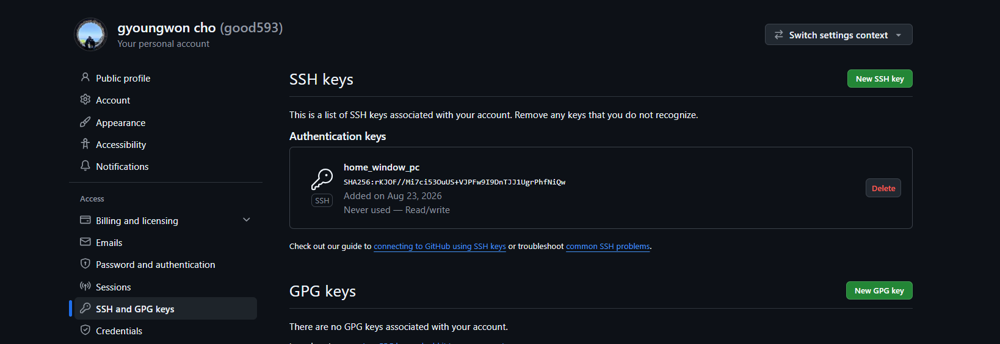

---
### 단계3: vscode 연동
> 익스탠션 설치 

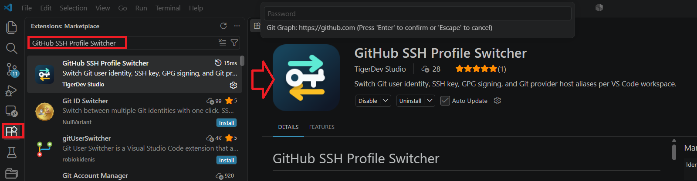

---
> Ctrl + Shift + P를 누르고
```shell
SSH Profiles: Open Manager
```
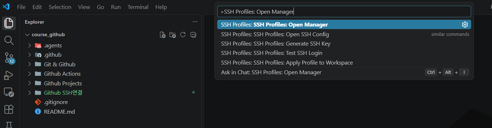

---
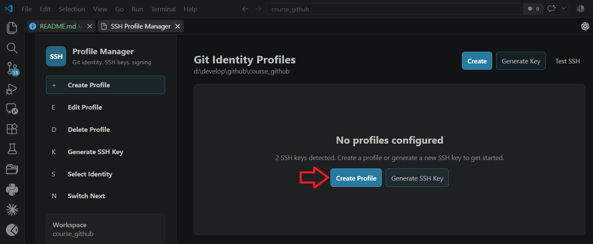

---
> ssh private 적용

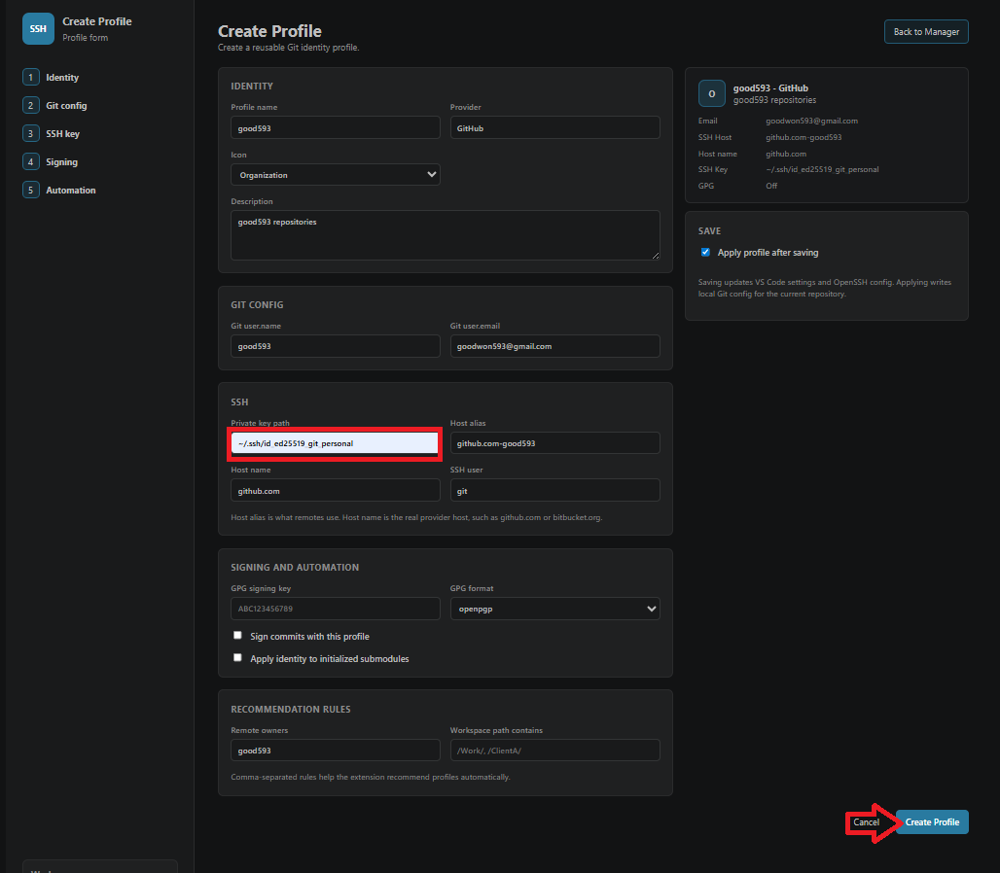

---
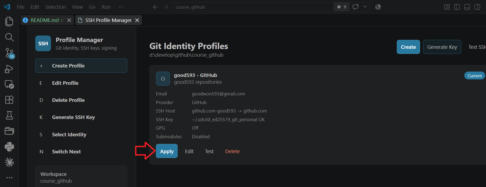

---
> config에서 Host 별칭 확인

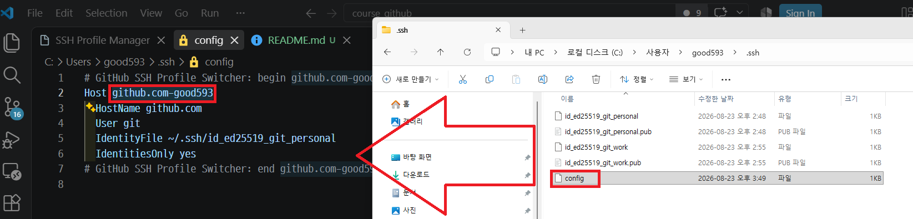

---
> config에서 확인한 Host 별칭 적용 
```shell
ssh -T git@[Host 별칭]
```
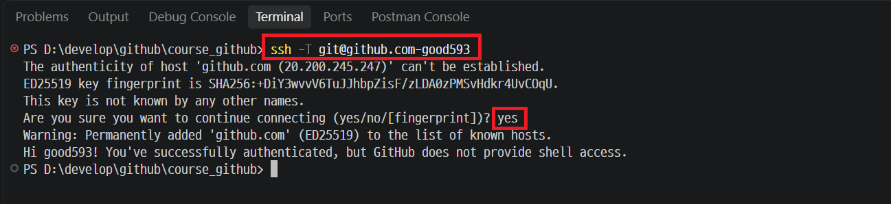

---
### 단계4: clone 방법
- Profile 별칭 확인 
- Host 별칭 확인

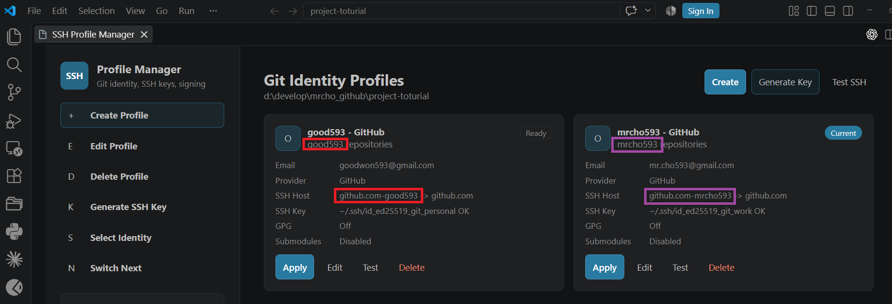

---
- 저장소명 확인 

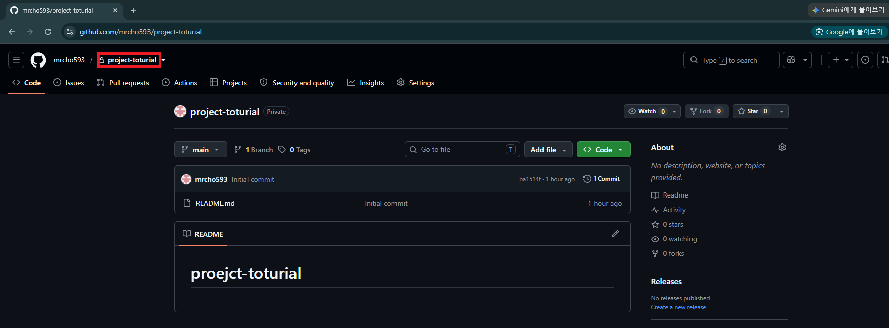

---
> Ctrl + Shift + P → Git: Clone → Clone from GitHub
```shell
# git@[Host 별칭]:[Profile 별칭]/[저장소명].git

git@github.com-mrcho593:mrcho593/project-toturial.git
```
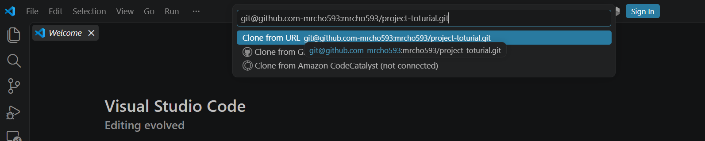

---
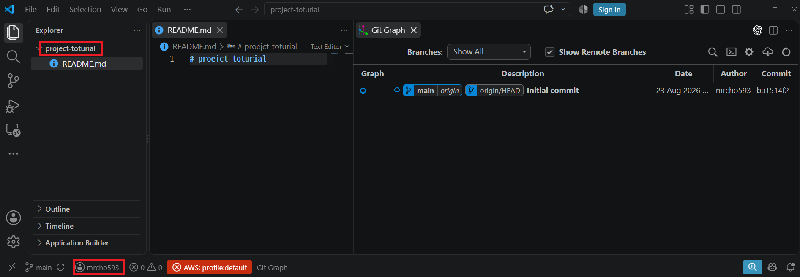


