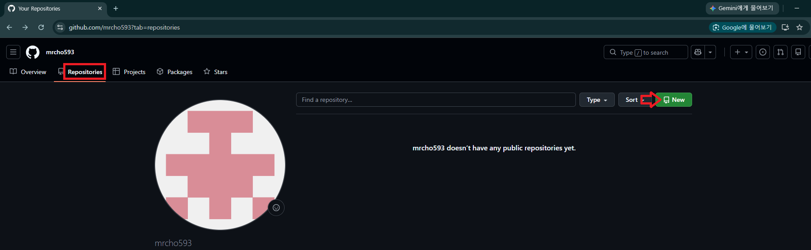
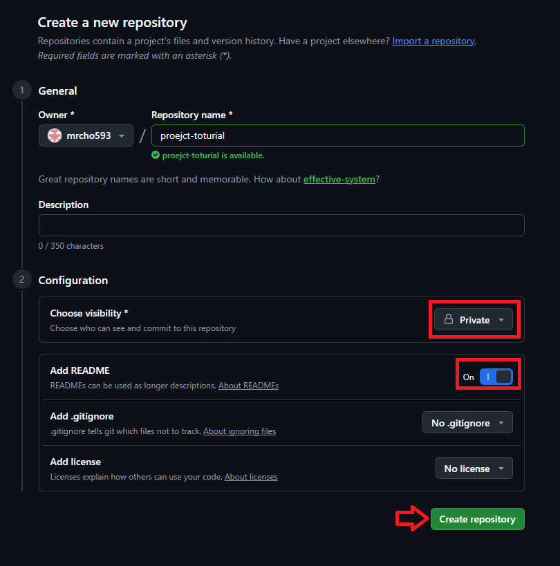
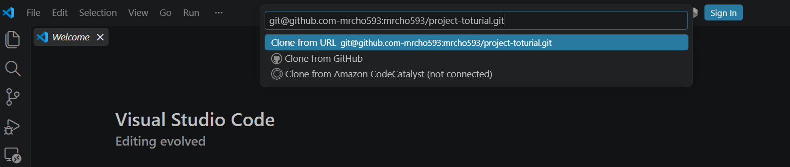
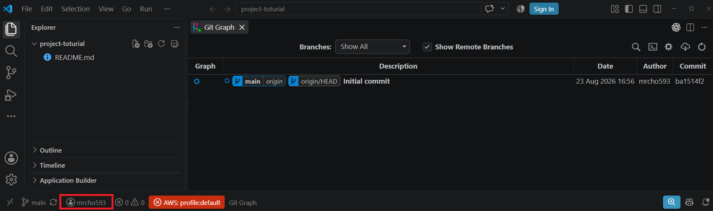

### 단계1: New repository



---
> Create repository



---
### 단계2: Clone using the web URL
> Ctrl + Shift + P → Git: Clone → Clone from GitHub
```shell
# git@[Host 별칭]:[Profile 별칭]/[저장소명].git

git@github.com-mrcho593:mrcho593/project-toturial.git
```


---
> 결과 확인




