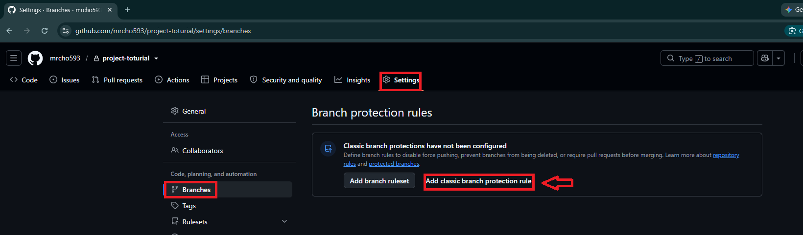
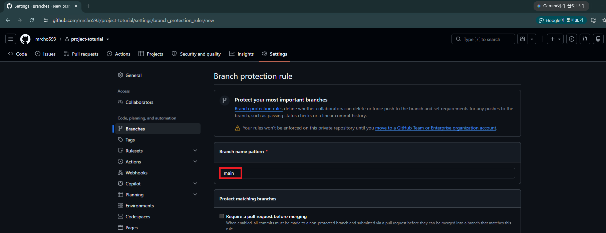
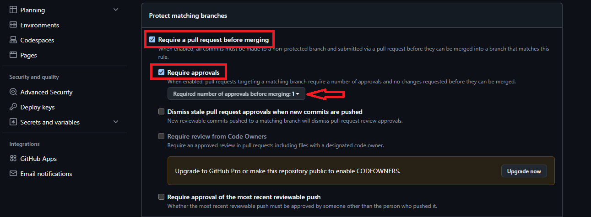
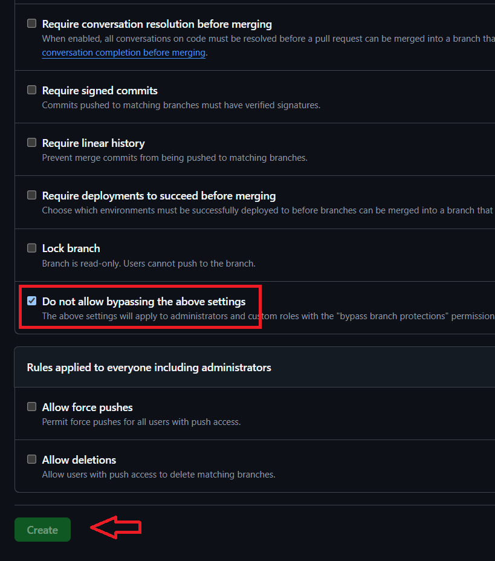
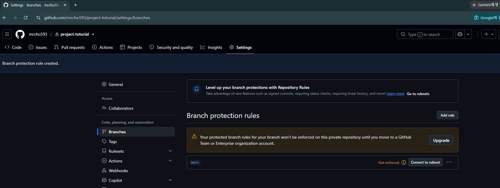
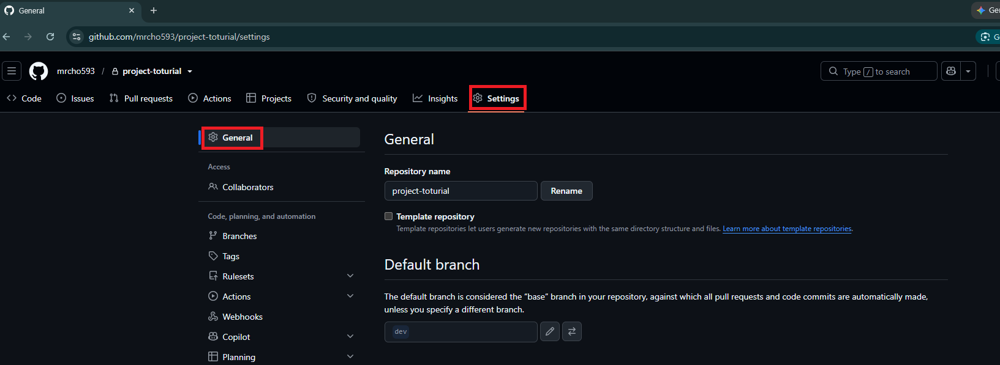
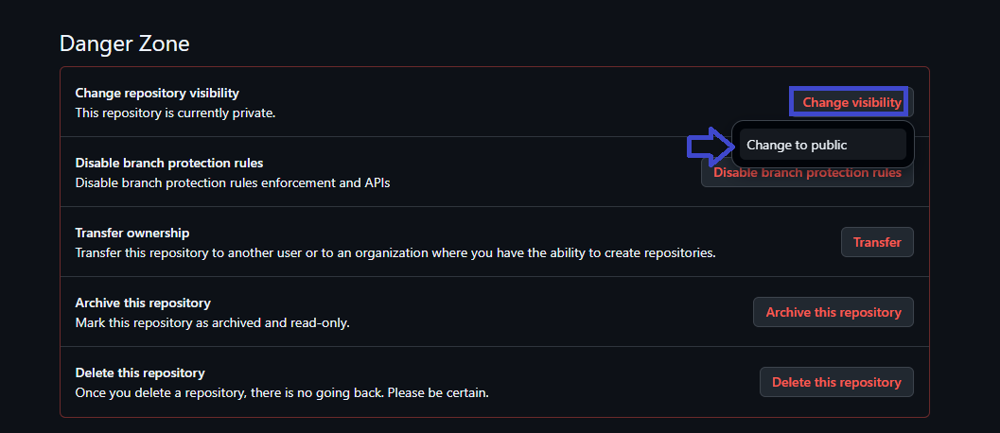
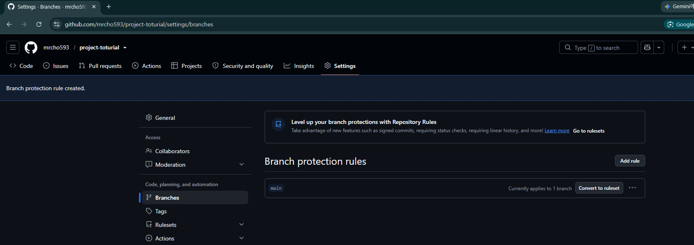

### 단계1: Branch protection rules

---
### 단계2: main branch rule 생성

---
### 단계3: Require a pull request before merging 
> merge를 위해서 최소 인원의 허락이 필요

---
### 단계4: Create
> Do not allow bypassing the above settings: 직접 push 불가능

---
### 단계5: 수정 결과 적용 
> rule 적용을 위해서는 private을 public으로 변경해야 함

---

---

---

