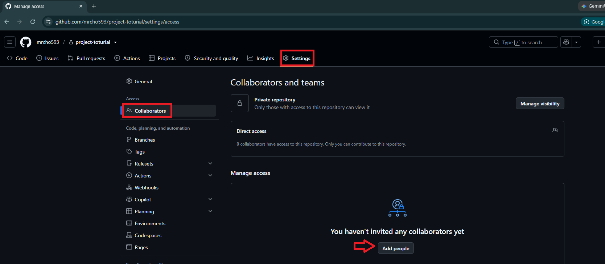
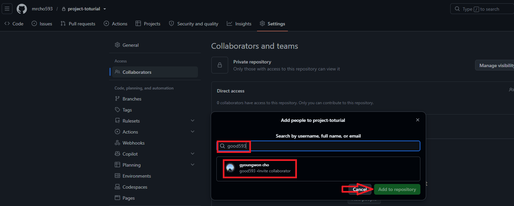
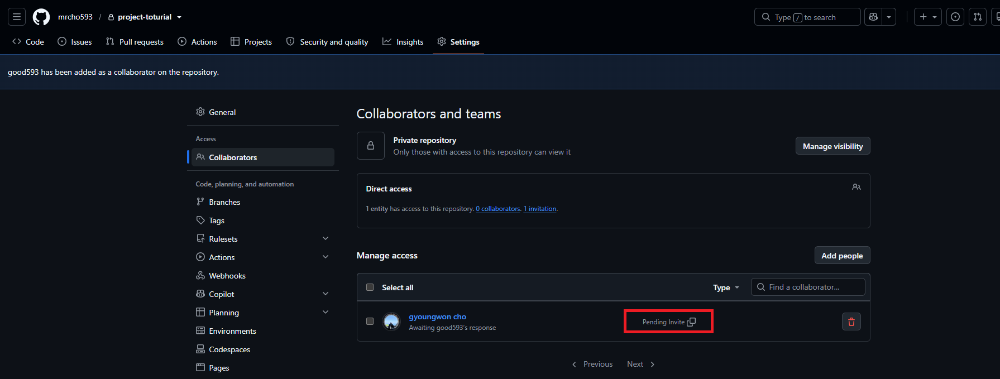
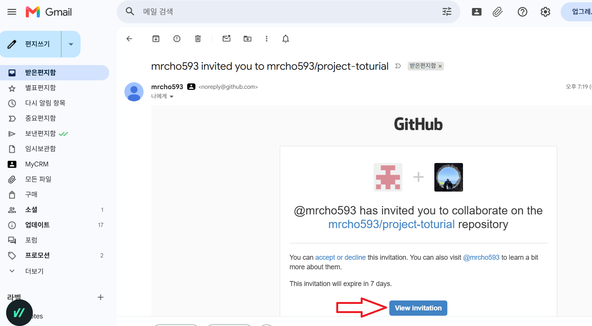
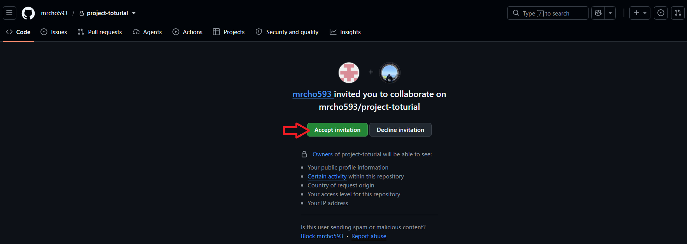
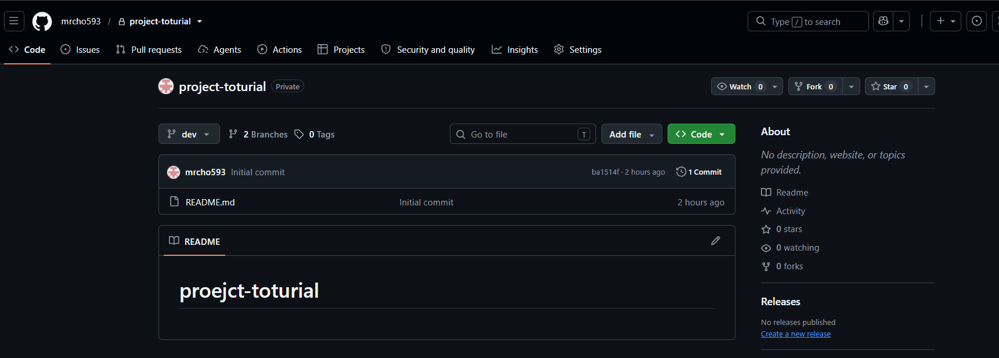
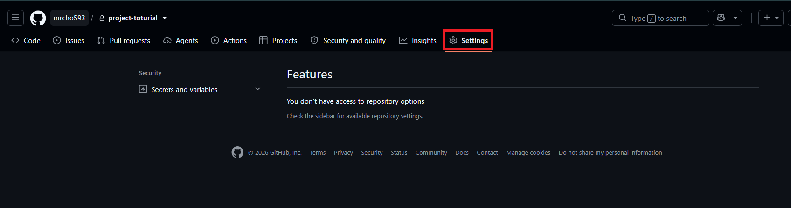
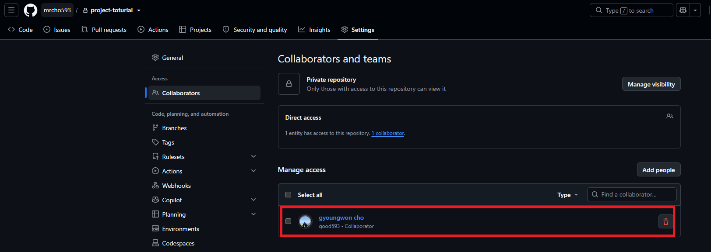

### 단계1: 관리자 계정(mrcho593) Add people

---
> 초대: 계정(good593)

---
> 수락 대기 중

---
### 단계2: 초대 받은 계정(good593)

---
> 초대 수락

---
> 확인

---
> 초대 받은 계정이기 때문에 설정 불가능

---
### 단계3: 관리자 계정(mrcho593)에서 수락 확인 

