### 단계1: Dev branch 테스트 without rules
> 코드 작성

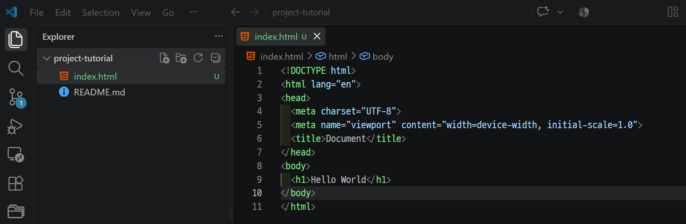

---
> 커밋

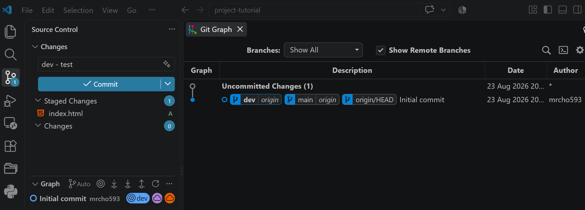

---
> 깃허브에 배포

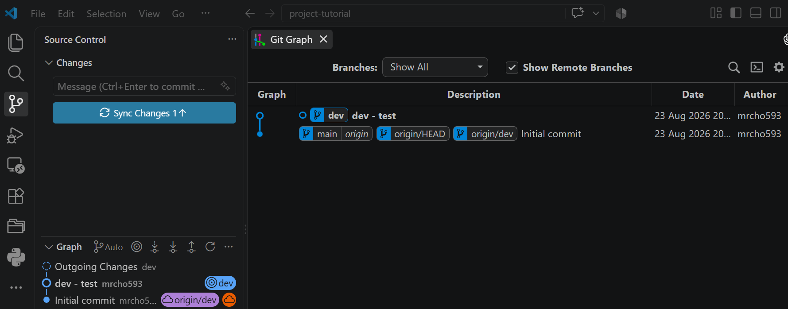

---
> 결과 확인: rule이 없어서 배포 성공

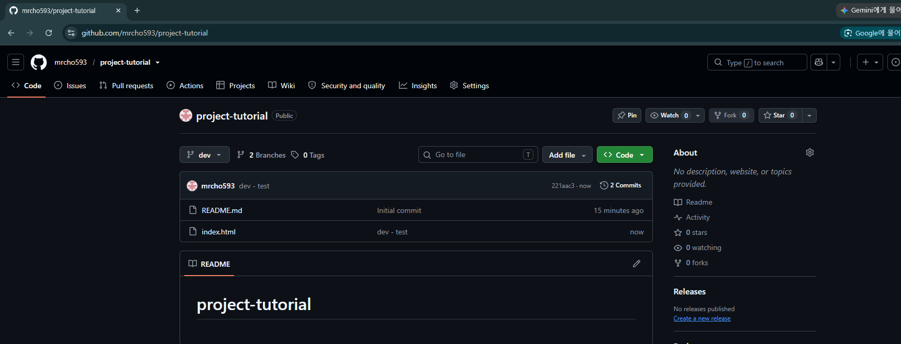

---
### 단계2: Main branch 테스트 with rules
> Dev branch의 변경된 내용 확인

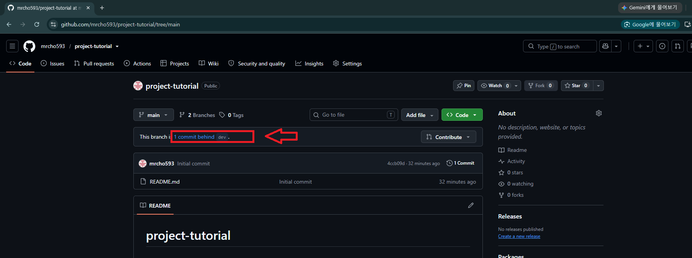

---
> 변경된 내용 확인 후 PR 생성

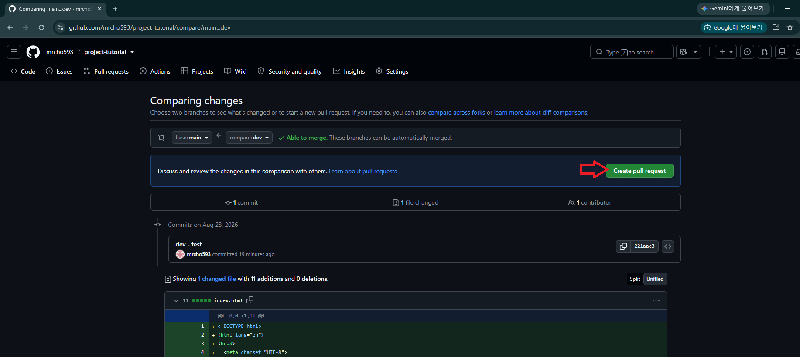

---
> 동료에게 제공할 메세지 입력 후 PR 생성

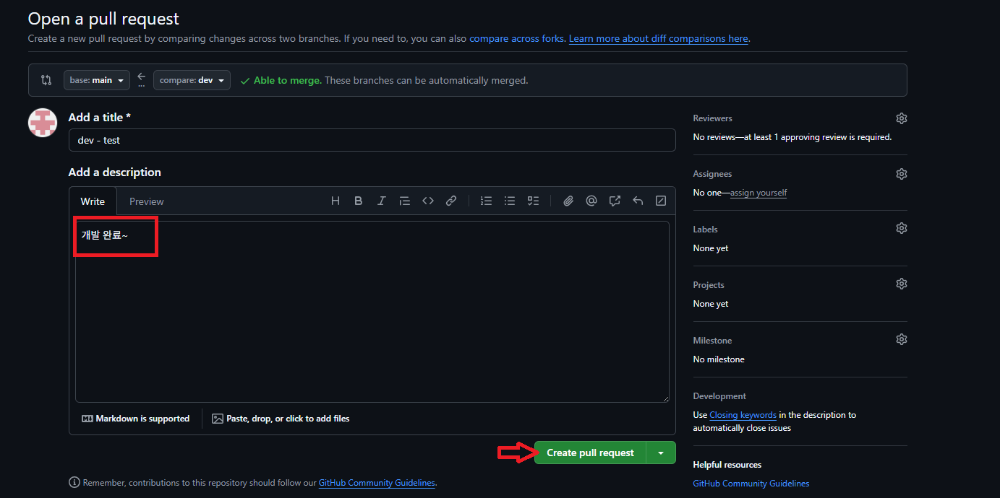

---
> PR 생성 확인 

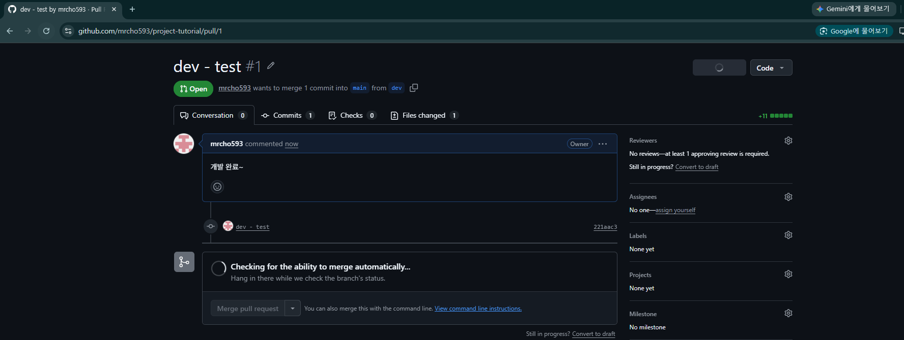

---
### 단계3: 동료 검토
> 생성된 PR 확인

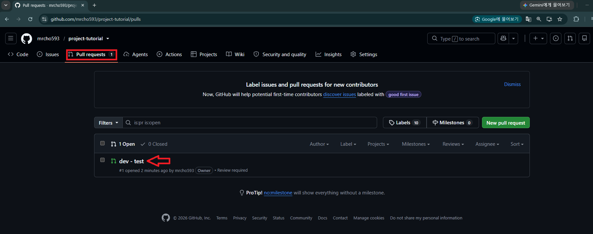

---
> 변경된 코드 확인

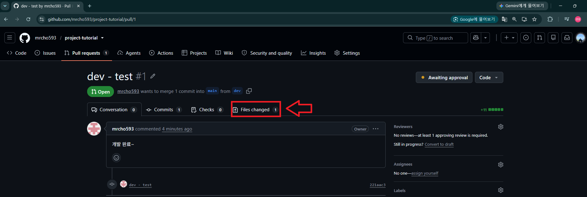

---
> 메세지 입력 및 Merge 허락 

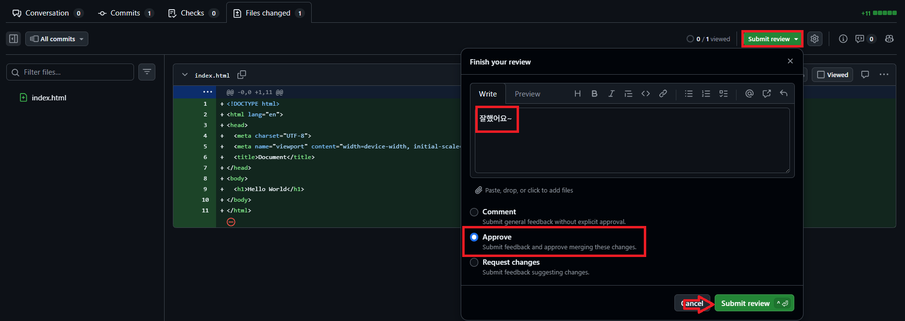

---
### 단계4: Merge pull request
> 동료 허락 확인 후 Merge 진행

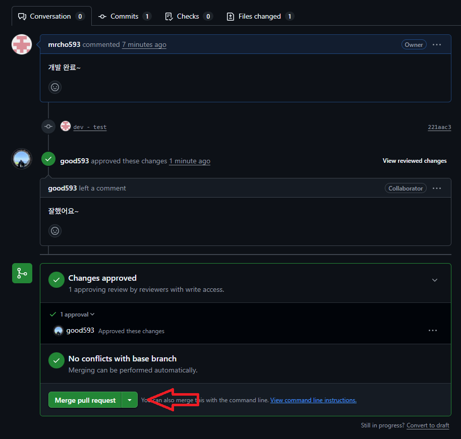

---
> Merge 실행

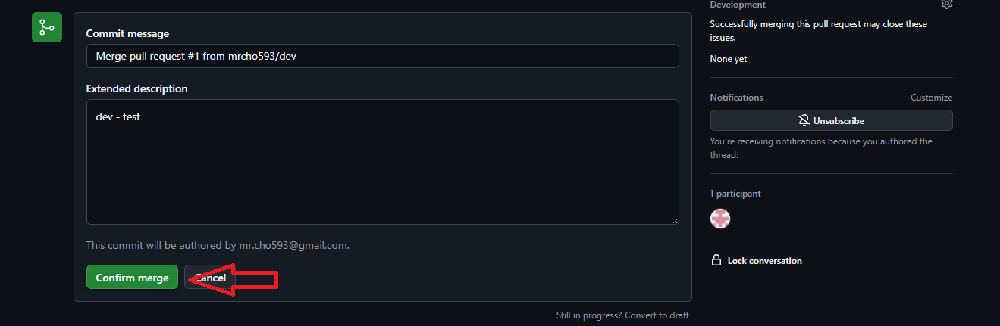

---
> Merge 결과 확인 

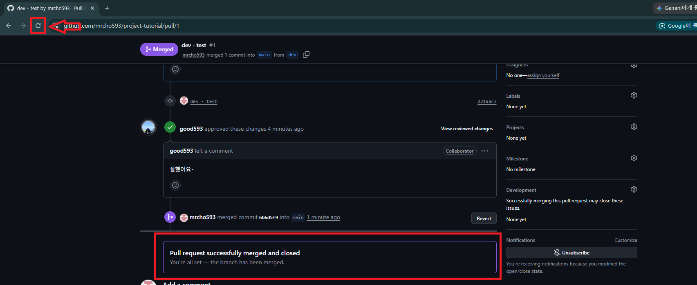

---
### 단계5: Main branch에서 결과 확인 
> Github에서 확인 

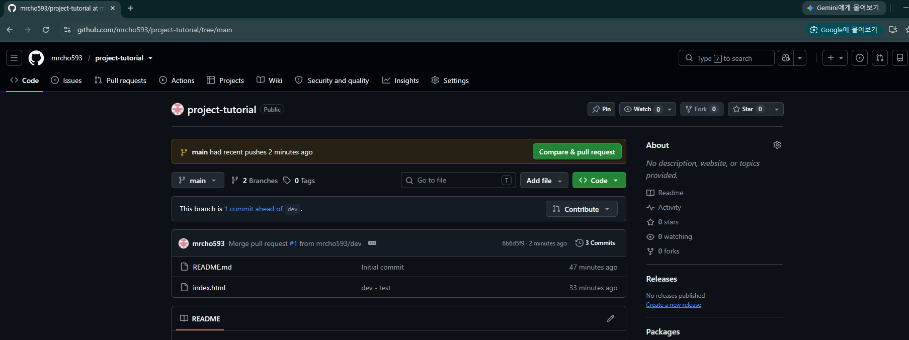

---
> Local PC에서 확인 

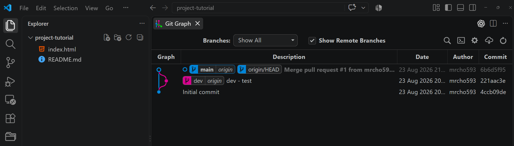

