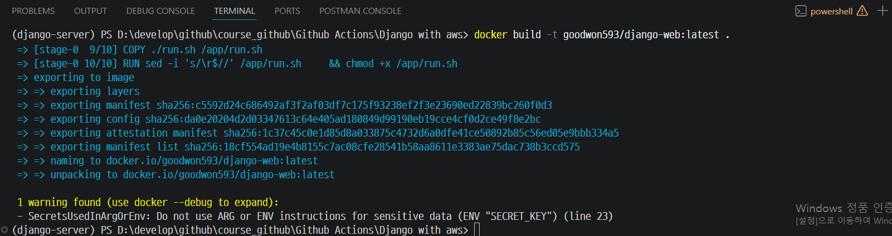
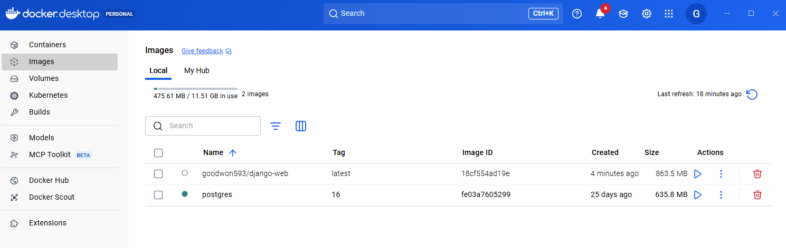
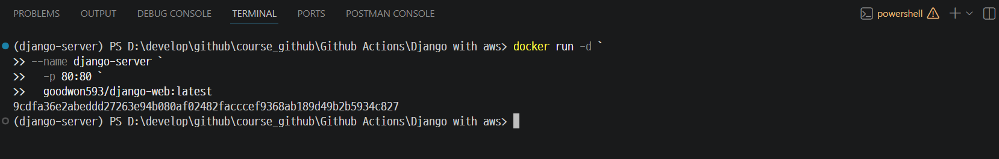
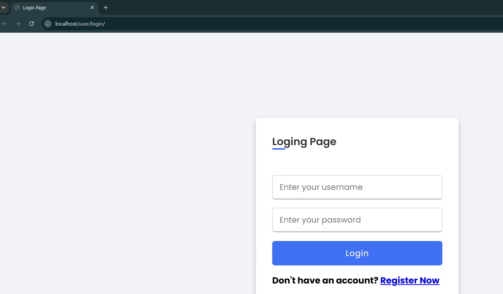
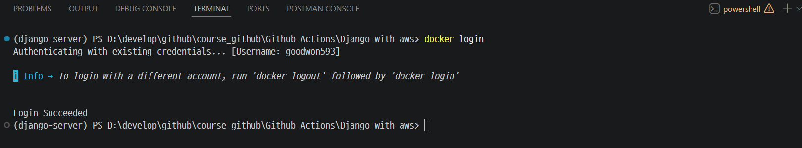
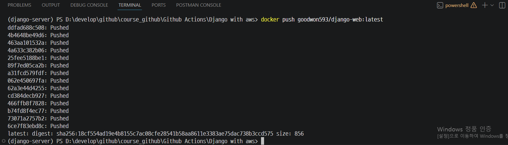
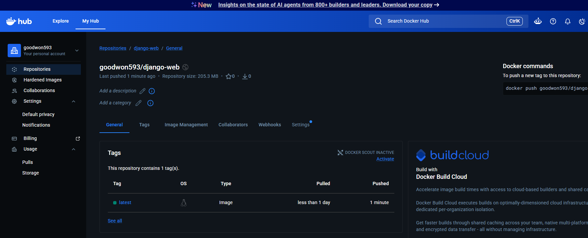

# Docker 이미지 빌드 & 배포

---

## 1. 이미지 빌드

Dockerfile이 위치한 프로젝트 루트에서 실행합니다.
> docker build -t <DOCKERHUB_USERNAME>/<IMAGE_NAME>:<TAG> .
```bash
docker build -t goodwon593/django-web:latest .
```


---


---
## 2. 컨테이너 실행

nginx가 컨테이너 내부 80번 포트에서 요청을 받아 gunicorn(8000)으로 프록시합니다.

```bash
docker run -d `
--name django-server `
  -p 80:80 `
  goodwon593/django-web:latest
```


---
> 브라우저에서 http://localhost 접속



---
## 3. Docker Hub 로그인
```bash
docker login
```


---
## 4. Docker Hub에 이미지 푸시
> docker push <DOCKERHUB_USERNAME>/<IMAGE_NAME>:<TAG>
```bash
docker push goodwon593/django-web:latest
```


---
> Docker Hub에서 확인 



